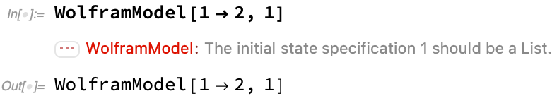

First, thanks for contributing! :balloon: :gear: :thumbsup:

These are the guidelines designed to make the development smooth, efficient and fun for all of us. But remember, they are created by us, not set in stone, and anybody is welcome to propose changes. Just open a pull request.

There are fundamentally two kinds of things you can contribute: issues (reports and ideas) and code.

[Issues](#issues) | [Code](#code)

# Issues

## Weed reports (something is not working)

First off, while it's common to call problems with the code "bugs", we call them *weeds* here instead (kudos to [@aokellermann](https://github.com/aokellermann)). That's because using the word "bug" in a negative context implicitly sends a message that *bugs* (aka insects) are someone bad and should be squashed. We don't agree with that sentiment, as *bugs* :ant: :beetle: :spider: are living creatures who deserve moral consideration. Hence, let's leave "bugs" alone, and go *weed whacking*.

Also note, this repository is all about software. If you have found a issue with our physics model, or a mistake in one of our papers, please contact the author directly, or see our [contact page](???). Also, this repository is only about the *SetReplace* paclet. If you have found a week in a function repository function, use the form on that function's documentation page to contact the author directly.

To report a weed, follow these steps:
1. Go the the [Issues page](https://github.com/maxitg/SetReplace/issues), and use the search to check if the weed you have encountered is in the list already. If it is, and it was not getting much attention recently, the best you can do is to comment that you care abut it being fixed, and leaving the example you have encountered that's not working (if it's different).
2. If the weed is not in the list, click "New issue", and then "Get started" next to the "Weed report".
3. Fill in all the fields including:
  * The line of Wolfram Language code that results in unexpected behavior (or a screenshot if the weed is in the UI).
  * The actual output you are getting.
  * The output you expect to see.
  * Include the output of `SystemInformation["Small"]` and `$SetReplaceGitSHA`.
4. If you have a Mathematica notebook with more details, you can attach it to the issue, but you will have to compress it into a `ZIP` first.
5. Click submit new issue.
6. Your issue is now in the list, and a developer will try to look at it when they have a chance. But if it does not get any attention, the best thing you can do is to [fix it yourself](#code).

## Feature suggestions

If you have an idea to improve an existing function, add a property to `WolframModel`, or for a new function that does not currently exist, you can suggest it by creating a feature request. Someone might implement it if they like the idea, but there are no guarantees. Also note, this repository is all about software, for research ideas see our [contact page](???).

The process is similar to weed reports, except use "Feature request" option for the new issue instead of "Weed report", and don't include any version information.

# Code

[Development process](#development-process) | [Code structure](#code-structure) | [Code style](#code-style)

If you would like to contribute code, thanks again! :balloon: :balloon: :balloon: :gear: :thumbsup:

In the sections below, we describe our development process, the code structure, and our code style rules. However, if you are unsure about something, don't let these rules deter you from opening pull requests! If something is missing, or if there are issues with code style, someone will just point them out during code review.

## Development process

[Writing code](#writing-code) | [Opening a pull request](#opening-a-pull-request) | [Automated tests](#automated-tests) | [Code review](#code-review) | [Merging](#merging)

Each change to the code must fundamentally pass through 5 steps, more or less in that order: writing code, opening a pull request, passing automated tests, passing code review, and merging the PR.

### Writing code

In addition to the code itself, each pull request should include unit tests and documentation.

To help you get started, see how the code is [organized](#code-structure) and our notes on [code style](#code-style). Also, we are keeping dependencies to a minimum to make the paclet as easy to compile and run as possible. So, avoid adding dependencies if at all possible. That includes Wolfram Function Repository functions. Even though they don't require installation, most of them are not stable enough for use in *SetReplace*. In addition, using them will result in unexpected behavior (as they can be updated independently of *SetReplace*, and there is no way to enforce a specific version), generate unexpected messages (i.e., for updates) and use Internet connection causing unexpected slowdowns. If you still think adding a dependency is worth it, please open a feature request first to discuss it.

The unit tests are particularly important if you are implementing a weed fix, as we need to make sure the weed you are fixing is not going to return in the future. And if you are implementing a new function, unit tests should not only cover the functionality, but also the behavior in case the function is called with invalid arguments. Each function should have at least some unit tests, otherwise one of the tests in [meta.wlt](Tests/meta.wlt) will fail.

If sharing variables between multiple tests, use [`With`](https://reference.wolfram.com/language/ref/With.html) instead of [`Module`](https://reference.wolfram.com/language/ref/Module.html) or global assignment, because otherwise variables will not appear resolves in the command line error message if the test fails (which makes it harder to weed whack). In addition, try to avoid very large inputs and outputs for the tests if at all possible.

You should also modify documentation in the [README](README.md) if you are implementing new functionality, or causing any outputs already in the [README](README.md) to change.

### Opening a pull request

Each pull request message should include detailed information on what was changed, optional comments for the reviewer, and **examples**, including screenshots if the output is a graphics. If your pull request closes an existing issue (as it generally should, as it's best to discuss your changes before implementing them), reference that issue in your pull request message. For an example of a good pull request message, see [#268](https://github.com/maxitg/SetReplace/pull/268).

Next, assign one of the type [labels](https://github.com/maxitg/SetReplace/labels) to your pull request:
* `feature`: new functionality, or change in existing functionality.
* `optimization`: does not change functionality, but makes code faster.
* `refactor`: does not change functionality, but makes the code more readable.
* `weed`: fixes a weed.

In addition, one or both of the following may be used:
* `critical`: fixes something that severely breaks the package (usually used for weeds).
* `breaking`: introduces API changes that would break existing code, better to avoid if possible.

Next, assign a reviewer to your pull request. Ideally, it should be someone who have recently edited the same files you are changing. If in doubt, assign to [@maxitg](https://github.com/maxitg).

It is important to keep your pull requests as small as possible (definitely under 1000 lines). This not only makes them easier to review and generally improves review quality, but also makes it more likely your changes will find their way into master, as it's always possible you will get distructed and won't be able to finish a one giant pull request. It also helps with keeping your pull requests up-to-date with master, which is important because changes in master might introduce conflicts or break your code.

### Automated tests

To run the tests, `cd` to the repository root, and run `./build.wls && ./install.wls && ./test.wls` from the command line. If everything is ok, you will see `[ok]` next to each group of tests, and "Tests passed." message at the end. Otherwise, you will see error messages telling you which test inputs failed and for what reason.

We have a CI that automatically runs tests for all commits on all branches (kudos to [Circle CI](https://circleci.com) for providing free resources for this project).

We use a (private) docker image `maxitg/set-replace:ci` running *Ubuntu* and *Wolfram Engine*, which [runs](https://app.circleci.com/pipelines/github/maxitg/SetReplace/408/workflows/8577ff51-2f5a-4517-992c-b20c76dcf170/jobs/444) [build](build.wls), [install](install.wls) and [test](test.wls) scripts.

Your code must successfully pass [test](test.wls) script to be mergeable to master.

We also have a setup within Wolfram Research that allows us to build the paclet containing compiled binary libraries for all platforms, which we use for releases, but it's only available to developers working in the company.

### Code review

First, if you have been assigned a `critical` pull request, please stop reading and review it (understand what the issue is, and verify the fix works) as soon as possible. Many people might be blocked by it right now.

Otherwise, please review within one business day (24 hours except weekends), or at least notify the pull request author if you won't be able to do that.

The main objectives for the code review is to:
1. Verify that the code works (i.e., make sure you can reproduce examples in the pull request message).
2. Read the code, understand it, and see if you can spot any potential weeds / unnecessary slowdowns / issues with it (including issues with code style as we don't currently have a linter).
3. Check the pull request contains unit tests and changes documentation if appropriate.

Please, [be polite](https://help.github.com/en/github/site-policy/github-community-guidelines), and comment directly on lines of code (which you can do on GitHub, or use [Reviewable](https://reviewable.io) if you prefer). Also, if you are commenting about something small (line insignificant code style style), add "Nit: " (for nitpicking) to the beginning of your comment.

### Merging

Once you see the green "Squash and merge" button, congratulations! :tada: That means all the necessary checks have passed, and you can merge your pull request! Push the green button, ***paste your pull request message to the commit message field***, and confirm. Your changes are now in, and will be available to the paclet server (`PacletInstall["SetReplace"]`) users within a week or so.

## Code structure

[Wolfram Language code](#wolfram-language-code) | [libSetReplace](#libsetreplace) | [Tests](#tests) | [Documentation](#documentation) | [Scripts](#scripts)

The most important components of the package are the [Wolfram Language code](#wolfram-language-code), [C++ code](#libsetreplace), [unit tests](#tests), [documentation](#documentation), and [various scripts](#scripts).

### Wolfram Language code

The Wolfram Language code, which constitutes the most of the package, lives in the [Kernel](Kernel) directory. We use the [new-style package structure](https://mathematica.stackexchange.com/a/176489/46895).

Specifically, [init.m](Kernel/init.m) is loaded first, followed by the rest of the files which are picked up automatically. Generally, each Wolfram Language symbol would go to a separate file except for very small ones (like constants), or very large functions (like [`WolframModel`](Kernel/WolframModel.m)).

Each file should start with a ``Package["SetReplace`"]`` line, followed by lines of the form `PackageExport["PublicSymbolName"]` for publicly available symbols, and `PackageScope["PackageSymbolName"]` for private symbols which still need to be used in other files. The symbols not included in either of these declarations will be private to that specific file.

In addition, your public symbols should include a `Usage` message, which should be created with a [`usageString`](Kernel/usageString.m) function. Each argument, number and ellipsis should be [enclosed in backticks](https://github.com/maxitg/SetReplace/blob/048311f4139cd7146e3879c710b02cc0c90a72e5/Kernel/GeneralizedGridGraph.m#L7), which would automatically convert it to the correct style.

Further, public symbols must include [`SyntaxInformation`](https://reference.wolfram.com/language/ref/SyntaxInformation.html), see [an example](https://github.com/maxitg/SetReplace/blob/048311f4139cd7146e3879c710b02cc0c90a72e5/Kernel/WolframModel.m#L45) for `WolframModel`.

It is very important that functions correctly handle invalid inputs. For example, if you try to evaluate



If we did not check here that the second argument should be a list, we would instead get the following effect:


and the function would not even terminate, which is confusing and hostile to the user.

One way to implement such argument checking is to make special `valid*Q` functions which would check each argument before running the function. This could work well for small functions, but it's not an ideal way to do it, because sometimes validity of the arguments can only be detected deep in the evaluation logic, and the validation function would be too complex and lead to code duplication.

A better approach is to setup the function to catch exceptions, i.e.,

```
MakeUniverse[args___] := Module[{result = Catch[makeUniverse[args]]},
  result /; result =!= $Failed
]
```

and parse the inputs lazily, printing a message and throwing an exception if something is wrong:

```
makeUniverse[badUniverse_] := (
  Message[MakeUniverse::bad, badUniverse];
  Throw[$Failed]
)
```

This way the error can occur arbitrarily deeply in the function logic, and it would still be easy to abort and return the function unevaluated.

The main dispatch function of *SetReplace* is the package-scope [`setSubstitutionSystem`](Kernel/setSubstitutionSystem.m). It is essentially the generic evolution function. It is used by [`WolframModel`](Kernel/WolframModel.m), [`SetReplace`](Kernel/SetReplace.m), [`SetReplaceAll`](Kernel/SetReplaceAll.m), etc.

[`setSubstitutionSystem`](Kernel/setSubstitutionSystem.m) parses the options (except for `WolframModel` specific ones), and uses one of the method functions, [`setSubstitutionSystem$cpp`](Kernel/setSubstitutionSystem$cpp.m) or [`setSubstitutionSystem$wl`](Kernel/setSubstitutionSystem$wl.m) to run the evolution.

[`setSubstitutionSystem$wl`](Kernel/setSubstitutionSystem$wl.m) is the pure Wolfram Language implementation, which is more general (it supports arbitrary pattern rules and disconnected rules), but less efficient.

[`setSubstitutionSystem$cpp`](Kernel/setSubstitutionSystem$cpp.m) on the other hand is the LibraryLink interface to [libSetReplace](#libsetreplace), which is the C++ implementation of Wolfram models.

If you'd like to implement a small utility, which is not to be made public, and is too small to put in a separate file, put it in [utilities.m](Kernel/utilities.m) (and check utilities already there to not reinvent the wheel).

### libSetReplace

libSetReplace is the C++ library that implements the `"LowLevel"` method of `WolframModel`. It lives in [`libSetReplace`](libSetReplace) directory, and there is also the [Xcode project](SetReplace.xcodeproj) for it. [`SetReplace.cpp`](libSetReplace/SetReplace.cpp) and [`SetReplace.hpp`](libSetReplace/SetReplace.hpp) implement the interface with Wolfram Language code.

Every time `WolframModel` is called, an instance of class [`Set`](libSetReplace/Set.hpp) is created. `Set` in turn uses an instance of [`Matcher`](libSetReplace/Match.hpp) class to perform the actual matching of expressions. [This class](libSetReplace/Match.cpp) is the core of *SetReplace*.

### Tests

Unit tests live in the [`Tests` folder](Tests). They are technically .wlt files, however, they contain more structure than ordinary .wlt files.

Each file contains an [`Association`](https://reference.wolfram.com/language/ref/Association.html) with the following contents:

```
<|"FunctionName" -> <|"init" -> ..., "tests" -> {VerificationTest[...], ...}, "options" -> ...|>, ...|>
```

`"FunctionName"` is the name of the test group. It's what appears in the command line output of the test script to the left from `[ok]`. `"init"` is the code that is run before the tests. It usually contains definitions of test functions or variables commonly used in the tests. `"tests"` is code, which if evaluated after `"init"` results in the arbitrarily-nested structure of lists of [`VerificationTest`](https://reference.wolfram.com/language/ref/VerificationTest.html)s. Finally, `"options"` is currently only used to disable parallelization, which can be done by setting it to `{"Parallel" -> False}`.

Apart from [`VerificationTest`](https://reference.wolfram.com/language/ref/VerificationTest.html), there are other convenience testing functions defined in [testUtilities.m](Kernel/testUtilities.m). For example, `"testUnevaluated"` can be used to test that the function returns unevaluated for given arguments, and produces a specified set of messages. `"testSymbolLeak"` can check if internal symbols are being produced and not garbage-collected during the evaluation of a function. Since these are `PackageScope` functions, they need to be used as, i.e., ``SetReplace`PackageScope`testUnevaluated[VerificationTest, args]``. To avoid typing `PackageScope` every time, however, it is convenient to define them in `"init"` as, i.e.,

```
Attributes[Global`testUnevaluated] = {HoldAll};
Global`testUnevaluated[args___] := SetReplace`PackageScope`testUnevaluated[VerificationTest, args];
```

This way, the test itself can be defined simply as

```
testUnevaluated[
  MakeUniverse[42],
  {MakeUniverse::badUniverse}
]
```

Note that it's important to test not only the functionality, but also the behavior of the function in case it's called with invalid (or missing) arguments.

The tests should be deterministic so that they can be reproduced. If the test cases are randomly generated, this can be achieved by setting [`SeedRandom`](https://reference.wolfram.com/language/ref/SeedRandom.html).

If you want to implement performance tests, leave a very large leeway for the performance target, as the performance of CI servers may be different than what you would expect, and could fluctuate from run to run, which could result in randomly failing CI runs.

### Documentation

The *SetReplace* documentation is contained in three places: [README.md](README.md), [CONTRIBUTING.md](.github/CONTRIBUTING.md), and the code comments. The structure of the .md files is for the most part self-explanatory.

Some things to note are:
* Large section should include navigation bars in the beginning (see the beginning of [README](README.md)).
* All references to functions should be links, either to [the Wolfram Language documentation](https://reference.wolfram.com/language/), or to the corresponding section in [README](README.md).
* Images (i.e., of output cells) should be made by selecting the relevant cells in the Front End, copying them as bitmaps, and saving them as .png files to [READMEImages](READMEImages) directory. They should then be inserted using the code similar to this:

  ```
  
  ```

  where the `width` can be computed as

  ```
  Round[0.6 First @ Import["$RepoRoot/READMEImages/image.png", "ImageSize"]]
  ```

The comments in the Wolfram Language code are encouraged, but free-style, and the C++ code is documented using [Doxygen](http://www.doxygen.nl).

### Scripts

The three main scripts of *SetReplace* are [build.wls](build.wls), [install.wls](install.wls) and [test.wls](test.wls). The build script is the most complex of the three, and it uses additional definitions in [buildInit.wl](scripts/buildInit.wl). In addition to building the C++ code and packing the paclet, it also auto-generates the paclet version number based on the number of commits to master from the checkpoint defined in [version.wl](scripts/version.wl). Some of the code in the [scripts](scripts) folder are only used for building *SetReplace* on the internal Wolfram Research systems, which are only available for internal Wolfram developers.

## Code style

Unfortunately, there is no established style guidelines for Wolfram Language code, and even different source files in *SetReplace* currently use slightly different conventions (we are working on it). The best rule here is to try to be consistent as much as possible with the specific file you are editing.

In addition to that, here are some more-or-less established rules:
* Keep line widths within 120 (does not apply to .md files).
* Use at most a single empty line to separate code paragraphs (note, the Front End uses two by default, which should be fixed manually if you use the Front End for editing).
* Write comments directly, and split them into lines. Don't use section definitions such as `(* ::Text:: *)`.
* Use spaces instead of tabs, and use 2 spaces for indentation.
* Close code block function brackets on the new line (for functions such as `Module`, `With` and `If`):

  ```
  Module[{result = f[x]},
    result *= 2;
    result
  ]
  ```

* However, close the brackets of ordinary functions on the same line as the last argument:

  ```
  veryLongFunctionCall[
    longArgument1, longArgument2, longArgument3]
  ```

* The function arguments should either all go on the same line, or should each be put on a separate line (except for special cases where a large quantity of short arguments is used).
* Avoid using `Flatten` and `ReplaceAll` with explicit level arguments. That is because it is very easy to accidentally assume that the user's input is not a list (i.e., a vertex name), even though it can be, in which case you would `Flatten` too much, and cause a weed. It is preferred to use `Catenate` and `Replace` instead of these functions.
* Similar issue could happen with `Thread` especially when used to thread a single element over multple. For example, `Thread[x -> {1, 2, 3}]` is easy to assume would always yield `{x -> 1, x -> 2, x -> 3}`. Except, sometimes it might be called as `With[{x = {4, 5, 6}}, Thread[x -> {1, 2, 3}]]`.
* Use uppercase camel for public symbols, lowercase camel for internal (including PackageScope) symbols.
* Start global constants with `$`, whether internal or public, and tags (such as used in `Throw` or `Sow`, or as general enum labels) with `$$`.
* C++ code generally uses the Xcode linter style, with the following clarifications:
  * Variable and constant names use lowercase camel, class names use uppercase camel.
  * Type definitions are done with `using NewType = OldType;`.
  * Do not use `using namespace std;`.

That's all for our guidelines, now let's go figure out the fundamental theory of physics! :microscope: :telescope: :rocket:

TODO: change PR and issue templates.

TODO: Add references to all functions.

TODO: Check references.
