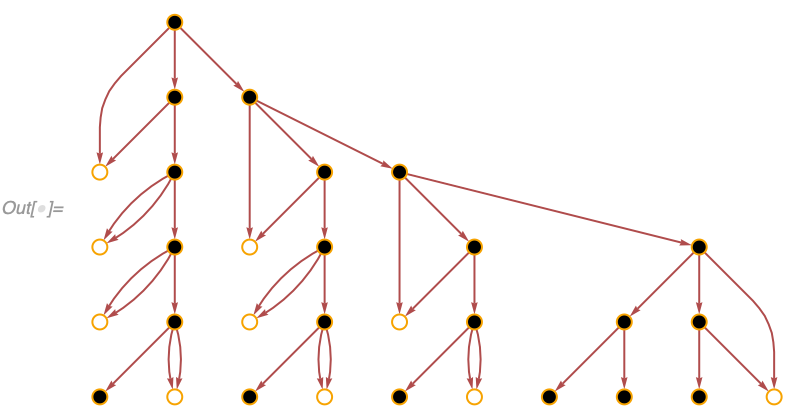
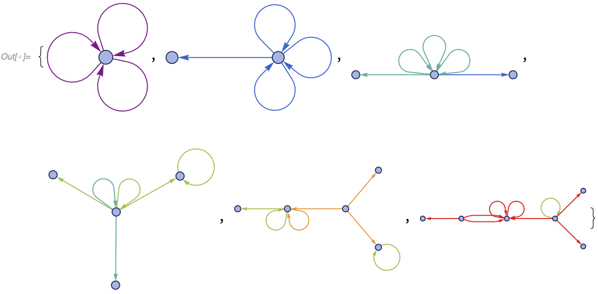
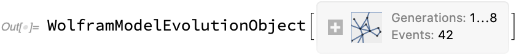

### Properties

[States](#states) | [Plots of States](#plots-of-states) | [Plots of Events](#plots-of-events) | [All Edges throughout Evolution](#all-edges-throughout-evolution) | [States as Edge Indices](#states-as-edge-indices) | [Events](#events) | [Events and States](#events-and-states) | [Creator and Destroyer Events](#creator-and-destroyer-events) | [Causal Graphs](#causal-graphs) | [Expression Separations](#expression-separations) | [Rule Indices for Events](#rule-indices-for-events) | [Edge and Event Generations](#edge-and-event-generations) | [Termination Reason](#termination-reason) | [Generation Counts](#generation-counts) | [Event Counts](#event-counts) | [Element Count Lists](#element-count-lists) | [Final Element Counts](#final-element-counts) | [Total Element Counts](#total-element-counts) | [Rules](#rules) | [Version](#version)

#### States

These are the properties used to extract states at a particular moment in the evolution. They always return lists, but in the examples below, we plot them for clarity.

**`"FinalState"`** (aka -1) yields the state obtained after all replacements of the evolution have been made:

```wl
In[] := WolframModelPlot @ WolframModel[{{1, 2, 3}, {4, 5, 6}, {1, 4}} ->
   {{2, 7, 8}, {3, 9, 10}, {5, 11, 12}, {6, 13, 14}, {8, 12}, {11,
     10}, {13, 7}, {14, 9}},
  {{1, 1, 1}, {1, 1, 1}, {1, 1}, {1, 1}, {1, 1}}, 6, "FinalState"]
```


**`"StatesList"`** yields the list of states at each generation:

```wl
In[] := WolframModelPlot /@ WolframModel[{{1, 2, 3}, {4, 5, 6}, {1, 4}} ->
   {{2, 7, 8}, {3, 9, 10}, {5, 11, 12}, {6, 13, 14}, {8, 12}, {11,
     10}, {13, 7}, {14, 9}},
  {{1, 1, 1}, {1, 1, 1}, {1, 1}, {1, 1}, {1, 1}}, 6, "StatesList"]
```


This is identical to using the **`"Generation"`** property mapped over all generations:

```wl
In[] := WolframModelPlot /@ (WolframModel[{{1, 2, 3}, {4, 5, 6}, {1, 4}} ->
       {{2, 7, 8}, {3, 9, 10}, {5, 11, 12}, {6, 13, 14}, {8, 12}, {11,
          10}, {13, 7}, {14, 9}},
      {{1, 1, 1}, {1, 1, 1}, {1, 1}, {1, 1}, {1, 1}}, 6][
     "Generation", #] &) /@ Range[0, 6]
```


In fact, the `"Generation"` property can be omitted and the index of the generation can be used directly:

```wl
In[] := WolframModelPlot /@ WolframModel[{{1, 2, 3}, {4, 5, 6}, {1, 4}} ->
    {{2, 7, 8}, {3, 9, 10}, {5, 11, 12}, {6, 13, 14}, {8, 12}, {11,
      10}, {13, 7}, {14, 9}},
   {{1, 1, 1}, {1, 1, 1}, {1, 1}, {1, 1}, {1, 1}}, 6] /@ Range[0, 6]
```


`"StatesList"` shows a compressed version of the evolution. To see how the state changes with each applied replacement, use **`"AllEventsStatesList"`**:

```wl
In[] := WolframModelPlot /@ WolframModel[{{1, 2, 3}, {4, 5, 6}, {1, 4}} ->
   {{2, 7, 8}, {3, 9, 10}, {5, 11, 12}, {6, 13, 14}, {8, 12}, {11,
     10}, {13, 7}, {14, 9}},
  {{1, 1, 1}, {1, 1, 1}, {1, 1}, {1, 1}, {1, 1}}, 3,
  "AllEventsStatesList"]
```


Finally, to see a state after a specific event, use **`"StateAfterEvent"`** (aka `"SetAfterEvent"`):

```wl
In[] := WolframModelPlot @ WolframModel[{{1, 2, 3}, {4, 5, 6}, {1, 4}} ->
    {{2, 7, 8}, {3, 9, 10}, {5, 11, 12}, {6, 13, 14}, {8, 12}, {11,
      10}, {13, 7}, {14, 9}},
   {{1, 1, 1}, {1, 1, 1}, {1, 1}, {1, 1}, {1, 1}}, 6][
  "StateAfterEvent", 42]
```


`"StateAfterEvent"` is equivalent to taking a corresponding part in `"AllEventsStatesList"`, but it is much faster to compute than the entire list.

#### Plots of States

Instead of explicitly calling [`WolframModelPlot`](WolframModelPlot.md#wolframmodelplot), one can use short-hand properties **`"FinalStatePlot"`** and **`"StatesPlotsList"`**:

```wl
In[] := WolframModel[{{1, 2, 3}, {4, 5, 6}, {1, 4}} ->
  {{2, 7, 8}, {3, 9, 10}, {5, 11, 12}, {6, 13, 14}, {8, 12}, {11,
    10}, {13, 7}, {14, 9}},
 {{1, 1, 1}, {1, 1, 1}, {1, 1}, {1, 1}, {1, 1}}, 6, "FinalStatePlot"]
```


```wl
In[] := WolframModel[{{1, 2, 3}, {4, 5, 6}, {1, 4}} ->
  {{2, 7, 8}, {3, 9, 10}, {5, 11, 12}, {6, 13, 14}, {8, 12}, {11,
    10}, {13, 7}, {14, 9}},
 {{1, 1, 1}, {1, 1, 1}, {1, 1}, {1, 1}, {1, 1}}, 6, "StatesPlotsList"]
```


These properties take the same options as [`WolframModelPlot`](WolframModelPlot.md#wolframmodelplot) (but one has to specify them in a call to the evolution object, not `WolframModel`):

```wl
In[] := WolframModel[{{1, 2, 3}, {4, 5, 6}, {1, 4}} ->
   {{2, 7, 8}, {3, 9, 10}, {5, 11, 12}, {6, 13, 14}, {8, 12}, {11,
     10}, {13, 7}, {14, 9}},
  {{1, 1, 1}, {1, 1, 1}, {1, 1}, {1, 1}, {1, 1}}, 3]["FinalStatePlot",
  VertexLabels -> Automatic]
```


#### Plots of Events

The plotting function corresponding to [`"AllEventsStatesList"`](#states) is more interesting than the other ones. **`"EventsStatesPlotsList"`** plots not only the states, but also the events that produced them:

```wl
In[] := WolframModel[{{1, 2, 3}, {4, 5, 6}, {1, 4}} ->
  {{2, 7, 8}, {3, 9, 10}, {5, 11, 12}, {6, 13, 14}, {8, 12}, {11,
    10}, {13, 7}, {14, 9}},
 {{1, 1, 1}, {1, 1, 1}, {1, 1}, {1, 1}, {1, 1}},
 3, "EventsStatesPlotsList"]
```


Here the dotted gray edges are the ones about to be deleted, whereas the red ones have just been created.

#### All Edges throughout Evolution

**`"AllEventsEdgesList"`** (aka `"AllExpressions"`) returns the list of edges throughout evolution. This is distinct from a catenated [`"StateList"`](#states), as the edge does not appear twice if it moved from one generation to the next without being involved in an event.

Compare for instance the output of [`"StatesList"`](#states) for a system where only one replacement is made per generation:

```wl
In[] := WolframModel[<|"PatternRules" -> {x_?OddQ, y_} :> x + y|>,
 {1, 2, 4, 6}, Infinity, "StatesList"]
Out[] = {{1, 2, 4, 6}, {4, 6, 3}, {6, 7}, {13}}
```

to the output of `"AllEventsEdgesList"`:

```wl
In[] := WolframModel[<|"PatternRules" -> {x_?OddQ, y_} :> x + y|>,
 {1, 2, 4, 6}, Infinity, "AllEventsEdgesList"]
Out[] = {1, 2, 4, 6, 3, 7, 13}
```

Note how 4 and 6 only appear once in the list.

Edge indices from `"AllEventsEdgesList"` are used in various other properties such as [`"AllEventsList"`](#events) and [`"EventsStatesList"`](#events-and-states).

#### States as Edge Indices

**`"AllEventsStatesEdgeIndicesList"`** is similar to [`"AllEventsStatesList"`](#states), except instead of actual edges the list it returns contains the indices of edges from [`"AllEventsEdgesList"`](#all-edges-throughout-evolution):

```wl
In[] := WolframModel[{{1, 2, 3}, {4, 5, 6}, {1, 4}} ->
  {{2, 7, 8}, {3, 9, 10}, {5, 11, 12}, {6, 13, 14}, {8, 12}, {11,
    10}, {13, 7}, {14, 9}},
 {{1, 1, 1}, {1, 1, 1}, {1, 1}, {1, 1}, {1, 1}},
 2, "AllEventsStatesEdgeIndicesList"]
Out[] = {{1, 2, 3, 4, 5}, {4, 5, 6, 7, 8, 9, 10, 11, 12, 13}, {5, 8, 9, 10,
  11, 12, 13, 14, 15, 16, 17, 18, 19, 20, 21}, {10, 11, 12, 13, 14,
  15, 16, 17, 18, 19, 20, 21, 22, 23, 24, 25, 26, 27, 28, 29}}
```

One can easily go back to states:

```wl
In[] := WolframModelPlot /@ With[{
   evolution = WolframModel[{{1, 2, 3}, {4, 5, 6}, {1, 4}} ->
      {{2, 7, 8}, {3, 9, 10}, {5, 11, 12}, {6, 13, 14}, {8, 12}, {11,
        10}, {13, 7}, {14, 9}},
     {{1, 1, 1}, {1, 1, 1}, {1, 1}, {1, 1}, {1, 1}}, 3]},
  evolution["AllEventsEdgesList"][[#]] & /@
   evolution["AllEventsStatesEdgeIndicesList"]]
```


However, this representation is useful if one needs to distinguish between identical edges.

Similarly, **`"StateEdgeIndicesAfterEvent"`** is a index analog of [`"StateAfterEvent"`](#states):

```wl
In[] := WolframModel[{{1, 2, 3}, {4, 5, 6}, {1, 4}} ->
   {{2, 7, 8}, {3, 9, 10}, {5, 11, 12}, {6, 13, 14}, {8, 12}, {11,
     10}, {13, 7}, {14, 9}},
  {{1, 1, 1}, {1, 1, 1}, {1, 1}, {1, 1}, {1, 1}},
  6]["StateEdgeIndicesAfterEvent", 12]
Out[] = {18, 19, 29, 34, 35, 36, 37, 39, 40, 42, 43, 44, 45, 49, 50, 51, 52,
  53, 55, 56, 57, 58, 59, 60, 61, 62, 63, 64, 65, 66, 67, 68, 69, 70,
  71, 72, 73, 74, 75, 76, 77, 78, 79, 80, 81, 82, 83, 84, 85, 86, 87,
  88, 89, 90, 91, 92, 93, 94, 95, 96, 97, 98, 99, 100, 101}
```

and **`"GenerationEdgeIndices"`** is an analog of [`"Generation"`](#states):

```wl
In[] := WolframModel[{{1, 2, 3}, {4, 5, 6}, {1, 4}} ->
   {{2, 7, 8}, {3, 9, 10}, {5, 11, 12}, {6, 13, 14}, {8, 12}, {11,
     10}, {13, 7}, {14, 9}},
  {{1, 1, 1}, {1, 1, 1}, {1, 1}, {1, 1}, {1, 1}},
  6]["GenerationEdgeIndices", 2]
Out[] = {10, 11, 12, 13, 14, 15, 16, 17, 18, 19, 20, 21, 22, 23, 24, 25, 26,
  27, 28, 29}
```

#### Events

**`"AllEventsList"`** (aka `"EventsList"`) and **`"GenerationEventsList"`** both return all replacement events throughout the evolution. The only difference is how the events are arranged. `"AllEventsList"` returns the flat list of all events, whereas `"GenerationEventsList"` splits them into sublists for each generation:

```wl
In[] := WolframModel[{{1, 2}} -> {{3, 4}, {3, 1}, {4, 1}, {2, 4}},
 {{1, 1}}, 2, "AllEventsList"]
Out[] = {{1, {1} -> {2, 3, 4, 5}}, {1, {2} -> {6, 7, 8, 9}},
 {1, {3} -> {10, 11, 12, 13}}, {1, {4} -> {14, 15, 16, 17}},
 {1, {5} -> {18, 19, 20, 21}}}
```

```wl
In[] := WolframModel[{{1, 2}} -> {{3, 4}, {3, 1}, {4, 1}, {2, 4}},
 {{1, 1}}, 2, "GenerationEventsList"]
Out[] = {{{1, {1} -> {2, 3, 4, 5}}},
 {{1, {2} -> {6, 7, 8, 9}}, {1, {3} -> {10, 11, 12, 13}},
  {1, {4} -> {14, 15, 16, 17}}, {1, {5} -> {18, 19, 20, 21}}}}
```

The format for the events is

```wl
{ruleIndex, {inputEdgeIndices} -> {outputEdgeIndices}}
```

where the edge indices refer to expressions from [`"AllEventsEdgesList"`](#all-edges-throughout-evolution).

#### Events and States

**`"EventsStatesList"`** just produces a list of `{event, state}` pairs, where state is the complete state right after this event is applied. Events are the same as generated by [`"AllEventsList"`](#events), and the states are represented as edge indices as in [`"AllEventsStatesEdgeIndicesList"`](#states-as-edge-indices):

```wl
In[] := WolframModel[{{1, 2}} -> {{3, 4}, {3, 1}, {4, 1}, {2, 4}},
 {{1, 1}}, 2, "EventsStatesList"]
Out[] = {{{1, {1} -> {2, 3, 4, 5}}, {2, 3, 4, 5}},
 {{1, {2} -> {6, 7, 8, 9}}, {3, 4, 5, 6, 7, 8, 9}},
 {{1, {3} -> {10, 11, 12, 13}}, {4, 5, 6, 7, 8, 9, 10, 11, 12, 13}},
 {{1, {4} -> {14, 15, 16, 17}},
  {5, 6, 7, 8, 9, 10, 11, 12, 13, 14, 15, 16, 17}},
 {{1, {5} -> {18, 19, 20, 21}},
  {6, 7, 8, 9, 10, 11, 12, 13, 14, 15, 16, 17, 18, 19, 20, 21}}}
```

#### Creator and Destroyer Events

An event is said to *destroy* the edges in its input, and *create* the edges in its output. Creator and destroyer events for each edge can be obtained with **`"EdgeCreatorEventIndices"`** (aka `"CreatorEvents"`) and **`"EdgeDestroyerEventsIndices"`** properties.

As an example, for a simple rule that splits each edge in two, one can see that edges are created in pairs:

```wl
In[] := WolframModel[{{1, 2}} -> {{1, 3}, {3, 2}},
 {{1, 1}}, 4, "EdgeCreatorEventIndices"]
Out[] = {0, 1, 1, 2, 2, 3, 3, 4, 4, 5, 5, 6, 6, 7, 7, 8, 8, 9, 9, 10, 10, 11,
   11, 12, 12, 13, 13, 14, 14, 15, 15}
```

and destroyed one-by-one:

```wl
In[] := WolframModel[{{1, 2}} -> {{1, 3}, {3, 2}},
 {{1, 1}}, 4, "EdgeDestroyerEventsIndices"]
Out[] = {{1}, {2}, {3}, {4}, {5}, {6}, {7}, {8}, {9}, {10}, {11}, {12},
   {13}, {14}, {15}, {}, {}, {}, {}, {}, {}, {}, {}, {}, {}, {}, {},
   {}, {}, {}, {}}
```

Here 0 refers to the initial state. Note the format is different for creator and destroyer events. That is because each edge has a unique creator event, but can have multiple destroyer events in [multiway systems](#eventselectionfunction).

There is another property, **`"EdgeDestroyerEventIndices"`** (aka `"DestroyerEvents"`), left for compatibility reasons, which has the same format as **`"EdgeCreatorEventIndices"`**. However, it does not work for [multiway systems](#eventselectionfunction).

```wl
In[] := WolframModel[{{1, 2}} -> {{1, 3}, {3, 2}},
 {{1, 1}}, 4, "EdgeDestroyerEventIndices"]
Out[] = {1, 2, 3, 4, 5, 6, 7, 8, 9, 10, 11, 12, 13, 14, 15, Infinity,
  Infinity, Infinity, Infinity, Infinity, Infinity, Infinity,
  Infinity, Infinity, Infinity, Infinity, Infinity, Infinity,
  Infinity, Infinity, Infinity}
```

#### Causal Graphs

An event **A** *causes* an event **B** if there exists an expression (set element) created by **A** and destroyed by **B**. If we then consider all such relationships between events, we create a **`"CausalGraph"`**. In a causal graph, vertices correspond to events, and edges correspond to the set elements (aka spatial edges).

To make it even more explicit, we have another property, **`"ExpressionsEventsGraph"`**. In this graph, there are two types of vertices corresponding to events and expressions, and edges correspond to a given expression being an input or an output of a given event.

For example, if we consider our simple arithmetic model `{a_, b_} :> a + b` starting from `{3, 8, 8, 8, 2, 10, 0, 9, 7}` we get an expressions-events graph which quite clearly describes what's going on:

```wl
In[] := WolframModel[<|"PatternRules" -> {a_, b_} :> a + b|>,
  {3, 8, 8, 8, 2, 10, 0, 9, 7}, Infinity]["ExpressionsEventsGraph",
 VertexLabels -> Placed[Automatic, After]]
```


The causal graph is very similar, it just has the expression-vertices contracted:

```wl
In[] := WolframModel[<|"PatternRules" -> {a_, b_} :> a + b|>,
 {3, 8, 8, 8, 2, 10, 0, 9, 7}, Infinity, "CausalGraph"]
```


Here is an example for a hypergraph model (admittedly considerably harder to understand). Multiedges correspond to situations where multiple set elements were both created and destroyed by the same pair of events:

```wl
In[] := WolframModel[{{1, 2, 3}, {4, 5, 6}, {1, 4}} ->
  {{3, 7, 8}, {9, 2, 10}, {11, 12, 5}, {13, 14, 6}, {7, 12}, {11,
    9}, {13, 10}, {14, 8}},
 {{1, 1, 1}, {1, 1, 1}, {1, 1}, {1, 1}, {1, 1}}, 20, "CausalGraph"]
```


**`"LayeredCausalGraph"`** generates the same graph but layers events generation-by-generation. For example, in our arithmetic causal graph, note how it's arranged differently from an example above:

```wl
In[] := WolframModel[<|"PatternRules" -> {a_, b_} :> a + b|>,
 {3, 8, 8, 8, 2, 10, 0, 9, 7}, Infinity, "LayeredCausalGraph"]
```


Note how slices through the expressions-events graph correspond to states returned by [`"StatesList"`](#states). Pay attention to intersections of the slices with edges as well, as they correspond to unused expressions from previous generations that remain in the state:

```wl
In[] := With[{evolution =
   WolframModel[<|"PatternRules" -> {a_, b_} :> a + b|>,
    {3, 8, 8, 8, 2, 10, 0, 9, 7}, Infinity]},
 evolution["ExpressionsEventsGraph",
  VertexLabels -> Placed[Automatic, {After, Above}],
  Epilog -> {Red, Dotted,
    Table[Line[{{-10, k}, {10, k}}], {k, 0, 9, 2}]}]]
```


```wl
In[] := WolframModel[<|"PatternRules" -> {a_, b_} :> a + b|>,
 {3, 8, 8, 8, 2, 10, 0, 9, 7}, Infinity, "StatesList"]
Out[] = {{3, 8, 8, 8, 2, 10, 0, 9, 7}, {7, 11, 16, 12, 9}, {9, 18, 28}, {28,
  27}, {55}}
```

`"ExpressionsEventsGraph"` is particularly useful for multiway systems, as it allows one to immediately see multiway branching. For example, here the expression-vertex `{2}` has the out-degree of 2, which indicates it was used in two conflicting events, which indicates multiway branching:

```wl
In[] := WolframModel[{{1}, {1, 2}} -> {{2}}, {{1}, {1, 2}, {2, 3}, {2, 4}},
  Infinity,
  "EventSelectionFunction" -> None]["ExpressionsEventsGraph",
 VertexLabels -> Placed[Automatic, After]]
```


`"CausalGraph"`, `"LayeredCausalGraph"` and `"ExpressionsEventsGraph"` properties all accept [`Graph`](https://reference.wolfram.com/language/ref/Graph.html) options, as was demonstrated above with [`VertexLabels`](https://reference.wolfram.com/language/ref/VertexLabels.html). Some options have special behavior for the [`Automatic`](https://reference.wolfram.com/language/ref/Automatic.html) value, i.e., `VertexLabels -> Automatic` in `"ExpressionsEventsGraph"` displays the contents of expressions, which are not the vertex names in that graph (as there can be multiple expressions with the same contents). `VertexLabels -> "Index"`, on the other hand, displays the vertex indices of both expressions and events in the graph:

```wl
In[] := WolframModel[{{{x, y}, {x, z}} -> {{x, z}, {x, w}, {y, w}, {z, w}}},
  {{0, 0}, {0, 0}}, 2]["ExpressionsEventsGraph", VertexLabels -> "Index"]
```


#### Expression Separations

Expressions can be related in different ways to one another depending on the causal structure of the expressions-events
graph.

There are three fundamental cases, the separation between two expressions can be:
* spacelike -- the expressions were produced (directly or indirectly) by a single event;
* branchlike -- the expressions were produced (directly or indirectly) by multiple events that matched the same
expression;
* timelike -- the expressions are causally related, one produced or was produced by another.

The expressions `{2, 3}` and `{3, 4}` here are spacelike, branchlike and timelike separated respectively:

```wl
In[] := Framed[WolframModel[<|"PatternRules" -> #|>, {{1, 2}}, Infinity,
     "EventSelectionFunction" -> None]["ExpressionsEventsGraph",
    VertexLabels -> Placed[Automatic, After],
    GraphHighlight -> Thread[{"Expression", {2, 3}}]],
   FrameStyle -> LightGray] & /@ {{{1, 2}} -> {{2, 3}, {3, 4}},
  {{{1, 2}} -> {{2, 3}}, {{1, 2}} -> {{3, 4}}},
  {{{1, 2}} -> {{2, 3}}, {{2, 3}} -> {{3, 4}}}}
```


One might be tempted to assume that spacelike separated expressions can always be 'assembled' to produce a possible
history for a singleway system.
For match-all evolution, however, this is not the case.
Match-all rules can match two branchlike separated expressions, something that is never possible for singleway systems.
If such events produce spacelike separated results, then we will obtain spacelike separated expressions that can be
assembled into global states which *do not* correspond to any singleway evolution state.
See expressions `{4, 5}` and `{5, 6}` in the following picture:

```wl
In[] := WolframModel[<|
   "PatternRules" -> {{{1, 2}} -> {{2, 3}}, {{1, 2}} -> {{3, 4}},
     {{2, 3}, {3, 4}} -> {{4, 5}, {5, 6}}}|>, {{1, 2}}, Infinity,
  "EventSelectionFunction" -> None]["ExpressionsEventsGraph",
 VertexLabels -> Placed[Automatic, After]]
```


Further, branchlike separation takes precedence over spacelike separation, and timelike separation takes precedence over
both.
As such, expressions `{v, f, 1}` and `{v, f, 2}` here are branchlike separated because one of their common ancestors is
an expression even though the other one is an event:

```wl
In[] := WolframModel[<|"PatternRules" -> {{{v, i}} -> {{v, 1}, {v, 2}},
     {{v, 1}} -> {{v, 1, 1}, {v, 1, 2}},
     {{v, 1, 1}, {v, 2}} -> {{v, f, 1}},
     {{v, 1, 2}, {v, 2}} -> {{v, f, 2}}}|>, {{v, i}}, Infinity,
  "EventSelectionFunction" -> None]["ExpressionsEventsGraph",
 VertexLabels -> Placed[Automatic, After]]
```


Specifically, the general algorithm for computing the separation between two expressions `A` and `B` in an
expressions-events graph is:
1. Compute the past causal cones of both `A` and `B`.
2. Compute the intersection between the causal cones.
3. Take all vertices with out-degree zero (the future boundary of the intersection).
4. If the boundary contains either `A` and `B`, they are timelike separated.
5. If any vertices on the boundary are expression-vertices, they are branchlike separated.
6. Otherwise, if all vertices on the boundary are event-vertices, they are spacelike separated.

One can compute that separation using **`"ExpressionsSeparation"`** property.
It takes two arguments, which are the indices of expressions from [`"AllEventsEdgesList"`](#all-edges-throughout-evolution):

```wl
In[] := WolframModel[<|"PatternRules" -> {{{v, i}} -> {{v, 1}, {v, 2}},
     {{v, 1}} -> {{v, 1, 1}, {v, 1, 2}},
     {{v, 1, 1}, {v, 2}} -> {{v, f, 1}},
     {{v, 1, 2}, {v, 2}} -> {{v, f, 2}}}|>, {{v, i}}, Infinity,
  "EventSelectionFunction" -> None]["ExpressionsSeparation", 6, 7]
Out[] = "Branchlike"
```

It is also possible to use negative indices, in which case expressions are counted backwards:

```wl
In[] := WolframModel[<|
   "PatternRules" -> {{{1, 2}} -> {{2, 3}}, {{1, 2}} -> {{3, 4}},
     {{2, 3}, {3, 4}} -> {{4, 5}, {5, 6}}}|>, {{1, 2}}, Infinity,
  "EventSelectionFunction" -> None]["ExpressionsSeparation", -1, -2]
Out[] = "Spacelike"
```

#### Rule Indices for Events

**`"AllEventsRuleIndices"`** returns which rule was used for each event (the same can be obtained by mapping [`First`](https://reference.wolfram.com/language/ref/First.html) over [`"AllEventsList"`](#events)):

```wl
In[] := WolframModel[{{{1, 1, 2}} -> {{2, 2, 1}, {2, 3, 2}, {1, 2, 3}},
  {{1, 2, 1}, {3, 4, 2}} -> {{4, 3, 2}}},
 {{1, 1, 1}}, 4, "AllEventsRuleIndices"]
Out[] = {1, 1, 1, 1, 1, 1, 2, 1, 1, 1, 2, 1, 2}
```

A neat example of using `"AllEventsRuleIndices"` is coloring events in a causal graph according to the rule index. With this visualization, one can see, for instance, that the outputs of the second rule in the example above are never used in any further inputs:

```wl
In[] := With[{
  evolution =
   WolframModel[{{{1, 1, 2}} -> {{2, 2, 1}, {2, 3, 2}, {1, 2, 3}},
     {{1, 2, 1}, {3, 4, 2}} -> {{4, 3, 2}}}, {{1, 1, 1}}, 6]}, With[{
   causalGraph = evolution["LayeredCausalGraph"]},
  Graph[causalGraph,
   VertexStyle ->
    Thread[VertexList[causalGraph] ->
      Replace[evolution["AllEventsRuleIndices"], {1 -> Black,
        2 -> White}, {1}]], VertexSize -> Medium]]]
```



#### Edge and Event Generations

**`"EdgeGenerationsList"`** (aka `"ExpressionGenerations"`) yields the list of generation numbers (numbers of predecessor layers) for each edge in [`"AllEventsEdgesList"`](#all-edges-throughout-evolution):

```wl
In[] := WolframModel[{{1, 2}, {1, 3}, {1, 4}} ->
  {{2, 2}, {3, 2}, {3, 4}, {3, 5}},
 {{1, 1}, {1, 1}, {1, 1}}, 5, "EdgeGenerationsList"]
Out[] = {0, 0, 0, 1, 1, 1, 1, 2, 2, 2, 2, 3, 3, 3, 3, 4, 4, 4, 4, 5, 5, 5, 5,
   5, 5, 5, 5}
```

 **`"AllEventsGenerationsList"`** (aka `"EventGenerations"`) gives the same for events. The generation of an event is defined as the generation of edges it produces as output. Here edges of different generations are colored differently:

```wl
In[] := With[{
  evolution = WolframModel[{{1, 2}, {1, 3}, {1, 4}} ->
     {{2, 2}, {3, 2}, {3, 4}, {3, 5}},
    {{1, 1}, {1, 1}, {1, 1}}, 5]},
 MapThread[
  WolframModelPlot[#, EdgeStyle -> #2] &, {evolution["StatesList"],
   Replace[evolution[
        "EdgeGenerationsList"][[#]] & /@ (evolution[
         "StateEdgeIndicesAfterEvent", #] &) /@
      Prepend[0] @ Accumulate @ evolution["GenerationEventsCountList"],
    g_ :> ColorData["Rainbow"][g/5], {2}]}]]
```



Event and expression generations correspond to layers in [`"LayeredCausalGraph"`](#causal-graphs) and [`"ExpressionsEventsGraph"`](#causal-graphs):

```wl
In[] := WolframModel[{{1, 2}, {1, 3}, {1, 4}} ->
  {{2, 2}, {3, 2}, {3, 4}, {3, 5}},
 {{1, 1}, {1, 1}, {1, 1}}, 5, "AllEventsGenerationsList"]
Out[] = {1, 2, 3, 4, 5, 5}
```

```wl
In[] := WolframModel[{{1, 2}, {1, 3}, {1, 4}} ->
  {{2, 2}, {3, 2}, {3, 4}, {3, 5}},
 {{1, 1}, {1, 1}, {1, 1}}, 5, "LayeredCausalGraph"]
```


#### Termination Reason

**`"TerminationReason"`** shows why the evaluation of the model was stopped. It's particularly useful if multiple [stopping conditions](StepLimiters.md#step-limiters) are specified.

All possible values are:

* `"MaxEvents"`, `"MaxGenerations"`, `"MaxVertices"`, `"MaxVertexDegree"` and `"MaxEdges"` correspond directly to [step limiters](StepLimiters.md#step-limiters).
* `"FixedPoint"` means there were no more matches possible to rule inputs.
* `"TimeConstraint"` could occur if a [`"TimeConstraint"`](#timeconstraint) option is used.
* `"Aborted"` would occur if the evaluation was manually interrupted (i.e., by pressing ⌘. on a Mac). In that case, a partially computed evolution object is returned.

As an example, in our arithmetic model a `"FixedPoint"` is reached (which is why we can use [`Infinity`](https://reference.wolfram.com/language/ref/Infinity.html) as the number of steps):

```wl
In[] := WolframModel[<|"PatternRules" -> {a_, b_} :> a + b|>,
  {3, 8, 8, 8, 2, 10, 0, 9, 7}, Infinity]["TerminationReason"]
Out[] = "FixedPoint"
```

And if we manually abort the evolution, we could get something like this:

```wl
In[] := WolframModel[{{1, 2, 3}, {4, 5, 6}, {1, 4}} ->
  {{2, 7, 8}, {5, 9, 10}, {6, 11, 12}, {13, 3, 14}, {8, 13}, {9,
    7}, {10, 12}, {14, 11}},
 {{1, 1, 1}, {1, 1, 1}, {1, 1}, {1, 1}, {1, 1}}, 100]
⌘.
```


#### Generation Counts

**`"TotalGenerationsCount"`** returns the largest generation of any edge during the evolution:

```wl
In[] := WolframModel[{{1, 2}} -> {{1, 3}, {1, 3}, {3, 2}}, {{1, 1}},
 <|"MaxEvents" -> 42|>, "TotalGenerationsCount"]
Out[] = 5
```

**`"CompleteGenerationsCount"`** yields the number of generations that are "completely done". That is, no more matches can be made involving this or earlier generations. If the default [evaluation order](#eventorderingfunction) is used, this can only be either the same as `"TotalGenerationsCount"` (if we just finished a step) or one less (if we are in the middle of a step). However, it gets much more interesting if a different event order is used. For a random evolution, for instance, one can get

```wl
In[] := WolframModel[{{1, 2}} -> {{1, 3}, {1, 3}, {3, 2}}, {{1, 1}},
 <|"MaxEvents" -> 42|>, "EventOrderingFunction" -> "Random"]
```



Note, in this case, only one generation is complete, and seven are partial. That happens because the states grow with each generation, so it becomes more likely for a random choice to pick an edge from a later generation. Thus earlier ones are left unevolved.

**`"PartialGenerationsCount"`** is simply a difference of `"TotalGenerationsCount"` and `"CompleteGenerationsCount"`, and **`"GenerationsCount"`** is equivalent to `{"CompleteGenerationsCount", "PartialGenerationsCount"}`.

**`"GenerationComplete"`** takes a generation number as an argument, and gives [`True`](https://reference.wolfram.com/language/ref/True.html) or [`False`](https://reference.wolfram.com/language/ref/False.html) depending on whether that particular generation is complete:

```wl
In[] := WolframModel[{{1, 2}} -> {{1, 3}, {1, 3}, {3, 2}}, {{1, 1}},
  <|"MaxEvents" -> 42|>]["GenerationComplete", 5]
Out[] = False
```

#### Event Counts

**`"AllEventsCount"`** (aka `"EventsCount"`) returns the overall number of events throughout the evolution (the [`Length`](https://reference.wolfram.com/language/ref/Length.html) of [`"AllEventsList"`](#events)).

**`"GenerationEventsCountList"`** gives the number of events per each generation ([`Length`](https://reference.wolfram.com/language/ref/Length.html) mapped over [`"GenerationEventsList"`](#events)):

```wl
In[] := WolframModel[{{1, 2}} -> {{1, 3}, {1, 3}, {3, 2}},
 {{1, 1}}, 5, "GenerationEventsCountList"]
Out[] = {1, 3, 9, 27, 81}
```

#### Element Count Lists

**`"VertexCountList"`** and **`"EdgeCountList"`** return counts of vertices and edges respectively in each state of [`"StatesList"`](#states). They are useful to see how quickly a particular system grows:

```wl
In[] := WolframModel[{{1, 2, 3}, {2, 4, 5}} ->
  {{6, 6, 3}, {2, 6, 2}, {6, 4, 2}, {5, 3, 6}},
 {{1, 1, 1}, {1, 1, 1}}, 10, "VertexCountList"]
Out[] = {1, 2, 4, 8, 14, 27, 49, 92, 171, 324, 622}
```

```wl
In[] := WolframModel[{{1, 2, 3}, {2, 4, 5}} ->
  {{6, 6, 3}, {2, 6, 2}, {6, 4, 2}, {5, 3, 6}},
 {{1, 1, 1}, {1, 1, 1}}, 10, "EdgeCountList"]
Out[] = {2, 4, 8, 16, 28, 54, 98, 184, 342, 648, 1244}
```

#### Final Element Counts

**`FinalDistinctElementsCount`** (aka `"AtomsCountFinal"`) and **`FinalEdgeCount`** (aka `"ExpressionsCountFinal"`) are similar to corresponding [`*List`](#element-count-lists) properties, except we don't have `"FinalVertexCount"` (we should have it and also `"DistinctElementsCountList"`, but they are not currently implemented).

The difference is that [`"VertexCountList"`](#element-count-lists) counts expressions on level 2 in the states whereas `"FinalDistinctElementsCount"` counts all expressions matching `_ ? AtomQ` (on any level). The difference becomes apparent for edges that contain non-trivially nested lists.

For example, consider a rule that performs non-trivial nesting:

```wl
In[] := WolframModel[<|
  "PatternRules" -> {{a_}} :> {{a + 1}, {a - 1}, {{a + 2, a - 2}}}|>,
 {{1}}, 7, "VertexCountList"]
Out[] = {1, 3, 6, 10, 15, 21, 28, 36}
```

```wl
In[] := WolframModel[<|"PatternRules" ->
     {{a_}} :> {{a + 1}, {a - 1}, {{a + 2, a - 2}}}|>,
   {{1}}, #, "FinalDistinctElementsCount"] & /@ Range[0, 7]
Out[] = {1, 4, 9, 13, 17, 21, 25, 29}
```

To understand why this is happening, consider the state after one step:

```wl
In[] := WolframModel[<|
  "PatternRules" -> {{a_}} :> {{a + 1}, {a - 1}, {{a + 2, a - 2}}}|>,
 {{1}}, 1, "FinalState"]
Out[] = {{2}, {0}, {{3, -1}}}
```

This state has 3 vertices (distinct level-2 expressions): `2`, `0`, and `{3, -1}`, but 4 atoms: `2`, `0`, `3`, and `-1`. This distinction does not usually come up in our models since vertices and atoms are usually the same things, but it is significant in exotic cases like this.

#### Total Element Counts

**`"AllEventsDistinctElementsCount"`** (aka `"AtomsCountTotal"`) and **`"AllEventsEdgesCount"`** (aka `"ExpressionsCountTotal"`) are similar to [`"FinalDistinctElementsCount"`](#final-element-counts) and [`"FinalEdgeCount"`](#final-element-counts), except they count atoms and edges throughout the entire evolution instead of just in the final step.

For instance,

```wl
In[] := WolframModel[{{1, 2, 3}, {2, 4, 5}} ->
  {{6, 6, 3}, {2, 6, 2}, {6, 4, 2}, {5, 3, 6}},
 {{1, 1, 1}, {1, 1, 1}}, 10,
 {"AllEventsDistinctElementsCount", "AllEventsEdgesCount"}]
Out[] = {622, 2486}
```

#### Rules

**`"Rules"`** just stores the rules in the same way they were entered as an input to `WolframModel`:

```wl
In[] := WolframModel[<|"PatternRules" ->
    {{a_}} :> {{a + 1}, {a - 1}, {{a + 2, a - 2}}}|>,
  {{1}}, 1]["Rules"]
Out[] = <|"PatternRules" -> {{a_}} :> {{a + 1}, {a - 1}, {{a + 2, a - 2}}}|>
```

This is useful for display in the information box of the evolution object, and if one needs to reproduce an evolution object, the input for which is no longer available.

#### Version

**`"Version"`** returns the version of the data structure used in the evolution object. It will always be the same for the same version of *SetReplace*:

```wl
In[] := WolframModel[1 -> 2, {1}]["Version"]
Out[] = 2
```

Objects are automatically converted to the latest version when they are encountered by the newer version of *SetReplace*.