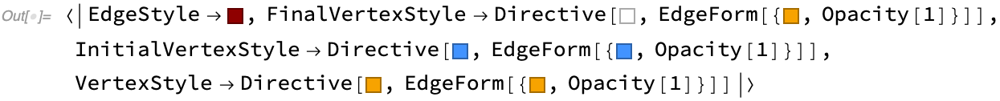

## Utility Functions

[Subhypergraph](#subhypergraph) | [WolframModelRuleValue](#wolframmodelrulevalue) | [GeneralizedGridGraph](#generalizedgridgraph) | [HypergraphAutomorphismGroup](#hypergraphautomorphismgroup) | [HypergraphUnifications](#hypergraphunifications) | [WolframPhysicsProjectStyleData](#wolframphysicsprojectstyledata) | [Build Data](#build-data)

### Subhypergraph

**`Subhypergraph`** is a small utility function that selects hyperedges that only contain vertices from the requested list.

```wl
In[]:= Subhypergraph[{{1, 1, 1}, {1, 2}, {2, 3, 3}, {2, 3, 4}}, {2, 3, 4}]
Out[]= {{2, 3, 3}, {2, 3, 4}}
```
**`WeakSubhypergraph`** is the weak version of the previous function, where hyperedges are selected if they contain any vertex from the requested list.

```wl
In[]:= WeakSubhypergraph[{{1, 1}, {2, 3}, {3, 4, 4}}, {1, 3}]
Out[]= {{1, 1}, {2, 3}, {3, 4, 4}}
```

### WolframModelRuleValue

[Transformation Count](#transformation-count) | [Arity](#arity) | [Node Counts](#node-counts) | [Connectedness](#connectedness)

**`WolframModelRuleValue`** computes simple properties of rules, which can be determined without running the evolution. Only anonymous (not pattern) rules are supported at the moment. The full list of supported properties can be obtained with **`$WolframModelRuleProperties`**:

```wl
In[] := $WolframModelRuleProperties
Out[] = {"ConnectedInput", "ConnectedInputOutputUnion", "ConnectedOutput",
  "MaximumArity", "NodeCounts", "NodesDroppedAdded", "Signature",
  "TraditionalSignature", "TransformationCount"}
```

#### Transformation Count

**`TransformationCount`** is a very simple property that returns the number of rules in the system:

```wl
In[] := WolframModelRuleValue[{{{1, 1, 2}} -> {{2, 2, 1}, {2, 3, 2}, {1, 2,
     3}},
  {{1, 2, 1}, {3, 4, 2}} -> {{4, 3, 2}}}, "TransformationCount"]
Out[] = 2
```

#### Arity

Arity is the length of an edge. The maximum length of any edge in the rules can be determined with **`MaximumArity`**:

```wl
In[] := WolframModelRuleValue[{{1, 2, 3}, {4, 5, 6}, {2, 5}, {5, 2}} ->
  {{7, 1, 8}, {9, 3, 10}, {11, 4, 12}, {13, 6, 14}, {7, 13}, {13,
    7}, {8, 10}, {10, 8}, {9, 11}, {11, 9}, {12, 14}, {14,
    12}}, "MaximumArity"]
Out[] = 3
```

For the summary of arities for all edges, one can use **`RuleSignature`**:

```wl
In[] := WolframModelRuleValue[{{1, 2, 3}, {4, 5, 6}, {2, 5}, {5, 2}} ->
  {{7, 1, 8}, {9, 3, 10}, {11, 4, 12}, {13, 6, 14}, {7, 13}, {13,
    7}, {8, 10}, {10, 8}, {9, 11}, {11, 9}, {12, 14}, {14,
    12}}, "TraditionalSignature"]
```


In this example, there are 2 binary and 2 ternary edges in the input, and 8 binary and 4 ternary edges in the output. The more machine-readable form of this can be obtained with **`Signature`** property:

```wl
In[] := WolframModelRuleValue[{{1, 2, 3}, {4, 5, 6}, {2, 5}, {5, 2}} ->
  {{7, 1, 8}, {9, 3, 10}, {11, 4, 12}, {13, 6, 14}, {7, 13}, {13,
    7}, {8, 10}, {10, 8}, {9, 11}, {11, 9}, {12, 14}, {14,
    12}}, "Signature"]
Out[] = {{2, 2}, {2, 3}} -> {{8, 2}, {4, 3}}
```

#### Node Counts

One can count the vertices involved in the left- and right-hand sides of the rule with **`"NodeCounts"`**. For example, this rule has 5 vertices in the input, and 6 in the output:

```wl
In[] := WolframModelRuleValue[{{1, 2, 3}, {2, 4, 5}} -> {{5, 6, 1}, {6, 4,
    2}, {4, 5, 3}}, "NodeCounts"]
Out[] = 5 -> 6
```

**`NodesDroppedAdded`** gives the counts of vertices that appear only on the left- and right-hand sides of the rule. Here for example, the first rule creates a vertex, and the second rule drops a vertex:

```wl
In[] := WolframModelRuleValue[{{{1, 1, 2}} -> {{2, 2, 1}, {2, 3, 2}, {1, 2,
     3}},
  {{1, 2, 1}, {3, 4, 2}} -> {{4, 3, 2}}}, "NodesDroppedAdded"]
Out[] = {{0, 1}, {1, 0}}
```

Keep in mind that rule dropping a vertex does not imply this vertex would be deleted from the state, as there may be other edges containing this vertex.

#### Connectedness

There are three types of rule connectedness.

**`ConnectedInput`** checks if the left-hand side of the rule is a connected hypergraph. If it's [`True`](https://reference.wolfram.com/language/ref/True.html), the rule is local, and [`"LowLevel"` implementation](Properties.md#method) can be used for it:

```wl
In[] := WolframModelRuleValue[{{1, 2, 3}, {3, 4, 5}} -> {{2, 3, 1}, {4, 3,
    2}, {5, 6, 7}}, "ConnectedInput"]
Out[] = True
```

**`ConnectedOutput`** does the same for the output:

```wl
In[] := WolframModelRuleValue[{{1, 2, 3}, {3, 4, 5}} -> {{2, 3, 1}, {4, 3,
    2}, {5, 6, 7}}, "ConnectedOutput"]
Out[] = False
```

**`ConnectedInputOutputUnion`** yields [`True`](https://reference.wolfram.com/language/ref/True.html) if the input is connected to the output. Note that it does not require either the input or the output to be connected within themselves, but neither of them can have pieces disconnected from the rest of the rule:

```wl
In[] := WolframModelRuleValue[{{1, 2, 3}, {3, 4, 5}} -> {{2, 3, 1}, {4, 3,
    2}, {5, 6, 7}}, "ConnectedInputOutputUnion"]
Out[] = True
```

For multiple-rule systems, each rule needs to be connected for these properties to yield [`True`](https://reference.wolfram.com/language/ref/True.html):

```wl
In[] := WolframModelRuleValue[{{{1, 2}} -> {{1, 3}, {3, 2}},
  {{1, 2}} -> {{1, 2}, {3, 3}}}, "ConnectedOutput"]
Out[] = False
```

### GeneralizedGridGraph

**`GeneralizedGridGraph`** is similar to [`GridGraph`](https://reference.wolfram.com/language/ref/GridGraph.html), but it allows for additional specifiers in each direction of the grid:

```wl
In[] := GeneralizedGridGraph[{5 -> "Directed", 5 -> "Circular"}]
```


Possible specifiers are `"Directed"` and `"Circular"`, and they can be combined:

```wl
In[] := GeneralizedGridGraph[{3 -> {"Directed", "Circular"}, 6}]
```


The same options as [`GridGraph`](https://reference.wolfram.com/language/ref/GridGraph.html) are supported. In addition `"VertexNamingFunction" -> "Coordinates"` names vertices according to their position in a grid:

```wl
In[] := GeneralizedGridGraph[{4, 5, 2},
 "VertexNamingFunction" -> "Coordinates", VertexLabels -> Automatic]
```


Finally, it's possible to use different `EdgeStyle` in different directions by specifying it as a list:

```wl
In[] := GeneralizedGridGraph[{4 -> "Directed", 5, 2},
 "VertexNamingFunction" -> "Coordinates",
 EdgeStyle -> Darker /@ {Red, Green, Blue}]
```


### HypergraphAutomorphismGroup

**`HypergraphAutomorphismGroup`** does the same thing as [`GraphAutomorphismGroup`](https://reference.wolfram.com/language/ref/GraphAutomorphismGroup.html), but for ordered hypergraphs:

```wl
In[] := HypergraphAutomorphismGroup[{{1, 2, 3}, {1, 2, 4}}]
Out[] = PermutationGroup[{Cycles[{{3, 4}}]}]
```

A more complicated example:

```wl
In[] := GroupOrder[
 HypergraphAutomorphismGroup[
  EchoFunction[
    WolframModelPlot] @ {{1, 2, 3}, {3, 4, 5}, {5, 6, 1}, {1, 7, 3}, {3,
      8, 5}, {5, 9, 1}}]]
```


```wl
Out[] = 24
```

### HypergraphUnifications

When considering which matches could potentially exist to a given set of rule inputs, it is often useful to see all possible ways hypergraphs can overlap. **`HypergraphUnifications`** constructs all possible hypergraphs that contain subgraphs matching both of its arguments. The argument-hypergraphs must overlap by at least a single edge. `HypergraphUnifications` identifies vertices to the least extent possible, but it makes some identifications if necessary for matching.

The output format is a list of triples `{unified hypergraph, first argument edge matches, second argument edge matches}`, where the last two elements are associations mapping the edge indices in the input hypergraphs to the edge indices in the unified hypergraph.

As an example, consider a simple case of two adjacent binary edges:

```wl
In[] := HypergraphUnifications[{{1, 2}, {2, 3}}, {{1, 2}, {2, 3}}]
Out[] = {{{{3, 1}, {3, 4}, {2, 3}}, <|1 -> 3, 2 -> 1|>, <|1 -> 3, 2 -> 2|>},
 {{{2, 3}, {3, 1}}, <|1 -> 1, 2 -> 2|>, <|1 -> 1, 2 -> 2|>},
 {{{4, 1}, {2, 3}, {3, 4}}, <|1 -> 3, 2 -> 1|>, <|1 -> 2, 2 -> 3|>},
 {{{1, 2}, {2, 1}}, <|1 -> 1, 2 -> 2|>, <|1 -> 2, 2 -> 1|>},
 {{{1, 2}, {3, 4}, {2, 3}}, <|1 -> 1, 2 -> 3|>, <|1 -> 3, 2 -> 2|>},
 {{{1, 3}, {2, 3}, {3, 4}}, <|1 -> 1, 2 -> 3|>, <|1 -> 2, 2 -> 3|>}}
```

In the first output here `{{{3, 1}, {3, 4}, {2, 3}}, <|1 -> 3, 2 -> 1|>, <|1 -> 3, 2 -> 2|>}`, the graphs are overlapping by a shared edge `{2, 3}`, and two inputs are matched respectively to `{{2, 3}, {3, 1}}` and `{{2, 3}, {3, 4}}`.

All unifications can be visualized with **`HypergraphUnificationsPlot`**:

```wl
In[] := HypergraphUnificationsPlot[{{1, 2}, {2, 3}}, {{1, 2}, {2, 3}}]
```


Vertex labels here show the vertex names in the input graphs to which the unification is matched.

A more complicated example with edges of various arities is

```wl
In[] := HypergraphUnificationsPlot[{{1, 2, 3}, {4, 5, 6}, {1, 4}},
 {{1, 2, 3}, {4, 5, 6}, {1, 4}}, VertexLabels -> Automatic]
```


### WolframPhysicsProjectStyleData

**`WolframPhysicsProjectStyleData`** allows one to lookup styles used in various *SetReplace* functions and properties such as [`WolframModelPlot`](WolframModelPlot.md#wolframmodelplot) and [`"CausalGraph"`](#causal-graphs).

For example, here is the default style used to draw polygons in [`WolframModelPlot`](#wolframmodelplot):

```wl
In[] := WolframPhysicsProjectStyleData["SpatialGraph", "EdgePolygonStyle"]
```


The full specification is `WolframPhysicsProjectStyleData[theme, plot type, style element]`, however either the last or the last two elements can be omitted to obtain a full [`Association`](https://reference.wolfram.com/language/ref/Association.html) of styles. The `theme` argument can be omitted to get the result for the default plot theme (only `"Light"` theme is supported at the moment). Here are all styles used in [`"CausalGraph"`](Properties.md#causal-graphs) for example:

```wl
In[] := WolframPhysicsProjectStyleData["CausalGraph"]
```



This function is useful if one needs to produce "fake" example plots using styles consistent with the Wolfram Physics Project.

For graphs composed of only a single type of vertices and edges, there is a short-hand syntax.
One can get the list of all options that needs to be passed using an `"Options"` property:

```wl
In[] := WolframPhysicsProjectStyleData["SpatialGraph3D", "Options"]
```


Alternatively, one can use the `"Function"` property, which would give a function that takes a graph and produces a
correctly styled graph:

```wl
In[] := WolframPhysicsProjectStyleData["SpatialGraph3D", "Function"][
 Graph3D[{1 -> 2, 2 -> 3, 3 -> 1, 3 -> 4, 4 -> 1}]]
```


### Build Data

There are two constants containing information about the build. **`$SetReplaceGitSHA`** is a git SHA of the currently-used version of *SetReplace*:

```wl
In[] := $SetReplaceGitSHA
Out[] = "320b91b5ca1d91b9b7890aa181ad457de3e38939"
```

If the build directory were not clean, it would have "\*" at the end.

**`$SetReplaceBuildTime`** gives a date object of when the paclet was created:

```wl
In[] := $SetReplaceBuildTime
```


These constants are particularly useful for reporting issues with the code.