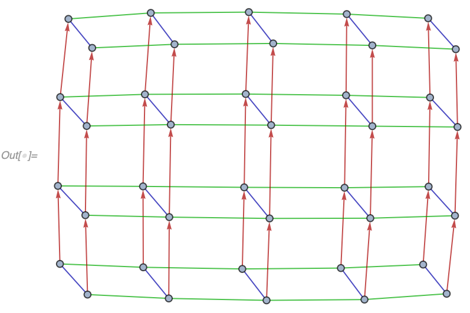

### GeneralizedGridGraph

**`GeneralizedGridGraph`** is similar to [`GridGraph`](https://reference.wolfram.com/language/ref/GridGraph.html), but it allows for additional specifiers in each direction of the grid:

```wl
In[] := GeneralizedGridGraph[{5 -> "Directed", 5 -> "Circular"}]
```


Possible specifiers are `"Directed"` and `"Circular"`, and they can be combined:

```wl
In[] := GeneralizedGridGraph[{3 -> {"Directed", "Circular"}, 6}]
```


The same options as [`GridGraph`](https://reference.wolfram.com/language/ref/GridGraph.html) are supported. In addition `"VertexNamingFunction" -> "Coordinates"` names vertices according to their position in a grid:

```wl
In[] := GeneralizedGridGraph[{4, 5, 2},
 "VertexNamingFunction" -> "Coordinates", VertexLabels -> Automatic]
```


Finally, it's possible to use different `EdgeStyle` in different directions by specifying it as a list:

```wl
In[] := GeneralizedGridGraph[{4 -> "Directed", 5, 2},
 "VertexNamingFunction" -> "Coordinates",
 EdgeStyle -> Darker /@ {Red, Green, Blue}]
```


