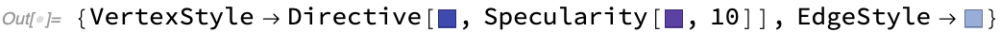

### WolframPhysicsProjectStyleData

**`WolframPhysicsProjectStyleData`** allows one to lookup styles used in various *SetReplace* functions and properties such as [`WolframModelPlot`](../WolframModelPlot.md) and [`"CausalGraph"`](../WolframModelAndWolframModelEvolutionObject/Properties/CausalGraphs.md).

For example, here is the default style used to draw polygons in [`WolframModelPlot`](../WolframModelPlot.md):

```wl
In[] := WolframPhysicsProjectStyleData["SpatialGraph", "EdgePolygonStyle"]
```


The full specification is `WolframPhysicsProjectStyleData[theme, plot type, style element]`, however either the last or the last two elements can be omitted to obtain a full [`Association`](https://reference.wolfram.com/language/ref/Association.html) of styles. The `theme` argument can be omitted to get the result for the default plot theme (only `"Light"` theme is supported at the moment). Here are all styles used in [`"CausalGraph"`](../WolframModelAndWolframModelEvolutionObject/Properties/CausalGraphs.md) for example:

```wl
In[] := WolframPhysicsProjectStyleData["CausalGraph"]
```


This function is useful if one needs to produce "fake" example plots using styles consistent with the Wolfram Physics Project.

For graphs composed of only a single type of vertices and edges, there is a short-hand syntax.
One can get the list of all options that needs to be passed using an `"Options"` property:

```wl
In[] := WolframPhysicsProjectStyleData["SpatialGraph3D", "Options"]
```



Alternatively, one can use the `"Function"` property, which would give a function that takes a graph and produces a
correctly styled graph:

```wl
In[] := WolframPhysicsProjectStyleData["SpatialGraph3D", "Function"][
 Graph3D[{1 -> 2, 2 -> 3, 3 -> 1, 3 -> 4, 4 -> 1}]]
```


