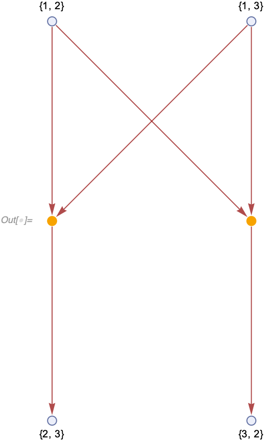
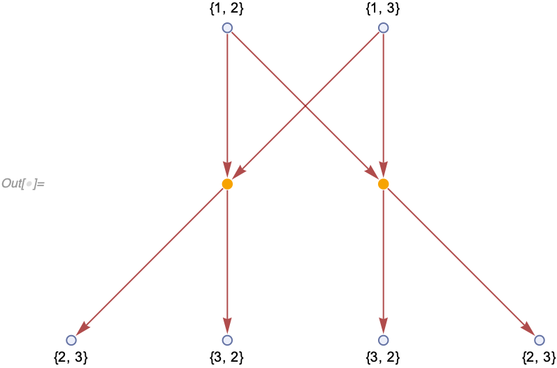

#### "EventDeduplication"

Some rules can match the same set of inputs in different ways.
For example, consider the rule `{{a, b}, {a, c}} -> {{b, c}}` starting with an initial condition `{{1, 2}, {1, 3}}`.
There are two possible ways to match it: `<|a -> 1, b -> 2, c -> 3|>` and `<|a -> 1, b -> 3, c -> 2|>`.
In this case, these matches yield different results, `{2, 3}` and `{3, 2}` respectively:

```wl
In[] := WolframModel[{{a, b}, {a, c}} -> {{b, c}}, {{1, 2}, {1, 3}},
  "EventSelectionFunction" ->
   "MultiwaySpacelike"]["ExpressionsEventsGraph",
 VertexLabels -> Automatic]
```



In the case above the outputs are different, however sometimes they are the same (more precisely, isomorphic):

```wl
In[] := WolframModel[{{a, b}, {a, c}} -> {{b, c}, {c, b}}, {{1, 2}, {1, 3}},
  "EventSelectionFunction" ->
   "MultiwaySpacelike"]["ExpressionsEventsGraph",
 VertexLabels -> Automatic]
```



**`EventDeduplication`** option can be used in a case like this to combine these two identical events into one:

```wl
In[] := WolframModel[{{a, b}, {a, c}} -> {{b, c}, {c, b}}, {{1, 2}, {1, 3}},
  "EventSelectionFunction" -> "MultiwaySpacelike",
  "EventDeduplication" -> "SameInputSetIsomorphicOutputs"]["ExpressionsEventsGraph",
 VertexLabels -> Automatic]
```


The outputs of the rule need not be identical, but should be isomorphic with respect to renaming of new atoms:

```wl
In[] := WolframModel[{{a, b}, {a, c}} -> {{b, d}, {c, d}}, {{1, 2}, {1, 3}},
  "EventSelectionFunction" -> "MultiwaySpacelike",
  "EventDeduplication" -> "SameInputSetIsomorphicOutputs"]["ExpressionsEventsGraph",
 VertexLabels -> Automatic]
```


