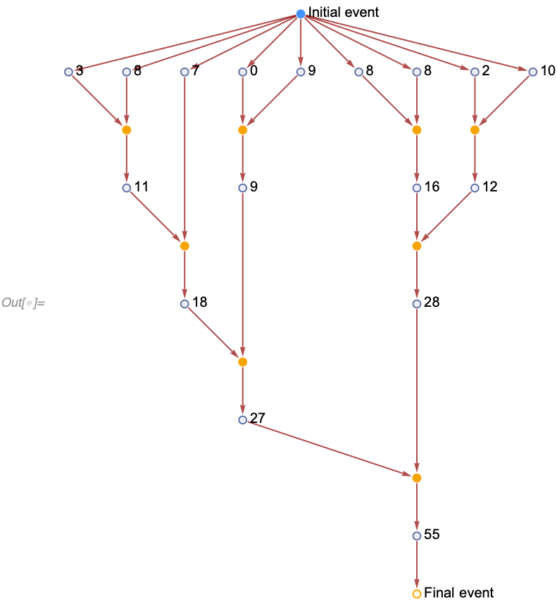

#### "IncludeBoundaryEvents"

**`"IncludeBoundaryEvents"`** allows one to include "fake" initial and final events in properties such as [`"ExpressionsEventsGraph"`](../Properties/CausalGraphs.md). It does not affect the evolution itself and does not affect the evolution object. It has 4 settings: [`None`](https://reference.wolfram.com/language/ref/None.html), `"Initial"`, `"Final"` and [`All`](https://reference.wolfram.com/language/ref/All.html).

Here is an example of an [`"ExpressionsEventsGraph"`](../Properties/CausalGraphs.md) with the initial and final "events" included:

```wl
In[] := WolframModel[<|"PatternRules" -> {a_, b_} :> a + b|>,
  {3, 8, 8, 8, 2, 10, 0, 9, 7}, Infinity]["ExpressionsEventsGraph",
 "IncludeBoundaryEvents" -> All,
 VertexLabels -> Placed[Automatic, After]]
```



Properties like [`"AllEventsList"`](../Properties/Events.md) are affected as well:

```wl
In[] := WolframModel[<|"PatternRules" -> {a_, b_} :> a + b|>,
 {3, 8, 8, 8, 2, 10, 0, 9, 7}, Infinity, "AllEventsList",
 "IncludeBoundaryEvents" -> "Final"]
Out[] = {{1, {1, 2} -> {10}}, {1, {3, 4} -> {11}},
 {1, {5, 6} -> {12}}, {1, {7, 8} -> {13}},
 {1, {9, 10} -> {14}}, {1, {11, 12} -> {15}},
 {1, {13, 14} -> {16}}, {1, {15, 16} -> {17}},
 {Infinity, {17} -> {}}}
```
