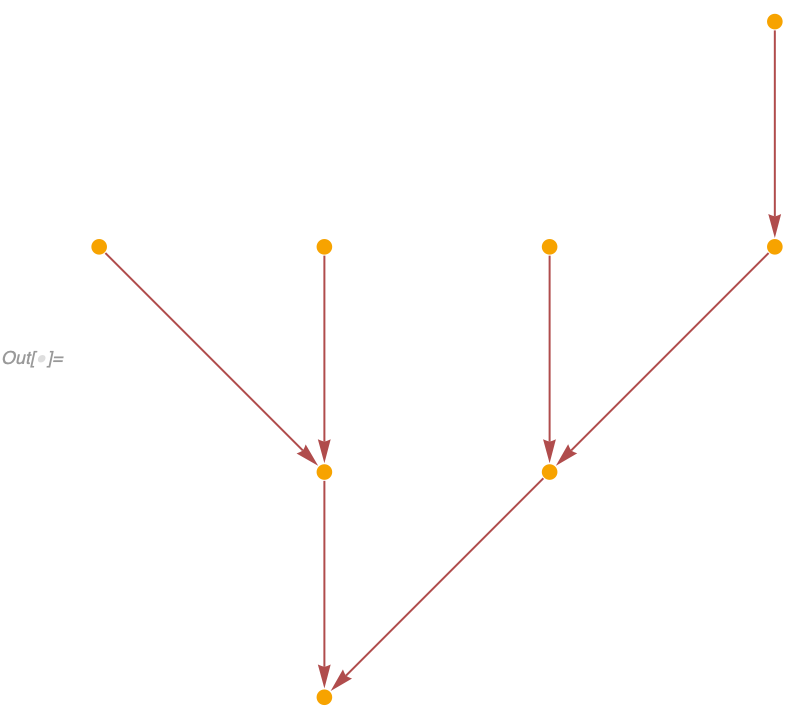
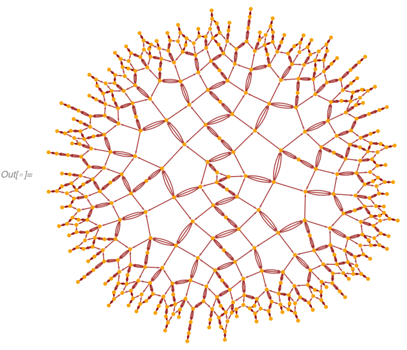
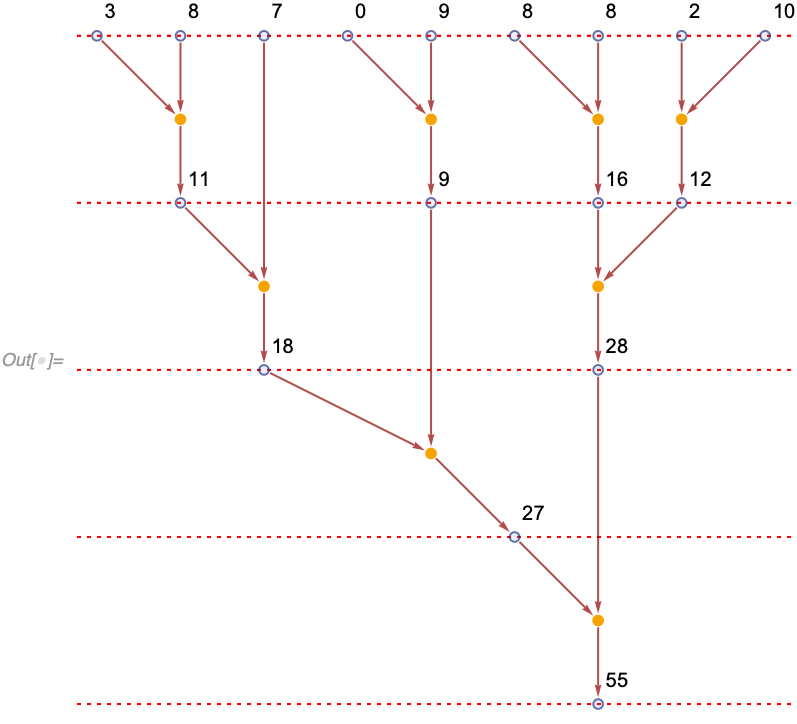

###### [Symbols and Functions](/README.md#symbols-and-functions) > [WolframModel and WolframModelEvolutionObject](../WolframModelAndWolframModelEvolutionObject.md) > [Properties](../WolframModelAndWolframModelEvolutionObject.md#properties) >

# Causal Graphs

An event **A** *causes* an event **B** if there exists an expression (set element) created by **A** and destroyed by **B**. If we then consider all such relationships between events, we create a **`"CausalGraph"`**. In a causal graph, vertices correspond to events, and edges correspond to the set elements (aka spatial edges).

To make it even more explicit, we have another property, **`"ExpressionsEventsGraph"`**. In this graph, there are two types of vertices corresponding to events and expressions, and edges correspond to a given expression being an input or an output of a given event.

For example, if we consider our simple arithmetic model `{a_, b_} :> a + b` starting from `{3, 8, 8, 8, 2, 10, 0, 9, 7}` we get an expressions-events graph which quite clearly describes what's going on:

```wl
In[] := WolframModel[<|"PatternRules" -> {a_, b_} :> a + b|>,
  {3, 8, 8, 8, 2, 10, 0, 9, 7}, Infinity]["ExpressionsEventsGraph",
 VertexLabels -> Placed[Automatic, After]]
```


The causal graph is very similar, it just has the expression-vertices contracted:

```wl
In[] := WolframModel[<|"PatternRules" -> {a_, b_} :> a + b|>,
 {3, 8, 8, 8, 2, 10, 0, 9, 7}, Infinity, "CausalGraph"]
```



Here is an example for a hypergraph model (admittedly considerably harder to understand). Multiedges correspond to situations where multiple set elements were both created and destroyed by the same pair of events:

```wl
In[] := WolframModel[{{1, 2, 3}, {4, 5, 6}, {1, 4}} ->
  {{3, 7, 8}, {9, 2, 10}, {11, 12, 5}, {13, 14, 6}, {7, 12}, {11,
    9}, {13, 10}, {14, 8}},
 {{1, 1, 1}, {1, 1, 1}, {1, 1}, {1, 1}, {1, 1}}, 20, "CausalGraph"]
```



**`"LayeredCausalGraph"`** generates the same graph but layers events generation-by-generation. For example, in our arithmetic causal graph, note how it's arranged differently from an example above:

```wl
In[] := WolframModel[<|"PatternRules" -> {a_, b_} :> a + b|>,
 {3, 8, 8, 8, 2, 10, 0, 9, 7}, Infinity, "LayeredCausalGraph"]
```


Note how slices through the expressions-events graph correspond to states returned by [`"StatesList"`](States.md). Pay attention to intersections of the slices with edges as well, as they correspond to unused expressions from previous generations that remain in the state:

```wl
In[] := With[{evolution =
   WolframModel[<|"PatternRules" -> {a_, b_} :> a + b|>,
    {3, 8, 8, 8, 2, 10, 0, 9, 7}, Infinity]},
 evolution["ExpressionsEventsGraph",
  VertexLabels -> Placed[Automatic, {After, Above}],
  Epilog -> {Red, Dotted,
    Table[Line[{{-10, k}, {10, k}}], {k, 0, 9, 2}]}]]
```



```wl
In[] := WolframModel[<|"PatternRules" -> {a_, b_} :> a + b|>,
 {3, 8, 8, 8, 2, 10, 0, 9, 7}, Infinity, "StatesList"]
Out[] = {{3, 8, 8, 8, 2, 10, 0, 9, 7}, {7, 11, 16, 12, 9}, {9, 18, 28}, {28,
  27}, {55}}
```

`"ExpressionsEventsGraph"` is particularly useful for multiway systems, as it allows one to immediately see multiway branching. For example, here the expression-vertex `{2}` has the out-degree of 2, which indicates it was used in two conflicting events, which indicates multiway branching:

```wl
In[] := WolframModel[{{1}, {1, 2}} -> {{2}}, {{1}, {1, 2}, {2, 3}, {2, 4}},
  Infinity,
  "EventSelectionFunction" -> None]["ExpressionsEventsGraph",
 VertexLabels -> Placed[Automatic, After]]
```


`"CausalGraph"`, `"LayeredCausalGraph"` and `"ExpressionsEventsGraph"` properties all accept [`Graph`](https://reference.wolfram.com/language/ref/Graph.html) options, as was demonstrated above with [`VertexLabels`](https://reference.wolfram.com/language/ref/VertexLabels.html). Some options have special behavior for the [`Automatic`](https://reference.wolfram.com/language/ref/Automatic.html) value, i.e., `VertexLabels -> Automatic` in `"ExpressionsEventsGraph"` displays the contents of expressions, which are not the vertex names in that graph (as there can be multiple expressions with the same contents). `VertexLabels -> "Index"`, on the other hand, displays the vertex indices of both expressions and events in the graph:

```wl
In[] := WolframModel[{{{x, y}, {x, z}} -> {{x, z}, {x, w}, {y, w}, {z, w}}},
  {{0, 0}, {0, 0}}, 2]["ExpressionsEventsGraph", VertexLabels -> "Index"]
```


