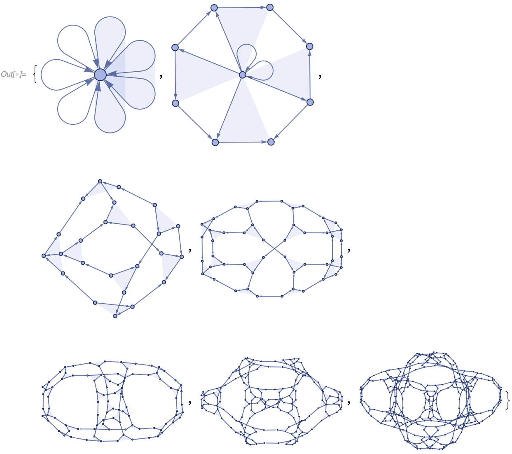

###### [Symbols and Functions](/README.md#symbols-and-functions) > [WolframModel and WolframModelEvolutionObject](../WolframModelAndWolframModelEvolutionObject.md) > [Properties](../WolframModelAndWolframModelEvolutionObject.md#properties) >

# States

These are the properties used to extract states at a particular moment in the evolution. They always return lists, but in the examples below, we plot them for clarity.

**`"FinalState"`** (aka -1) yields the state obtained after all replacements of the evolution have been made:

```wl
In[] := WolframModelPlot @ WolframModel[{{1, 2, 3}, {4, 5, 6}, {1, 4}} ->
   {{2, 7, 8}, {3, 9, 10}, {5, 11, 12}, {6, 13, 14}, {8, 12}, {11,
     10}, {13, 7}, {14, 9}},
  {{1, 1, 1}, {1, 1, 1}, {1, 1}, {1, 1}, {1, 1}}, 6, "FinalState"]
```


**`"StatesList"`** yields the list of states at each generation:

```wl
In[] := WolframModelPlot /@ WolframModel[{{1, 2, 3}, {4, 5, 6}, {1, 4}} ->
   {{2, 7, 8}, {3, 9, 10}, {5, 11, 12}, {6, 13, 14}, {8, 12}, {11,
     10}, {13, 7}, {14, 9}},
  {{1, 1, 1}, {1, 1, 1}, {1, 1}, {1, 1}, {1, 1}}, 6, "StatesList"]
```



This is identical to using the **`"Generation"`** property mapped over all generations:

```wl
In[] := WolframModelPlot /@ (WolframModel[{{1, 2, 3}, {4, 5, 6}, {1, 4}} ->
       {{2, 7, 8}, {3, 9, 10}, {5, 11, 12}, {6, 13, 14}, {8, 12}, {11,
          10}, {13, 7}, {14, 9}},
      {{1, 1, 1}, {1, 1, 1}, {1, 1}, {1, 1}, {1, 1}}, 6][
     "Generation", #] &) /@ Range[0, 6]
```


In fact, the `"Generation"` property can be omitted and the index of the generation can be used directly:

```wl
In[] := WolframModelPlot /@ WolframModel[{{1, 2, 3}, {4, 5, 6}, {1, 4}} ->
    {{2, 7, 8}, {3, 9, 10}, {5, 11, 12}, {6, 13, 14}, {8, 12}, {11,
      10}, {13, 7}, {14, 9}},
   {{1, 1, 1}, {1, 1, 1}, {1, 1}, {1, 1}, {1, 1}}, 6] /@ Range[0, 6]
```


`"StatesList"` shows a compressed version of the evolution. To see how the state changes with each applied replacement, use **`"AllEventsStatesList"`**:

```wl
In[] := WolframModelPlot /@ WolframModel[{{1, 2, 3}, {4, 5, 6}, {1, 4}} ->
   {{2, 7, 8}, {3, 9, 10}, {5, 11, 12}, {6, 13, 14}, {8, 12}, {11,
     10}, {13, 7}, {14, 9}},
  {{1, 1, 1}, {1, 1, 1}, {1, 1}, {1, 1}, {1, 1}}, 3,
  "AllEventsStatesList"]
```


Finally, to see a state after a specific event, use **`"StateAfterEvent"`** (aka `"SetAfterEvent"`):

```wl
In[] := WolframModelPlot @ WolframModel[{{1, 2, 3}, {4, 5, 6}, {1, 4}} ->
    {{2, 7, 8}, {3, 9, 10}, {5, 11, 12}, {6, 13, 14}, {8, 12}, {11,
      10}, {13, 7}, {14, 9}},
   {{1, 1, 1}, {1, 1, 1}, {1, 1}, {1, 1}, {1, 1}}, 6][
  "StateAfterEvent", 42]
```


`"StateAfterEvent"` is equivalent to taking a corresponding part in `"AllEventsStatesList"`, but it is much faster to compute than the entire list.
