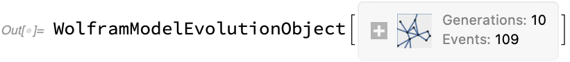
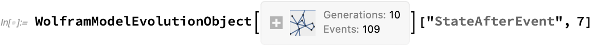

## WolframModel and WolframModelEvolutionObject

[Rule Specification](RuleSpecification.md) | [Automatic Initial State](AutomaticInitialState.md) | [Step Limiters](StepLimiters.md)| ["VertexNamingFunction"](Options/VertexNamingFunction) | ["IncludePartialGenerations"](Options/IncludePartialGenerations.md) | ["IncludeBoundaryEvents"](Options/IncludeBoundaryEvents.md) | ["EventOrderingFunction"](Options/EventOrderingFunction.md) | ["EventSelectionFunction"](Options/EventSelectionFunction.md) | ["EventDeduplication"](Options/EventDeduplication.md) | ["IncludeBoundaryEvents"](Options/IncludeBoundaryEvents.md) | ["IncludePartialGenerations"](Options/IncludePartialGenerations.md) | [Method](Options/Method.md) | [TimeConstraint](Options/TimeConstraint.md) | ["AllEdgesThroughoutEvolution"](Properties/AllEdgesThroughoutEvolution.md) | [Causal Graphs](Properties/CausalGraphs.md) | [Creator And Destroyer Events](Properties/CreatorAndDestroyerEvents.md) | [Edge And Event Generations](Properties/EdgeAndEventGenerations.md) | [ElementCountLists](Properties/ElementCountLists.md) | [Event Counts](Properties/EventCounts.md) | [Events](Properties/Events.md) | [Events And States](Properties/EventsAndStates.md) | [Expression Separations](Properties/ExpressionSeparations.md) | [Final Element Counts](Properties/FinalElementCounts.md) | [Generation Counts](Properties/GenerationCounts.md) | [Plots Of Events](Properties/PlotsOfEvents.md) | [Plots Of States](Properties/PlotsOfStates.md) | [RuleIndices For Events](Properties/RuleIndicesForEvents.md) | [Rules](Properties/Rules.md) | [States](Properties/States.md) | [States As Edge Indices](Properties/StatesAsEdgeIndices.md) | [Termination Reason](Properties/TerminationReason.md) | [Total Element Counts](Properties/TotalElementCounts.md) | [Version](Properties/Version.md) 

**`WolframModel`** is the primary function of the package. It provides tools for the generation and analysis of set substitution systems. It can compute many different properties of the evolution and has many different options, which we describe in the corresponding subsections.

The most basic way to call it is

```wl
In[] := WolframModel[rule, initial set, step count]
```

For example,

```wl
In[] := WolframModel[{{1, 2, 3}, {2, 4, 5}} ->
  {{5, 6, 1}, {6, 4, 2}, {4, 5, 3}},
 {{1, 2, 3}, {2, 4, 5}, {4, 6, 7}}, 10]
```



Note that this call is different from the [`SetReplace`](../SetReplace*.md) function in a variety of ways:

* The order of arguments is switched, the rule goes first.
* The rule is specified in the "anonymous" form ([`ToPatternRules`](../ToPatternRules.md) is done implicitly).
* The number of steps here is the number of generations, which is equivalent to steps of [`SetReplaceAll`](../SetReplace*.md). Here each edge can have at most 10 generations of predecessors.
* The output is not a final state, but a **`WolframModelEvolutionObject`** containing the entire evolution (similar to [`SetReplaceList`](../SetReplace*.md) but with additional information about the relationships between edges and the events that produced them. From the information field on that object, one can see that the evolution was done for 10 generations (i.e., the evolution did not terminate early), and 109 replacements (aka events) were made in total. More properties can be computed from an evolution object.

To see the information an evolution object contains, let's make one with a smaller number of generations:

```wl
In[] := WolframModel[{{1, 2, 3}, {2, 4, 5}} ->
  {{5, 6, 1}, {6, 4, 2}, {4, 5, 3}},
 {{1, 2, 3}, {2, 4, 5}, {4, 6, 7}}, 3]
```


One can easily see its internal structure in its [`InputForm`](https://reference.wolfram.com/language/ref/InputForm.html):


```wl
Out[] = WolframModelEvolutionObject[<|
  "Version" -> 2,
  "Rules" -> {{1, 2, 3}, {2, 4, 5}} ->
    {{5, 6, 1}, {6, 4, 2}, {4, 5, 3}},
  "MaxCompleteGeneration" -> 3,
  "TerminationReason" -> "MaxGenerationsLocal",
  "AtomLists" -> {{1, 2, 3}, {2, 4, 5}, {4, 6, 7}, {5, 8, 1}, {8, 4,
     2}, {4, 5, 3}, {7, 9, 8}, {9, 6, 4}, {6, 7, 2}, {1, 10, 4}, {10,
     8, 5}, {8, 1, 3}, {4, 11, 7}, {11, 6, 9}, {6, 4, 8}, {5, 12,
     1}, {12, 8, 10}, {8, 5, 4}},
  "EventRuleIDs" -> {0, 1, 1, 1, 1, 1},
  "EventInputs" -> {{}, {1, 2}, {5, 3}, {6, 4}, {7, 8}, {10, 11}},
  "EventOutputs" -> {{1, 2, 3}, {4, 5, 6}, {7, 8, 9}, {10, 11,
     12}, {13, 14, 15}, {16, 17, 18}},
  "EventGenerations" -> {0, 1, 2, 2, 3, 3}|>]
```

The most important part of this [`Association`](https://reference.wolfram.com/language/ref/Association.html) is `"AtomLists"` which includes all set elements (aka expressions or edges) ever created throughout evolution.

In this particular example, it begins with `{1, 2, 3}`, `{2, 4, 5}` and `{4, 6, 7}`, which is the initial set. It is then followed by `{5, 8, 1}`, `{8, 4, 2}` and `{4, 5, 3}` which are the edges created in the first replacement event (the new vertex `8` here is named with the first unused integer, see [`"VertexNamingFunction"`](Options/VertexNamingFunction.md) for details about naming). These edges are followed by four more triples of edges corresponding to the outputs of remaining events.

`"AtomLists"` contains edges from all steps and is by itself insufficient to determine to which step a particular edge belongs. For example, `{5, 8, 1}` only appears in the result after a single step and `{7, 9, 8}` after two steps. Here we use [`"StatesList"`](Properties/States.md) property to demonstrate that:


```wl
Out[] = {{{1, 2, 3}, {2, 4, 5}, {4, 6, 7}},
 {{4, 6, 7}, {5, 8, 1}, {8, 4, 2}, {4, 5, 3}},
 {{7, 9, 8}, {9, 6, 4}, {6, 7, 2}, {1, 10, 4}, {10, 8, 5}, {8, 1,
   3}},
 {{6, 7, 2}, {8, 1, 3}, {4, 11, 7}, {11, 6, 9}, {6, 4, 8}, {5, 12,
   1}, {12, 8, 10}, {8, 5, 4}}}
```

Note that a set element is not duplicated in `"AtomLists"` if it exists in multiple steps. For example, `{6, 7, 2}` appears in the set after both two and three steps, but it only appears in `"AtomLists"` once because it was never used as an input during the 3rd step.

Other properties of the evolution object describe the relationships between edges and the features of the evolution:

* `"Version"` is the data format of the evolution object. This description is for version 2, which is the first version to support multiway systems. Version 1 does not have the `"Version"` key. The objects of older versions are automatically migrated when they are evaluated.
* `"Rules"` is an exact copy of the corresponding `WolframModel` argument.
* `"MaxCompleteGenerations"` shows the largest generation in which no matches are possible that only involve expressions of this or earlier generations. In this particular case, it is the same as the largest generation of any edge, but it might be different if a more elaborate [step specification](StepLimiters.md) is used.
* `"TerminationReason"` shows the reason evaluation was stopped. See the [`"TerminationReason"`](Properties/TerminationReason.md) property for more details.
* `"EventRuleIDs"` shows which rule was used for each event. It's rather boring in this particular case, as this example only has one rule. See [Rule Indices for Events](Properties/RuleIndicesForEvents.md) for a more interesting case. The first value, `0`, corresponds to the initial event, which is included in the evolution object but is omitted [by default](Options/IncludeBoundaryEvents.md) when computing properties.
* `"EventInputs"` shows which edge indices from `"AtomLists"` were used in each event. The order corresponds to the input patterns of the rules. The first value, `{}`, again corresponds to the initial event. Note, the same index can appear multiple times in [multiway systems](Options/EventSelectionFunction.md).
* `"EventOutputs"` similarly shows which edge indices from `"AtomLists"` were produced by each event. There are no duplicates in these lists because events always generate new edges.
* `"EventGenerations"` shows how many layers of predecessors a given event has.

A specific property can be requested from an evolution object by supplying it as an argument to the object itself:


```wl
Out[] = 109
```

Properties section describes and gives examples for each available property. The full list of them can also be obtained with the `"Properties"` property:


```wl
Out[] = {"EvolutionObject", "FinalState", "FinalStatePlot", "StatesList",
  "StatesPlotsList", "EventsStatesPlotsList",
  "AllEventsStatesEdgeIndicesList", "AllEventsStatesList",
  "GenerationEdgeIndices", "Generation", "StateEdgeIndicesAfterEvent",
   "StateAfterEvent", "TotalGenerationsCount",
  "PartialGenerationsCount", "GenerationsCount", "GenerationComplete",
   "AllEventsCount", "GenerationEventsCountList",
  "GenerationEventsList", "FinalDistinctElementsCount",
  "AllEventsDistinctElementsCount", "VertexCountList",
  "EdgeCountList", "FinalEdgeCount", "AllEventsEdgesCount",
  "AllEventsGenerationsList", "ExpressionsEventsGraph", "CausalGraph",
   "LayeredCausalGraph", "TerminationReason", "AllEventsRuleIndices",
  "AllEventsList", "EventsStatesList", "EdgeCreatorEventIndices",
  "EdgeDestroyerEventsIndices", "EdgeDestroyerEventIndices",
  "EdgeGenerationsList", "ExpressionsSeparation", "Properties",
  "Version", "Rules", "CompleteGenerationsCount",
  "AllEventsEdgesList"}
```

Some properties take additional arguments, which can be supplied after the property name:



```wl
Out[] = {{8, 1, 3}, {5, 12, 1}, {12, 8, 10}, {8, 5, 4}, {2, 13, 11}, {13, 7,
  6}, {7, 2, 9}, {7, 14, 6}, {14, 11, 4}, {11, 7, 8}}
```

A particular generation can be extracted simply by its number (including, i.e., -1 for the final state):


```wl
Out[] = {{6, 7, 2}, {8, 1, 3}, {4, 11, 7}, {11, 6, 9}, {6, 4, 8}, {5, 12,
  1}, {12, 8, 10}, {8, 5, 4}}
```

If a property does not take any arguments, it can be specified directly in `WolframModel` as the fourth argument:

```wl
In[] := WolframModel[{{1, 2, 3}, {2, 4, 5}} ->
  {{5, 6, 1}, {6, 4, 2}, {4, 5, 3}},
 {{1, 2, 3}, {2, 4, 5}, {4, 6, 7}}, 10, "EdgeCountList"]
Out[] = {3, 4, 6, 8, 12, 18, 24, 36, 54, 76, 112}
```

All properties available to use directly in `WolframModel` can be looked up in `$WolframModelProperties` (there are more properties here compared to the list above because some properties are available under multiple names, and only the canonical name is listed above):

```wl
In[] := $WolframModelProperties
Out[] = {"AllEventsCount", "AllEventsDistinctElementsCount",
  "AllEventsEdgesCount", "AllEventsEdgesList",
  "AllEventsGenerationsList", "AllEventsList", "AllEventsRuleIndices",
   "AllEventsStatesEdgeIndicesList", "AllEventsStatesList",
  "AllExpressions", "AtomsCountFinal", "AtomsCountTotal",
  "CausalGraph", "CompleteGenerationsCount", "CreatorEvents",
  "DestroyerEvents", "EdgeCountList", "EdgeCreatorEventIndices",
  "EdgeDestroyerEventIndices", "EdgeDestroyerEventsIndices",
  "EdgeGenerationsList", "EventGenerations", "EventGenerationsList",
  "EventsCount", "EventsList", "EventsStatesList",
  "EventsStatesPlotsList", "EvolutionObject", "ExpressionGenerations",
   "ExpressionsCountFinal", "ExpressionsCountTotal",
  "ExpressionsEventsGraph", "FinalDistinctElementsCount",
  "FinalEdgeCount", "FinalState", "FinalStatePlot",
  "GenerationComplete", "GenerationEventsCountList",
  "GenerationEventsList", "GenerationsCount", "LayeredCausalGraph",
  "MaxCompleteGeneration", "PartialGenerationsCount", "StatesList",
  "StatesPlotsList", "TerminationReason", "TotalGenerationsCount",
  "UpdatedStatesList", "Version", "VertexCountList"}
```

Multiple properties can also be specified in a list (only in `WolframModel`, not in `WolframModelEvolutionObject`):

```wl
In[] = WolframModel[{{1, 2, 3}, {2, 4, 5}} ->
  {{5, 6, 1}, {6, 4, 2}, {4, 5, 3}},
 {{1, 2, 3}, {2, 4, 5}, {4, 6, 7}}, 10,
 {"EdgeCountList", "VertexCountList"}]
Out[] = {{3, 4, 6, 8, 12, 18, 24, 36, 54, 76, 112},
 {7, 8, 10, 12, 16, 22, 28, 40, 58, 80, 116}}
```
