[Wolfram Models as Set Substitution Systems](#wolfram-models-as-set-substitution-systems) | [Getting Started](#getting-started) | [Symbols and Functions](#symbols-and-functions) | [Physics](#physics) | [Acknowledgements](#acknowledgements)

# Wolfram Models as Set Substitution Systems

## Set Substitution Systems

**SetReplace** is a [Wolfram Language](https://www.wolfram.com/language/) package for manipulating set substitution systems. To understand what a set substitution system does consider an unordered set of elements:

```wl
{1, 2, 5, 3, 6}
```

We can set up an operation on this set which would take any of the two elements and replace them with their sum:

```wl
{a_, b_} :> {a + b}
```

In **SetReplace**, this can be expressed as the following (the new element `1 + 2 -> 3` is put at the end)

```wl
In[] := SetReplace[{1, 2, 5, 3, 6}, {a_, b_} :> {a + b}]
Out[] = {5, 3, 6, 3}
```

Note that this is similar to [`SubsetReplace`](https://reference.wolfram.com/language/ref/SubsetReplace.html) function of Wolfram Language (introduced in version 12.1, it replaces all non-overlapping subsets at once by default):

```wl
In[] := SubsetReplace[{1, 2, 5, 3, 6}, {a_, b_} :> a + b]
Out[] = {3, 8, 6}
```

## Wolfram Models

A more interesting case (which we call a Wolfram model) is one where the set elements are related to each other. Specifically, we can consider a set of ordered lists of atomic vertices; in other words, an ordered hypergraph.

As an example consider a set:

```wl
{{1, 2, 3}, {2, 4, 5}, {4, 6, 7}}
```

We can render it as a collection of ordered hyperedges:

```wl
In[] := WolframModelPlot[{{1, 2, 3}, {2, 4, 5}, {4, 6, 7}},
 VertexLabels -> Automatic]
```

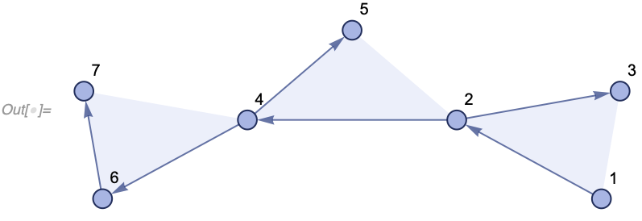

We can then have a rule which would pick a subset of these hyperedges related through common vertices (much like a join query) and replace them with something else:

```wl
{{v1_, v2_, v3_}, {v2_, v4_, v5_}} :>
 Module[{v6}, {{v5, v6, v1}, {v6, v4, v2}, {v4, v5, v3}}]
```

Note the [`Module`](https://reference.wolfram.com/language/ref/Module.html) on the right-hand side creates a new variable (vertex) which causes the hypergraph to grow. Due to optimizations, it's not always a [`Module`](https://reference.wolfram.com/language/ref/Module.html) that creates vertices, so its name may be different. After a single replacement we get this (the new vertex is v11):

```wl
In[] := WolframModelPlot[SetReplace[{{1, 2, 3}, {2, 4, 5}, {4, 6, 7}},
  {{v1_, v2_, v3_}, {v2_, v4_, v5_}} :>
   Module[{v6}, {{v5, v6, v1}, {v6, v4, v2}, {v4, v5, v3}}]],
 VertexLabels -> Automatic]
```


After 10 steps, we get a more complicated structure:

```wl
In[] := WolframModelPlot[SetReplace[{{1, 2, 3}, {2, 4, 5}, {4, 6, 7}},
  {{v1_, v2_, v3_}, {v2_, v4_, v5_}} :>
   Module[{v6}, {{v5, v6, v1}, {v6, v4, v2}, {v4, v5, v3}}], 10],
 VertexLabels -> Automatic]
```

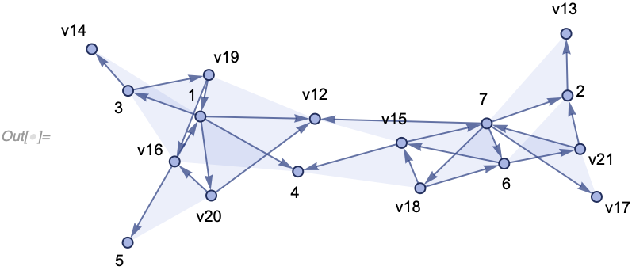

And after 100 steps, it gets even more elaborate:

```wl
In[] := WolframModelPlot[SetReplace[{{1, 2, 3}, {2, 4, 5}, {4, 6, 7}},
  {{v1_, v2_, v3_}, {v2_, v4_, v5_}} :>
   Module[{v6}, {{v5, v6, v1}, {v6, v4, v2}, {v4, v5, v3}}], 100]]
```

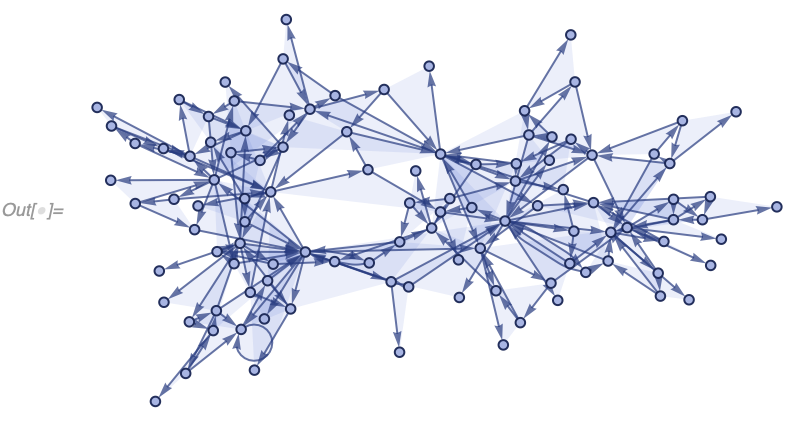

Exploring the hypergraph models of this variety is the primary purpose of this package.

# Getting Started

## Dependencies

You only need three things to use **SetReplace**:

* Windows, macOS 10.12+, or Linux.
* [Wolfram Language 12.1+](https://www.wolfram.com/language/) including [WolframScript](https://www.wolfram.com/wolframscript/). A free version is available as [Wolfram Engine](https://www.wolfram.com/engine/).
* A C++17 compiler to build the low-level part of the package. Instructions on how to set up a compiler to use in WolframScript are [here](https://reference.wolfram.com/language/CCompilerDriver/tutorial/SpecificCompilers.html#509267359).

## Build Instructions

To build:

1. `cd` to the root directory of the repository.
2. Run `./build.wls` to create the paclet file. If you see an error message about c++17, make sure the C++ compiler you are using is up-to-date. If your default system compiler does not support c++17, you can choose a different one with environmental variables. The following, for instance, typically works on a Mac:

    ```bash
    COMPILER=CCompilerDriver\`ClangCompiler\`ClangCompiler COMPILER_INSTALLATION=/usr/bin ./build.wls
    ```

    Here `ClangCompiler` can be replaced with one of ``<< CCompilerDriver`; "Compiler" /. CCompilerDriver`CCompilers[Full]``, and `COMPILER_INSTALLATION` is a directory in which the compiler binary can be found.

3. Run `./install.wls` to install the paclet into your Wolfram system.
4. Evaluate `PacletDataRebuild[]` in all running Wolfram kernels.
5. Evaluate ``<< SetReplace` `` every time before using the package.

A less frequently updated version is available through the Wolfram public paclet server and can be installed with `PacletInstall["SetReplace"]`.

## Contributing

Keep in mind that this is an active research project. While we try to keep the main functionality backward compatible, it might change in the future as we adjust our models and find better ways of analysis. Keep that in mind when building on top of *SetReplace*, and keep track of [git SHAs](#build-data) as you go.

*SetReplace* is an open-source project, and everyone is welcome to contribute. Read our [contributing guidelines](/.github/CONTRIBUTING.md) to get started.

# Symbols and Functions

[SetReplace\*](#setreplace) | [ToPatternRules](#topatternrules) | [WolframModel and WolframModelEvolutionObject](#wolframmodel-and-wolframmodelevolutionobject) | [WolframModelPlot](#wolframmodelplot) | [RulePlot of WolframModel](#ruleplot-of-wolframmodel) | [Utility Functions](#utility-functions)

## SetReplace*

**`SetReplace`** (and related **`SetReplaceList`**, **`SetReplaceAll`**, **`SetReplaceFixedPoint`** and **`SetReplaceFixedPointList`**) are the functions the package is named after. They are quite simple, and perform replacement operations either one-at-a-time (as in the case of `SetReplace`), to all non-overlapping subsets (`SetReplaceAll`), or until no more matches can be made (`SetReplaceFixedPoint`). A suffix `*List` implies the function returns a list of sets after each step instead of just the final result.

These functions are good for their simplicity and can be primarily used to obtain replacement results. [`WolframModel`](#wolframmodel-and-wolframmodelevolutionobject) is an advanced version of these functions and incorporates all of their features plus more sophisticated analysis capabilities.

As was mentioned previously, `SetReplace` performs a single iteration if called with two arguments:

```wl
In[] := SetReplace[set, rule]
```

For example,

```wl
In[] := SetReplace[{1, 2, 5, 3, 6}, {a_, b_} :> {a + b}]
Out[] = {5, 3, 6, 3}
```

It can be supplied a third argument specifying the number of replacements (the same can be achieved using [`Nest`](https://reference.wolfram.com/language/ref/Nest.html)):

```wl
In[] := SetReplace[{1, 2, 5, 3, 6}, {a_, b_} :> {a + b}, 2]
Out[] = {6, 3, 8}
```

If the number of replacements is set to [`Infinity`](https://reference.wolfram.com/language/ref/Infinity.html) calling `SetReplace` is equivalent to `SetReplaceFixedPoint`:

```wl
In[] := SetReplace[{1, 2, 5, 3, 6}, {a_, b_} :> {a + b}, Infinity]
Out[] = {17}
```

It is possible to use multiple rules (here the replacements `{1, 5} -> {5}` and `{2, 6} -> {8}` are made):

```wl
In[] := SetReplace[{1, 2, 5, 3, 6},
 {{a_?EvenQ, b_?EvenQ} :> {a + b}, {a_?OddQ, b_?OddQ} :> {a b}}, 2]
Out[] = {3, 5, 8}
```

`SetReplaceList` can be used to see the set after each replacement (here a list is omitted on the right-hand side of the rule, which can be done if the subset only contains a single element). Similar to `SetReplace`, if the number of steps is [`Infinity`](https://reference.wolfram.com/language/ref/Infinity.html), it's equivalent to `SetReplaceFixedPointList`:

```wl
In[] := SetReplaceList[{1, 2, 5, 3, 6}, {a_, b_} :> a + b, Infinity]
Out[] = {{1, 2, 5, 3, 6}, {5, 3, 6, 3}, {6, 3, 8}, {8, 9}, {17}}
```

`SetReplaceAll` replaces all non-overlapping subsets:

```wl
In[] := SetReplaceAll[{1, 2, 5, 3, 6}, {a_, b_} :> a + b]
Out[] = {6, 3, 8}
```

`SetReplaceFixedPoint` and `SetReplaceFixedPointList` perform replacements for as long as possible as previously mentioned:

```wl
In[] := SetReplaceFixedPoint[{1, 2, 5, 3, 6}, {a_, b_} :> a + b]
Out[] = {17}
```

```wl
In[] := SetReplaceFixedPointList[{1, 2, 5, 3, 6}, {a_, b_} :> a + b]
Out[] = {{1, 2, 5, 3, 6}, {5, 3, 6, 3}, {6, 3, 8}, {8, 9}, {17}}
```

All of these functions have [`Method`](#method), [`TimeConstraint`](#timeconstraint) and [`"EventOrderingFunction"`](#eventorderingfunction) options. [`TimeConstraint`](#timeconstraint) is self-explanatory. The other two work the same way as they do in [`WolframModel`](#wolframmodel-and-wolframmodelevolutionobject), and we describe them further in the [`WolframModel`](#wolframmodel-and-wolframmodelevolutionobject) section.

## ToPatternRules

**`ToPatternRules`** is a convenience function used to quickly enter rules such as the one mentioned previously:

```wl
{{v1_, v2_, v3_}, {v2_, v4_, v5_}} :>
 Module[{v6}, {{v5, v6, v1}, {v6, v4, v2}, {v4, v5, v3}}]
```

This is the type of rule we study the most, and it satisfies the following set of conditions:

* Both input and output subsets consist of ordered lists of atomic vertices.
* The input (left-hand side) only contains patterns, it never refers to explicit vertex names.
* The name of the vertex is only used to identify it, it does not contain any additional information. In particular, there are no conditions on the left-hand side of the rule (neither on the entire subset nor on individual vertices or edges), except for the implicit condition of the same vertices appearing multiple times.
* The output may contain new vertices (the ones that don't appear on the left-hand side), in which case [`Module`](https://reference.wolfram.com/language/ref/Module.html) is used to create them.

`ToPatternRules` provides a more straightforward way to specify such rules by automatically assuming that all level-2 expressions on the left-hand side are patterns, and vertices used on the right that don't appear on the left are new and should be created with a [`Module`](https://reference.wolfram.com/language/ref/Module.html). For example, the rule above can simply be written as

```wl
In[] := ToPatternRules[{{v1, v2, v3}, {v2, v4, v5}} ->
  {{v5, v6, v1}, {v6, v4, v2}, {v4, v5, v3}}]
Out[] = {{v1_, v2_, v3_}, {v2_, v4_, v5_}} :>
 Module[{v6}, {{v5, v6, v1}, {v6, v4, v2}, {v4, v5, v3}}]
```

or even simpler as

```wl
In[] := ToPatternRules[{{1, 2, 3}, {2, 4, 5}} ->
  {{5, 6, 1}, {6, 4, 2}, {4, 5, 3}}]
Out[] = {{v1_, v2_, v3_}, {v2_, v4_, v5_}} :>
 Module[{v6}, {{v5, v6, v1}, {v6, v4, v2}, {v4, v5, v3}}]
```

This last form of the rule is the one that we use most often and is also the one [`WolframModel`](#wolframmodel-and-wolframmodelevolutionobject) accepts by default.

`ToPatternRules` is listable in a trivial way:

```wl
In[] := ToPatternRules[{{{1, 2}} -> {{1, 2}, {2, 3}},
  {{1, 2}} -> {{1, 3}, {3, 2}}}]
Out[] = {{{v1_, v2_}} :> Module[{v3}, {{v1, v2}, {v2, v3}}],
 {{v1_, v2_}} :> Module[{v3}, {{v1, v3}, {v3, v2}}]}
```

## WolframModel and WolframModelEvolutionObject

[Rule Specification](#rule-specification) | [Automatic Initial State](#automatic-initial-state) | [Step Limiters](#step-limiters) | [Properties](#properties) | [Options](#options)

**`WolframModel`** is the primary function of the package. It provides tools for the generation and analysis of set substitution systems. It can compute many different properties of the evolution and has many different options, which we describe in the corresponding subsections.

The most basic way to call it is

```wl
In[] := WolframModel[rule, initial set, step count]
```

For example,

```wl
In[] := WolframModel[{{1, 2, 3}, {2, 4, 5}} ->
  {{5, 6, 1}, {6, 4, 2}, {4, 5, 3}},
 {{1, 2, 3}, {2, 4, 5}, {4, 6, 7}}, 10]
```


Note that this call is different from the [`SetReplace`](#setreplace) function in a variety of ways:

* The order of arguments is switched, the rule goes first.
* The rule is specified in the "anonymous" form ([`ToPatternRules`](#topatternrules) is done implicitly).
* The number of steps here is the number of generations, which is equivalent to steps of [`SetReplaceAll`](#setreplace). Here each edge can have at most 10 generations of predecessors.
* The output is not a final state, but a **`WolframModelEvolutionObject`** containing the entire evolution (similar to [`SetReplaceList`](#setreplace) but with additional information about the relationships between edges and the events that produced them. From the information field on that object, one can see that the evolution was done for 10 generations (i.e., the evolution did not terminate early), and 109 replacements (aka events) were made in total. More [properties](#properties) can be computed from an evolution object.

To see the information an evolution object contains, let's make one with a smaller number of generations:

```wl
In[] := WolframModel[{{1, 2, 3}, {2, 4, 5}} ->
  {{5, 6, 1}, {6, 4, 2}, {4, 5, 3}},
 {{1, 2, 3}, {2, 4, 5}, {4, 6, 7}}, 3]
```

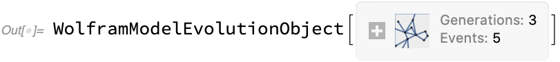

One can easily see its internal structure in its [`InputForm`](https://reference.wolfram.com/language/ref/InputForm.html):

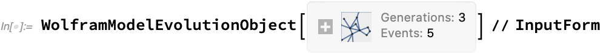

```wl
Out[] = WolframModelEvolutionObject[<|
  "Version" -> 2,
  "Rules" -> {{1, 2, 3}, {2, 4, 5}} ->
    {{5, 6, 1}, {6, 4, 2}, {4, 5, 3}},
  "MaxCompleteGeneration" -> 3,
  "TerminationReason" -> "MaxGenerationsLocal",
  "AtomLists" -> {{1, 2, 3}, {2, 4, 5}, {4, 6, 7}, {5, 8, 1}, {8, 4,
     2}, {4, 5, 3}, {7, 9, 8}, {9, 6, 4}, {6, 7, 2}, {1, 10, 4}, {10,
     8, 5}, {8, 1, 3}, {4, 11, 7}, {11, 6, 9}, {6, 4, 8}, {5, 12,
     1}, {12, 8, 10}, {8, 5, 4}},
  "EventRuleIDs" -> {0, 1, 1, 1, 1, 1},
  "EventInputs" -> {{}, {1, 2}, {5, 3}, {6, 4}, {7, 8}, {10, 11}},
  "EventOutputs" -> {{1, 2, 3}, {4, 5, 6}, {7, 8, 9}, {10, 11,
     12}, {13, 14, 15}, {16, 17, 18}},
  "EventGenerations" -> {0, 1, 2, 2, 3, 3}|>]
```

The most important part of this [`Association`](https://reference.wolfram.com/language/ref/Association.html) is `"AtomLists"` which includes all set elements (aka expressions or edges) ever created throughout evolution.

In this particular example, it begins with `{1, 2, 3}`, `{2, 4, 5}` and `{4, 6, 7}`, which is the initial set. It is then followed by `{5, 8, 1}`, `{8, 4, 2}` and `{4, 5, 3}` which are the edges created in the first replacement event (the new vertex `8` here is named with the first unused integer, see [`"VertexNamingFunction"`](#vertexnamingfunction) for details about naming). These edges are followed by four more triples of edges corresponding to the outputs of remaining events.

`"AtomLists"` contains edges from all steps and is by itself insufficient to determine to which step a particular edge belongs. For example, `{5, 8, 1}` only appears in the result after a single step and `{7, 9, 8}` after two steps. Here we use [`"StatesList"`](#states) property to demonstrate that:


```wl
Out[] = {{{1, 2, 3}, {2, 4, 5}, {4, 6, 7}},
 {{4, 6, 7}, {5, 8, 1}, {8, 4, 2}, {4, 5, 3}},
 {{7, 9, 8}, {9, 6, 4}, {6, 7, 2}, {1, 10, 4}, {10, 8, 5}, {8, 1,
   3}},
 {{6, 7, 2}, {8, 1, 3}, {4, 11, 7}, {11, 6, 9}, {6, 4, 8}, {5, 12,
   1}, {12, 8, 10}, {8, 5, 4}}}
```

Note that a set element is not duplicated in `"AtomLists"` if it exists in multiple steps. For example, `{6, 7, 2}` appears in the set after both two and three steps, but it only appears in `"AtomLists"` once because it was never used as an input during the 3rd step.

Other properties of the evolution object describe the relationships between edges and the features of the evolution:

* `"Version"` is the data format of the evolution object. This description is for version 2, which is the first version to support multiway systems. Version 1 does not have the `"Version"` key. The objects of older versions are automatically migrated when they are evaluated.
* `"Rules"` is an exact copy of the corresponding `WolframModel` argument.
* `"MaxCompleteGenerations"` shows the largest generation in which no matches are possible that only involve expressions of this or earlier generations. In this particular case, it is the same as the largest generation of any edge, but it might be different if a more elaborate [step specification](#step-limiters) is used.
* `"TerminationReason"` shows the reason evaluation was stopped. See the [`"TerminationReason"`](#termination-reason) property for more details.
* `"EventRuleIDs"` shows which rule was used for each event. It's rather boring in this particular case, as this example only has one rule. See [Rule Indices for Events](#rule-indices-for-events) for a more interesting case. The first value, `0`, corresponds to the initial event, which is included in the evolution object but is omitted [by default](#includeboundaryevents) when computing [properties](#properties).
* `"EventInputs"` shows which edge indices from `"AtomLists"` were used in each event. The order corresponds to the input patterns of the rules. The first value, `{}`, again corresponds to the initial event. Note, the same index can appear multiple times in [multiway systems](#eventselectionfunction).
* `"EventOutputs"` similarly shows which edge indices from `"AtomLists"` were produced by each event. There are no duplicates in these lists because events always generate new edges.
* `"EventGenerations"` shows how many layers of predecessors a given event has.

A specific property can be requested from an evolution object by supplying it as an argument to the object itself:


```wl
Out[] = 109
```

[Properties section](#properties) describes and gives examples for each available property. The full list of them can also be obtained with the `"Properties"` property:

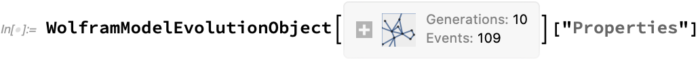

```wl
Out[] = {"EvolutionObject", "FinalState", "FinalStatePlot", "StatesList",
  "StatesPlotsList", "EventsStatesPlotsList",
  "AllEventsStatesEdgeIndicesList", "AllEventsStatesList",
  "Generation", "StateEdgeIndicesAfterEvent", "StateAfterEvent",
  "TotalGenerationsCount", "PartialGenerationsCount",
  "GenerationsCount", "GenerationComplete", "AllEventsCount",
  "GenerationEventsCountList", "GenerationEventsList",
  "FinalDistinctElementsCount", "AllEventsDistinctElementsCount",
  "VertexCountList", "EdgeCountList", "FinalEdgeCount",
  "AllEventsEdgesCount", "AllEventsGenerationsList",
  "ExpressionsEventsGraph", "CausalGraph", "LayeredCausalGraph",
  "TerminationReason", "AllEventsRuleIndices", "AllEventsList",
  "EventsStatesList", "EdgeCreatorEventIndices",
  "EdgeDestroyerEventsIndices", "EdgeDestroyerEventIndices",
  "EdgeGenerationsList", "Properties", "Version", "Rules",
  "CompleteGenerationsCount", "AllEventsEdgesList"}
```

Some properties take additional arguments, which can be supplied after the property name:


```wl
Out[] = {{8, 1, 3}, {5, 12, 1}, {12, 8, 10}, {8, 5, 4}, {2, 13, 11}, {13, 7,
  6}, {7, 2, 9}, {7, 14, 6}, {14, 11, 4}, {11, 7, 8}}
```

A particular generation can be extracted simply by its number (including, i.e., -1 for the final state):


```wl
Out[] = {{6, 7, 2}, {8, 1, 3}, {4, 11, 7}, {11, 6, 9}, {6, 4, 8}, {5, 12,
  1}, {12, 8, 10}, {8, 5, 4}}
```

If a property does not take any arguments, it can be specified directly in `WolframModel` as the fourth argument:

```wl
In[] := WolframModel[{{1, 2, 3}, {2, 4, 5}} ->
  {{5, 6, 1}, {6, 4, 2}, {4, 5, 3}},
 {{1, 2, 3}, {2, 4, 5}, {4, 6, 7}}, 10, "EdgeCountList"]
Out[] = {3, 4, 6, 8, 12, 18, 24, 36, 54, 76, 112}
```

All properties available to use directly in `WolframModel` can be looked up in `$WolframModelProperties` (there are more properties here compared to the list above because some properties are available under multiple names, and only the canonical name is listed above):

```wl
In[] := $WolframModelProperties
Out[] = {"AllEventsCount", "AllEventsDistinctElementsCount",
  "AllEventsEdgesCount", "AllEventsEdgesList",
  "AllEventsGenerationsList", "AllEventsList", "AllEventsRuleIndices",
   "AllEventsStatesEdgeIndicesList", "AllEventsStatesList",
  "AllExpressions", "AtomsCountFinal", "AtomsCountTotal",
  "CausalGraph", "CompleteGenerationsCount", "CreatorEvents",
  "DestroyerEvents", "EdgeCountList", "EdgeCreatorEventIndices",
  "EdgeDestroyerEventIndices", "EdgeDestroyerEventsIndices",
  "EdgeGenerationsList", "EventGenerations", "EventGenerationsList",
  "EventsCount", "EventsList", "EventsStatesList",
  "EventsStatesPlotsList", "EvolutionObject", "ExpressionGenerations",
   "ExpressionsCountFinal", "ExpressionsCountTotal",
  "ExpressionsEventsGraph", "FinalDistinctElementsCount",
  "FinalEdgeCount", "FinalState", "FinalStatePlot",
  "GenerationComplete", "GenerationEventsCountList",
  "GenerationEventsList", "GenerationsCount", "LayeredCausalGraph",
  "MaxCompleteGeneration", "PartialGenerationsCount", "StatesList",
  "StatesPlotsList", "TerminationReason", "TotalGenerationsCount",
  "UpdatedStatesList", "Version", "VertexCountList"}
```

Multiple properties can also be specified in a list (only in `WolframModel`, not in `WolframModelEvolutionObject`):

```wl
In[] = WolframModel[{{1, 2, 3}, {2, 4, 5}} ->
  {{5, 6, 1}, {6, 4, 2}, {4, 5, 3}},
 {{1, 2, 3}, {2, 4, 5}, {4, 6, 7}}, 10,
 {"EdgeCountList", "VertexCountList"}]
Out[] = {{3, 4, 6, 8, 12, 18, 24, 36, 54, 76, 112},
 {7, 8, 10, 12, 16, 22, 28, 40, 58, 80, 116}}
```

### Rule Specification

#### Multiple Rules

Multiple rules can simply be specified as a list of rules:

```wl
In[] := WolframModel[{{{1, 1, 2}} -> {{2, 2, 1}, {2, 3, 2}, {1, 2, 3}},
  {{1, 2, 1}, {3, 4, 2}} -> {{4, 3, 2}}}, {{1, 1, 1}}, 4]
```

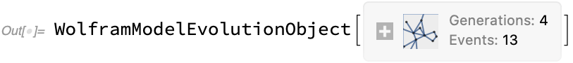

To see which rules were used for each replacement:


```wl
Out[] = {1, 1, 1, 1, 1, 1, 2, 1, 1, 1, 2, 1, 2}
```

#### Pattern Rules

Pattern rules (i.e., the kind of rules used in the [`SetReplace`](#setreplace) function) can be specified as well. As an example, previously described call to [`SetReplaceList`](#setreplace) can be reproduced as

```wl
In[] := WolframModel[<|"PatternRules" -> {a_, b_} :> a + b|>,
 {1, 2, 5, 3, 6}, Infinity, "AllEventsStatesList"]
Out[] = {{1, 2, 5, 3, 6}, {5, 3, 6, 3}, {6, 3, 8}, {8, 9}, {17}}
```

### Automatic Initial State

An initial state consisting of an appropriate number of (hyper) self-loops can be automatically produced for anonymous (non-pattern) rules. Here we evolve the system for 0 steps and ask the evolution object for the 0-th generation aka the initial state:

```wl
In[] := WolframModel[{{1, 2}, {1, 2}} -> {{3, 2}, {3, 2}, {2, 1}, {1, 3}},
  Automatic, 0][0]
Out[] = {{1, 1}, {1, 1}}
```

That even works for multiple rules in which case the loops are chosen in such a way that any of the rules can match:

```wl
In[] := WolframModel[{{{1, 2}, {1, 2}} ->
    {{3, 2}, {3, 2}, {2, 1, 3}, {2, 3}},
   {{2, 1, 3}, {2, 3}} -> {{2, 1}, {1, 3}}}, Automatic, 0][0]
Out[] = {{1, 1}, {1, 1}, {1, 1, 1}}
```

Note that because different patterns can be matched to the same symbol, this initial state is guaranteed to match the rules at least once (no guarantees after that).

### Step Limiters

The standard numeric argument to `WolframModel` specifies the number of generations:

```wl
In[] := WolframModel[{{1, 2, 3}, {4, 5, 6}, {2, 5}, {5, 2}} ->
  {{7, 1, 8}, {9, 3, 10}, {11, 4, 12}, {13, 6, 14}, {7, 13}, {13,
    7}, {8, 10}, {10, 8}, {9, 11}, {11, 9}, {12, 14}, {14, 12}},
 {{1, 2, 3}, {4, 5, 6}, {1, 4}, {4, 1}, {2, 5}, {5, 2}, {3, 6}, {6,
   3}}, 6, "FinalStatePlot"]
```


Alternatively, an [`Association`](https://reference.wolfram.com/language/ref/Association.html) can be used to specify a more elaborate limiting condition:

```wl
In[] := WolframModel[{{1, 2, 3}, {4, 5, 6}, {2, 5}, {5, 2}} ->
  {{7, 1, 8}, {9, 3, 10}, {11, 4, 12}, {13, 6, 14}, {7, 13}, {13,
    7}, {8, 10}, {10, 8}, {9, 11}, {11, 9}, {12, 14}, {14, 12}},
 {{1, 2, 3}, {4, 5, 6}, {1, 4}, {4, 1}, {2, 5}, {5, 2}, {3, 6}, {6,
   3}},
 <|"MaxVertices" -> 300, "MaxEvents" -> 200|>, "FinalStatePlot"]
```

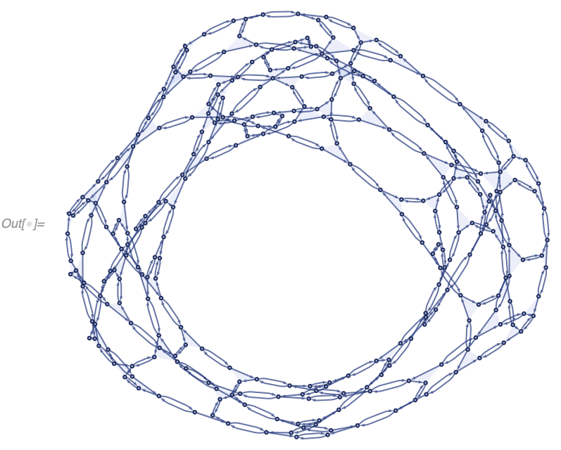

Note that the final state here is "less symmetric" because its last generation is incomplete (more on that [later](#hypergraphautomorphismgroup)). Such incomplete generations can be automatically trimmed by setting [`"IncludePartialGenerations" -> False`](#includepartialgenerations).

One can also see the presence of an incomplete generation by looking at the evolution object (note `5...6` which means 5 generations are complete, and 1 is not). Expanding the object's information, one can also see that in this particular case the evolution was terminated because `"MaxVertices"` (not `"MaxEvents"`) condition was reached:

```wl
In[] := WolframModel[{{1, 2, 3}, {4, 5, 6}, {2, 5}, {5, 2}} ->
  {{7, 1, 8}, {9, 3, 10}, {11, 4, 12}, {13, 6, 14}, {7, 13}, {13,
    7}, {8, 10}, {10, 8}, {9, 11}, {11, 9}, {12, 14}, {14, 12}},
 {{1, 2, 3}, {4, 5, 6}, {1, 4}, {4, 1}, {2, 5}, {5, 2}, {3, 6}, {6,
   3}},
 <|"MaxVertices" -> 300, "MaxEvents" -> 200|>]
```


All possible keys in that association are:

* `"MaxEvents"`: limit the number of individual replacements (in the [`SetReplace`](#setreplace) function meaning).
* `"MaxGenerations"`: limit the number of generations (steps in [`SetReplaceAll`](#setreplace) meaning), same as specifying steps directly as a number in `WolframModel`.
* `"MaxVertices"`: limit the number of vertices in the *final* state only (the total count throughout evolution might be larger). This limit stops evolution if the next event, if applied, would put the state over the limit. Note once such an event is encountered, the evolution stops immediately even if other matches exist that would not put the vertex count over the limit.
* `"MaxVertexDegree"`: limit the number of final state edges in which any particular vertex is involved. Works in a similar way to `"MaxVertices"`.
* `"MaxEdges"`: limit the number of edges (set elements) in the final state. Works similarly to `"MaxVertices"`.

Any combination of these can be used, in which case the earliest triggered condition stops the evolution.

Note also that `"MaxGenerations"` works differently from the other limiters, as the matching algorithm would not even attempt to match edges with generations over the limit. Therefore unlike, i.e., `"MaxVertices"`, which would terminate the evolution immediately once the limit-violating event is attempted, `"MaxGenerations"` would keep "filling in" events for as long as possible until no further matches within allowed generations are possible.

It is also possible to set the step count to `Automatic`, in which case `WolframModel` tries to automatically pick a number of steps that showcases the evolution without taking too long. It stops the evolution sooner if the state grows quickly:

```wl
In[] := WolframModel[{{1, 2, 3}, {2, 4, 5}} -> {{5, 6, 1}, {6, 4, 2}, {4, 5,
    3}},
 {{1, 2, 3}, {2, 4, 5}, {4, 6, 7}}, Automatic]
```


But evolves the rule much longer if it does not grow:

```wl
In[] := WolframModel[<|"PatternRules" -> {{a_, b_}} :> {{a + b, a - b}}|>,
 {{1, 1}}, Automatic]
```

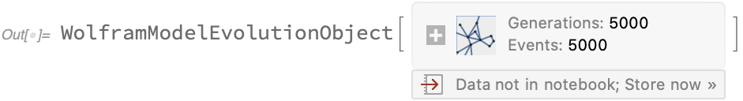

Currently, it's equivalent to `<|"MaxEvents" -> 5000, "MaxVertices" -> 200|>`, setting `TimeConstraint -> 5` (it still returns values for all properties even if terminated due to time constraint), and `"IncludePartialGenerations" -> False`, but it may be adjusted in future updates.

### Properties

[States](#states) | [Plots of States](#plots-of-states) | [Plots of Events](#plots-of-events) | [All Edges throughout Evolution](#all-edges-throughout-evolution) | [States as Edge Indices](#states-as-edge-indices) | [Events](#events) | [Events and States](#events-and-states) | [Creator and Destroyer Events](#creator-and-destroyer-events) | [Causal Graphs](#causal-graphs) | [Rule Indices for Events](#rule-indices-for-events) | [Edge and Event Generations](#edge-and-event-generations) | [Termination Reason](#termination-reason) | [Generation Counts](#generation-counts) | [Event Counts](#event-counts) | [Element Count Lists](#element-count-lists) | [Final Element Counts](#final-element-counts) | [Total Element Counts](#total-element-counts) | [Rules](#rules) | [Version](#version)

#### States

These are the properties used to extract states at a particular moment in the evolution. They always return lists, but in the examples below, we plot them for clarity.

**`"FinalState"`** (aka -1) yields the state obtained after all replacements of the evolution have been made:

```wl
In[] := WolframModelPlot @ WolframModel[{{1, 2, 3}, {4, 5, 6}, {1, 4}} ->
   {{2, 7, 8}, {3, 9, 10}, {5, 11, 12}, {6, 13, 14}, {8, 12}, {11,
     10}, {13, 7}, {14, 9}},
  {{1, 1, 1}, {1, 1, 1}, {1, 1}, {1, 1}, {1, 1}}, 6, "FinalState"]
```

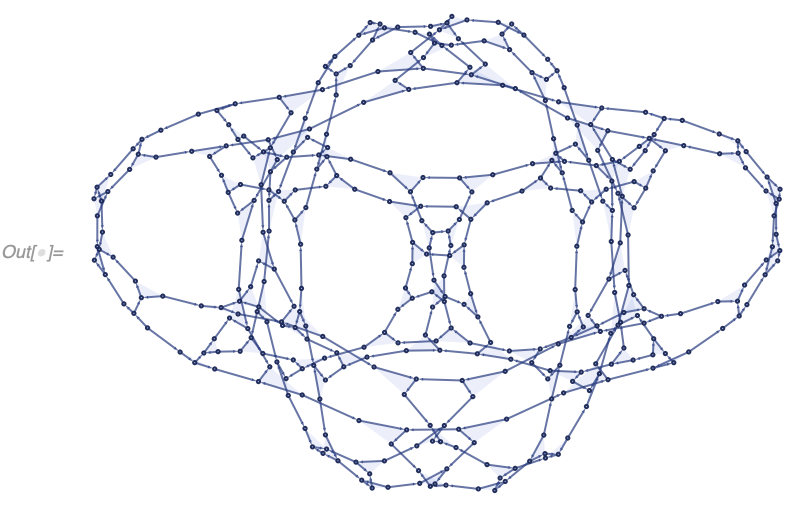

**`"StatesList"`** yields the list of states at each generation:

```wl
In[] := WolframModelPlot /@ WolframModel[{{1, 2, 3}, {4, 5, 6}, {1, 4}} ->
   {{2, 7, 8}, {3, 9, 10}, {5, 11, 12}, {6, 13, 14}, {8, 12}, {11,
     10}, {13, 7}, {14, 9}},
  {{1, 1, 1}, {1, 1, 1}, {1, 1}, {1, 1}, {1, 1}}, 6, "StatesList"]
```

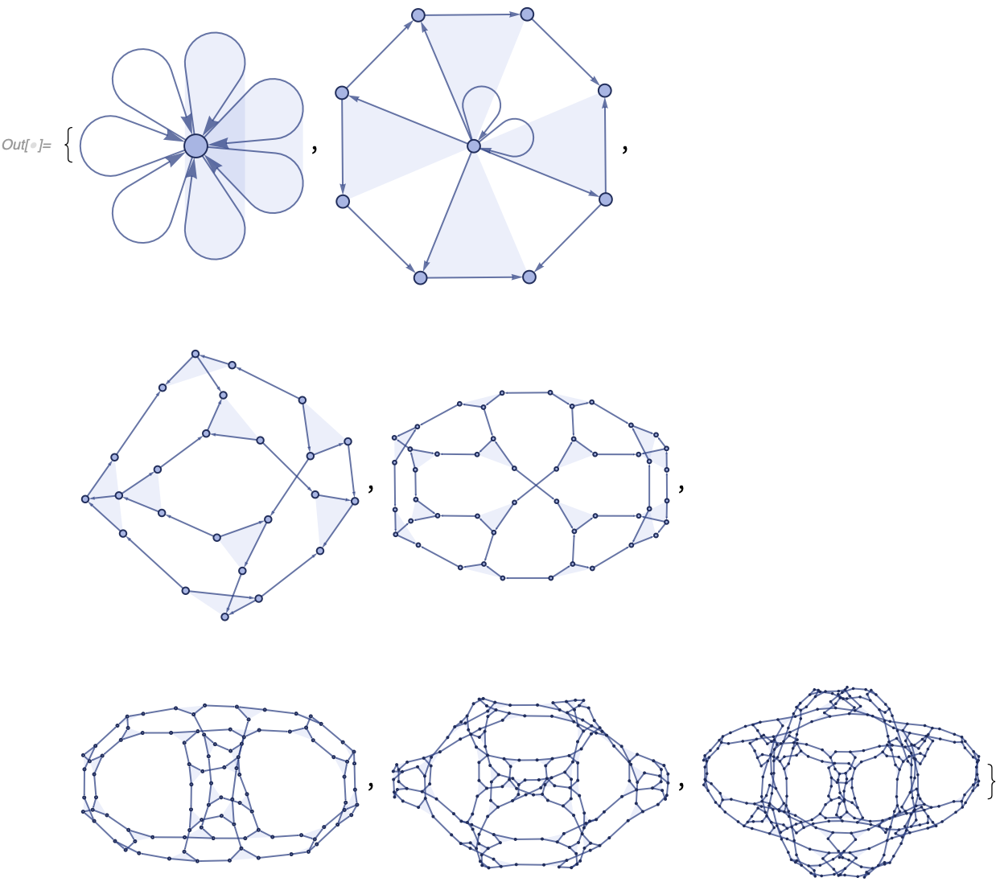

This is identical to using the **`"Generation"`** property mapped over all generations:

```wl
In[] := WolframModelPlot /@ (WolframModel[{{1, 2, 3}, {4, 5, 6}, {1, 4}} ->
       {{2, 7, 8}, {3, 9, 10}, {5, 11, 12}, {6, 13, 14}, {8, 12}, {11,
          10}, {13, 7}, {14, 9}},
      {{1, 1, 1}, {1, 1, 1}, {1, 1}, {1, 1}, {1, 1}}, 6][
     "Generation", #] &) /@ Range[0, 6]
```


In fact, the `"Generation"` property can be omitted and the index of the generation can be used directly:

```wl
In[] := WolframModelPlot /@ WolframModel[{{1, 2, 3}, {4, 5, 6}, {1, 4}} ->
    {{2, 7, 8}, {3, 9, 10}, {5, 11, 12}, {6, 13, 14}, {8, 12}, {11,
      10}, {13, 7}, {14, 9}},
   {{1, 1, 1}, {1, 1, 1}, {1, 1}, {1, 1}, {1, 1}}, 6] /@ Range[0, 6]
```


`"StatesList"` shows a compressed version of the evolution. To see how the state changes with each applied replacement, use **`"AllEventsStatesList"`**:

```wl
In[] := WolframModelPlot /@ WolframModel[{{1, 2, 3}, {4, 5, 6}, {1, 4}} ->
   {{2, 7, 8}, {3, 9, 10}, {5, 11, 12}, {6, 13, 14}, {8, 12}, {11,
     10}, {13, 7}, {14, 9}},
  {{1, 1, 1}, {1, 1, 1}, {1, 1}, {1, 1}, {1, 1}}, 3,
  "AllEventsStatesList"]
```

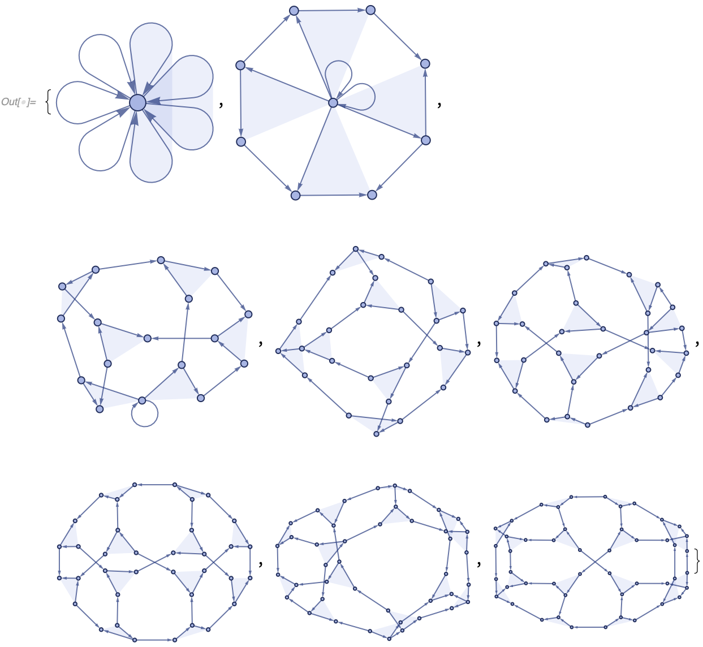

Finally, to see a state after a specific event, use **`"StateAfterEvent"`** (aka `"SetAfterEvent"`):

```wl
In[] := WolframModelPlot @ WolframModel[{{1, 2, 3}, {4, 5, 6}, {1, 4}} ->
    {{2, 7, 8}, {3, 9, 10}, {5, 11, 12}, {6, 13, 14}, {8, 12}, {11,
      10}, {13, 7}, {14, 9}},
   {{1, 1, 1}, {1, 1, 1}, {1, 1}, {1, 1}, {1, 1}}, 6][
  "StateAfterEvent", 42]
```

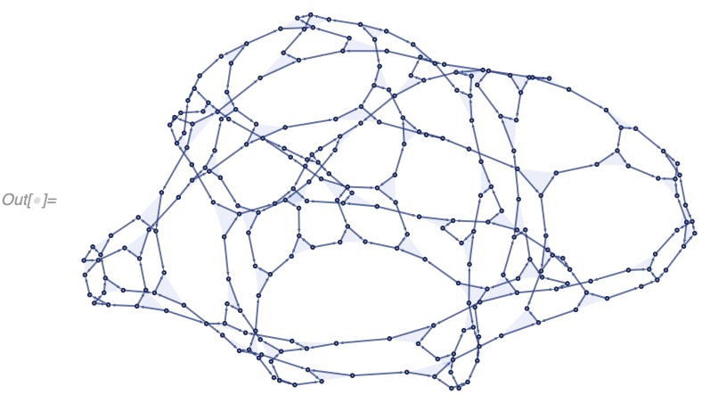

`"StateAfterEvent"` is equivalent to taking a corresponding part in `"AllEventsStatesList"`, but it is much faster to compute than the entire list.

#### Plots of States

Instead of explicitly calling [`WolframModelPlot`](#wolframmodelplot), one can use short-hand properties **`"FinalStatePlot"`** and **`"StatesPlotsList"`**:

```wl
In[] := WolframModel[{{1, 2, 3}, {4, 5, 6}, {1, 4}} ->
  {{2, 7, 8}, {3, 9, 10}, {5, 11, 12}, {6, 13, 14}, {8, 12}, {11,
    10}, {13, 7}, {14, 9}},
 {{1, 1, 1}, {1, 1, 1}, {1, 1}, {1, 1}, {1, 1}}, 6, "FinalStatePlot"]
```


```wl
In[] := WolframModel[{{1, 2, 3}, {4, 5, 6}, {1, 4}} ->
  {{2, 7, 8}, {3, 9, 10}, {5, 11, 12}, {6, 13, 14}, {8, 12}, {11,
    10}, {13, 7}, {14, 9}},
 {{1, 1, 1}, {1, 1, 1}, {1, 1}, {1, 1}, {1, 1}}, 6, "StatesPlotsList"]
```


These properties take the same options as [`WolframModelPlot`](#wolframmodelplot) (but one has to specify them in a call to the evolution object, not `WolframModel`):

```wl
In[] := WolframModel[{{1, 2, 3}, {4, 5, 6}, {1, 4}} ->
   {{2, 7, 8}, {3, 9, 10}, {5, 11, 12}, {6, 13, 14}, {8, 12}, {11,
     10}, {13, 7}, {14, 9}},
  {{1, 1, 1}, {1, 1, 1}, {1, 1}, {1, 1}, {1, 1}}, 3]["FinalStatePlot",
  VertexLabels -> Automatic]
```

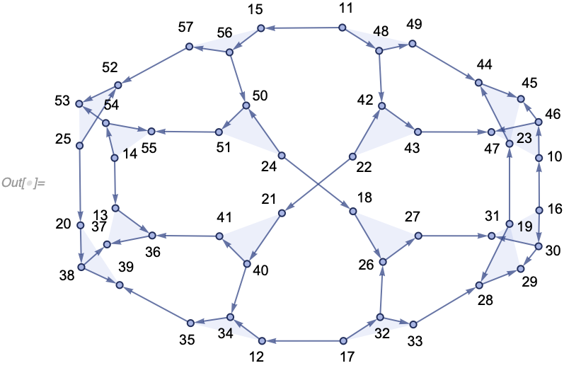

#### Plots of Events

The plotting function corresponding to [`"AllEventsStatesList"`](#states) is more interesting than the other ones. **`"EventsStatesPlotsList"`** plots not only the states, but also the events that produced them:

```wl
In[] := WolframModel[{{1, 2, 3}, {4, 5, 6}, {1, 4}} ->
  {{2, 7, 8}, {3, 9, 10}, {5, 11, 12}, {6, 13, 14}, {8, 12}, {11,
    10}, {13, 7}, {14, 9}},
 {{1, 1, 1}, {1, 1, 1}, {1, 1}, {1, 1}, {1, 1}},
 3, "EventsStatesPlotsList"]
```


Here the dotted gray edges are the ones about to be deleted, whereas the red ones have just been created.

#### All Edges throughout Evolution

**`"AllEventsEdgesList"`** (aka `"AllExpressions"`) returns the list of edges throughout evolution. This is distinct from a catenated [`"StateList"`](#states), as the edge does not appear twice if it moved from one generation to the next without being involved in an event.

Compare for instance the output of [`"StatesList"`](#states) for a system where only one replacement is made per generation:

```wl
In[] := WolframModel[<|"PatternRules" -> {x_?OddQ, y_} :> x + y|>,
 {1, 2, 4, 6}, Infinity, "StatesList"]
Out[] = {{1, 2, 4, 6}, {4, 6, 3}, {6, 7}, {13}}
```

to the output of `"AllEventsEdgesList"`:

```wl
In[] := WolframModel[<|"PatternRules" -> {x_?OddQ, y_} :> x + y|>,
 {1, 2, 4, 6}, Infinity, "AllEventsEdgesList"]
Out[] = {1, 2, 4, 6, 3, 7, 13}
```

Note how 4 and 6 only appear once in the list.

Edge indices from `"AllEventsEdgesList"` are used in various other properties such as [`"AllEventsList"`](#events) and [`"EventsStatesList"`](#events-and-states).

#### States as Edge Indices

**`"AllEventsStatesEdgeIndicesList"`** is similar to [`"AllEventsStatesList"`](#states), except instead of actual edges the list it returns contains the indices of edges from [`"AllEventsEdgesList"`](#all-edges-throughout-evolution):

```wl
In[] := WolframModel[{{1, 2, 3}, {4, 5, 6}, {1, 4}} ->
  {{2, 7, 8}, {3, 9, 10}, {5, 11, 12}, {6, 13, 14}, {8, 12}, {11,
    10}, {13, 7}, {14, 9}},
 {{1, 1, 1}, {1, 1, 1}, {1, 1}, {1, 1}, {1, 1}},
 2, "AllEventsStatesEdgeIndicesList"]
Out[] = {{1, 2, 3, 4, 5}, {4, 5, 6, 7, 8, 9, 10, 11, 12, 13}, {5, 8, 9, 10,
  11, 12, 13, 14, 15, 16, 17, 18, 19, 20, 21}, {10, 11, 12, 13, 14,
  15, 16, 17, 18, 19, 20, 21, 22, 23, 24, 25, 26, 27, 28, 29}}
```

One can easily go back to states:

```wl
In[] := WolframModelPlot /@ With[{
   evolution = WolframModel[{{1, 2, 3}, {4, 5, 6}, {1, 4}} ->
      {{2, 7, 8}, {3, 9, 10}, {5, 11, 12}, {6, 13, 14}, {8, 12}, {11,
        10}, {13, 7}, {14, 9}},
     {{1, 1, 1}, {1, 1, 1}, {1, 1}, {1, 1}, {1, 1}}, 3]},
  evolution["AllEventsEdgesList"][[#]] & /@
   evolution["AllEventsStatesEdgeIndicesList"]]
```


However, this representation is useful if one needs to distinguish between identical edges.

Similarly, **`"StateEdgeIndicesAfterEvent"`** is a index analog of [`"StateAfterEvent"`](#states):

```wl
In[] := WolframModel[{{1, 2, 3}, {4, 5, 6}, {1, 4}} ->
   {{2, 7, 8}, {3, 9, 10}, {5, 11, 12}, {6, 13, 14}, {8, 12}, {11,
     10}, {13, 7}, {14, 9}},
  {{1, 1, 1}, {1, 1, 1}, {1, 1}, {1, 1}, {1, 1}},
  6]["StateEdgeIndicesAfterEvent", 12]
Out[] = {18, 19, 29, 34, 35, 36, 37, 39, 40, 42, 43, 44, 45, 49, 50, 51, 52,
  53, 55, 56, 57, 58, 59, 60, 61, 62, 63, 64, 65, 66, 67, 68, 69, 70,
  71, 72, 73, 74, 75, 76, 77, 78, 79, 80, 81, 82, 83, 84, 85, 86, 87,
  88, 89, 90, 91, 92, 93, 94, 95, 96, 97, 98, 99, 100, 101}
```

#### Events

**`"AllEventsList"`** (aka `"EventsList"`) and **`"GenerationEventsList"`** both return all replacement events throughout the evolution. The only difference is how the events are arranged. `"AllEventsList"` returns the flat list of all events, whereas `"GenerationEventsList"` splits them into sublists for each generation:

```wl
In[] := WolframModel[{{1, 2}} -> {{3, 4}, {3, 1}, {4, 1}, {2, 4}},
 {{1, 1}}, 2, "AllEventsList"]
Out[] = {{1, {1} -> {2, 3, 4, 5}}, {1, {2} -> {6, 7, 8, 9}},
 {1, {3} -> {10, 11, 12, 13}}, {1, {4} -> {14, 15, 16, 17}},
 {1, {5} -> {18, 19, 20, 21}}}
```

```wl
In[] := WolframModel[{{1, 2}} -> {{3, 4}, {3, 1}, {4, 1}, {2, 4}},
 {{1, 1}}, 2, "GenerationEventsList"]
Out[] = {{{1, {1} -> {2, 3, 4, 5}}},
 {{1, {2} -> {6, 7, 8, 9}}, {1, {3} -> {10, 11, 12, 13}},
  {1, {4} -> {14, 15, 16, 17}}, {1, {5} -> {18, 19, 20, 21}}}}
```

The format for the events is

```wl
{ruleIndex, {inputEdgeIndices} -> {outputEdgeIndices}}
```

where the edge indices refer to expressions from [`"AllEventsEdgesList"`](#all-edges-throughout-evolution).

#### Events and States

**`"EventsStatesList"`** just produces a list of `{event, state}` pairs, where state is the complete state right after this event is applied. Events are the same as generated by [`"AllEventsList"`](#events), and the states are represented as edge indices as in [`"AllEventsStatesEdgeIndicesList"`](#states-as-edge-indices):

```wl
In[] := WolframModel[{{1, 2}} -> {{3, 4}, {3, 1}, {4, 1}, {2, 4}},
 {{1, 1}}, 2, "EventsStatesList"]
Out[] = {{{1, {1} -> {2, 3, 4, 5}}, {2, 3, 4, 5}},
 {{1, {2} -> {6, 7, 8, 9}}, {3, 4, 5, 6, 7, 8, 9}},
 {{1, {3} -> {10, 11, 12, 13}}, {4, 5, 6, 7, 8, 9, 10, 11, 12, 13}},
 {{1, {4} -> {14, 15, 16, 17}},
  {5, 6, 7, 8, 9, 10, 11, 12, 13, 14, 15, 16, 17}},
 {{1, {5} -> {18, 19, 20, 21}},
  {6, 7, 8, 9, 10, 11, 12, 13, 14, 15, 16, 17, 18, 19, 20, 21}}}
```

#### Creator and Destroyer Events

An event is said to *destroy* the edges in its input, and *create* the edges in its output. Creator and destroyer events for each edge can be obtained with **`"EdgeCreatorEventIndices"`** (aka `"CreatorEvents"`) and **`"EdgeDestroyerEventsIndices"`** properties.

As an example, for a simple rule that splits each edge in two, one can see that edges are created in pairs:

```wl
In[] := WolframModel[{{1, 2}} -> {{1, 3}, {3, 2}},
 {{1, 1}}, 4, "EdgeCreatorEventIndices"]
Out[] = {0, 1, 1, 2, 2, 3, 3, 4, 4, 5, 5, 6, 6, 7, 7, 8, 8, 9, 9, 10, 10, 11,
   11, 12, 12, 13, 13, 14, 14, 15, 15}
```

and destroyed one-by-one:

```wl
In[] := WolframModel[{{1, 2}} -> {{1, 3}, {3, 2}},
 {{1, 1}}, 4, "EdgeDestroyerEventsIndices"]
Out[] = {{1}, {2}, {3}, {4}, {5}, {6}, {7}, {8}, {9}, {10}, {11}, {12},
   {13}, {14}, {15}, {}, {}, {}, {}, {}, {}, {}, {}, {}, {}, {}, {},
   {}, {}, {}, {}}
```

Here 0 refers to the initial state. Note the format is different for creator and destroyer events. That is because each edge has a unique creator event, but can have multiple destroyer events in [multiway systems](#eventselectionfunction).

There is another property, **`"EdgeDestroyerEventIndices"`** (aka `"DestroyerEvents"`), left for compatibility reasons, which has the same format as **`"EdgeCreatorEventIndices"`**. However, it does not work for [multiway systems](#eventselectionfunction).

```wl
In[] := WolframModel[{{1, 2}} -> {{1, 3}, {3, 2}},
 {{1, 1}}, 4, "EdgeDestroyerEventIndices"]
Out[] = {1, 2, 3, 4, 5, 6, 7, 8, 9, 10, 11, 12, 13, 14, 15, Infinity,
  Infinity, Infinity, Infinity, Infinity, Infinity, Infinity,
  Infinity, Infinity, Infinity, Infinity, Infinity, Infinity,
  Infinity, Infinity, Infinity}
```

#### Causal Graphs

An event **A** *causes* an event **B** if there exists an expression (set element) created by **A** and destroyed by **B**. If we then consider all such relationships between events, we create a **`"CausalGraph"`**. In a causal graph, vertices correspond to events, and edges correspond to the set elements (aka spatial edges).

To make it even more explicit, we have another property, **`"ExpressionsEventsGraph"`**. In this graph, there are two types of vertices corresponding to events and expressions, and edges correspond to a given expression being an input or an output of a given event.

For example, if we consider our simple arithmetic model `{a_, b_} :> a + b` starting from `{3, 8, 8, 8, 2, 10, 0, 9, 7}` we get an expressions-events graph which quite clearly describes what's going on:

```wl
In[] := WolframModel[<|"PatternRules" -> {a_, b_} :> a + b|>,
  {3, 8, 8, 8, 2, 10, 0, 9, 7}, Infinity]["ExpressionsEventsGraph",
 VertexLabels -> Placed[Automatic, After]]
```

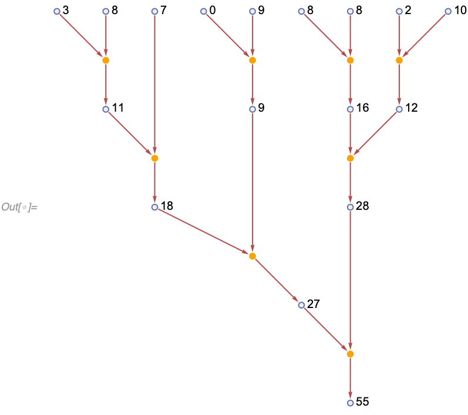

The causal graph is very similar, it just has the expression-vertices contracted:

```wl
In[] := WolframModel[<|"PatternRules" -> {a_, b_} :> a + b|>,
 {3, 8, 8, 8, 2, 10, 0, 9, 7}, Infinity, "CausalGraph"]
```

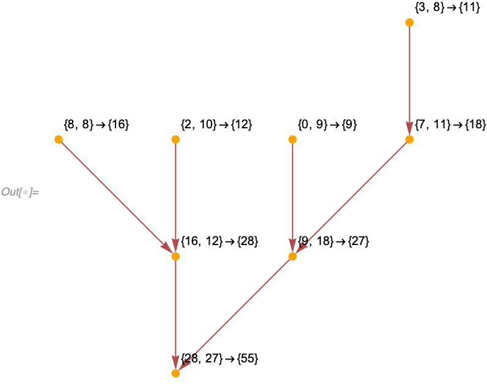

Here is an example for a hypergraph model (admittedly considerably harder to understand). Multiedges correspond to situations where multiple set elements were both created and destroyed by the same pair of events:

```wl
In[] := WolframModel[{{1, 2, 3}, {4, 5, 6}, {1, 4}} ->
  {{3, 7, 8}, {9, 2, 10}, {11, 12, 5}, {13, 14, 6}, {7, 12}, {11,
    9}, {13, 10}, {14, 8}},
 {{1, 1, 1}, {1, 1, 1}, {1, 1}, {1, 1}, {1, 1}}, 20, "CausalGraph"]
```


**`"LayeredCausalGraph"`** generates the same graph but layers events generation-by-generation. For example, in our arithmetic causal graph, note how it's arranged differently from an example above:

```wl
In[] := WolframModel[<|"PatternRules" -> {a_, b_} :> a + b|>,
 {3, 8, 8, 8, 2, 10, 0, 9, 7}, Infinity, "LayeredCausalGraph"]
```

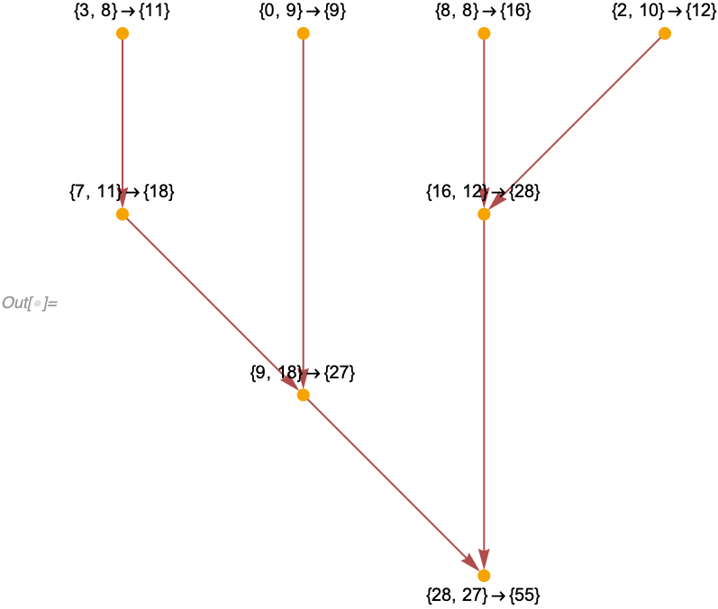

Note how slices through the expressions-events graph correspond to states returned by [`"StatesList"`](#states). Pay attention to intersections of the slices with edges as well, as they correspond to unused expressions from previous generations that remain in the state:

```wl
In[] := With[{evolution =
   WolframModel[<|"PatternRules" -> {a_, b_} :> a + b|>,
    {3, 8, 8, 8, 2, 10, 0, 9, 7}, Infinity]},
 evolution["ExpressionsEventsGraph",
  VertexLabels -> Placed[Automatic, {After, Above}],
  Epilog -> {Red, Dotted,
    Table[Line[{{-10, k}, {10, k}}], {k, 0, 9, 2}]}]]
```


```wl
In[] := WolframModel[<|"PatternRules" -> {a_, b_} :> a + b|>,
 {3, 8, 8, 8, 2, 10, 0, 9, 7}, Infinity, "StatesList"]
Out[] = {{3, 8, 8, 8, 2, 10, 0, 9, 7}, {7, 11, 16, 12, 9}, {9, 18, 28}, {28,
  27}, {55}}
```

`"CausalGraph"`, `"LayeredCausalGraph"` and `"ExpressionsEventsGraph"` properties all accept [`Graph`](https://reference.wolfram.com/language/ref/Graph.html) options, as was demonstrated above with [`VertexLabels`](https://reference.wolfram.com/language/ref/VertexLabels.html). Some options have special behavior for the [`Automatic`](https://reference.wolfram.com/language/ref/Automatic.html) value, i.e., `VertexLabels -> Automatic` in `"ExpressionsEventsGraph"` displays the contents of expressions, which are not the vertex names in that graph (as there can be multiple expressions with the same contents).

#### Rule Indices for Events

**`"AllEventsRuleIndices"`** returns which rule was used for each event (the same can be obtained by mapping [`First`](https://reference.wolfram.com/language/ref/First.html) over [`"AllEventsList"`](#events)):

```wl
In[] := WolframModel[{{{1, 1, 2}} -> {{2, 2, 1}, {2, 3, 2}, {1, 2, 3}},
  {{1, 2, 1}, {3, 4, 2}} -> {{4, 3, 2}}},
 {{1, 1, 1}}, 4, "AllEventsRuleIndices"]
Out[] = {1, 1, 1, 1, 1, 1, 2, 1, 1, 1, 2, 1, 2}
```

A neat example of using `"AllEventsRuleIndices"` is coloring events in a causal graph according to the rule index. With this visualization, one can see, for instance, that the outputs of the second rule in the example above are never used in any further inputs:

```wl
In[] := With[{
  evolution =
   WolframModel[{{{1, 1, 2}} -> {{2, 2, 1}, {2, 3, 2}, {1, 2, 3}},
     {{1, 2, 1}, {3, 4, 2}} -> {{4, 3, 2}}}, {{1, 1, 1}}, 6]}, With[{
   causalGraph = evolution["LayeredCausalGraph"]},
  Graph[causalGraph,
   VertexStyle ->
    Thread[VertexList[causalGraph] ->
      Replace[evolution["AllEventsRuleIndices"], {1 -> Black,
        2 -> White}, {1}]], VertexSize -> Medium]]]
```


#### Edge and Event Generations

**`"EdgeGenerationsList"`** (aka `"ExpressionGenerations"`) yields the list of generation numbers (numbers of predecessor layers) for each edge in [`"AllEventsEdgesList"`](#all-edges-throughout-evolution):

```wl
In[] := WolframModel[{{1, 2}, {1, 3}, {1, 4}} ->
  {{2, 2}, {3, 2}, {3, 4}, {3, 5}},
 {{1, 1}, {1, 1}, {1, 1}}, 5, "EdgeGenerationsList"]
Out[] = {0, 0, 0, 1, 1, 1, 1, 2, 2, 2, 2, 3, 3, 3, 3, 4, 4, 4, 4, 5, 5, 5, 5,
   5, 5, 5, 5}
```

 **`"AllEventsGenerationsList"`** (aka `"EventGenerations"`) gives the same for events. The generation of an event is defined as the generation of edges it produces as output. Here edges of different generations are colored differently:

```wl
In[] := With[{
  evolution = WolframModel[{{1, 2}, {1, 3}, {1, 4}} ->
     {{2, 2}, {3, 2}, {3, 4}, {3, 5}},
    {{1, 1}, {1, 1}, {1, 1}}, 5]},
 MapThread[
  WolframModelPlot[#, EdgeStyle -> #2] &, {evolution["StatesList"],
   Replace[evolution[
        "EdgeGenerationsList"][[#]] & /@ (evolution[
         "StateEdgeIndicesAfterEvent", #] &) /@
      Prepend[0] @ Accumulate @ evolution["GenerationEventsCountList"],
    g_ :> ColorData["Rainbow"][g/5], {2}]}]]
```

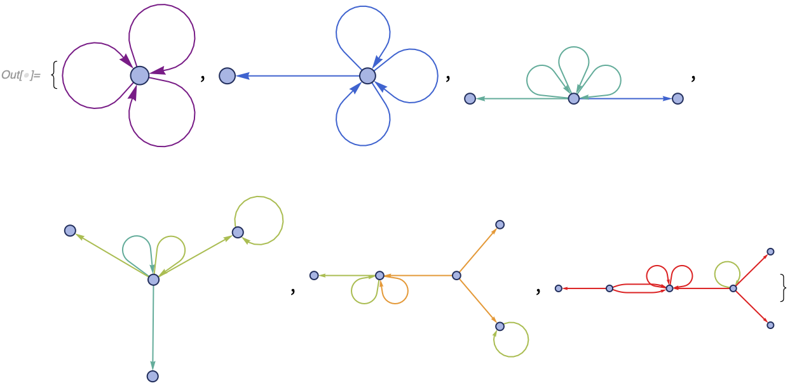

Event and expression generations correspond to layers in [`"LayeredCausalGraph"`](#causal-graphs) and [`"ExpressionsEventsGraph"`](#causal-graphs):

```wl
In[] := WolframModel[{{1, 2}, {1, 3}, {1, 4}} ->
  {{2, 2}, {3, 2}, {3, 4}, {3, 5}},
 {{1, 1}, {1, 1}, {1, 1}}, 5, "AllEventsGenerationsList"]
Out[] = {1, 2, 3, 4, 5, 5}
```

```wl
In[] := WolframModel[{{1, 2}, {1, 3}, {1, 4}} ->
  {{2, 2}, {3, 2}, {3, 4}, {3, 5}},
 {{1, 1}, {1, 1}, {1, 1}}, 5, "LayeredCausalGraph"]
```


#### Termination Reason

**`"TerminationReason"`** shows why the evaluation of the model was stopped. It's particularly useful if multiple [stopping conditions](#step-limiters) are specified.

All possible values are:

* `"MaxEvents"`, `"MaxGenerations"`, `"MaxVertices"`, `"MaxVertexDegree"` and `"MaxEdges"` correspond directly to [step limiters](#step-limiters).
* `"FixedPoint"` means there were no more matches possible to rule inputs.
* `"TimeConstraint"` could occur if a [`"TimeConstraint"`](#timeconstraint) option is used.
* `"Aborted"` would occur if the evaluation was manually interrupted (i.e., by pressing ⌘. on a Mac). In that case, a partially computed evolution object is returned.

As an example, in our arithmetic model a `"FixedPoint"` is reached (which is why we can use [`Infinity`](https://reference.wolfram.com/language/ref/Infinity.html) as the number of steps):

```wl
In[] := WolframModel[<|"PatternRules" -> {a_, b_} :> a + b|>,
  {3, 8, 8, 8, 2, 10, 0, 9, 7}, Infinity]["TerminationReason"]
Out[] = "FixedPoint"
```

And if we manually abort the evolution, we could get something like this:

```wl
In[] := WolframModel[{{1, 2, 3}, {4, 5, 6}, {1, 4}} ->
  {{2, 7, 8}, {5, 9, 10}, {6, 11, 12}, {13, 3, 14}, {8, 13}, {9,
    7}, {10, 12}, {14, 11}},
 {{1, 1, 1}, {1, 1, 1}, {1, 1}, {1, 1}, {1, 1}}, 100]
⌘.
```

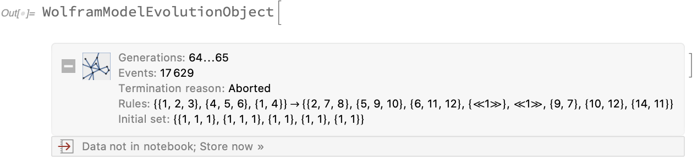

#### Generation Counts

**`"TotalGenerationsCount"`** returns the largest generation of any edge during the evolution:

```wl
In[] := WolframModel[{{1, 2}} -> {{1, 3}, {1, 3}, {3, 2}}, {{1, 1}},
 <|"MaxEvents" -> 42|>, "TotalGenerationsCount"]
Out[] = 5
```

**`"CompleteGenerationsCount"`** yields the number of generations that are "completely done". That is, no more matches can be made involving this or earlier generations. If the default [evaluation order](#eventorderingfunction) is used, this can only be either the same as `"TotalGenerationsCount"` (if we just finished a step) or one less (if we are in the middle of a step). However, it gets much more interesting if a different event order is used. For a random evolution, for instance, one can get

```wl
In[] := WolframModel[{{1, 2}} -> {{1, 3}, {1, 3}, {3, 2}}, {{1, 1}},
 <|"MaxEvents" -> 42|>, "EventOrderingFunction" -> "Random"]
```


Note, in this case, only one generation is complete, and seven are partial. That happens because the states grow with each generation, so it becomes more likely for a random choice to pick an edge from a later generation. Thus earlier ones are left unevolved.

**`"PartialGenerationsCount"`** is simply a difference of `"TotalGenerationsCount"` and `"CompleteGenerationsCount"`, and **`"GenerationsCount"`** is equivalent to `{"CompleteGenerationsCount", "PartialGenerationsCount"}`.

**`"GenerationComplete"`** takes a generation number as an argument, and gives [`True`](https://reference.wolfram.com/language/ref/True.html) or [`False`](https://reference.wolfram.com/language/ref/False.html) depending on whether that particular generation is complete:

```wl
In[] := WolframModel[{{1, 2}} -> {{1, 3}, {1, 3}, {3, 2}}, {{1, 1}},
  <|"MaxEvents" -> 42|>]["GenerationComplete", 5]
Out[] = False
```

#### Event Counts

**`"AllEventsCount"`** (aka `"EventsCount"`) returns the overall number of events throughout the evolution (the [`Length`](https://reference.wolfram.com/language/ref/Length.html) of [`"AllEventsList"`](#events)).

**`"GenerationEventsCountList"`** gives the number of events per each generation ([`Length`](https://reference.wolfram.com/language/ref/Length.html) mapped over [`"GenerationEventsList"`](#events)):

```wl
In[] := WolframModel[{{1, 2}} -> {{1, 3}, {1, 3}, {3, 2}},
 {{1, 1}}, 5, "GenerationEventsCountList"]
Out[] = {1, 3, 9, 27, 81}
```

#### Element Count Lists

**`"VertexCountList"`** and **`"EdgeCountList"`** return counts of vertices and edges respectively in each state of [`"StatesList"`](#states). They are useful to see how quickly a particular system grows:

```wl
In[] := WolframModel[{{1, 2, 3}, {2, 4, 5}} ->
  {{6, 6, 3}, {2, 6, 2}, {6, 4, 2}, {5, 3, 6}},
 {{1, 1, 1}, {1, 1, 1}}, 10, "VertexCountList"]
Out[] = {1, 2, 4, 8, 14, 27, 49, 92, 171, 324, 622}
```

```wl
In[] := WolframModel[{{1, 2, 3}, {2, 4, 5}} ->
  {{6, 6, 3}, {2, 6, 2}, {6, 4, 2}, {5, 3, 6}},
 {{1, 1, 1}, {1, 1, 1}}, 10, "EdgeCountList"]
Out[] = {2, 4, 8, 16, 28, 54, 98, 184, 342, 648, 1244}
```

#### Final Element Counts

**`FinalDistinctElementsCount`** (aka `"AtomsCountFinal"`) and **`FinalEdgeCount`** (aka `"ExpressionsCountFinal"`) are similar to corresponding [`*List`](#element-count-lists) properties, except we don't have `"FinalVertexCount"` (we should have it and also `"DistinctElementsCountList"`, but they are not currently implemented).

The difference is that [`"VertexCountList"`](#element-count-lists) counts expressions on level 2 in the states whereas `"FinalDistinctElementsCount"` counts all expressions matching `_ ? AtomQ` (on any level). The difference becomes apparent for edges that contain non-trivially nested lists.

For example, consider a rule that performs non-trivial nesting:

```wl
In[] := WolframModel[<|
  "PatternRules" -> {{a_}} :> {{a + 1}, {a - 1}, {{a + 2, a - 2}}}|>,
 {{1}}, 7, "VertexCountList"]
Out[] = {1, 3, 6, 10, 15, 21, 28, 36}
```

```wl
In[] := WolframModel[<|"PatternRules" ->
     {{a_}} :> {{a + 1}, {a - 1}, {{a + 2, a - 2}}}|>,
   {{1}}, #, "FinalDistinctElementsCount"] & /@ Range[0, 7]
Out[] = {1, 4, 9, 13, 17, 21, 25, 29}
```

To understand why this is happening, consider the state after one step:

```wl
In[] := WolframModel[<|
  "PatternRules" -> {{a_}} :> {{a + 1}, {a - 1}, {{a + 2, a - 2}}}|>,
 {{1}}, 1, "FinalState"]
Out[] = {{2}, {0}, {{3, -1}}}
```

This state has 3 vertices (distinct level-2 expressions): `2`, `0`, and `{3, -1}`, but 4 atoms: `2`, `0`, `3`, and `-1`. This distinction does not usually come up in our models since vertices and atoms are usually the same things, but it is significant in exotic cases like this.

#### Total Element Counts

**`"AllEventsDistinctElementsCount"`** (aka `"AtomsCountTotal"`) and **`"AllEventsEdgesCount"`** (aka `"ExpressionsCountTotal"`) are similar to [`"FinalDistinctElementsCount"`](#final-element-counts) and [`"FinalEdgeCount"`](#final-element-counts), except they count atoms and edges throughout the entire evolution instead of just in the final step.

For instance,

```wl
In[] := WolframModel[{{1, 2, 3}, {2, 4, 5}} ->
  {{6, 6, 3}, {2, 6, 2}, {6, 4, 2}, {5, 3, 6}},
 {{1, 1, 1}, {1, 1, 1}}, 10,
 {"AllEventsDistinctElementsCount", "AllEventsEdgesCount"}]
Out[] = {622, 2486}
```

#### Rules

**`"Rules"`** just stores the rules in the same way they were entered as an input to `WolframModel`:

```wl
In[] := WolframModel[<|"PatternRules" ->
    {{a_}} :> {{a + 1}, {a - 1}, {{a + 2, a - 2}}}|>,
  {{1}}, 1]["Rules"]
Out[] = <|"PatternRules" -> {{a_}} :> {{a + 1}, {a - 1}, {{a + 2, a - 2}}}|>
```

This is useful for display in the information box of the evolution object, and if one needs to reproduce an evolution object, the input for which is no longer available.

#### Version

**`"Version"`** returns the version of the data structure used in the evolution object. It will always be the same for the same version of *SetReplace*:

```wl
In[] := WolframModel[1 -> 2, {1}]["Version"]
Out[] = 2
```

Objects are automatically converted to the latest version when they are encountered by the newer version of *SetReplace*.

### Options

["VertexNamingFunction"](#vertexnamingfunction) | ["IncludePartialGenerations"](#includepartialgenerations) | ["IncludeBoundaryEvents"](#includeboundaryevents) | [Method](#method) | [TimeConstraint](#timeconstraint) | ["EventOrderingFunction"](#eventorderingfunction) | ["EventSelectionFunction"](#eventselectionfunction)

#### "VertexNamingFunction"

**`"VertexNamingFunction"`** controls the names chosen for vertices, particularly the newly created ones. It can take three values: [`None`](https://reference.wolfram.com/language/ref/None.html), [`Automatic`](https://reference.wolfram.com/language/ref/Automatic.html), and [`All`](https://reference.wolfram.com/language/ref/All.html).

[`None`](https://reference.wolfram.com/language/ref/None.html) does not do anything, the vertices in the initial condition are left as-is, and the newly created vertices use symbol names as, i.e., `Module[{v}, v]` could generate:

```wl
In[] := WolframModel[{{1, 2}} -> {{1, 3}, {1, 3}, {3, 2}},
 {{v1, v1}}, 2, "StatesList", "VertexNamingFunction" -> None]
Out[] = {{{v1, v1}}, {{v1, v256479}, {v1, v256479}, {v256479, v1}}, {{v1,
   v256480}, {v1, v256480}, {v256480, v256479}, {v1, v256481}, {v1,
   v256481}, {v256481, v256479}, {v256479, v256482}, {v256479,
   v256482}, {v256482, v1}}}
```

[`All`](https://reference.wolfram.com/language/ref/All.html) renames all vertices as sequential integers, including the ones in the the initial condition, and including ones manually generated in [pattern rules](#pattern-rules):

```wl
In[] := WolframModel[{{1, 2}} -> {{1, 3}, {1, 3}, {3, 2}},
 {{v1, v1}}, 2, "StatesList", "VertexNamingFunction" -> All]
Out[] = {{{1, 1}}, {{1, 2}, {1, 2}, {2, 1}}, {{1, 3}, {1, 3}, {3, 2}, {1,
   4}, {1, 4}, {4, 2}, {2, 5}, {2, 5}, {5, 1}}}
```

[`Automatic`](https://reference.wolfram.com/language/ref/Automatic.html) only renames newly created vertices with non-previously-used integers, and leaves the initial condition as-is. It does nothing in the case of [pattern rules](#pattern-rules).

```wl
In[] := WolframModel[{{1, 2}} -> {{1, 3}, {1, 3}, {3, 2}},
 {{v1, v1}}, 2, "StatesList", "VertexNamingFunction" -> Automatic]
Out[] = {{{v1, v1}}, {{v1, 1}, {v1, 1}, {1, v1}}, {{v1, 2}, {v1, 2}, {2,
   1}, {v1, 3}, {v1, 3}, {3, 1}, {1, 4}, {1, 4}, {4, v1}}}
```

#### "IncludePartialGenerations"

In case partial generations were produced, they can be automatically dropped by setting **`"IncludePartialGenerations"`** to [`False`](https://reference.wolfram.com/language/ref/False.html). Compare for instance

```wl
In[] := WolframModel[{{1, 2}} -> {{1, 3}, {1, 3}, {3, 2}},
 {{1, 1}}, <|"MaxEvents" -> 42|>]
```


with

```wl
In[] := WolframModel[{{1, 2}} -> {{1, 3}, {1, 3}, {3, 2}},
 {{1, 1}}, <|"MaxEvents" -> 42|>,
 "IncludePartialGenerations" -> False]
```


One neat use of this is producing a uniformly random evolution for a complete number of generations:

```wl
In[] := WolframModel[{{1, 2, 3}, {2, 4, 5}} ->
  {{6, 6, 3}, {2, 6, 2}, {6, 4, 2}, {5, 3, 6}},
 {{1, 1, 1}, {1, 1, 1}}, <|"MaxEvents" -> 10000|>, "FinalStatePlot",
 "EventOrderingFunction" -> "Random",
 "IncludePartialGenerations" -> False]
```

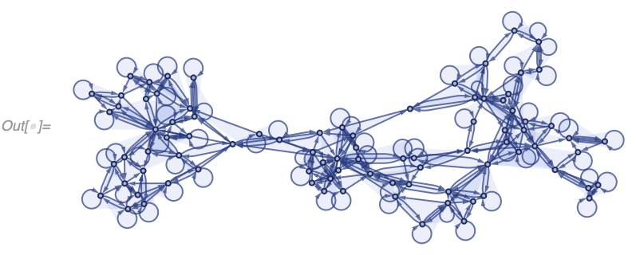

#### "IncludeBoundaryEvents"

**`"IncludeBoundaryEvents"`** allows one to include "fake" initial and final events in properties such as [`"ExpressionsEventsGraph"`](#causal-graphs). It does not affect the evolution itself and does not affect the evolution object. It has 4 settings: [`None`](https://reference.wolfram.com/language/ref/None.html), `"Initial"`, `"Final"` and [`All`](https://reference.wolfram.com/language/ref/All.html).

Here is an example of an [`"ExpressionsEventsGraph"`](#causal-graphs) with the initial and final "events" included:

```wl
In[] := WolframModel[<|"PatternRules" -> {a_, b_} :> a + b|>,
  {3, 8, 8, 8, 2, 10, 0, 9, 7}, Infinity]["ExpressionsEventsGraph",
 "IncludeBoundaryEvents" -> All,
 VertexLabels -> Placed[Automatic, After]]
```


Properties like [`"AllEventsList"`](#events) are affected as well:

```wl
In[] := WolframModel[<|"PatternRules" -> {a_, b_} :> a + b|>,
 {3, 8, 8, 8, 2, 10, 0, 9, 7}, Infinity, "AllEventsList",
 "IncludeBoundaryEvents" -> "Final"]
Out[] = {{1, {1, 2} -> {10}}, {1, {3, 4} -> {11}},
 {1, {5, 6} -> {12}}, {1, {7, 8} -> {13}},
 {1, {9, 10} -> {14}}, {1, {11, 12} -> {15}},
 {1, {13, 14} -> {16}}, {1, {15, 16} -> {17}},
 {Infinity, {17} -> {}}}
```

#### Method

There are two implementations (**`Method`** s) available: one written in Wolfram Language (`Method -> "Symbolic"`), one in C++ (`Method -> "LowLevel"`).

The Wolfram Language implementation permutes the left-hand sides of the rules in all possible ways and uses [`Replace`](https://reference.wolfram.com/language/ref/Replace.html) a specified number of times to perform evolution. This implementation works well for small graphs and small rule inputs, but it slows down with the number of edges in the graph and has exponential complexity in rule size.

The C++ implementation, on the other hand, keeps an index of all possible rule matches and updates it after every replacement. The reindexing algorithm looks only at the local region of the graph close to the rewrite site. Thus time complexity does not depend on the graph size as long as vertex degrees are small. The downside is that it has exponential complexity (both in time and memory) in the vertex degrees. Currently, it also does not work for non-local rules (i.e., rule inputs that do not form a connected hypergraph) and rules that are not hypergraph rules (i.e., pattern rules that have non-trivial nesting or conditions).

The C++ implementation is used by default for supported systems and is particularly useful if:

* Vertex degrees are expected to be small.
* Evolution needs to be done for a large number of steps `> 100`, it is possible to produce states with up to a million edges or more.

It should not be used, however, if vertex degrees can grow large. For example

```wl
In[] := AbsoluteTiming[
 WolframModel[{{{0}} -> {{0}, {0}, {0}}, {{0}, {0}, {0}} -> {{0}}},
  {{0}}, <|"MaxEvents" -> 30|>, Method -> "LowLevel"]]
```


takes almost 10 seconds in C++ implementation, and less than 1/10th of a second in the Wolfram Language implementation:

```wl
In[] := AbsoluteTiming[
 WolframModel[{{{0}} -> {{0}, {0}, {0}}, {{0}, {0}, {0}} -> {{0}}},
  {{0}}, <|"MaxEvents" -> 30|>, Method -> "Symbolic"]]
```

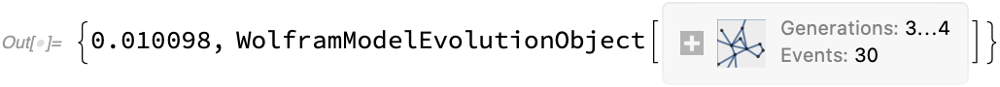

Wolfram Language implementation should be used if:

* A large number of small rules with unknown behavior needs to be simulated for a small number of steps.
* Vertex degrees are expected to be large, rules are non-local, or pattern rules with non-trivial nesting or conditions are used.

#### TimeConstraint

**`TimeConstraint`** option allows one to stop the evolution early. If an evolution object is requested, it will return a partial result, otherwise, it will just give [`$Aborted`](https://reference.wolfram.com/language/ref/$Aborted.html):

```wl
In[] := WolframModel[{{1, 2}} -> {{1, 3}, {1, 3}, {3, 2}},
 {{1, 1}}, Infinity, TimeConstraint -> 1]
```

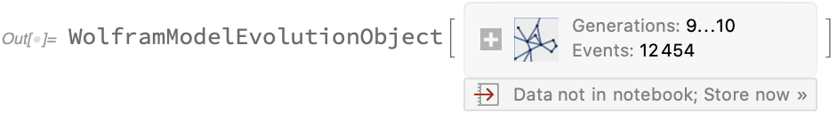

#### "EventOrderingFunction"

In many `WolframModel` systems multiple matches are possible at any given step. As an example, two possible replacements are possible in the system below from the initial condition:

```wl
In[] := WolframModel[{{1, 2}} -> {{1, 3}, {3, 2}},
 {{1, 2}, {2, 2}}, <|"MaxEvents" -> 1|>, "EventsStatesPlotsList"]
```


```wl
In[] := WolframModel[{{1, 2}} -> {{1, 3}, {3, 2}},
 {{1, 2}, {2, 2}}, <|"MaxEvents" -> 1|>, "EventsStatesPlotsList",
 "EventOrderingFunction" -> "NewestEdge"]
```


In this particular so-called non-overlapping system, the order of replacements does not matter. Regardless of order, the same final state (up to renaming of vertices) is produced for the same fixed number of generations. This will always be the case if there is only a single edge on the left-hand side of the rule:

```wl
In[] := WolframModel[{{1, 2}} -> {{1, 3}, {1, 3}, {3, 2}},
   {{1, 2}, {2, 2}}, 3, "FinalStatePlot",
   "EventOrderingFunction" -> #] & /@ {Automatic, "Random"}
```

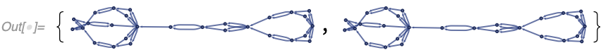

For some systems, however, the order of replacements does matter, and non-equivalent final states would be produced for different orders even if a fixed number of generations is requested:

```wl
In[] := WolframModel[{{1, 2}, {2, 3}} -> {{4, 2}, {4, 1}, {2, 1}, {3, 4}},
 {{1, 2}, {2, 3}, {3, 4}, {4, 1}}, 5, "FinalStatePlot"]
```


```wl
In[] := WolframModel[{{1, 2}, {2, 3}} -> {{4, 2}, {4, 1}, {2, 1}, {3, 4}},
 {{1, 2}, {2, 3}, {3, 4}, {4, 1}}, 5, "FinalStatePlot",
 "EventOrderingFunction" -> "RuleOrdering"]
```

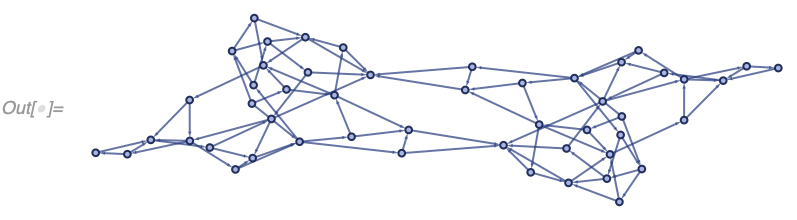

In a case like that, it is important to be able to specify the desired evolution order, which is the purpose of the **`"EventOrderingFunction"`** option. `"EventOrderingFunction"` is specified as a list of sorting criteria such as the default `{"LeastRecentEdge", "RuleOrdering", "RuleIndex"}`. Note that most individual sorting criteria are insufficient to distinguish between all available matches. If multiple matches remain after exhausting all sorting criteria, one is chosen uniformly at random (which is why `{}` works as a shorthand for `"Random"`).

Possible sorting criteria are:

* `"OldestEdge"`: greedily select the edge closest to the beginning of the list (which would typically correspond to the oldest edge). Note, the edges within a single-event output are assumed oldest-to-newest left-to-right as written on the right-hand side of the rule. After this criterion, a fixed ***subset*** of edges is guaranteed to be chosen, but different orderings of that subset might be possible (which could allow for multiple non-equivalent matches).

* `"NewestEdge"`: similar to `"OldestEdge"` except edges are chosen from the end of the list rather than from the beginning.

* `"LeastRecentEdge"`: this is similar to `"OldestEdge"`, but instead of greedily choosing the oldest edges, it instead avoids choosing newest ones. The difference is best demonstrated in an example:

    ```wl
    In[] := WolframModel[{{x, y}, {y, z}} -> {},
       {{1, 2}, {a, b}, {b, c}, {2, 3}},
       <|"MaxEvents" -> 1|>, "AllEventsList",
       "EventOrderingFunction" -> #] & /@ {"OldestEdge",
      "LeastRecentEdge"}
    Out[] = {{{1, {1, 4} -> {}}}, {{1, {2, 3} -> {}}}}
    ```

    Note that in this example `"OldestEdge"` has selected the first and the last edge, whereas `"LeastRecentEdge"`, in an attempt to avoid the most "recent" last edge, has selected the second and the third ones. In this case, similarly to `"OldestEdge"`, a fixed set of edges is guaranteed to be chosen, but potentially in multiple orders.

* `"LeastOldEdge"`: similar to `"LeastRecentEdge"`, but avoids old edges instead of new ones.

    Note that counterintuitively `"OldestEdge"` sorting is not equivalent to the reverse of `"NewestEdge"` sorting, it is equivalent to the reverse of `"LeastOldEdge"`. Similarly, `"NewestEdge"` is the reverse of `"LeastRecentEdge"`.

* `"RuleOrdering"`: similarly to `"OldestEdge"` greedily chooses edges from the beginning of the list, however unlike `"OldestEdge"` which would pick the oldest edge with *any* available matches, it chooses edges in the order the left-hand side of (any) rule is written. The difference is best demonstrated in an example:

    ```wl
    In[] := WolframModel[{{x, y}, {y, z}} -> {},
       {{b, c}, {1, 2}, {a, b}, {2, 3}},
       <|"MaxEvents" -> 1|>, "AllEventsList",
       "EventOrderingFunction" -> #] & /@ {"OldestEdge", "RuleOrdering"}
    Out[] = {{{1, {1, 3} -> {}}}, {{1, {2, 4} -> {}}}}
    ```

    Note how `"RuleOrdering"` has selected the second edge first because it matches the first rule input while the first edge does not.

    In this case, a specific ordered sequence of edges is guaranteed to be matched (including its permutation). However, multiple matches might still be possible if multiple rules exist which match that sequence.

* `"ReverseRuleOrdering"`: as the name suggests, this is just the reverse of `"RuleOrdering"`.

* `"RuleIndex"`: this simply means it attempts to match the first rule first, and only if no matches to the first rule are possible, it goes to the second rule, and so on.

* `"ReverseRuleIndex"`: similar to `"RuleIndex"`, but reversed as the name suggests.

* `"Random"`: selects a single match uniformly at random. It is possible to do that efficiently because the C++ implementation of `WolframModel` (the only one that supports `"EventOrderingFunction"`) keeps track of all possible matches at any point during the evolution. `"Random"` is guaranteed to select a single match, so the remaining sorting criteria are ignored. It can also be omitted because the random event is always chosen if provided sorting criteria are insufficient. The seeding can be controlled with [`SeedRandom`](https://reference.wolfram.com/language/ref/SeedRandom.html). However, the result does depend on your platform (Mac/Linux/Windows) and the specific build (version) of **SetReplace**.

As a neat example, here is the output of all individual sorting criteria (default sorting criteria are appended to disambiguate):

```wl
In[] := WolframModel[{{{1, 2}, {1, 3}, {1, 4}} -> {{5, 6}, {6, 7}, {7, 5}, {5,
         7}, {7, 6}, {6, 5}, {5, 2}, {6, 3}, {7, 4}, {2, 7}, {4, 5}},
     {{1, 2}, {1, 3}, {1, 4}, {1, 5}} -> {{2, 3}, {3, 4}}},
    {{1, 1}, {1, 1}, {1, 1}},
    <|"MaxEvents" -> 30|>,
    "EventOrderingFunction" -> {#, "LeastRecentEdge", "RuleOrdering",
      "RuleIndex"}]["FinalStatePlot",
   PlotLabel -> #] & /@
 {"OldestEdge", "LeastOldEdge",
  "LeastRecentEdge", "NewestEdge", "RuleOrdering",
  "ReverseRuleOrdering", "RuleIndex", "ReverseRuleIndex", "Random"}
```

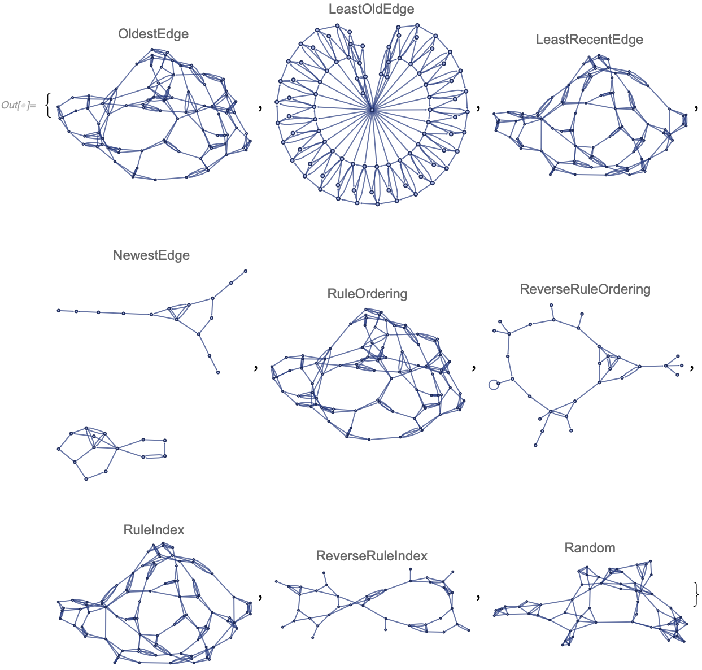

#### "EventSelectionFunction"

**`EventSelectionFunction`** allows one to evaluate local multiway systems. Currently, two values are supported, `"GlobalSpacelike"` and `None`.

`"GlobalSpacelike"` is the default, and is the single-way evolution. "Spacelike" refers to relationships between edges, and "global" means each edge is only used once in an event. As a consequence, there are no branchlike pairs of edges.

On the other hand, `None` (aka match-all) event selection function matches everything. It does not disable edges after they were used, so they can be reused repeatedly (each unique match is only used once, though).

For example, consider a system

```wl
In[] := WolframModel[{{1, 2}, {2, 3}} -> {{1, 3}},
 {{1, 2}, {2, 3}, {2, 4}}, Infinity, "AllEventsEdgesList"]
Out[] = {{1, 2}, {2, 3}, {2, 4}, {1, 3}}
```

In this example we used the default `"GlobalSpacelike"` selection function, and the evolution terminated after a single event, because the edge `{1, 2}` was used, and it could not be reused to be matched with `{2, 4}`. However, let's look at what `"EventSelectionFunction" -> None` will do:

```wl
In[] := WolframModel[{{1, 2}, {2, 3}} -> {{1, 3}},
 {{1, 2}, {2, 3}, {2, 4}}, Infinity, "AllEventsEdgesList",
 "EventSelectionFunction" -> None]
Out[] = {{1, 2}, {2, 3}, {2, 4}, {1, 3}, {1, 4}}
```

In this case, the edge `{1, 2}` was matched twice, which we can also see by looking at its list of destroyer events:

```wl
In[] := WolframModel[{{1, 2}, {2, 3}} -> {{1, 3}},
 {{1, 2}, {2, 3}, {2, 4}}, Infinity, "EdgeDestroyerEventsIndices",
 "EventSelectionFunction" -> None]
Out[] = {{1, 2}, {1}, {2}, {}, {}}
```

In the previous example, we matched the same edge twice, but every match's inputs were spacelike with each other. I.e., every edge in the previous input could be generated by choosing a different [`"EventOrderingFunction"`](#eventorderingfunction). However, `"EventSelectionFunction"` also matches edges that are branchlike (i.e., edges from different multiway branches) and timelike (i.e., edges that causally depend on each other).

The edges `{1, 2, 3}` and `{1, 2, 4}` in the next example are branchlike, they can never co-exist in a single `"GlobalSpacelike"` evolution no matter which ["EventOrderingFunction"](#eventorderingfunction) one chooses. The match-all (`"EventSelectionFunction" -> None`) evolution matches them nonetheless.

```wl
In[] := WolframModel[{{{1, 2}, {2, 3}} -> {{1, 2, 3}},
  {{1, 2, 3}, {1, 2, 4}} -> {{1, 2, 3, 4}}},
 {{1, 2}, {2, 3}, {2, 4}}, Infinity, "AllEventsEdgesList",
 "EventSelectionFunction" -> None]
Out[] = {{1, 2}, {2, 3}, {2, 4}, {1, 2, 3}, {1, 2, 4}, {1, 2, 3, 4}, {1, 2, 4,
   3}}
```

Similarly, it matches timelike edges `{1, 2}` and `{1, 2, 3}` below:

```wl
In[] := WolframModel[{{{1, 2}, {2, 3}} -> {{1, 2, 3}},
  {{1, 2}, {1, 2, 3}} -> {{1, 2, 3, 4}}},
 {{1, 2}, {2, 3}}, Infinity, "AllEventsEdgesList",
 "EventSelectionFunction" -> None]
Out[] = {{1, 2}, {2, 3}, {1, 2, 3}, {1, 2, 3, 4}}
```

Because of this branchlike and timelike matching, branches in `"EventSelectionFunction" -> None` evolution are not separated but can "interfere" with one another.

## WolframModelPlot

[Edge Type](#edge-type) | [GraphHighlight and GraphHighlightStyle](#graphhighlight-and-graphhighlightstyle) | ["HyperedgeRendering"](#hyperedgerendering) | [VertexCoordinateRules](#vertexcoordinaterules) | [VertexLabels](#vertexlabels) | [VertexSize and "ArrowheadLength"](#vertexsize-and-arrowheadlength) | ["MaxImageSize"](#maximagesize) | [Style Options](#style-options) | [Graphics Options](#graphics-options)

**`WolframModelPlot`** (aka `HypergraphPlot`) is a function used to visualize [`WolframModel`](#wolframmodel-and-wolframmodelevolutionobject) states. It treats lists of vertices as ordered hypergraphs, and displays each hyperedge as a polygon with arrows showing the ordering:

```wl
In[] := WolframModelPlot[{{1, 2, 3}, {3, 4, 5}, {5, 6, 7, 1}}]
```


Edges of any arity can be mixed. The binary edges are displayed as non-filled arrows, and the unary edges are shown as circles around the vertices:

```wl
In[] := WolframModelPlot[{{1, 2, 3}, {3, 4}, {4, 3}, {4, 5,
   6}, {1}, {6}, {6}}]
```

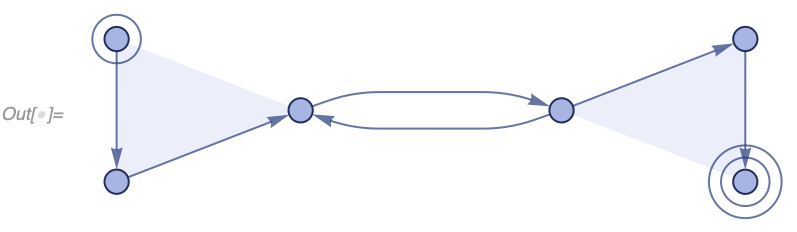

Self-loops are shown as convex polygons around the appropriate number of circular arrows:

```wl
In[] := WolframModelPlot[{{1, 1, 1}, {1, 2, 3}, {3, 4, 4}}]
```


Note the difference between a hyper-self-loop and two binary edges pointing in opposite directions:

```wl
In[] := WolframModelPlot[{{1, 2, 1}, {2, 3}, {3, 2}}]
```


Multiedges are shown in a darker color (because of overlayed partially transparent polygons), or as separate polygons depending on the layout (and are admittedly sometimes hard to understand):

```wl
In[] := WolframModelPlot[{{1, 2, 3}, {3, 4, 5}, {3, 4, 5}, {1, 6, 6}, {1, 6,
   6}}]
```

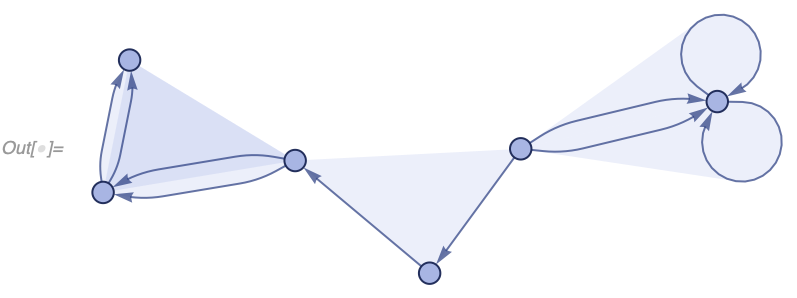

`WolframModelPlot` is listable. Multiple hypergraphs can be plotted at the same time:

```wl
In[] := WolframModelPlot[{{{1, 2, 3}},
  {{1, 2, 3}, {3, 4, 5}},
  {{1, 2, 3}, {3, 4, 5}, {5, 6, 7}}}]
```

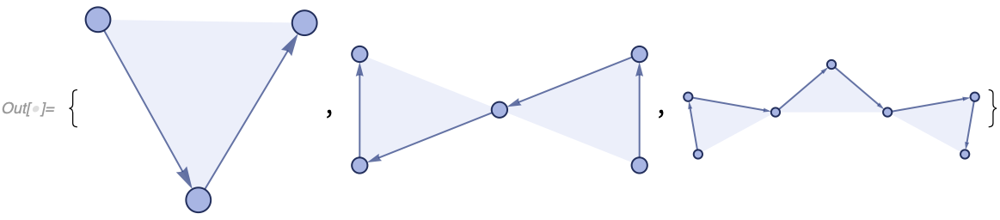

Many [`WolframModel`](#wolframmodel-and-wolframmodelevolutionobject) properties, such as [`"FinalStatePlot"`](#plots-of-states) and [`"EventStatesPlotsList"`](#plots-of-events), use `WolframModelPlot` to produce output. They accept the same set of options, as enumerated below.

### Edge Type

By default, `WolframModelPlot` assumes the hypergraph edges are ordered. It is also possible to treat edges as cyclic instead (i.e., assume [`RotateLeft`](https://reference.wolfram.com/language/ref/RotateLeft.html) and [`RotateRight`](https://reference.wolfram.com/language/ref/RotateRight.html) don't change the edge), in which case `"Cyclic"` should be used as the second argument to `WolframModelPlot`:

```wl
In[] := WolframModelPlot[{{1, 2, 3}, {3, 4, 5}, {5, 6, 7, 1}}, "Cyclic"]
```

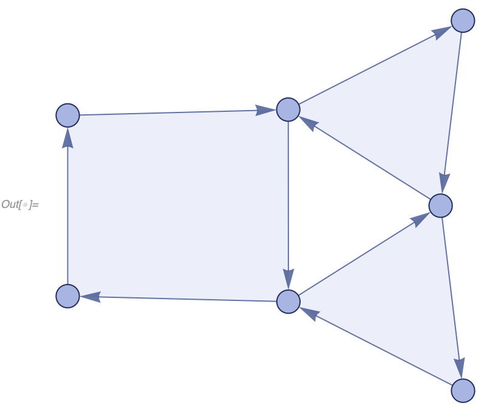

### GraphHighlight and GraphHighlightStyle

Vertices and edges can be highlighted with the **`GraphHighlight`** option:

```wl
In[] := WolframModelPlot[{{1, 2, 3}, {3, 4, 5}, {5, 6, 7, 1}, {7, 8, 2}, {4,
   9}, {9}}, GraphHighlight -> {{1, 2, 3}, 4, {9}}]
```


For a hypergraph with multiedges, only the specified number of edges will be highlighted:

```wl
In[] := WolframModelPlot[{{1, 2, 3}, {1, 2, 3}, {3, 4}, {3, 4}, {3,
   4}, {4}, {4}}, GraphHighlight -> {{1, 2, 3}, {3, 4}, {3, 4}, {4}}]
```


The style of the highlight can be specified with **`GraphHighlightStyle`**:

```wl
In[] := WolframModelPlot[{{1, 2, 3}, {3, 4, 5}, {5, 6, 7, 1}, {7, 8, 2}, {4,
   9}, {9}}, GraphHighlight -> {{1, 2, 3}, 4, {9}},
 GraphHighlightStyle -> Directive[Darker @ Green, Thick]]
```

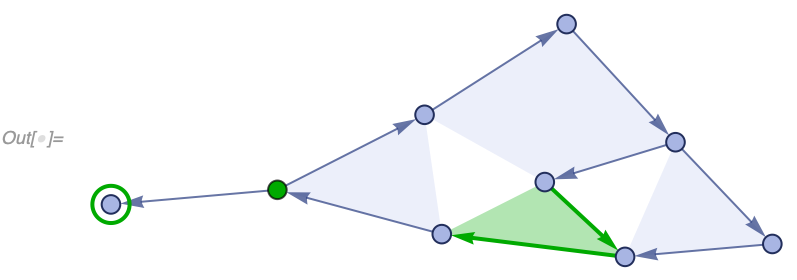

### "HyperedgeRendering"

By default, `WolframModelPlot` represents each hyperedge as a polygon. It is possible instead to drop the polygons (and the vertex layout adjustments that come with them), and simply split each hyperedge into a collection of binary edges by setting **`"HyperedgeRendering"`** to `"Subgraphs"`. This loses information (`{{1, 2}, {2, 3}}` and `{{1, 2, 3}}` would look the same), but might be useful if one does not care to see the separation between hyperedges:

```wl
In[] := WolframModelPlot[{{1, 2, 3}, {3, 4, 5}, {5, 6, 7, 1}, {7, 8, 2}, {4,
   9}, {9}}, "HyperedgeRendering" -> "Subgraphs",
 VertexLabels -> Automatic]
```

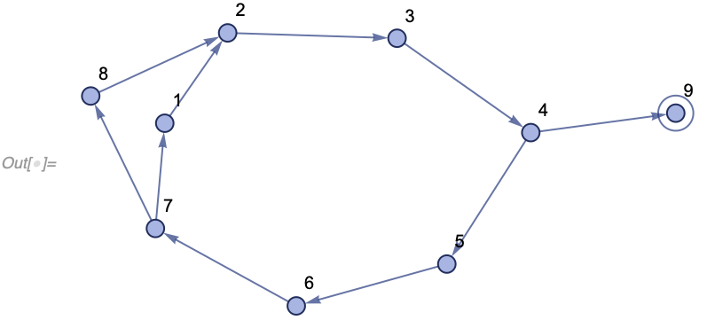

### VertexCoordinateRules

It is possible to manually specify some or all coordinates for the vertices:

```wl
In[] := WolframModelPlot[{{1, 2, 3}, {2, 4, 5}, {2, 6, 7, 8}, {8, 9, 1}},
 VertexCoordinateRules -> {1 -> {0, 0}, 2 -> {1, 0}, 3 -> {0, 1}},
 Axes -> True]
```

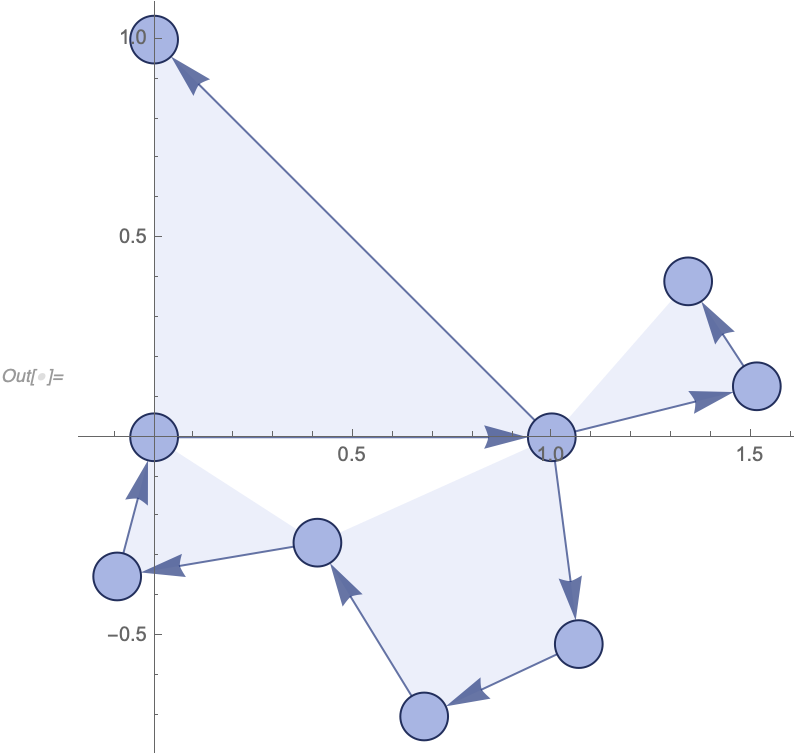

Unfortunately, due to limitations of [`GraphEmbedding`](https://reference.wolfram.com/language/ref/GraphEmbedding.html), specifying coordinates of two or more vertices breaks the scaling of distances. As a result, vertices and arrowheads might appear too small or too large and need to be manually adjusted. This might also affect [`RulePlot`](#ruleplot-of-wolframmodel) in some cases.

```wl
In[] := WolframModelPlot[{{1, 2, 3}, {2, 4, 5}, {2, 6, 7, 8}, {8, 9, 1}},
 VertexCoordinateRules -> {1 -> {0, 0}, 2 -> {1, 0}}]
```

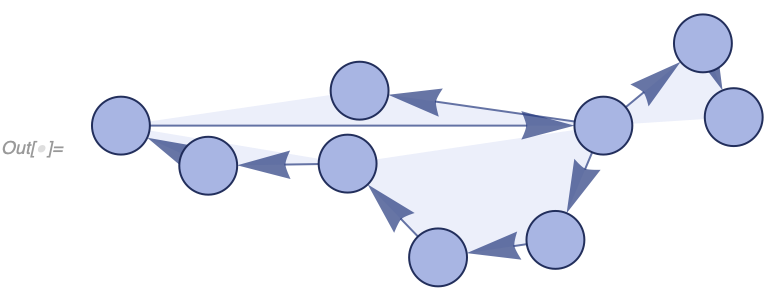

```wl
In[] := WolframModelPlot[{{1, 2, 3}, {2, 4, 5}, {2, 6, 7, 8}, {8, 9, 1}},
 VertexCoordinateRules -> {1 -> {0, 0}, 2 -> {1, 0}},
 VertexSize -> 0.03, "ArrowheadLength" -> 0.06]
```


### VertexLabels

`"VertexLabels" -> Automatic` displays labels for vertices, similar to [`GraphPlot`](https://reference.wolfram.com/language/ref/GraphPlot.html):

```wl
In[] := WolframModelPlot[{{1, 2, 3}, {2, 4, 5}, {2, 6, 7, 8}, {8, 9, 1}},
 VertexLabels -> Automatic]
```


### VertexSize and "ArrowheadLength"

The size of vertices and the length of arrowheads (in the internal graphics units), can be adjusted with **`VertexSize`** and **`"ArrowheadLength"`** options respectively:

```wl
In[] := WolframModelPlot[{{1, 2, 3, 4}, {1, 5, 6}, {2, 7, 8}, {4, 6, 9}},
 VertexSize -> 0.1, "ArrowheadLength" -> 0.3]
```


Note that unlike [`GraphPlot`](https://reference.wolfram.com/language/ref/GraphPlot.html), both vertices and arrowheads have a fixed size relative to the layout (in fact, the arrowheads are drawn manually as polygons). This fixed size implies that they scale proportionally when the image is resized, and do not overlay/disappear for tiny/huge graphs or image sizes.

These options can also be used to get rid of vertices and arrowheads altogether:

```wl
In[] := WolframModelPlot[{{1, 2, 3}, {3, 4, 5}, {5, 6, 7}, {7, 8, 9}, {9, 10,
   1}}, "Cyclic", "ArrowheadLength" -> 0, VertexSize -> 0,
 VertexStyle -> Transparent]
```

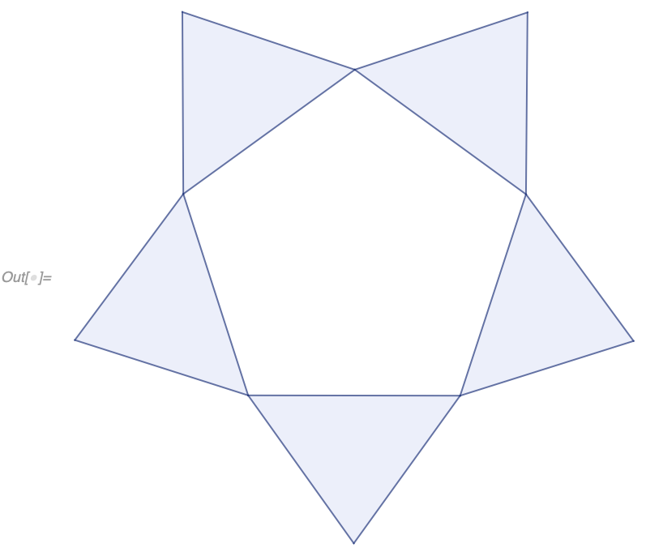

As a neat example, one can even draw unordered hypergraphs:

```wl
In[] := WolframModelPlot[{{1, 2, 2}, {2, 3, 3}, {3, 1, 1}},
 "ArrowheadLength" -> 0, EdgeStyle -> <|{_, _, _ ..} -> Transparent|>,
  "EdgePolygonStyle" -> <|{_, _, _ ..} ->
    Directive[Hue[0.63, 0.66, 0.81], Opacity[0.1],
     EdgeForm[Directive[Hue[0.63, 0.7, 0.5], Opacity[0.7]]]]|>]
```

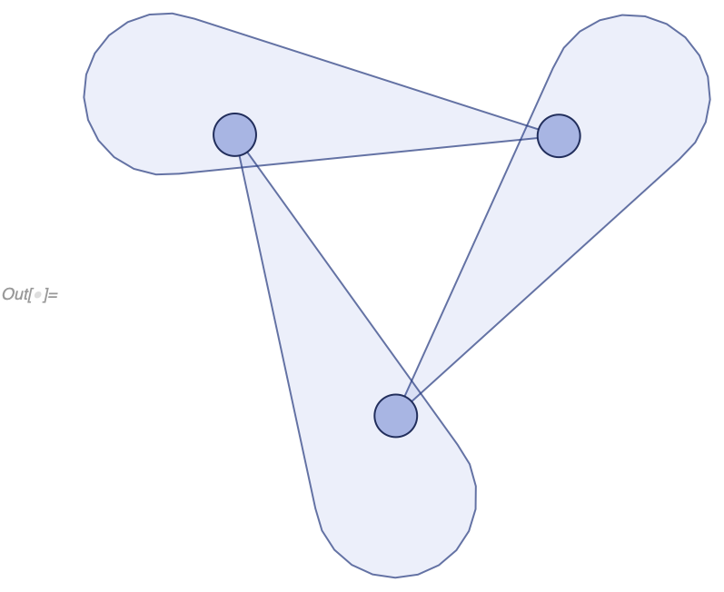

### "MaxImageSize"

**`"MaxImageSize"`** allows one to specify the image size while allowing for automatic reduction for very small hypergraphs. To demonstrate that, consider the difference:

```wl
In[] := WolframModelPlot[{{{1}}, {{1, 1}}, {{1, 2, 3}}},
 "MaxImageSize" -> 100]
```


```wl
In[] := WolframModelPlot[{{{1}}, {{1, 1}}, {{1, 2, 3}}}, ImageSize -> 100]
```

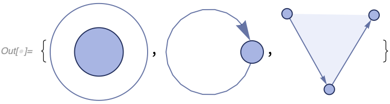

### Style Options

There are four styling options: `PlotStyle`, `VertexStyle`, `EdgeStyle` and `"EdgePolygonStyle"`.

**`PlotStyle`** controls the overall style for everything, `VertexStyle` and `EdgeStyle` inherit from it:

```wl
In[] := WolframModelPlot[{{1, 2, 3}, {3, 4, 5}, {5, 6, 7, 1}, {7, 8, 2}, {4,
   9}, {9}}, PlotStyle -> Directive[Blue, Dotted]]
```


**`VertexStyle`** works similar to [`GraphPlot`](https://reference.wolfram.com/language/ref/GraphPlot.html):

```wl
In[] := WolframModelPlot[{{1, 2, 3}, {3, 4, 5}, {5, 6, 7, 1}, {7, 8, 2}, {4,
   9}, {9}}, PlotStyle -> Directive[Blue, Dotted], VertexStyle -> Red]
```


**`EdgeStyle`** controls edge lines, and `"EdgePolygonStyle"` inherits from it (automatically adding transparency):

```wl
In[] := WolframModelPlot[{{1, 2, 3}, {3, 4, 5}, {5, 6, 7, 1}, {7, 8, 2}, {4,
   9}, {9}}, PlotStyle -> Directive[Blue, Dotted], VertexStyle -> Red,
  EdgeStyle -> Darker @ Green]
```


Finally, **`"EdgePolygonStyle"`** controls the hyperedge polygons:

```wl
In[] := WolframModelPlot[{{1, 2, 3}, {3, 4, 5}, {5, 6, 7, 1}, {7, 8, 2}, {4,
   9}, {9}}, PlotStyle -> Directive[Blue, Dotted], VertexStyle -> Red,
  EdgeStyle -> Darker @ Green,
 "EdgePolygonStyle" ->
  Directive[Lighter[Green, 0.9], EdgeForm[Dotted]]]
```

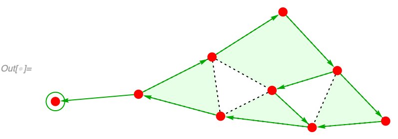

It is possible to specify styles separately for each edge and vertex. Vertex styles are specified in the same order as `Union @* Catenate` evaluated on the list of edges:

```wl
In[] := WolframModelPlot[{{1, 2, 3}, {3, 4, 5}, {5, 6, 7, 1}, {7, 8, 2}, {4,
   9}, {9}}, EdgeStyle -> ColorData[97] /@ Range[6],
 VertexStyle -> ColorData[98] /@ Range[9]]
```


Alternatively, one can specify different styles for different patterns of elements. In this case, styles are specified as [`Association`](https://reference.wolfram.com/language/ref/Association.html)s with patterns for keys. This can be used to, for example, differently color edges of different arities:

```wl
In[] := WolframModelPlot[WolframModel[{{1, 2, 3}, {4, 5, 6}, {2, 5}, {5, 2}} ->
   {{7, 1, 8}, {9, 3, 10}, {11, 4, 12}, {13, 6, 14}, {7, 13}, {13,
     7}, {8, 10}, {10, 8}, {9, 11}, {11, 9}, {12, 14}, {14, 12}},
  {{1, 2, 3}, {4, 5, 6}, {1, 4}, {4, 1}, {2, 5}, {5, 2}, {3, 6}, {6,
    3}}, 6, "FinalState"],
 EdgeStyle -> <|{_, _} -> Darker @ Green, {_, _, _} -> Darker @ Red|>]
```

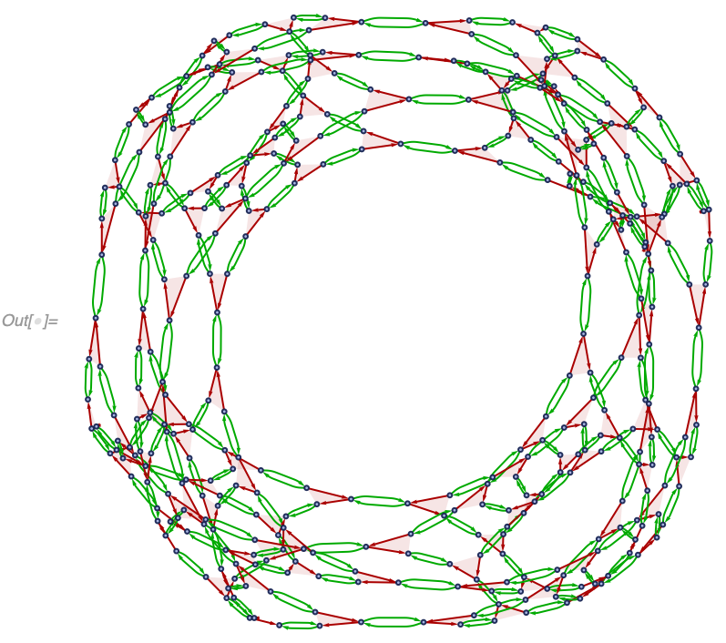

### Graphics Options

All [`Graphics`](https://reference.wolfram.com/language/ref/Graphics.html) options are supported as well, such as [`Background`](https://reference.wolfram.com/language/ref/Background.html), [`PlotRange`](https://reference.wolfram.com/language/ref/PlotRange.html), [`Axes`](https://reference.wolfram.com/language/ref/Axes.html), etc.:

```wl
In[] := WolframModelPlot[WolframModel[{{1, 2}} -> {{1, 3}, {1, 3}, {3, 2}},
  {{1, 2}, {2, 3}, {3, 1}}, 7, "FinalState"], Background -> Black,
 PlotStyle -> White, GridLines -> Automatic,
 PlotRange -> {{30, 50}, {20, 40}}, Axes -> True]
```


## RulePlot of WolframModel

**`RulePlot`** can be used to get a [`WolframModelPlot`](#wolframmodelplot)-based visual representation of hypergraph substitution rules:

```wl
In[] := RulePlot[WolframModel[{{1, 2}, {1, 2}} ->
   {{3, 2}, {3, 2}, {2, 1}, {1, 3}}]]
```

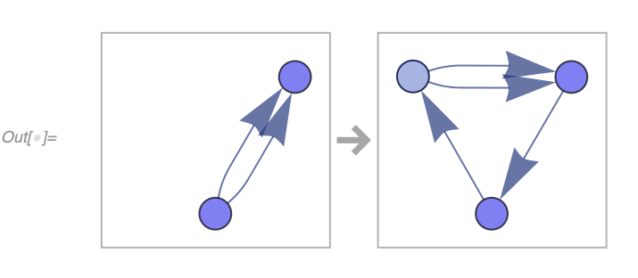

The shared elements between rule sides (vertices `1` and `2` in the example above) are put at the same positions in the `RulePlot` and highlighted in a darker shade of blue. Shared edges are highlighted as well:

```wl
In[] := RulePlot[WolframModel[{{1, 2, 3}} -> {{1, 2, 3}, {3, 4, 5}}]]
```


Multiple rules can be plotted:

```wl
In[] := RulePlot[WolframModel[{{{1, 1, 2}} ->
    {{2, 2, 1}, {2, 3, 2}, {1, 2, 3}},
   {{1, 2, 1}, {3, 4, 2}} -> {{4, 3, 2}}}]]
```

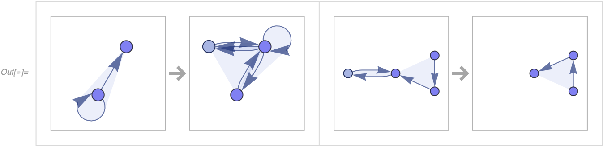

Sometimes an incorrectly scaled layout might be produced due to the issue discussed above in [`VertexCoordinateRules`](#vertexcoordinaterules):

```wl
In[] := RulePlot[WolframModel[{{1, 2}, {1, 3}, {1, 4}} ->
   {{2, 2}, {2, 2}, {2, 5}, {3, 2}}]]
```

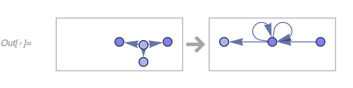

`VertexCoordinateRules` can be used in that case to specify the layout manually:

```wl
In[] := RulePlot[WolframModel[{{1, 2}, {1, 3}, {1, 4}} ->
   {{2, 2}, {2, 2}, {2, 5}, {3, 2}}],
 VertexCoordinateRules -> {1 -> {0, 0}, 2 -> {1, 0}, 3 -> {0, 1},
   4 -> {-1, 0}, 5 -> {2, 1}}]
```


Some of the [`WolframModelPlot`](#wolframmodelplot) options are supported, specifically [`GraphHighlightStyle`](#graphhighlight-and-graphhighlightstyle), [`"HyperedgeRendering"`](#hyperedgerendering), [`VertexCoordinateRules`](#vertexcoordinaterules), [`VertexLabels`](#vertexlabels), [`VertexSize`, `"ArrowheadLength"`](#vertexsize-and-arrowheadlength), and [style options](#style-options). `"EdgeType"` is supported as an option instead of [the second argument](#edge-type) like in [`WolframModelPlot`](#wolframmodelplot).

There are also two additional `RulePlot`-specific style options. **`Spacings`** controls the amount of empty space between the rule parts and the frame (or the space where the frame would be if it's not shown):

```wl
In[] := RulePlot[WolframModel[{{{1, 2}} -> {{1, 3}, {1, 3}, {3, 2}},
   {{1, 2}, {1, 2}} -> {{1, 3}, {3, 2}}}], Spacings -> 0.03]
```

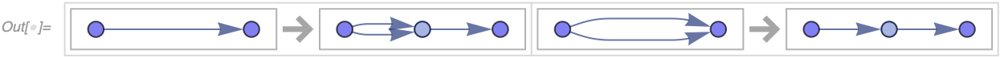

**`"RulePartsAspectRatio"`** is used to control the aspect ratio of rule sides. As an example, it can be used to force rule parts to be square:

```wl
In[] := RulePlot[WolframModel[{{1, 2}} -> {{1, 3}, {1, 3}, {3, 2}}],
 "RulePartsAspectRatio" -> 1]
```

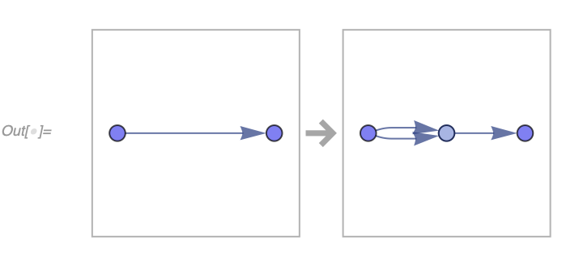

## Utility Functions

[WolframModelRuleValue](#wolframmodelrulevalue) | [GeneralizedGridGraph](#generalizedgridgraph) | [HypergraphAutomorphismGroup](#hypergraphautomorphismgroup) | [HypergraphUnifications](#hypergraphunifications) | [WolframPhysicsProjectStyleData](#wolframphysicsprojectstyledata) | [Build Data](#build-data)

### WolframModelRuleValue

[Transformation Count](#transformation-count) | [Arity](#arity) | [Node Counts](#node-counts) | [Connectedness](#connectedness)

**`WolframModelRuleValue`** computes simple properties of rules, which can be determined without running the evolution. Only anonymous (not pattern) rules are supported at the moment. The full list of supported properties can be obtained with **`$WolframModelRuleProperties`**:

```wl
In[] := $WolframModelRuleProperties
Out[] = {"ConnectedInput", "ConnectedInputOutputUnion", "ConnectedOutput",
  "MaximumArity", "NodeCounts", "NodesDroppedAdded", "Signature",
  "TraditionalSignature", "TransformationCount"}
```

#### Transformation Count

**`TransformationCount`** is a very simple property that returns the number of rules in the system:

```wl
In[] := WolframModelRuleValue[{{{1, 1, 2}} -> {{2, 2, 1}, {2, 3, 2}, {1, 2,
     3}},
  {{1, 2, 1}, {3, 4, 2}} -> {{4, 3, 2}}}, "TransformationCount"]
Out[] = 2
```

#### Arity

Arity is the length of an edge. The maximum length of any edge in the rules can be determined with **`MaximumArity`**:

```wl
In[] := WolframModelRuleValue[{{1, 2, 3}, {4, 5, 6}, {2, 5}, {5, 2}} ->
  {{7, 1, 8}, {9, 3, 10}, {11, 4, 12}, {13, 6, 14}, {7, 13}, {13,
    7}, {8, 10}, {10, 8}, {9, 11}, {11, 9}, {12, 14}, {14,
    12}}, "MaximumArity"]
Out[] = 3
```

For the summary of arities for all edges, one can use **`RuleSignature`**:

```wl
In[] := WolframModelRuleValue[{{1, 2, 3}, {4, 5, 6}, {2, 5}, {5, 2}} ->
  {{7, 1, 8}, {9, 3, 10}, {11, 4, 12}, {13, 6, 14}, {7, 13}, {13,
    7}, {8, 10}, {10, 8}, {9, 11}, {11, 9}, {12, 14}, {14,
    12}}, "TraditionalSignature"]
```


In this example, there are 2 binary and 2 ternary edges in the input, and 8 binary and 4 ternary edges in the output. The more machine-readable form of this can be obtained with **`Signature`** property:

```wl
In[] := WolframModelRuleValue[{{1, 2, 3}, {4, 5, 6}, {2, 5}, {5, 2}} ->
  {{7, 1, 8}, {9, 3, 10}, {11, 4, 12}, {13, 6, 14}, {7, 13}, {13,
    7}, {8, 10}, {10, 8}, {9, 11}, {11, 9}, {12, 14}, {14,
    12}}, "Signature"]
Out[] = {{2, 2}, {2, 3}} -> {{8, 2}, {4, 3}}
```

#### Node Counts

One can count the vertices involved in the left- and right-hand sides of the rule with **`"NodeCounts"`**. For example, this rule has 5 vertices in the input, and 6 in the output:

```wl
In[] := WolframModelRuleValue[{{1, 2, 3}, {2, 4, 5}} -> {{5, 6, 1}, {6, 4,
    2}, {4, 5, 3}}, "NodeCounts"]
Out[] = 5 -> 6
```

**`NodesDroppedAdded`** gives the counts of vertices that appear only on the left- and right-hand sides of the rule. Here for example, the first rule creates a vertex, and the second rule drops a vertex:

```wl
In[] := WolframModelRuleValue[{{{1, 1, 2}} -> {{2, 2, 1}, {2, 3, 2}, {1, 2,
     3}},
  {{1, 2, 1}, {3, 4, 2}} -> {{4, 3, 2}}}, "NodesDroppedAdded"]
Out[] = {{0, 1}, {1, 0}}
```

Keep in mind that rule dropping a vertex does not imply this vertex would be deleted from the state, as there may be other edges containing this vertex.

#### Connectedness

There are three types of rule connectedness.

**`ConnectedInput`** checks if the left-hand side of the rule is a connected hypergraph. If it's [`True`](https://reference.wolfram.com/language/ref/True.html), the rule is local, and [`"LowLevel"` implementation](#method) can be used for it:

```wl
In[] := WolframModelRuleValue[{{1, 2, 3}, {3, 4, 5}} -> {{2, 3, 1}, {4, 3,
    2}, {5, 6, 7}}, "ConnectedInput"]
Out[] = True
```

**`ConnectedOutput`** does the same for the output:

```wl
In[] := WolframModelRuleValue[{{1, 2, 3}, {3, 4, 5}} -> {{2, 3, 1}, {4, 3,
    2}, {5, 6, 7}}, "ConnectedOutput"]
Out[] = False
```

**`ConnectedInputOutputUnion`** yields [`True`](https://reference.wolfram.com/language/ref/True.html) if the input is connected to the output. Note that it does not require either the input or the output to be connected within themselves, but neither of them can have pieces disconnected from the rest of the rule:

```wl
In[] := WolframModelRuleValue[{{1, 2, 3}, {3, 4, 5}} -> {{2, 3, 1}, {4, 3,
    2}, {5, 6, 7}}, "ConnectedInputOutputUnion"]
Out[] = True
```

For multiple-rule systems, each rule needs to be connected for these properties to yield [`True`](https://reference.wolfram.com/language/ref/True.html):

```wl
In[] := WolframModelRuleValue[{{{1, 2}} -> {{1, 3}, {3, 2}},
  {{1, 2}} -> {{1, 2}, {3, 3}}}, "ConnectedOutput"]
Out[] = False
```

### GeneralizedGridGraph

**`GeneralizedGridGraph`** is similar to [`GridGraph`](https://reference.wolfram.com/language/ref/GridGraph.html), but it allows for additional specifiers in each direction of the grid:

```wl
In[] := GeneralizedGridGraph[{5 -> "Directed", 5 -> "Circular"}]
```

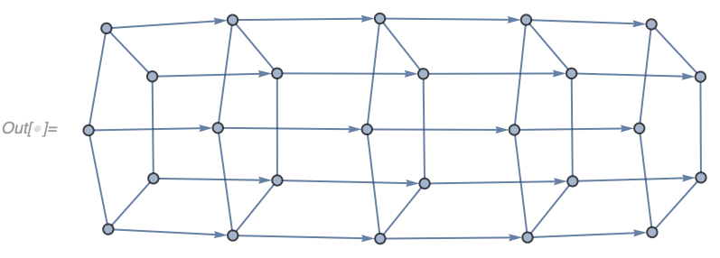

Possible specifiers are `"Directed"` and `"Circular"`, and they can be combined:

```wl
In[] := GeneralizedGridGraph[{3 -> {"Directed", "Circular"}, 6}]
```

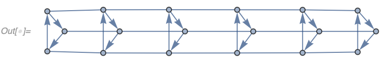

The same options as [`GridGraph`](https://reference.wolfram.com/language/ref/GridGraph.html) are supported. In addition `"VertexNamingFunction" -> "Coordinates"` names vertices according to their position in a grid:

```wl
In[] := GeneralizedGridGraph[{4, 5, 2},
 "VertexNamingFunction" -> "Coordinates", VertexLabels -> Automatic]
```

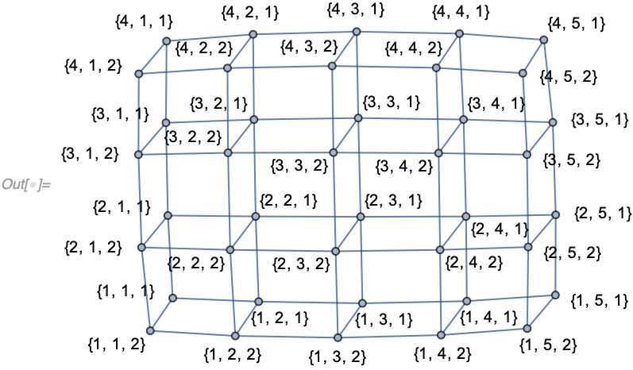

Finally, it's possible to use different `EdgeStyle` in different directions by specifying it as a list:

```wl
In[] := GeneralizedGridGraph[{4 -> "Directed", 5, 2},
 "VertexNamingFunction" -> "Coordinates",
 EdgeStyle -> Darker /@ {Red, Green, Blue}]
```


### HypergraphAutomorphismGroup

**`HypergraphAutomorphismGroup`** does the same thing as [`GraphAutomorphismGroup`](https://reference.wolfram.com/language/ref/GraphAutomorphismGroup.html), but for ordered hypergraphs:

```wl
In[] := HypergraphAutomorphismGroup[{{1, 2, 3}, {1, 2, 4}}]
Out[] = PermutationGroup[{Cycles[{{3, 4}}]}]
```

A more complicated example:

```wl
In[] := GroupOrder[
 HypergraphAutomorphismGroup[
  EchoFunction[
    WolframModelPlot] @ {{1, 2, 3}, {3, 4, 5}, {5, 6, 1}, {1, 7, 3}, {3,
      8, 5}, {5, 9, 1}}]]
```

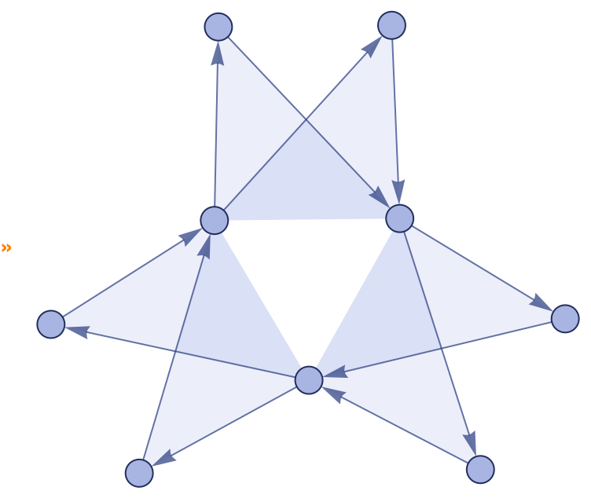

```wl
Out[] = 24
```

### HypergraphUnifications

When considering which matches could potentially exist to a given set of rule inputs, it is often useful to see all possible ways hypergraphs can overlap. **`HypergraphUnifications`** constructs all possible hypergraphs that contain subgraphs matching both of its arguments. The argument-hypergraphs must overlap by at least a single edge. `HypergraphUnifications` identifies vertices to the least extent possible, but it makes some identifications if necessary for matching.

The output format is a list of triples `{unified hypergraph, first argument edge matches, second argument edge matches}`, where the last two elements are associations mapping the edge indices in the input hypergraphs to the edge indices in the unified hypergraph.

As an example, consider a simple case of two adjacent binary edges:

```wl
In[] := HypergraphUnifications[{{1, 2}, {2, 3}}, {{1, 2}, {2, 3}}]
Out[] = {{{{3, 1}, {3, 4}, {2, 3}}, <|1 -> 3, 2 -> 1|>, <|1 -> 3, 2 -> 2|>},
 {{{2, 3}, {3, 1}}, <|1 -> 1, 2 -> 2|>, <|1 -> 1, 2 -> 2|>},
 {{{4, 1}, {2, 3}, {3, 4}}, <|1 -> 3, 2 -> 1|>, <|1 -> 2, 2 -> 3|>},
 {{{1, 2}, {2, 1}}, <|1 -> 1, 2 -> 2|>, <|1 -> 2, 2 -> 1|>},
 {{{1, 2}, {3, 4}, {2, 3}}, <|1 -> 1, 2 -> 3|>, <|1 -> 3, 2 -> 2|>},
 {{{1, 3}, {2, 3}, {3, 4}}, <|1 -> 1, 2 -> 3|>, <|1 -> 2, 2 -> 3|>}}
```

In the first output here `{{{3, 1}, {3, 4}, {2, 3}}, <|1 -> 3, 2 -> 1|>, <|1 -> 3, 2 -> 2|>}`, the graphs are overlapping by a shared edge `{2, 3}`, and two inputs are matched respectively to `{{2, 3}, {3, 1}}` and `{{2, 3}, {3, 4}}`.

All unifications can be visualized with **`HypergraphUnificationsPlot`**:

```wl
In[] := HypergraphUnificationsPlot[{{1, 2}, {2, 3}}, {{1, 2}, {2, 3}}]
```

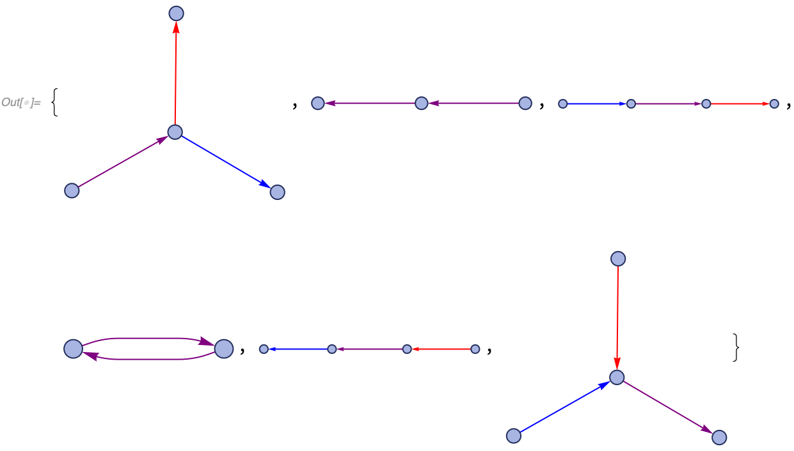

Vertex labels here show the vertex names in the input graphs to which the unification is matched.

A more complicated example with edges of various arities is

```wl
In[] := HypergraphUnificationsPlot[{{1, 2, 3}, {4, 5, 6}, {1, 4}},
 {{1, 2, 3}, {4, 5, 6}, {1, 4}}, VertexLabels -> Automatic]
```

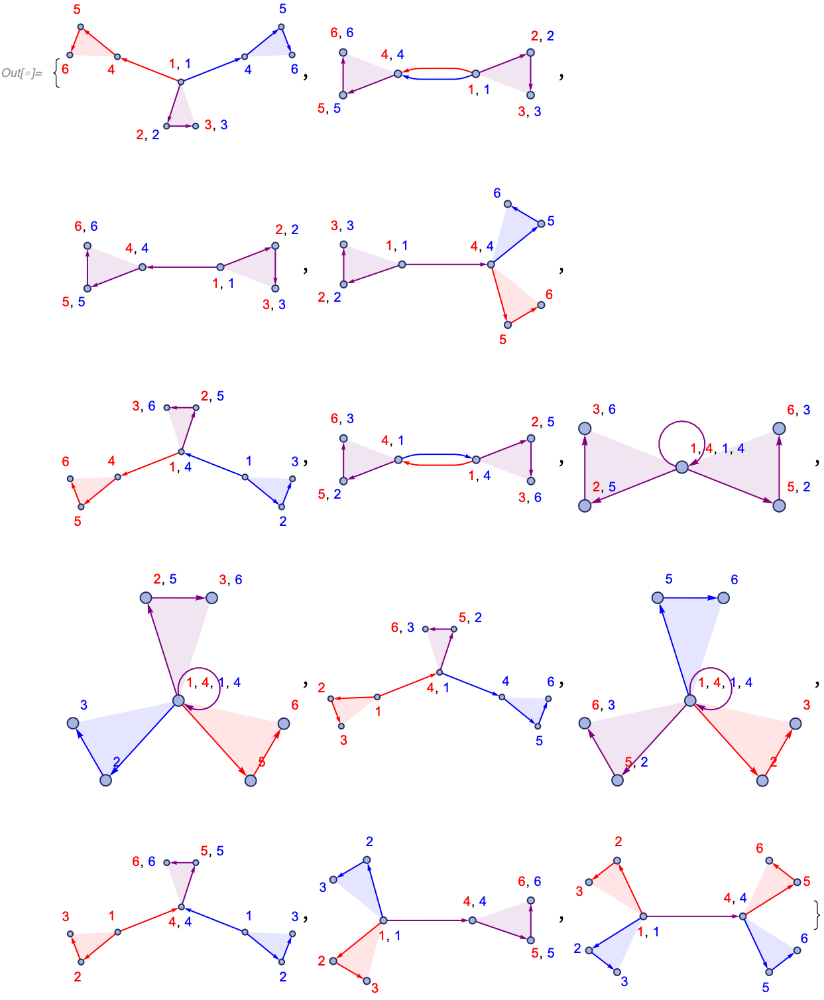

### WolframPhysicsProjectStyleData

**`WolframPhysicsProjectStyleData`** allows one to lookup styles used in various **SetReplace** functions and properties such as [`WolframModelPlot`](#wolframmodelplot) and [`"CausalGraph"`](#causal-graphs).

For example, here is the default style used to draw polygons in [`WolframModelPlot`](#wolframmodelplot):

```wl
In[] := WolframPhysicsProjectStyleData["SpatialGraph", "EdgePolygonStyle"]
```


The full specification is `WolframPhysicsProjectStyleData[theme, plot type, style element]`, however either the last or the last two elements can be omitted to obtain a full [`Association`](https://reference.wolfram.com/language/ref/Association.html) of styles. The `theme` argument can be omitted to get the result for the default plot theme (only `"Light"` theme is supported at the moment). Here are all styles used in [`"CausalGraph"`](#causal-graphs) for example:

```wl
In[] := WolframPhysicsProjectStyleData["CausalGraph"]
```


This function is useful if one needs to produce "fake" example plots using styles consistent with the Wolfram Physics Project.

### Build Data

There are two constants containing information about the build. **`$SetReplaceGitSHA`** is a git SHA of the currently-used version of *SetReplace*:

```wl
In[] := $SetReplaceGitSHA
Out[] = "320b91b5ca1d91b9b7890aa181ad457de3e38939"
```

If the build directory were not clean, it would have "\*" at the end.

**`$SetReplaceBuildTime`** gives a date object of when the paclet was created:

```wl
In[] := $SetReplaceBuildTime
```


These constants are particularly useful for reporting issues with the code.

# Physics

A hypothesis is that spacetime at small scales is a network, and the fundamental law of physics is a system similar to the one this package implements.

A slightly different version of this system was first introduced in *Stephen Wolfram*'s [A New Kind Of Science](https://www.wolframscience.com/nks/chap-9--fundamental-physics/).

You can find many more details about our physics results in *Stephen Wolfram*'s [Technical Introduction](https://www.wolframphysics.org/technical-introduction/), and *Jonathan Gorard*'s papers on [Relativity](https://www.wolframcloud.com/obj/wolframphysics/Documents/some-relativistic-and-gravitational-properties-of-the-wolfram-model.pdf) and [Quantum Mechanics](https://www.wolframcloud.com/obj/wolframphysics/Documents/some-quantum-mechanical-properties-of-the-wolfram-model.pdf). And there is much more on [wolframphysics.org](https://www.wolframphysics.org).

# Acknowledgements

In additional to commit authors and reviewers, *Stephen Wolfram* has contributed to the API design of most functions, and *Jeremy Davis* has contributed to the visual style of [`WolframModelPlot`](#wolframmodelplot), [`RulePlot`](#ruleplot-of-wolframmodel) and [`"CausalGraph"`](#causal-graphs).
