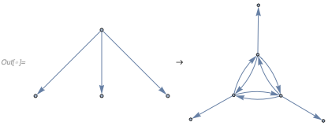
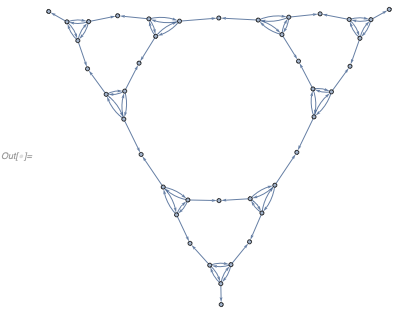
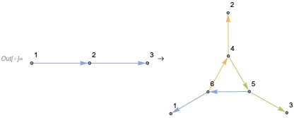
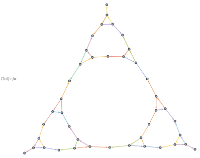
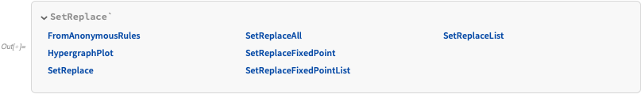
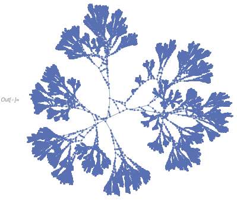

# SetReplace

## Set | Network Substitution Systems

**SetReplace** is a Wolfram Language package that implements a substitution system such that in each step an unordered subset matching a given pattern is deleted from a multiset and replaced with different subset. If each element of the set consists of pairs of elements, this set can be thought of as a directed graph, and the system becomes a ***network substitution*** (aka *graph rewrite*) ***system***.

An example of such a system would be removing vertices from a path graph
```
In[.] := SetReplace[{{0, 1}, {1, 2}, {2, 3}}, {{a_, b_}, {b_, c_}} :> {{a, c}}, 2]
```
```
Out[.] = {{0, 3}}
```

Here, `{{0, 1}, {1, 2}, {2, 3}}` is the initial condition, `{{a_, b_}, {b_, c_}} :> {{a, c}}` is the rule that matches pairs of edges sharing a vertex and replaces them with a single edge, and `2` the number of steps, i.e., the number of times the rule is applied.

One can also imagine an inverse of the rule above
```
In[.] := SetReplace[{{0, 1}}, {{a_, b_}} :>
  Module[{new}, {{a, new}, {new, b}}], 2]
```
```
Out[.] = {{v11, 1}, {0, v12}, {v12, v11}}
```

We use `Module` here to assign unique names to the newly created vertices. As using `Module` is somewhat cumbersome, a simplified syntax is available, where integers are automatically converted into patterns, and `Module` is added if necessary
```
In[.] := SetReplace[{{0, 1}},
 Echo @ FromAnonymousRules[{{0, 1}} -> {{0, 2}, {2, 1}}], 2]
```
```
>> {{v1_, v2_}} :> Module[{v3}\, {{v1, v3}, {v3, v2}}]
Out[.] = {{v13, 1}, {0, v14}, {v14, v13}}
```

A more complex example is taking three edges starting at the same vertex and replacing them with a triangle
```
In[.] := pointToTriangle = {{0, 1}, {0, 2}, {0, 3}} -> {{4, 5}, {5, 4}, {4,
     6}, {6, 4}, {5, 6}, {6, 5}, {4, 1}, {5, 2}, {6, 3}};
In[.] := Graph /@ Apply[DirectedEdge, pointToTriangle, {2}]
```


```
In[.] := Graph[DirectedEdge @@@
  SetReplace[{{0, 1}, {0, 2}, {0, 3}},
   FromAnonymousRules[pointToTriangle], 13]]
```


Edges can contain more than two vertices, in which case this becomes a directed hypergraph rewrite system
```
In[.] := hyperedgeToTriangle = {{1, 2, 3}} -> {{5, 6, 1}, {6, 4, 2}, {4, 5, 3}};
In[.] := HypergraphPlot[#, VertexLabels -> "Name"] & /@ hyperedgeToTriangle
```


```
In[.] := HypergraphPlot[
 SetReplace[{{1, 2, 3}}, FromAnonymousRules[hyperedgeToTriangle], 13]]
```


Here `HypergraphPlot` is used, which displays each directed hyperedge with a sequence of two-vertex edges, and colors each such sequence in a different color.

## Fundamental Physics

A hypothesis is that space-time at the fundamental Planck scale might be represented as a network that can be produced by a system similar to the one this package implements.

This idea was first proposed in Stephen Wolfram's [A New Kind Of Science](https://www.wolframscience.com/nks/chap-9--fundamental-physics/).

The system here is not the same (the matching algorithm does not constrain vertex degrees), but it follows the same principles.

## C++ | Wolfram Language Implementations

There are two implementations available: one written in Wolfram Language, one in C++.

The Wolfram Language implementation permutes `SetReplace` rules in all possible ways, and uses `Replace` a specified number of times to perform evolution. This works well for small graphs and small rule inputs, but it slows down with the number of edges in the graph, and has exponential complexity in rule size.

The C++ implementation on the other keeps an index of all possible rule matches, and updates it after every step. The reindexing algorithm looks only at the local region of the graph close to the rewrite site, thus time complexity does not depend on the graph size as long as vertex degrees are small. The downside is that it has exponential complexity (both in time and memory) in the vertex degrees. Currently, it also does not work for non-local rules (i.e., rule inputs that do not form a connected graph), although one can imagine ways to implement that.

So, in summary C++ implementation `Method -> "C++"` should be used if:
1. Vertex degrees are expected to be small.
2. Evolution needs to be done for a large number of steps `> 100`, it is possible to produce graphs with up to `10^6` edges or more.

It should not be used, however, if vertex degrees can grow large. For example
```
In[.] := SetReplace[{{0}},
  FromAnonymousRules[{{{0}} -> {{0}, {0}, {0}}, {{0}, {0}, {0}} -> {{0}}}], 30];
```
takes 3.25 seconds in C++ implementation, and less than 1 millisecond in the Wolfram Language implementation.

On the other hand, Wolfram Language implementation `Method -> "WolframLanguage"` should be used if:
1. Large number and variety of rules needs to be simulated for a small number of steps.
2. Vertex degrees are expected to be large, or rules are non-local.

There are unit tests, but if you spend time studying a particular rule in detail, it is a good idea to evaluate it with both C++ and Wolfram Language implementations and check the results are the same. If results are different, create an issue, and assign `bug` and `P0` tags to it.

## Other Functions

There are other functions available, such as `SetReplaceAll`, `SetReplaceFixedPoint` and `SetReplaceList`. Only Wolfram Language implementations are available for these at the time. They all have usage strings, so just run
```
In[.] := ?SetReplace`*
```


to see the full list and explore.

## Rules with Complex Behaviors

One example of an interesting system (credit to Stephen Wolfram) is
```
In[.] := GraphPlot[
 UndirectedEdge @@@
  SetReplace[{{0, 0}, {0, 0}, {0, 0}},
   FromAnonymousRules[{{0, 1}, {0, 2}, {0, 3}} -> {{4, 5}, {5, 4}, {4,
        6}, {6, 4}, {5, 6}, {6, 5}, {4, 1}, {5, 2}, {6, 3}, {1,
       6}, {3, 4}}], 10000]]
```


A smaller system that still appears complex is
```
In[.] := GraphPlot[
 neat2 = Graph[
   DirectedEdge @@@
    SetReplace[{{0, 0}, {0, 0}, {0, 0}},
     FromAnonymousRules[{{0, 1}, {0, 2}, {0, 3}} -> {{1, 6}, {6,
         4}, {6, 5}, {5, 6}, {6, 3}, {3, 4}, {5, 2}}], 10000]]]
```


Curiously, it produces planar graphs
```
In[.] := PlanarGraphQ[neat2]
```
```
Out[.] = True
```

## Build Instructions

Prerequisites are Wolfram Language 12.0+ and a C++ compiler. Supported platforms are Linux, macOS and Windows.

To build,
1. `cd` to the root directory of the repository.
2. Run `./build.wls` to create the paclet file.
3. Run `./install.wls` to install the paclet into your Wolfram system.
4. Restart any running Wolfram kernels.
5. Evaluate ``<< SetReplace` `` every time prior to using package functions.
