# Set Substitution Systems

## Basic Example

**SetReplace** is a [Wolfram Language](https://www.wolfram.com/language/) package to manipulate set substitution systems. To understand what a set substitution system does consider an unordered set of elements:
```
{1, 2, 5, 3, 6}
```
We can set up an operation on this set which would take any of the two elements and replace them with their sum:
```
{a_, b_} :> {a + b}
```
In **SetReplace**, this can be expressed as (the new element is put at the end)
```
In[] := SetReplace[{1, 2, 5, 3, 6}, {a_, b_} :> {a + b}]
Out[] = {5, 3, 6, 3}
```
Note that this is similar to [`SubsetReplace`](https://reference.wolfram.com/language/ref/SubsetReplace.html) function of Wolfram Language (which did not exist prior to version 12.1, and which by default replaces all non-overlapping subsets at once)
```
In[] := SubsetReplace[{1, 2, 5, 3, 6}, {a_, b_} :> Sequence[a + b]]
Out[] = {3, 8, 6}
```

## Relations between Set Elements

A more interesting case (and the only case we have studied with any reasonable detail) is the case of set elements that are related to each other. Specifically, we can consider ordered lists of atoms (or vertices) as elements, in which case the set becomes an ordered hypergraph.

As a simple example consider a set
```
{{1, 2, 3}, {2, 4, 5}, {4, 6, 7}}
```
which we can render as a collection of ordered hyperedges:
```
In[] := HypergraphPlot[{{1, 2, 3}, {2, 4, 5}, {4, 6, 7}},
 VertexLabels -> Automatic]
```


We can then have a rule which would pick a subset of expressions related in a particular way (much like a join query) and replace them with something else. Note the [`Module`](https://reference.wolfram.com/language/ref/Module.html) on the right-hand side creates a new variable (vertex) which causes the hypergraph to grow.
```
{{v1_, v2_, v3_}, {v2_, v4_, v5_}} :>
 Module[{v6}, {{v5, v6, v1}, {v6, v4, v2}, {v4, v5, v3}}]
```
After a single replacement we get this (note the new vertex)
```
In[] := HypergraphPlot[
 SetReplace[{{1, 2, 3}, {2, 4, 5}, {4, 6,
    7}}, {{v1_, v2_, v3_}, {v2_, v4_, v5_}} :>
   Module[{v6}, {{v5, v6, v1}, {v6, v4, v2}, {v4, v5, v3}}]],
 VertexLabels -> Automatic]
```


After 10 steps, we get a more complicated structure
```
In[] := HypergraphPlot[
 SetReplace[{{1, 2, 3}, {2, 4, 5}, {4, 6,
    7}}, {{v1_, v2_, v3_}, {v2_, v4_, v5_}} :>
   Module[{v6}, {{v5, v6, v1}, {v6, v4, v2}, {v4, v5, v3}}], 10],
 VertexLabels -> Automatic]
```
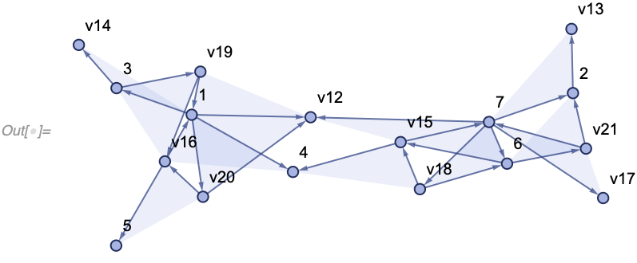

And after 100 steps, it gets even more complicated
```
In[] := HypergraphPlot[
 SetReplace[{{1, 2, 3}, {2, 4, 5}, {4, 6,
    7}}, {{v1_, v2_, v3_}, {v2_, v4_, v5_}} :>
   Module[{v6}, {{v5, v6, v1}, {v6, v4, v2}, {v4, v5, v3}}], 100]]
```
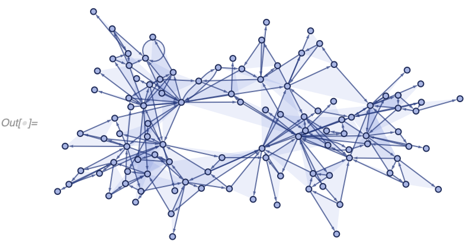

Exploring the models of this more complicated variety is the primary purpose of this package.

# Getting Started

## Dependencies

To start using **SetReplace**, you only need two things.

* [Wolfram Language 12.1+](https://www.wolfram.com/language/) including [WolframScript](https://www.wolfram.com/wolframscript/). A free (although not open-source) version is available as [Wolfram Engine](https://www.wolfram.com/engine/).
* A C++ compiler to build the low-level part of the package. Instructions on how to set up a compiler to use in WolframScript in various platforms are [available](https://reference.wolfram.com/language/CCompilerDriver/tutorial/SpecificCompilers.html#509267359).

## Build Instructions

To build,
1. `cd` to the root directory of the repository.
2. Run `./build.wls` to create the paclet file.
If you see an error message about c++17, make sure the C++ compiler you are using is up-to-date. If your default system compiler does not support c++17, you can choose a different one with environmental variables. The following, for instance, typically works on a Mac:
```
COMPILER=CCompilerDriver\`ClangCompiler\`ClangCompiler COMPILER_INSTALLATION=/usr/bin ./build.wls
```
Here `ClangCompiler` can be replaced with one of ``<< CCompilerDriver`; "Compiler" /. CCompilerDriver`CCompilers[Full]``, and `COMPILER_INSTALLATION` is a directory in which the compiler binary can be found.

3. Run `./install.wls` to install the paclet into your Wolfram system.
4. Evaluate `PacletDataRebuild[]` in all running Wolfram kernels.
5. Evaluate ``<< SetReplace` `` every time prior to using package functions.

A less frequently updated version is available through the Wolfram's public paclet server and can be installed by running `PacletInstall["SetReplace"]`.

# Symbols and Functions

## SetReplace*

**`SetReplace`** (and related **`SetReplaceList`**, **`SetReplaceAll`**, **`SetReplaceFixedPoint`** and **`SetReplaceFixedPointList`**) are the functions the package is named after. They are quite simple, don't have many options, and simply perform replacement operations either one-at-a-time (as in the case of `SetReplace`), to all non-overlapping subsets (`SetReplaceAll`), or until no more matches can be made (`SetReplaceFixedPoint`). A suffix `*List` implies the function returns a list of sets after each replacement instead of just the final result.

These functions are useful for their simplicity, but we don't use them much anymore as a more advanced [`WolframModel`](#wolframmodel-and-wolframmodelevolutionobject) incorporates all of these features plus other utilities helpful for the exploration of our models.

As was mentioned previously, `SetReplace` performs a single iteration if called with two arguments:
```
In[] := SetReplace[{1, 2, 5, 3, 6}, {a_, b_} :> {a + b}]
Out[] = {5, 3, 6, 3}
```

It can be supplied a third argument specifying the number of replacements (the same can be achieved using [`Nest`](https://reference.wolfram.com/language/ref/Nest.html)):
```
In[] := SetReplace[{1, 2, 5, 3, 6}, {a_, b_} :> {a + b}, 2]
Out[] = {6, 3, 8}
```

If the number of replacements is set to [`Infinity`](https://reference.wolfram.com/language/ref/Infinity.html) calling `SetReplace` is equivalent to `SetReplaceFixedPoint`:
```
In[] := SetReplace[{1, 2, 5, 3, 6}, {a_, b_} :> {a + b}, \[Infinity]]
Out[] = {17}
```

It is possible to use multiple rules as well (here the subsets `{1, 5}` and then `{2, 6}` are replaced):
```
In[] := SetReplace[{1, 2, 5, 3,
  6}, {{a_?EvenQ, b_?EvenQ} :> {a + b}, {a_?OddQ,
    b_?OddQ} :> {a + b}}, 2]
Out[] = {3, 6, 8}
```

`SetReplaceList` can be used to see the set after each replacement (here a list is omitted on the right-hand side of the rule, which can be done if the subset only contains a single element):
```
In[] := SetReplaceList[{1, 2, 5, 3, 6}, {a_, b_} :> a + b, \[Infinity]]
Out[] = {{1, 2, 5, 3, 6}, {5, 3, 6, 3}, {6, 3, 8}, {8, 9}, {17}}
```

`SetReplaceAll` replaces all non-overlapping subsets:
```
In[] := SetReplaceAll[{1, 2, 5, 3, 6}, {a_, b_} :> a + b]
Out[] = {6, 3, 8}
```

`SetReplaceFixedPoint` and `SetReplaceFixedPointList` perform replacements for as long as possible as previously mentioned:
```
In[] := SetReplaceFixedPoint[{1, 2, 5, 3, 6}, {a_, b_} :> a + b]
Out[] = {17}
```
```
In[] := SetReplaceFixedPointList[{1, 2, 5, 3, 6}, {a_, b_} :> a + b]
Out[] = {{1, 2, 5, 3, 6}, {5, 3, 6, 3}, {6, 3, 8}, {8, 9}, {17}}

```

All of these functions have [`Method`](#method), [`TimeConstraint`](#timeconstraint) and [`"EventOrderingFunction"`](#eventorderingfunction) options. [`TimeConstraint`](#timeconstraint) is self-evident. The other two work the same way as they do in [`WolframModel`](#wolframmodel-and-wolframmodelevolutionobject), and we describe them further in the [`WolframModel`](#wolframmodel-and-wolframmodelevolutionobject) part of this README.

## ToPatternRules

**`ToPatternRules`** is a convenience function used to quickly enter rules such as the one mentioned previously
```
{{v1_, v2_, v3_}, {v2_, v4_, v5_}} :>
 Module[{v6}, {{v5, v6, v1}, {v6, v4, v2}, {v4, v5, v3}}]
```

This is the type of rule we study the most, and it satisfies the following set of conditions:
* Both input and output subsets consist of (ordered) lists of atoms (aka vertices).
* The input (left-hand side) only contains patterns, it never refers to explicit vertex names.
* The name of the vertex is only used to identify it, it does not contain any additional information. In particular, there are no conditions on the left-hand side of the rule (neither on the entire subset nor on individual vertices), except for the implicit condition of some vertices appearing multiple times in different lists.
* The output may contain new vertices (i.e., the ones that don't appear on the left-hand side), in which case [`Module`](https://reference.wolfram.com/language/ref/Module.html) is inserted to create them.

`ToPatternRules` provides a simpler way to specify such rules by automatically assuming that the level-2 expressions on the left-hand side are patterns, and that vertices used on the right which don't appear on the left are new and should be created with a [`Module`](https://reference.wolfram.com/language/ref/Module.html). For example, the rule above can simply be written as
```
In[] := ToPatternRules[{{v1, v2, v3}, {v2, v4, v5}} -> {{v5, v6, v1}, {v6, v4,
     v2}, {v4, v5, v3}}]
Out[] = {{v1_, v2_, v3_}, {v2_, v4_, v5_}} :>
 Module[{v6}, {{v5, v6, v1}, {v6, v4, v2}, {v4, v5, v3}}]
```
or even simpler as
```
In[] := ToPatternRules[{{1, 2, 3}, {2, 4, 5}} -> {{5, 6, 1}, {6, 4, 2}, {4, 5,
     3}}]
Out[] = {{v1_, v2_, v3_}, {v2_, v4_, v5_}} :>
 Module[{v6}, {{v5, v6, v1}, {v6, v4, v2}, {v4, v5, v3}}]
```

This last form of the rule is the one that we use most often and is also the one that is accepted by [`WolframModel`](#wolframmodel-and-wolframmodelevolutionobject) by default.

`ToPatternRules` is listable in a trivial way:
```
In[] := ToPatternRules[{{{1, 2}} -> {{1, 2}, {2, 3}}, {{1, 2}} -> {{1, 3}, {3,
      2}}}]
Out[] = {{{v1_, v2_}} :> Module[{v3}, {{v1, v2}, {v2, v3}}], {{v1_, v2_}} :>
  Module[{v3}, {{v1, v3}, {v3, v2}}]}
```

## WolframModel and WolframModelEvolutionObject

**`WolframModel`** is the primary function of the package, and provides tools for the generation and analysis of set substitution systems. It can compute many different properties of the evolution and has many different options, which we describe in the corresponding subsections.

The most basic way to call it however is this:
```
In[] := WolframModel[{{1, 2, 3}, {2, 4, 5}} -> {{5, 6, 1}, {6, 4, 2}, {4, 5,
    3}}, {{1, 2, 3}, {2, 4, 5}, {4, 6, 7}}, 10]
```


Note that this call is different from using the [`SetReplace`](#setreplace) function in a variety of ways:
* The order of arguments is switched, the rule goes first.
* The rule is specified in the "anonymous" form (i.e., [`ToPatternRules`](#topatternrules) is done implicitly).
* The number of steps here is the number of generations, which is equivalent to steps of [`SetReplaceAll`](#setreplace). Here each edge can have at most 10 generations of predecessors.
* The output is not a final state, but a **`WolframModelEvolutionObject`** containing the entire evolution (similar to [`SetReplaceList`](#setreplace) but with additional information about which rules are used at each replacement. From the information field on that object, one can see that the evolution was done for 10 generations (i.e., a fixed point has not been reached early), and 109 replacements (aka events) were made in total. More properties can be computed from an evolution object, more on that later.

To see the information an evolution object contains, let's make one with a smaller number of generations:
```
In[] := WolframModel[{{1, 2, 3}, {2, 4, 5}} -> {{5, 6, 1}, {6, 4, 2}, {4, 5,
    3}}, {{1, 2, 3}, {2, 4, 5}, {4, 6, 7}}, 3]
```


One can easily see its internal structure in the [`InputForm`](https://reference.wolfram.com/language/ref/InputForm.html):

```
Out[] = WolframModelEvolutionObject[<|"CreatorEvents" -> {0, 0, 0, 1, 1, 1, 2, 2, 2, 3, 3, 3, 4,
   4, 4, 5, 5, 5}, "DestroyerEvents" -> {1, 1, 2, 3, 2, 3, 4, 4, Infinity, 5, 5,
    Infinity, Infinity, Infinity, Infinity, Infinity, Infinity, Infinity},
  "Generations" -> {0, 0, 0, 1, 1, 1, 2, 2, 2, 2, 2, 2, 3, 3, 3, 3, 3, 3},
  "AtomLists" -> {{1, 2, 3}, {2, 4, 5}, {4, 6, 7}, {5, 8, 1}, {8, 4, 2}, {4, 5, 3},
    {7, 9, 8}, {9, 6, 4}, {6, 7, 2}, {1, 10, 4}, {10, 8, 5}, {8, 1, 3}, {4, 11, 7},
    {11, 6, 9}, {6, 4, 8}, {5, 12, 1}, {12, 8, 10}, {8, 5, 4}},
  "Rules" -> {{1, 2, 3}, {2, 4, 5}} -> {{5, 6, 1}, {6, 4, 2}, {4, 5, 3}},
  "MaxCompleteGeneration" -> 3, "TerminationReason" -> "MaxGenerationsLocal",
  "EventRuleIDs" -> {1, 1, 1, 1, 1}|>]
```

The most important part of that association is `"AtomLists"` which includes all set elements (aka expressions or edges) ever created throughout history. Note, this does not correspond to any particular step, rather all steps are combined. They are not just catenated states as well, as if a particular expression was never used as an input for any replacement in a particular step, it would not be duplicated in that list. To see how that works, compare it to [`"StatesList"`](#states) and observe that a catenated [`"StatesList"`](#states) would contain more expressions than `"AtomLists"` does.
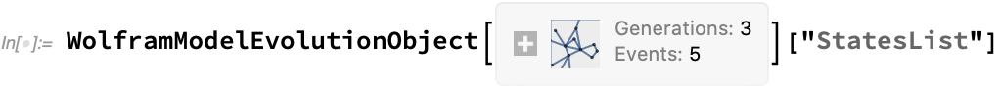
```
Out[] = {{{1, 2, 3}, {2, 4, 5}, {4, 6, 7}}, {{4, 6, 7}, {5, 8, 1}, {8, 4,
   2}, {4, 5, 3}}, {{7, 9, 8}, {9, 6, 4}, {6, 7, 2}, {1, 10, 4}, {10,
   8, 5}, {8, 1, 3}}, {{6, 7, 2}, {8, 1, 3}, {4, 11, 7}, {11, 6,
   9}, {6, 4, 8}, {5, 12, 1}, {12, 8, 10}, {8, 5, 4}}}
```

Each edge in `"AtomLists"` has properties which are stored in other lists of the evolution object:
* `"CreatorEvents"` shows which event (aka replacement) (referenced by its index) has this edge as one of its outputs.
* `"DestroyerEvents"` shows which event has this edge as an input. Note that even though multiple matches could be possible that involve a particular edge, in the current implementation, only one of these matches is used (see [`"EventOrderingFunction"`](#eventorderingfunction) option on how to control which match to use).
* `"Generations"` shows how many layers of predecessors a given edge has.
* `"Rules"` is an exact copy of the `WolframModel` input.
* `"MaxCompleteGenerations"` shows the largest generation in which no matches are possible that only involve expressions of this or earlier generations. In this particular case, it is the same as the largest generation of any edge, but it might be different if a more elaborate [step specification](#step-limiters) is used.
* `"TerminationReason"` shows the reason evaluation was stopped. See the [`"TerminationReason"`](#termination-reason) property for more details.
* Finally, `"EventRuleIDs"` shows which rule was used for each event. It's rather boring in this particular case as only one rule is used in this example.

A specific property can be requested from an evolution object in a similar way as a property for an [`Entity`](https://reference.wolfram.com/language/ref/Entity.html). The list of available properties can be found [below](#properties).

```
Out[] = 109
```

List of all available properties can be obtained with a `"Properties"` property:

```
Out[] = {"EvolutionObject", "FinalState", "FinalStatePlot", "StatesList", \
"StatesPlotsList", "EventsStatesPlotsList", \
"AllEventsStatesEdgeIndicesList", "AllEventsStatesList", \
"Generation", "StateEdgeIndicesAfterEvent", "StateAfterEvent", \
"Rules", "TotalGenerationsCount", "PartialGenerationsCount", \
"GenerationsCount", "GenerationComplete", "AllEventsCount", \
"GenerationEventsCountList", "GenerationEventsList", \
"FinalDistinctElementsCount", "AllEventsDistinctElementsCount", \
"VertexCountList", "EdgeCountList", "FinalEdgeCount", \
"AllEventsEdgesCount", "AllEventsGenerationsList", "CausalGraph", \
"LayeredCausalGraph", "TerminationReason", "AllEventsRuleIndices", \
"AllEventsList", "EventsStatesList", "Properties", \
"EdgeCreatorEventIndices", "EdgeDestroyerEventIndices", \
"EdgeGenerationsList", "AllEventsEdgesList", \
"CompleteGenerationsCount"}
```

Some properties take additional arguments, which can be supplied after the property name:

```
Out[] = {{8, 1, 3}, {5, 12, 1}, {12, 8, 10}, {8, 5, 4}, {2, 13, 11}, {13, 7,
  6}, {7, 2, 9}, {7, 14, 6}, {14, 11, 4}, {11, 7, 8}}
```

A particular generation can be extracted simply by number (including, i.e., -1 for the final state):
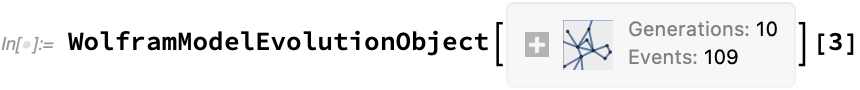
```
Out[] = {{6, 7, 2}, {8, 1, 3}, {4, 11, 7}, {11, 6, 9}, {6, 4, 8}, {5, 12,
  1}, {12, 8, 10}, {8, 5, 4}}
```

If a property does not take any arguments, it can be specified directly in `WolframModel` as a shorthand:
```
In[] := WolframModel[{{1, 2, 3}, {2, 4, 5}} -> {{5, 6, 1}, {6, 4, 2}, {4, 5,
    3}}, {{1, 2, 3}, {2, 4, 5}, {4, 6, 7}}, 10, "EdgeCountList"]
Out[] = {3, 4, 6, 8, 12, 18, 24, 36, 54, 76, 112}
```

All properties available to use directly in `WolframModel` can be looked up in `$WolframModelProperties` (there are more properties here compared to the list above because some properties are available under multiple names, and only the canonical name is listed above).
```
In[] := $WolframModelProperties
Out[] = {"AllEventsCount", "AllEventsDistinctElementsCount", \
"AllEventsEdgesCount", "AllEventsEdgesList", \
"AllEventsGenerationsList", "AllEventsList", "AllEventsRuleIndices", \
"AllEventsStatesEdgeIndicesList", "AllEventsStatesList", \
"AllExpressions", "AtomsCountFinal", "AtomsCountTotal", \
"CausalGraph", "CompleteGenerationsCount", "CreatorEvents", \
"DestroyerEvents", "EdgeCountList", "EdgeCreatorEventIndices", \
"EdgeDestroyerEventIndices", "EdgeGenerationsList", \
"EventGenerations", "EventGenerationsList", "EventsCount", \
"EventsList", "EventsStatesList", "EventsStatesPlotsList", \
"EvolutionObject", "ExpressionGenerations", "ExpressionsCountFinal", \
"ExpressionsCountTotal", "FinalDistinctElementsCount", \
"FinalEdgeCount", "FinalState", "FinalStatePlot", \
"GenerationComplete", "GenerationEventsCountList", \
"GenerationEventsList", "GenerationsCount", "LayeredCausalGraph", \
"MaxCompleteGeneration", "PartialGenerationsCount", "StatesList", \
"StatesPlotsList", "TerminationReason", "TotalGenerationsCount", \
"UpdatedStatesList", "VertexCountList"}
```

Multiple properties can also be specified in a list (only in `WolframModel`, not in `WolframModelEvolutionObject`):
```
In[] = WolframModel[{{1, 2, 3}, {2, 4, 5}} -> {{5, 6, 1}, {6, 4, 2}, {4, 5,
    3}}, {{1, 2, 3}, {2, 4, 5}, {4, 6, 7}}, 10, {"EdgeCountList",
  "VertexCountList"}]
Out[] = {{3, 4, 6, 8, 12, 18, 24, 36, 54, 76, 112}, {7, 8, 10, 12, 16, 22, 28,
   40, 58, 80, 116}}
```

### Rule Specification

#### Multiple Rules

Multiple rules can simply be specified as a list of rules.
```
In[] := WolframModel[{{{1, 1, 2}} -> {{2, 2, 1}, {2, 3, 2}, {1, 2, 3}}, {{1,
     2, 1}, {3, 4, 2}} -> {{4, 3, 2}}}, {{1, 1, 1}}, 4]
```


To see which rules were used for each replacement:

```
Out[] = {1, 1, 1, 1, 1, 1, 2, 1, 1, 1, 2, 1, 2}
```

#### Pattern Rules

Pattern rules (i.e., the kind of rules used in the [`SetReplace`](#setreplace) function) can be specified as well. As an example, previously described call to [`SetReplaceList`](#setreplace) can be reproduced as
```
In[] := WolframModel[<|"PatternRules" -> {a_, b_} :> a + b|>, {1, 2, 5, 3,
  6}, \[Infinity], "AllEventsStatesList"]
Out[] = {{1, 2, 5, 3, 6}, {5, 3, 6, 3}, {6, 3, 8}, {8, 9}, {17}}
```

### Automatic Initial State

An initial state consistint of an appropriate number of (hyper) self-loops can be automatically produced for anonymous (non-pattern) rules (here we evolve the system for 0 steps and ask the evolution object for the 0-th generation aka the initial state).
```
In[] := WolframModel[{{1, 2}, {1, 2}} -> {{3, 2}, {3, 2}, {2, 1}, {1, 3}},
  Automatic, 0][0]
Out[] = {{1, 1}, {1, 1}}
```

That even works for multiple rules in which case the loops are chosen in such a way that any of the rules can match
```
In[] := WolframModel[{{{1, 2}, {1, 2}} -> {{3, 2}, {3, 2}, {2, 1, 3}, {2,
      3}}, {{2, 1, 3}, {2, 3}} -> {{2, 1}, {1, 3}}}, Automatic, 0][0]
Out[] = {{1, 1}, {1, 1}, {1, 1, 1}}
```

Note that because different patterns can be matched to the same symbol, this initial state is guaranteed to match the rules at least once (no guarantees after that).

### Step Limiters

The standard numeric argument to `WolframModel` specifies the number of generations.
```
In[] := WolframModel[{{1, 2, 3}, {4, 5, 6}, {2, 5}, {5, 2}} -> {{7, 1, 8}, {9,
     3, 10}, {11, 4, 12}, {13, 6, 14}, {7, 13}, {13, 7}, {8, 10}, {10,
     8}, {9, 11}, {11, 9}, {12, 14}, {14, 12}}, {{1, 2, 3}, {4, 5,
   6}, {1, 4}, {4, 1}, {2, 5}, {5, 2}, {3, 6}, {6,
   3}}, 6, "FinalStatePlot"]
```
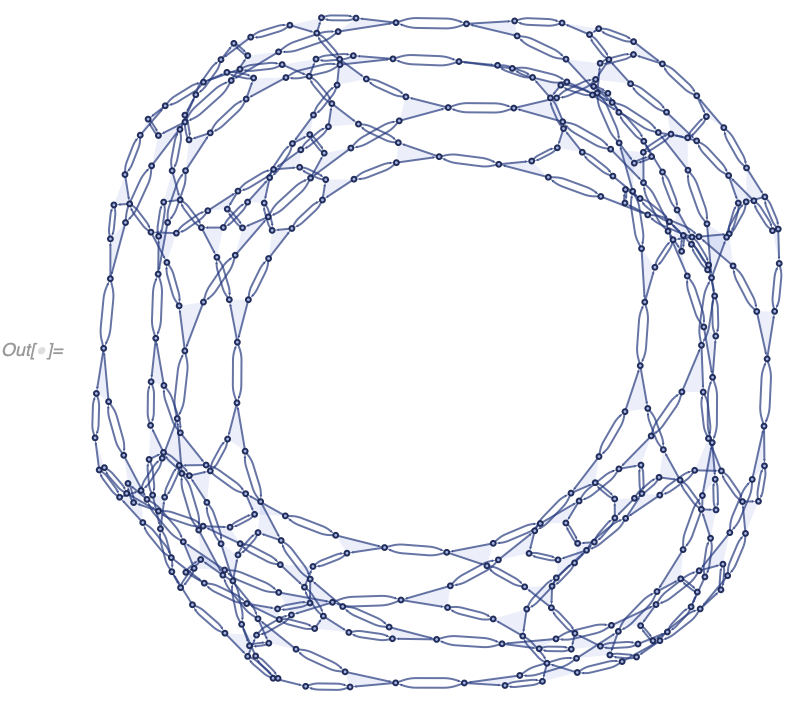

Alternatively, an [`Association`](https://reference.wolfram.com/language/ref/Association.html) can be used to specify multiple limiting conditions
```
In[] := WolframModel[{{1, 2, 3}, {4, 5, 6}, {2, 5}, {5, 2}} -> {{7, 1, 8}, {9,
     3, 10}, {11, 4, 12}, {13, 6, 14}, {7, 13}, {13, 7}, {8, 10}, {10,
     8}, {9, 11}, {11, 9}, {12, 14}, {14, 12}}, {{1, 2, 3}, {4, 5,
   6}, {1, 4}, {4, 1}, {2, 5}, {5, 2}, {3, 6}, {6, 3}}, <|
  "MaxVertices" -> 300, "MaxEvents" -> 200|>, "FinalStatePlot"]
```


Note that the final state here is "less symmetric" because its last generation is incomplete (more on that [later](#hypergraphautomorphismgroup)). Such incomplete generations can be automatically trimmed by setting [`"IncludePartialGenerations" -> False`](#includepartialgenerations).

One can also see the presence of an incomplete generation by looking at the evolution object (note `5...6` which means 5 generations are complete, and 1 is not). Expanding the object's information, one can also see that in this particular case the evolution was terminated because `"MaxVertices"` (not `"MaxEvents"`) condition was reached:
```
In[] := WolframModel[{{1, 2, 3}, {4, 5, 6}, {2, 5}, {5, 2}} -> {{7, 1, 8}, {9,
     3, 10}, {11, 4, 12}, {13, 6, 14}, {7, 13}, {13, 7}, {8, 10}, {10,
     8}, {9, 11}, {11, 9}, {12, 14}, {14, 12}}, {{1, 2, 3}, {4, 5,
   6}, {1, 4}, {4, 1}, {2, 5}, {5, 2}, {3, 6}, {6, 3}}, <|
  "MaxVertices" -> 300, "MaxEvents" -> 200|>]
```
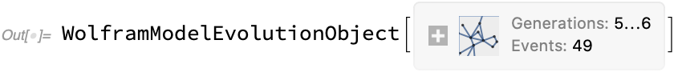

All possible keys in that association are:
* `"MaxEvents"`: limit the number of individual replacements (in the [`SetReplace`](#setreplace) function meaning).
* `"MaxGenerations"`: limit the number of generations (steps in [`SetReplaceAll`](#setreplace) meaning), same as specifying steps directly as a number in `WolframModel`.
* `"MaxVertices"`: limit the number of vertices in the *final* state only (the total count throughout history might be larger). This limit stops evolution if the next event, if applied, would put the state over the limit. Note once such an event is encountered, the evolution stops immediately even if other matches exist that would not put the vertex count over the limit.
* `"MaxVertexDegree"`: limit the number of final state edges in which any particular vertex is involved. Works in a similar way to `"MaxVertices"`.
* `"MaxEdges"`: limit the number of edges (expressions) in the final state. Similar to `"MaxVertices"`.

Any combination of these can be used, in which case the earliest triggered stops the evolution.

Note also that `"MaxGenerations"` works differently from the other limiters, as the matching algorithm would not even attempt to match edges with generations over the limit. Therefore unlike, i.e., `"MaxVertices"`, which would terminate the evolution immediately once the limit-violating event is attempted, `"MaxGenerations"`-limited evolution keeps "filling in" events for as long as possible until no further matches within allowed generations can be made.

### Properties

#### States

These are the properties used to extract states at a particular moment in the evolution. They always return lists, but in the examples below, we plot them for clarity.

**`"FinalState"`** (aka -1) yields the state obtained after all replacements of the evolution have been made:
```
In[] := WolframModelPlot@
 WolframModel[{{1, 2, 3}, {4, 5, 6}, {1, 4}} -> {{2, 7, 8}, {3, 9,
     10}, {5, 11, 12}, {6, 13, 14}, {8, 12}, {11, 10}, {13, 7}, {14,
     9}}, {{1, 1, 1}, {1, 1, 1}, {1, 1}, {1, 1}, {1, 1}}, 6,
  "FinalState"]
```


**`"StateList"`** yields the list of states at each generation:
```
In[] := WolframModelPlot /@
 WolframModel[{{1, 2, 3}, {4, 5, 6}, {1, 4}} -> {{2, 7, 8}, {3, 9,
     10}, {5, 11, 12}, {6, 13, 14}, {8, 12}, {11, 10}, {13, 7}, {14,
     9}}, {{1, 1, 1}, {1, 1, 1}, {1, 1}, {1, 1}, {1, 1}}, 6,
  "StatesList"]
```


This is identical to using the **`"Generation"`** property mapped over all generations:
```
In[] := WolframModelPlot /@ (WolframModel[{{1, 2, 3}, {4, 5, 6}, {1,
         4}} -> {{2, 7, 8}, {3, 9, 10}, {5, 11, 12}, {6, 13, 14}, {8,
         12}, {11, 10}, {13, 7}, {14, 9}}, {{1, 1, 1}, {1, 1, 1}, {1,
        1}, {1, 1}, {1, 1}}, 6]["Generation", #] &) /@ Range[0, 6]
```


In fact `"Generation"` property can be omitted and the index of the generation can be used directly:
```
In[] := WolframModelPlot /@
 WolframModel[{{1, 2, 3}, {4, 5, 6}, {1, 4}} -> {{2, 7, 8}, {3, 9,
      10}, {5, 11, 12}, {6, 13, 14}, {8, 12}, {11, 10}, {13, 7}, {14,
      9}}, {{1, 1, 1}, {1, 1, 1}, {1, 1}, {1, 1}, {1, 1}}, 6] /@
  Range[0, 6]
```


`"StatesList"` shows a compressed version of the evolution. To see how state changes with each applied replacement, use **`"AllEventsStatesList"`**:
```
In[] := WolframModelPlot /@
 WolframModel[{{1, 2, 3}, {4, 5, 6}, {1, 4}} -> {{2, 7, 8}, {3, 9,
     10}, {5, 11, 12}, {6, 13, 14}, {8, 12}, {11, 10}, {13, 7}, {14,
     9}}, {{1, 1, 1}, {1, 1, 1}, {1, 1}, {1, 1}, {1, 1}}, 3,
  "AllEventsStatesList"]
```


Finally, to see a state after a specific event, use **`"StateAfterEvent"`** (aka `"SetAfterEvent"`):
```
In[] := WolframModelPlot@
 WolframModel[{{1, 2, 3}, {4, 5, 6}, {1, 4}} -> {{2, 7, 8}, {3, 9,
      10}, {5, 11, 12}, {6, 13, 14}, {8, 12}, {11, 10}, {13, 7}, {14,
      9}}, {{1, 1, 1}, {1, 1, 1}, {1, 1}, {1, 1}, {1, 1}}, 6][
  "StateAfterEvent", 42]
```


`"StateAfterEvent"` is equivalent to taking a corresponding part in `"AllEventsStatesList"`, but it is much faster to compute than the entire list.

#### Plots of States

Instead of explicitly calling [`WolframModelPlot`](#wolframmodelplot), one can use short-hand properties **`"FinalStatePlot"`** and **`"StatesPlotsList"`**:
```
In[] := WolframModel[{{1, 2, 3}, {4, 5, 6}, {1, 4}} -> {{2, 7, 8}, {3, 9,
    10}, {5, 11, 12}, {6, 13, 14}, {8, 12}, {11, 10}, {13, 7}, {14,
    9}}, {{1, 1, 1}, {1, 1, 1}, {1, 1}, {1, 1}, {1,
   1}}, 6, "FinalStatePlot"]
```


```
In[] := WolframModel[{{1, 2, 3}, {4, 5, 6}, {1, 4}} -> {{2, 7, 8}, {3, 9,
    10}, {5, 11, 12}, {6, 13, 14}, {8, 12}, {11, 10}, {13, 7}, {14,
    9}}, {{1, 1, 1}, {1, 1, 1}, {1, 1}, {1, 1}, {1,
   1}}, 6, "StatesPlotsList"]
```


These properties take the same options as [`WolframModelPlot`](#wolframmodelplot):
```
In[] := WolframModel[{{1, 2, 3}, {4, 5, 6}, {1, 4}} -> {{2, 7, 8}, {3, 9,
     10}, {5, 11, 12}, {6, 13, 14}, {8, 12}, {11, 10}, {13, 7}, {14,
     9}}, {{1, 1, 1}, {1, 1, 1}, {1, 1}, {1, 1}, {1, 1}},
  3]["FinalStatePlot", VertexLabels -> Automatic]
```
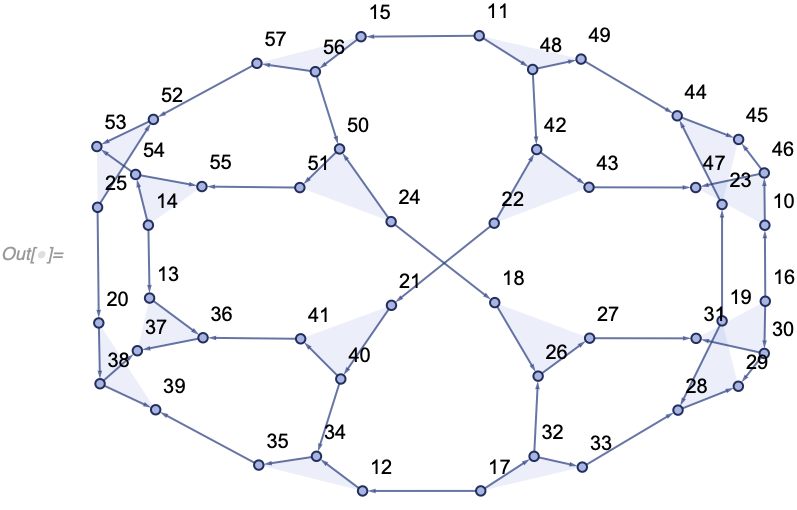

#### Plots of Events

The plotting function corresponding to [`"AllEventsStatesList"`](#states) is more interesting than the other ones. **`"EventsStatesPlotsList"`** plots not only the corresponding states, but also the events that produced each of them:
```
In[] := WolframModel[{{1, 2, 3}, {4, 5, 6}, {1, 4}} -> {{2, 7, 8}, {3, 9,
    10}, {5, 11, 12}, {6, 13, 14}, {8, 12}, {11, 10}, {13, 7}, {14,
    9}}, {{1, 1, 1}, {1, 1, 1}, {1, 1}, {1, 1}, {1,
   1}}, 3, "EventsStatesPlotsList"]
```


Here the dotted gray edges are the ones about to be deleted, whereas the red ones have just been created.

#### All Edges throughout History

**`"AllEventsEdgesList"`** (aka `"AllExpressions"`) returns the list of edges throughout history. This is distinct from a catenated [`"StateList"`](#states), as the edge does not appear twice if it moved from one generation to the next without being involved in an event.

Compare for instance the output of [`"StatesList"`](#states) for a system where only one replacement is made per generation
```
In[] := WolframModel[<|"PatternRules" -> {x_?OddQ, y_} :> x + y|>, {1, 2, 4,
  6}, \[Infinity], "StatesList"]
Out[] = {{1, 2, 4, 6}, {4, 6, 3}, {6, 7}, {13}}
```
with the output of `"AllEventsEdgesList"`:
```
In[] := WolframModel[<|"PatternRules" -> {x_?OddQ, y_} :> x + y|>, {1, 2, 4,
  6}, \[Infinity], "AllEventsEdgesList"]
Out[] = {1, 2, 4, 6, 3, 7, 13}
```
Note how 4 and 6 only appear once in the list.

Edge indices from `"AllEventsEdgesList"` are used in various other properties such as [`"AllEventsList"`](#events) and [`"EventsStatesList"`](#events-and-states).

#### States as Edge Indices

**`"AllEventsStatesEdgeIndicesList"`** is similar to [`"AllEventsStatesList"`](#states), except instead of actual edges the list it returns contains the indices of edges from [`"AllEventsEdgesList"`](#all-edges-throughout-history).
```
In[] := WolframModel[{{1, 2, 3}, {4, 5, 6}, {1, 4}} -> {{2, 7, 8}, {3, 9,
    10}, {5, 11, 12}, {6, 13, 14}, {8, 12}, {11, 10}, {13, 7}, {14,
    9}}, {{1, 1, 1}, {1, 1, 1}, {1, 1}, {1, 1}, {1,
   1}}, 2, "AllEventsStatesEdgeIndicesList"]
Out[] = {{1, 2, 3, 4, 5}, {4, 5, 6, 7, 8, 9, 10, 11, 12, 13}, {5, 8, 9, 10,
  11, 12, 13, 14, 15, 16, 17, 18, 19, 20, 21}, {10, 11, 12, 13, 14,
  15, 16, 17, 18, 19, 20, 21, 22, 23, 24, 25, 26, 27, 28, 29}}
```

One can easily go back to states:
```
In[] := WolframModelPlot /@
 With[{evolution =
    WolframModel[{{1, 2, 3}, {4, 5, 6}, {1, 4}} -> {{2, 7, 8}, {3, 9,
        10}, {5, 11, 12}, {6, 13, 14}, {8, 12}, {11, 10}, {13,
        7}, {14, 9}}, {{1, 1, 1}, {1, 1, 1}, {1, 1}, {1, 1}, {1, 1}},
     3]}, evolution["AllEventsEdgesList"][[#]] & /@
   evolution["AllEventsStatesEdgeIndicesList"]]
```


However, this representation is useful if one needs to distinguish between identical edges.

Similarly, **`"StateEdgeIndicesAfterEvent"`** is a index analog of [`"StateAfterEvent"`](#states):
```
In[] := WolframModel[{{1, 2, 3}, {4, 5, 6}, {1, 4}} -> {{2, 7, 8}, {3, 9,
     10}, {5, 11, 12}, {6, 13, 14}, {8, 12}, {11, 10}, {13, 7}, {14,
     9}}, {{1, 1, 1}, {1, 1, 1}, {1, 1}, {1, 1}, {1, 1}},
  6]["StateEdgeIndicesAfterEvent", 12]
Out[] = {18, 19, 29, 34, 35, 36, 37, 39, 40, 42, 43, 44, 45, 49, 50, 51, 52, \
53, 55, 56, 57, 58, 59, 60, 61, 62, 63, 64, 65, 66, 67, 68, 69, 70, \
71, 72, 73, 74, 75, 76, 77, 78, 79, 80, 81, 82, 83, 84, 85, 86, 87, \
88, 89, 90, 91, 92, 93, 94, 95, 96, 97, 98, 99, 100, 101}
```

#### Events

Both of these properties return all replacement events throughout the evolution. The only difference is how the events are arranged. **`"AllEventsList"`** (aka `"EventsList"`) returns the flat list of all events, whereas **`"GenerationEventsList"`** splits them into sublists for each generation.
```
In[] := WolframModel[{{1, 2}} -> {{3, 4}, {3, 1}, {4, 1}, {2, 4}}, {{1,
   1}}, 2, "AllEventsList"]
Out[] = {{1, {1} -> {2, 3, 4, 5}}, {1, {2} -> {6, 7, 8, 9}}, {1, {3} -> {10,
    11, 12, 13}}, {1, {4} -> {14, 15, 16, 17}}, {1, {5} -> {18, 19,
    20, 21}}}
```

```
In[] := WolframModel[{{1, 2}} -> {{3, 4}, {3, 1}, {4, 1}, {2, 4}}, {{1,
   1}}, 2, "GenerationEventsList"]
Out[] = {{{1, {1} -> {2, 3, 4, 5}}}, {{1, {2} -> {6, 7, 8,
     9}}, {1, {3} -> {10, 11, 12, 13}}, {1, {4} -> {14, 15, 16,
     17}}, {1, {5} -> {18, 19, 20, 21}}}}
```

The format for the events is
```
{ruleIndex, {indexEdgeIndices} -> {outputEdgeIndices}}
```
where the edge indices refer to expressions from [`"AllEventsEdgesList"`](#all-edges-throughout-history).

#### Events and States

**`"EventsStatesList"`** just produces a list of `{event, state}` pairs, where state is the complete state right after this event is applied. Events are the same as generated by [`"AllEventsList"`](#events), and the states are represented as edge indices as in [`"AllEventsStatesEdgeIndicesList"`](#states-as-edge-indices).
```
In[] := WolframModel[{{1, 2}} -> {{3, 4}, {3, 1}, {4, 1}, {2, 4}}, {{1,
   1}}, 2, "EventsStatesList"]
Out[] = {{{1, {1} -> {2, 3, 4, 5}}, {2, 3, 4,
   5}}, {{1, {2} -> {6, 7, 8, 9}}, {3, 4, 5, 6, 7, 8,
   9}}, {{1, {3} -> {10, 11, 12, 13}}, {4, 5, 6, 7, 8, 9, 10, 11, 12,
   13}}, {{1, {4} -> {14, 15, 16, 17}}, {5, 6, 7, 8, 9, 10, 11, 12,
   13, 14, 15, 16, 17}}, {{1, {5} -> {18, 19, 20, 21}}, {6, 7, 8, 9,
   10, 11, 12, 13, 14, 15, 16, 17, 18, 19, 20, 21}}}
```

#### Creator and Destroyer Events

And event *destroys* the edges in its input, and *creates* the edges in its output. Creator and destroyer events for each edge can be obtained with **`"EdgeCreatorEventIndices"`** (aka `"CreatorEvents"`) and **`"EdgeDestroyerEventIndices"`** (aka `"DestroyerEvents"`) properties.

As an example, for a simple rule that splits each edge in two, one can see that edges are created in pairs:
```
In[] := WolframModel[{{1, 2}} -> {{1, 3}, {3, 2}}, {{1,
   1}}, 4, "EdgeCreatorEventIndices"]
Out[] = {0, 1, 1, 2, 2, 3, 3, 4, 4, 5, 5, 6, 6, 7, 7, 8, 8, 9, 9, 10, 10, 11, \
11, 12, 12, 13, 13, 14, 14, 15, 15}
```
and destroyed one-by-one:
```
In[] := WolframModel[{{1, 2}} -> {{1, 3}, {3, 2}}, {{1,
   1}}, 4, "EdgeDestroyerEventIndices"]
Out[] = {1, 2, 3, 4, 5, 6, 7, 8, 9, 10, 11, 12, 13, 14, 15, \[Infinity], \
\[Infinity], \[Infinity], \[Infinity], \[Infinity], \[Infinity], \
\[Infinity], \[Infinity], \[Infinity], \[Infinity], \[Infinity], \
\[Infinity], \[Infinity], \[Infinity], \[Infinity], \[Infinity]}
```

Here 0 refers to the initial state, and `\[Infinity]` means an expression was never destroyed by any event (and thus appears in the final state). Thus a simple way to obtain a [`"FinalState"`](#states) is to pick all expressions which destroyer event is `\[Infinity]`:
```
In[] := With[{evolution =
   WolframModel[{{1, 2}} -> {{1, 3}, {3, 2}}, {{1, 1}}, 4]},
 evolution["AllEventsEdgesList"][[
  First /@ Position[
    evolution["EdgeDestroyerEventIndices"], \[Infinity]]]]]
Out[] = {{1, 9}, {9, 5}, {5, 10}, {10, 3}, {3, 11}, {11, 6}, {6, 12}, {12,
  2}, {2, 13}, {13, 7}, {7, 14}, {14, 4}, {4, 15}, {15, 8}, {8,
  16}, {16, 1}}
```
```
In[] := WolframModel[{{1, 2}} -> {{1, 3}, {3, 2}}, {{1, 1}}, 4][-1]
Out[] = {{1, 9}, {9, 5}, {5, 10}, {10, 3}, {3, 11}, {11, 6}, {6, 12}, {12,
  2}, {2, 13}, {13, 7}, {7, 14}, {14, 4}, {4, 15}, {15, 8}, {8,
  16}, {16, 1}}
```

#### Causal Graphs

An event A causes an event B if there exists an edge that was created by A and destroyed by B. If we then consider all relationships between events, we can create a causal graph. In a **`"CausalGraph"`**, vertices correspond to events, and causal graph edges correspond to the set edges (aka expressions).

For example, if we consider our simple arithmetic model `{a_, b_} :> a + b` starting from `{3, 8, 8, 8, 2, 10, 0, 9, 7}` we get a causal graph which quite clearly describes what's going on (we label each event here with explicit values for a and b):
```
In[] := With[{evolution =
   WolframModel[<|"PatternRules" -> {a_, b_} :> a + b|>, {3, 8, 8, 8,
     2, 10, 0, 9, 7}, \[Infinity]]},
 With[{causalGraph = evolution["CausalGraph"]},
  Graph[causalGraph,
   VertexLabels ->
    Thread[VertexList[causalGraph] ->
      Map[evolution["AllEventsEdgesList"][[#]] &,
       Last /@ evolution["AllEventsList"], {2}]]]]]
```


Here is an example for a hypergraph model (which is considerably harder to understand):
```
In[] := WolframModel[{{{1, 2, 3}, {4, 5, 6}, {1, 4}} -> {{3, 7, 8}, {9, 2,
     10}, {11, 12, 5}, {13, 14, 6}, {7, 12}, {11, 9}, {13, 10}, {14,
     8}}}, {{1, 1, 1}, {1, 1, 1}, {1, 1}, {1, 1}, {1,
   1}}, 20, "CausalGraph"]
```


**`"LayeredCausalGraph"`** generates the same graph but layers events generation-by-generation. For example, for our arithmetic causal graph, note how it's arranged differently from an example above:
```
In[] := With[{evolution =
   WolframModel[<|"PatternRules" -> {a_, b_} :> a + b|>, {3, 8, 8, 8,
     2, 10, 0, 9, 7}, \[Infinity]]},
 With[{causalGraph = evolution["LayeredCausalGraph"]},
  Graph[causalGraph,
   VertexLabels ->
    Thread[VertexList[causalGraph] ->
      Map[evolution["AllEventsEdgesList"][[#]] &,
       Last /@ evolution["AllEventsList"], {2}]]]]]
```


Furthermore, if we include the initial condition as a "fake" event (see [`"IncludeBoundaryEvents"`](#includeboundaryevents) option for more information), note how slices through the causal graph correspond to states from the [`"StatesList"`](#states):
```
In[] := With[{evolution =
   WolframModel[<|"PatternRules" -> {a_, b_} :> a + b|>, {3, 8, 8, 8,
     2, 10, 0, 9, 7}, \[Infinity]]},
 With[{causalGraph =
    evolution["LayeredCausalGraph",
     "IncludeBoundaryEvents" -> "Initial"]},
  Graph[causalGraph,
   VertexLabels ->
    Thread[VertexList[causalGraph] ->
      Map[evolution["AllEventsEdgesList",
          "IncludeBoundaryEvents" -> "Initial"][[#]] &,
       Last /@ evolution["AllEventsList",
         "IncludeBoundaryEvents" -> "Initial"], {2}]],
   Epilog -> {Red, Dotted,
     Table[Line[{{-10, k}, {10, k}}], {k, 0.5, 4.5}]}]]]
```


```
In[] := WolframModel[<|"PatternRules" -> {a_, b_} :> a + b|>, {3, 8, 8, 8, 2,
  10, 0, 9, 7}, \[Infinity], "StatesList"]
Out[] = {{3, 8, 8, 8, 2, 10, 0, 9, 7}, {7, 11, 16, 12, 9}, {9, 18, 28}, {28,
  27}, {55}}
```

`"CausalGraph"` property accepts the same options as [`Graph`](https://reference.wolfram.com/language/ref/Graph.html) as was demonstrated above with [`VertexLabels`](https://reference.wolfram.com/language/ref/VertexLabels.html).

#### Rule Indices for Events

**`"AllEventsRuleIndices"`** returns which rule was used for each event (the same can be obtained by mapping [`First`](https://reference.wolfram.com/language/ref/First.html) over [`"AllEventsList"`](#events)):
```
In[] := WolframModel[{{{1, 1, 2}} -> {{2, 2, 1}, {2, 3, 2}, {1, 2, 3}}, {{1,
     2, 1}, {3, 4, 2}} -> {{4, 3, 2}}}, {{1, 1,
   1}}, 4, "AllEventsRuleIndices"]
Out[] = {1, 1, 1, 1, 1, 1, 2, 1, 1, 1, 2, 1, 2}
```

A neat example of using `"AllEventsRuleIndices"` is coloring events in a causal graph differently depending on the corresponding rule. With this visualization, one can see, for instance, that the outputs of the second rule in the example above are never used in any further inputs:
```
In[] := With[{evolution =
   WolframModel[{{{1, 1, 2}} -> {{2, 2, 1}, {2, 3, 2}, {1, 2,
        3}}, {{1, 2, 1}, {3, 4, 2}} -> {{4, 3, 2}}}, {{1, 1, 1}}, 6]},
  With[{causalGraph = evolution["LayeredCausalGraph"]},
  Graph[causalGraph,
   VertexStyle ->
    Thread[VertexList[causalGraph] ->
      Replace[evolution["AllEventsRuleIndices"], {1 -> Black,
        2 -> White}, {1}]], VertexSize -> Medium]]]
```


#### Edge and Event Generations

**`"EdgeGenerationsList"`** (aka `"ExpressionGenerations"`) yields the list generation numbers (numbers of predecessor layers) for each edge in [`"AllEventsEdgesList"`](#all-edges-throughout-history). **`"AllEventsGenerationsList"`** (aka `"EventGenerations"`) gives the same for events. The generation of an event is the same as the generation of edges it produces as output.

Here edges of different generations are colored differently:
```
In[] := WolframModel[{{1, 2}, {1, 3}, {1, 4}} -> {{2, 2}, {3, 2}, {3, 4}, {3,
    5}}, {{1, 1}, {1, 1}, {1, 1}}, 5, "EdgeGenerationsList"]
Out[] = {0, 0, 0, 1, 1, 1, 1, 2, 2, 2, 2, 3, 3, 3, 3, 4, 4, 4, 4, 5, 5, 5, 5, \
5, 5, 5, 5}
```
```
In[] := With[{evolution =
   WolframModel[{{1, 2}, {1, 3}, {1, 4}} -> {{2, 2}, {3, 2}, {3,
       4}, {3, 5}}, {{1, 1}, {1, 1}, {1, 1}}, 5]},
 MapThread[
  WolframModelPlot[#, EdgeStyle -> #2] &, {evolution["StatesList"],
   Replace[evolution[
        "EdgeGenerationsList"][[#]] & /@ (evolution[
         "StateEdgeIndicesAfterEvent", #] &) /@
      Prepend[0]@Accumulate@evolution["GenerationEventsCountList"],
    g_ :> ColorData["Rainbow"][g/5], {2}]}]]
```


Event generations correspond to layers in [`"LayeredCausalGraph"`](#causal-graphs):
```
In[] := WolframModel[{{1, 2}, {1, 3}, {1, 4}} -> {{2, 2}, {3, 2}, {3, 4}, {3,
    5}}, {{1, 1}, {1, 1}, {1, 1}}, 5, "AllEventsGenerationsList"]
Out[] = {1, 2, 3, 4, 5, 5}
```
```
In[] := WolframModel[{{1, 2}, {1, 3}, {1, 4}} -> {{2, 2}, {3, 2}, {3, 4}, {3,
    5}}, {{1, 1}, {1, 1}, {1, 1}}, 5, "LayeredCausalGraph"]
```


#### Termination Reason

**`"TerminationReason"`** shows why the evaluation of the model was stopped. It's particularly useful if multiple [stopping conditions](#step-limiters) are specified.

All possible values are:
* `"MaxEvents"`, `"MaxGenerations"`, `"MaxVertices"`, `"MaxVertexDegree"` and `"MaxEdges"` correspond directly to step limiters.
* `"FixedPoint"` means there were no more matches possible to rule inputs.
* `"TimeConstraint"` could occur if a [`"TimeConstraint"`](#timeconstraint) option was used.
* `"Aborted"` would occur if the evaluation was manually interrupted (i.e., with ⌘. on a Mac). In that case, a partially computed evolution object is returned.

As an example, in our arithmetic model from before a `"FixedPoint"` is reached (which is why we can use [`Infinity`](https://reference.wolfram.com/language/ref/Infinity.html) as the number of steps):
```
In[] := WolframModel[<|"PatternRules" -> {a_, b_} :> a + b|>, {3, 8, 8, 8, 2,
   10, 0, 9, 7}, \[Infinity]]["TerminationReason"]
Out[] = "FixedPoint"
```

And if we manually abort the evolution, we could get something like this:
```
In[] := WolframModel[{{1, 2, 3}, {4, 5, 6}, {1, 4}} -> {{2, 7, 8}, {5, 9,
    10}, {6, 11, 12}, {13, 3, 14}, {8, 13}, {9, 7}, {10, 12}, {14,
    11}}, {{1, 1, 1}, {1, 1, 1}, {1, 1}, {1, 1}, {1, 1}}, 100]
⌘.
```
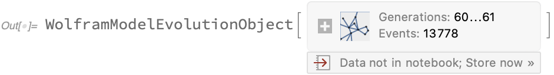

#### Generation Counts

**`"TotalGenerationsCount"`** returns the largest generation of any edge during the evolution:
```
In[] := WolframModel[{{1, 2}} -> {{1, 3}, {1, 3}, {3, 2}}, {{1, 1}}, <|
  "MaxEvents" -> 42|>, "TotalGenerationsCount"]
Out[] = 5
```

**`"PartialGenerationsCount"`** return the number of generations that are "completely done". That is, no more matches can be made involving this or earlier generations. If the default [evaluation order](#eventorderingfunction) is used, this can only be 0 (if we are in the middle of a step) or 1 (if we just finished the step). However, it gets much more interesting if a different event order is used. For a random evolution, for instance, one can get:
```
In[] := WolframModel[{{1, 2}} -> {{1, 3}, {1, 3}, {3, 2}}, {{1, 1}}, <|
  "MaxEvents" -> 42|>, "EventOrderingFunction" -> "Random"]
```


Note, in this case, only 2 generations are complete, and 7 are partial. That happens because the states grow with each generation, so it becomes more likely for a random choice to pick an edge from a later generation. Thus earlier ones are left unevolved.

**`"CompleteGenerationsCount"`** is simply a difference of `"TotalGenerationsCount"` and `"PartialGenerationsCount"`, and **`"GenerationsCount"`** is equivalent to `{"CompleteGenerationsCount", "PartialGenerationsCount"}`.

**`"GenerationComplete"`** takes a generation number as an argument, and gives [`True`](https://reference.wolfram.com/language/ref/True.html) or [`False`](https://reference.wolfram.com/language/ref/False.html) depending on whether that particular generation is complete.
```
In[] := WolframModel[{{1, 2}} -> {{1, 3}, {1, 3}, {3, 2}}, {{1, 1}}, <|
   "MaxEvents" -> 42|>]["GenerationComplete", 5]
Out[] = False
```

#### Event Counts

**`"AllEventsCount"`** (aka `"EventsCount"`) just returns the overall number of events throughout the evolution (the [`Length`](https://reference.wolfram.com/language/ref/Length.html) of [`"AllEventsList"`](#events)).

**`"GenerationEventsCountList"`** gives the number of events per each generation ([`Length`](https://reference.wolfram.com/language/ref/Length.html) mapped over [`"GenerationEventsList"`](#events)):
```
In[] := WolframModel[{{1, 2}} -> {{1, 3}, {1, 3}, {3, 2}}, {{1,
   1}}, 5, "GenerationEventsCountList"]
Out[] = {1, 3, 9, 27, 81}
```

#### Element Count Lists

**`"VertexCountList"`** and **`"EdgeCountList"`** return counts of vertices and edges respectively in each state of [`"StatesList"`](#states). They are useful to see how quickly a particular system grows.

```
In[] := WolframModel[{{1, 2, 3}, {2, 4, 5}} -> {{6, 6, 3}, {2, 6, 2}, {6, 4,
    2}, {5, 3, 6}}, {{1, 1, 1}, {1, 1, 1}}, 10, "VertexCountList"]
Out[] = {1, 2, 4, 8, 14, 27, 49, 92, 171, 324, 622}
```

```
In[] := WolframModel[{{1, 2, 3}, {2, 4, 5}} -> {{6, 6, 3}, {2, 6, 2}, {6, 4,
    2}, {5, 3, 6}}, {{1, 1, 1}, {1, 1, 1}}, 10, "EdgeCountList"]
Out[] = {2, 4, 8, 16, 28, 54, 98, 184, 342, 648, 1244}
```

#### Final Element Counts

These properties are similar to corresponding [`*List`](#element-count-lists) ones, except we don't have `"FinalVertexCount"` and instead have **`"FinalDistinctElementsCount"`** and **`"FinalEdgeCount"`** (we should have `"FinalVertexCount"` and `"FinalDistinctElementsCountList"`, but they are not currently implemented).

The difference is that [`"VertexCountList"`](#element-count-lists) counts expressions of level 2 in the states whereas `"FinalDistinctElementsCount"` counts all expressions matching `_ ? AtomQ`. The difference becomes apparent for edges that contain non-trivially nested lists.

For example, consider a rule that performs a non-trivial nesting:
```
In[] := WolframModel[<|
  "PatternRules" -> {{a_}} :> {{a + 1}, {a - 1}, {{a + 2,
       a - 2}}}|>, {{1}}, 7, "VertexCountList"]
Out[] = {1, 3, 6, 10, 15, 21, 28, 36}
```

```
In[] := WolframModel[<|
    "PatternRules" -> {{a_}} :> {{a + 1}, {a - 1}, {{a + 2,
         a - 2}}}|>, {{1}}, #, "FinalDistinctElementsCount"] & /@
 Range[0, 7]
Out[] = {1, 4, 9, 13, 17, 21, 25, 29}
```

To understand why this is happening, consider the state after one step:
```
In[] := WolframModel[<|
  "PatternRules" -> {{a_}} :> {{a + 1}, {a - 1}, {{a + 2,
       a - 2}}}|>, {{1}}, 1, "FinalState"]
Out[] = {{2}, {0}, {{3, -1}}}
```

This state has 3 vertices (distinct level-2 expressions): `2`, `0`, and `{3, -1}`, but 4 atoms: `2`, `0`, `3`, and `-1`. This distinction does not usually come up in our models since vertices are atoms are usually the same thing, but it is significant in exotic cases like this.

#### Total Element Counts

**`"AllEventsDistinctElementsCount"`** (aka `"AtomsCountTotal"`) and **`"AllEventsEdgesCount"`** (aka `"ExpressionsCountTotal"`) are similar to [`"FinalDistinctElementsCount"`](#final-element-counts) and [`"FinalEdgeCount"`](#final-element-counts), except they count atoms and edges throughout the entire evolution instead of just in the final step.

For instance,
```
In[] := WolframModel[{{1, 2, 3}, {2, 4, 5}} -> {{6, 6, 3}, {2, 6, 2}, {6, 4,
    2}, {5, 3, 6}}, {{1, 1, 1}, {1, 1,
   1}}, 10, {"AllEventsDistinctElementsCount", "AllEventsEdgesCount"}]
Out[] = {622, 2486}
```

#### Rules

**`"Rules"`** just stores the rules in the same way they were entered as an input to `WolframModel`.
```
In[] := WolframModel[<|
   "PatternRules" -> {{a_}} :> {{a + 1}, {a - 1}, {{a + 2,
        a - 2}}}|>, {{1}}, 1]["Rules"]
Out[] = <|"PatternRules" -> {{a_}} :> {{a + 1}, {a - 1}, {{a + 2, a - 2}}}|>
```

This is useful for display in the information box of the evolution object, and if one needs to reproduce an evolution object, the input for which is no longer available.

### Options

#### "VertexNamingFunction"

**`"VertexNamingFunction"`** controls the names chosen for vertices, particularly the newly created ones. It can take three values: [`None`](https://reference.wolfram.com/language/ref/None.html), [`Automatic`](https://reference.wolfram.com/language/ref/Automatic.html), and [`All`](https://reference.wolfram.com/language/ref/All.html).

[`None`](https://reference.wolfram.com/language/ref/None.html) does not do anything, the vertices in the initial condition are left as-is, and the newly created vertices use symbol names as, i.e., `Module[{v}, v]` would generate.
```
In[] := WolframModel[{{1, 2}} -> {{1, 3}, {1, 3}, {3, 2}}, {{v1,
   v1}}, 2, "StatesList", "VertexNamingFunction" -> None]
Out[] = {{{v1, v1}}, {{v1, v256479}, {v1, v256479}, {v256479, v1}}, {{v1,
   v256480}, {v1, v256480}, {v256480, v256479}, {v1, v256481}, {v1,
   v256481}, {v256481, v256479}, {v256479, v256482}, {v256479,
   v256482}, {v256482, v1}}}
```

[`All`](https://reference.wolfram.com/language/ref/All.html) renames all vertices as sequential integers, including the ones in initial condition, and including ones manually generated in [pattern rules](#pattern-rules).
```
In[] := WolframModel[{{1, 2}} -> {{1, 3}, {1, 3}, {3, 2}}, {{v1,
   v1}}, 2, "StatesList", "VertexNamingFunction" -> All]
Out[] = {{{1, 1}}, {{1, 2}, {1, 2}, {2, 1}}, {{1, 3}, {1, 3}, {3, 2}, {1,
   4}, {1, 4}, {4, 2}, {2, 5}, {2, 5}, {5, 1}}}
```

[`Automatic`](https://reference.wolfram.com/language/ref/Automatic.html) only renames newly created vertices with non-previouslly-used integers, and leaves the initial condition as-is. It does nothing in the case of [pattern rules](#pattern-rules).
```
In[] := WolframModel[{{1, 2}} -> {{1, 3}, {1, 3}, {3, 2}}, {{v1,
   v1}}, 2, "StatesList", "VertexNamingFunction" -> Automatic]
Out[] = {{{v1, v1}}, {{v1, 1}, {v1, 1}, {1, v1}}, {{v1, 2}, {v1, 2}, {2,
   1}, {v1, 3}, {v1, 3}, {3, 1}, {1, 4}, {1, 4}, {4, v1}}}
```

#### "IncludePartialGenerations"

In case partial generations were generated, they can be automatically dropped by setting **`"IncludePartialGenerations"`** to [`False`](https://reference.wolfram.com/language/ref/False.html). Compare for instance
```
In[] := WolframModel[{{1, 2}} -> {{1, 3}, {1, 3}, {3, 2}}, {{1, 1}}, <|
  "MaxEvents" -> 42|>]
```

with
```
In[] := WolframModel[{{1, 2}} -> {{1, 3}, {1, 3}, {3, 2}}, {{1, 1}}, <|
  "MaxEvents" -> 42|>, "IncludePartialGenerations" -> False]
```


One neat use of this is producing a uniformly random evolution for a complete number of generations:
```
In[] := WolframModel[{{1, 2, 3}, {2, 4, 5}} -> {{6, 6, 3}, {2, 6, 2}, {6, 4,
    2}, {5, 3, 6}}, {{1, 1, 1}, {1, 1, 1}}, <|
  "MaxEvents" -> 10000|>, "FinalStatePlot",
 "EventOrderingFunction" -> "Random",
 "IncludePartialGenerations" -> False]
```
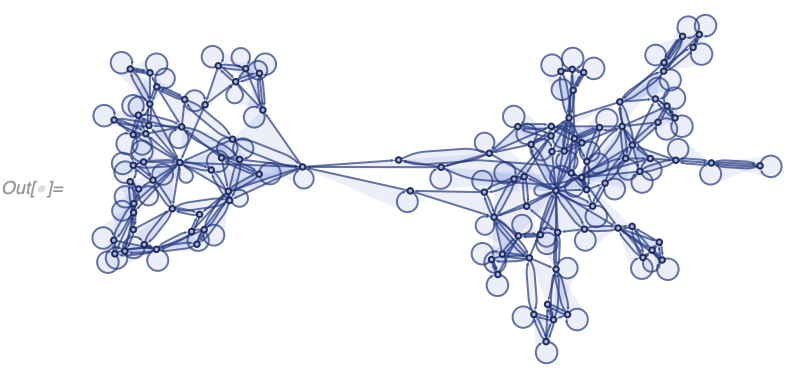

#### "IncludeBoundaryEvents"

**`"IncludeBoundaryEvents"`** allows one to include "fake" initial and final events in properties such as [`"CausalGraph"`](#causal-graphs). It does not affect the evolution itself and does not affect the evolution object. It has 4 settings: [`None`](https://reference.wolfram.com/language/ref/None.html), `"Initial"`, `"Final"` and [`All`](https://reference.wolfram.com/language/ref/All.html).

We have already [demonstrated](#causal-graphs) it previously for our arithmetic model. Here is an example with the final "event" included as well (event labels are kept for reference):
```
In[] := With[{evolution =
   WolframModel[<|"PatternRules" -> {a_, b_} :> a + b|>, {3, 8, 8, 8,
     2, 10, 0, 9, 7}, \[Infinity]]},
 With[{causalGraph =
    evolution["LayeredCausalGraph", "IncludeBoundaryEvents" -> All]},
  Graph[causalGraph,
   VertexLabels ->
    Thread[VertexList[causalGraph] ->
      Map[evolution["AllEventsEdgesList",
          "IncludeBoundaryEvents" -> All][[#]] &,
       Last /@ evolution["AllEventsList",
         "IncludeBoundaryEvents" -> All], {2}]]]]]
```


Properties like [`"AllEventsList"`](#events) are affected as well:
```
In[] := WolframModel[<|"PatternRules" -> {a_, b_} :> a + b|>, {3, 8, 8, 8, 2,
  10, 0, 9, 7}, \[Infinity], "AllEventsList",
 "IncludeBoundaryEvents" -> "Final"]
Out[] = {{1, {1, 2} -> {10}}, {1, {3, 4} -> {11}}, {1, {5,
    6} -> {12}}, {1, {7, 8} -> {13}}, {1, {9, 10} -> {14}}, {1, {11,
    12} -> {15}}, {1, {13, 14} -> {16}}, {1, {15,
    16} -> {17}}, {\[Infinity], {17} -> {}}}
```

#### Method

There are two implementations (**`Method`** s) available: one written in Wolfram Language (`Method -> "Symbolic"`), one in C++ (`Method -> "LowLevel"`).

The Wolfram Language implementation permutes the left-hand sides of the rules in all possible ways and uses [`Replace`](https://reference.wolfram.com/language/ref/Replace.html) a specified number of times to perform evolution. This implementation works well for small graphs and small rule inputs, but it slows down with the number of edges in the graph and has exponential complexity in rule size.

The C++ implementation, on the other hand, keeps an index of all possible rule matches and updates it after every replacement. The reindexing algorithm looks only at the local region of the graph close to the rewrite site. Thus time complexity does not depend on the graph size as long as vertex degrees are small. The downside is that it has exponential complexity (both in time and memory) in the vertex degrees. Currently, it also does not work for non-local rules (i.e., rule inputs that do not form a connected hypergraph) and rules that are not hypergraph rules (i.e., pattern rules that have non-trivial nesting or conditions).

The C++ implementation is used by default for supported systems and is particularly useful if:
* Vertex degrees are expected to be small.
* Evolution needs to be done for a large number of steps `> 100`, it is possible to produce states with up to `10^6` edges or more.

It should not be used, however, if vertex degrees can grow large. For example
```
In[] := AbsoluteTiming[
 WolframModel[{{{0}} -> {{0}, {0}, {0}}, {{0}, {0}, {0}} -> {{0}}}, \
{{0}}, <|"MaxEvents" -> 30|>, Method -> "LowLevel"]]
```

takes almost 10 seconds in C++ implementation, and less than 1/10th of a second in the Wolfram Language implementation:
```
In[] := AbsoluteTiming[
 WolframModel[{{{0}} -> {{0}, {0}, {0}}, {{0}, {0}, {0}} -> {{0}}}, \
{{0}}, <|"MaxEvents" -> 30|>, Method -> "Symbolic"]]
```


On the other hand, Wolfram Language implementation should be used if:
* A large number of small rules with unknown behavior needs to be simulated for a small number of steps.
* Vertex degrees are expected to be large, rules are non-local, or pattern rules with non-trivial nesting or conditions are used.

#### TimeConstraint

**`TimeConstraint`** option allows one to stop the evolution early. If an evolution object is requested, it will return a partial result, otherwise, it will just give [`$Aborted`](https://reference.wolfram.com/language/ref/$Aborted.html).
```
In[] := WolframModel[{{1, 2}} -> {{1, 3}, {1, 3}, {3, 2}}, {{1,
   1}}, \[Infinity], TimeConstraint -> 1]
```


#### "EventOrderingFunction"

In many `WolframModel` systems multiple matches are possible at any given step. As an example, two possible replacements are possible in the system below from the initial condition:
```
In[] := WolframModel[{{1, 2}} -> {{1, 3}, {3, 2}}, {{1, 2}, {2, 2}}, <|
  "MaxEvents" -> 1|>, "EventsStatesPlotsList"]
```


```
In[] := WolframModel[{{1, 2}} -> {{1, 3}, {3, 2}}, {{1, 2}, {2, 2}}, <|
  "MaxEvents" -> 1|>, "EventsStatesPlotsList",
 "EventOrderingFunction" -> "NewestEdge"]
```


In this particular, the so-called non-overlapping system, the order of replacements does not matter, as regardless of order the same final state (upto the renaming of vertices) will be produced for the same fixed number of generations. This will always be the case if there is only a single edge on the left-hand side of the rule:
```
In[] := WolframModel[{{1, 2}} -> {{1, 3}, {1, 3}, {3, 2}}, {{1, 2}, {2, 2}},
   3, "FinalStatePlot", "EventOrderingFunction" -> #] & /@ {Automatic,
   "Random"}
```
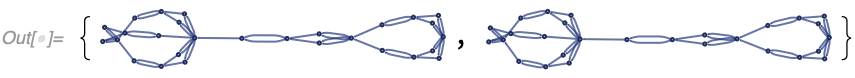

For some systems, however, the order of replacements does matter, and non-equivalent final states would be produced for different orders even if a fixed number of generations is requested:
```
In[] := WolframModel[{{1, 2}, {2, 3}} -> {{4, 2}, {4, 1}, {2, 1}, {3,
    4}}, {{1, 2}, {2, 3}, {3, 4}, {4, 1}}, 5, "FinalStatePlot"]
```
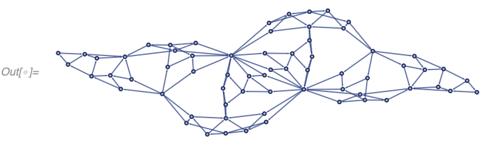

```
In[] := WolframModel[{{1, 2}, {2, 3}} -> {{4, 2}, {4, 1}, {2, 1}, {3,
    4}}, {{1, 2}, {2, 3}, {3, 4}, {4, 1}}, 5, "FinalStatePlot",
 "EventOrderingFunction" -> "RuleOrdering"]
```


In a case like that, it is important to be able to specify the desired evolution order, which is the purpose of the **`"EventOrderingFunction"`** option. `"EventOrderingFunction"` is specified as a list of sorting criteria such as the default `{"LeastRecentEdge", "RuleOrdering", "RuleIndex"}`. Note that most individual sorting criteria are insufficient to distinguish between all available matches. If multiple matches remain after exhausting all sorting criteria, one is chosen uniformly at random (which is why `{}` works as a shorthand for `"Random"`).

Possible sorting criteria are:
* `"OldestEdge"`: greedily select the edge in the set closest to the beginning of the list (which would typically correspond to the oldest edge). Note, the edges within a single-event output are assumed oldest-to-newest left-to-right as written on the right-hand side of the rule. After this criterion, a fixed ***set*** of edges is guaranteed to be chosen, but different orderings of that set might be possible (which could allow for multiple non-equivalent matches).

* `"NewestEdge"`: similar to `"OldestEdge"` except edges are chosen from the end of the list rather than from the beginning.

* `"LeastRecentEdge"`: this is similar to `"OldestEdge"`, but instead of greedely choosing the oldest edges, it instead avoids choosing new ones. The difference is best demonstrated in an example:
    ```
    In[] := WolframModel[{{x, y}, {y, z}} -> {}, {{1, 2}, {a, b}, {b, c}, {2,
         3}}, <|"MaxEvents" -> 1|>, "AllEventsList",
       "EventOrderingFunction" -> #] & /@ {"OldestEdge",
      "LeastRecentEdge"}
    Out[] = {{{1, {1, 4} -> {}}}, {{1, {2, 3} -> {}}}}
    ```

    Note that in this example `"OldestEdge"` has select edges the first and the last edge, whereas `"LeastRecentEdge"` in an attempt to avoid the most "recent" last edge has select the second and the third ones. In this case, similarly to `"OldestEdge"`, a fixed set of edges is guaranteed to be chosen, but potentially in different orders.

* `"LeastOldEdge"`: similar to `"LeastRecentEdge"`, but avoids old edges instead of avoiding new ones.

    Note that counterintuitively `"OldestEdge"` sorting is not equivalent to the reverse of `"NewestEdge"` sorting, it is equivalent to the reverse of `"LeastOldEdge"`. Similarly, `"NewestEdge"` is the reverse of `"LeastRecentEdge"`.

* `"RuleOrdering"`: similarly to `"OldestEdge"` greedely chooses edges from the beginning of the list, however unlike `"OldestEdge"` which would pick the oldest edge with *any* available matches, it chooses edges in the order the left-hand side of (any) rule is written. The difference is best demonstrated in an example:
    ```
    In[] := WolframModel[{{x, y}, {y, z}} -> {}, {{b, c}, {1, 2}, {a, b}, {2,
         3}}, <|"MaxEvents" -> 1|>, "AllEventsList",
       "EventOrderingFunction" -> #] & /@ {"OldestEdge", "RuleOrdering"}
    Out[] = {{{1, {1, 3} -> {}}}, {{1, {2, 4} -> {}}}}
    ```

    Note how `"RuleOrdering"` has selected the second edge first because it matches the first rule input while the first edge does not.

    In this case, a specific ordered sequence of edges is guaranteed to be matched (including its permutation). However, multiple matches might still be possible if multiple rules exist which match that sequence.

* `"ReverseRuleOrdering"`: as the name suggests, this is just the reverse of `"RuleOrdering"`.

* `"RuleIndex"`: this simply means it attempts to match the first rule first, and only if no matches to the first rule are possible, it goes to the second rule, and so on.

* `"ReverseRuleIndex"`: similar to `"RuleIndex"`, but reversed as the name suggests.

* `"Random"`: this selects a single match uniformly at random. It is possible to do that efficiently because the C++ implementation of `WolframModel` (the only one that supports `"EventOrderingFunction"`) keeps track of all possible matches at any point during the evolution. `"Random"` is guaranteed to select a single match, so the remainder of the sorting criteria list is ignored. It can also be omitted because the random event is always chosen if provided sorting criteria are insufficient. The seeding can be controlled with [`SeedRandom`](https://reference.wolfram.com/language/ref/SeedRandom.html). However, the result does depend on your platform (Mac/Linux/Windows) and the specific build (version) of **SetReplace**.

As a neat example, here is the output of all individual sorting criteria (default sorting criteria are appended to disambiguate):
```
In[] := WolframModel[{{{1, 2}, {1, 3}, {1, 4}} -> {{5, 6}, {6, 7}, {7, 5}, {5,
         7}, {7, 6}, {6, 5}, {5, 2}, {6, 3}, {7, 4}, {2, 7}, {4,
        5}}, {{1, 2}, {1, 3}, {1, 4}, {1, 5}} -> {{2, 3}, {3,
        4}}}, {{1, 1}, {1, 1}, {1, 1}}, <|"MaxEvents" -> 30|>,
    "EventOrderingFunction" -> {#, "LeastRecentEdge", "RuleOrdering",
      "RuleIndex"}]["FinalStatePlot",
   PlotLabel -> #] & /@ {"OldestEdge", "LeastOldEdge",
  "LeastRecentEdge", "NewestEdge", "RuleOrdering",
  "ReverseRuleOrdering", "RuleIndex", "ReverseRuleIndex", "Random"}
```


## WolframModelPlot

**`WolframModelPlot`** (aka `HypergraphPlot`) is a function used to visualize [`WolframModel`](#wolframmodel-and-wolframmodelevolutionobject) states. It treats lists of vertices as ordered hypergraphs, and displays each hyperedge as a polygon with arrows showing the ordering:
```
In[] := WolframModelPlot[{{1, 2, 3}, {3, 4, 5}, {5, 6, 7, 1}}]
```
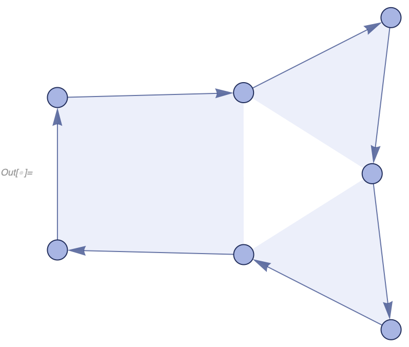

Edges of any arity can be mixed, the binary edges are displayed as non-filled arrows, and the unary edges are shown as circles around the vertices:
```
In[] := WolframModelPlot[{{1, 2, 3}, {3, 4}, {4, 3}, {4, 5,
   6}, {1}, {6}, {6}}]
```


Self-loops are shown as convex polygons around the appropriate number of circular arrows:
```
In[] := WolframModelPlot[{{1, 1, 1}, {1, 2, 3}, {3, 4, 4}}]
```
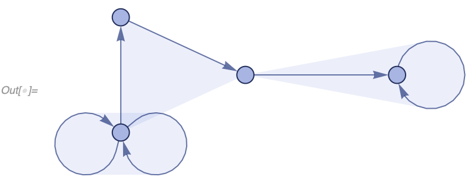

Note the difference between a hypermultiedge and two binary edges pointing in opposite directions:
```
In[] := WolframModelPlot[{{1, 2, 1}, {2, 3}, {3, 2}}]
```


And multiedges are shown in darker color (because of overlayed polygons), or as separate polygons depending on the layout (and are admittedly sometimes hard to understand):
```
In[] := WolframModelPlot[{{1, 2, 3}, {3, 4, 5}, {3, 4, 5}, {1, 6, 6}, {1, 6,
   6}}]
```


`WolframModelPlot` is listable, multiple hypergraphs can be plotted at the same time:
```
In[] := WolframModelPlot[{{{1, 2, 3}}, {{1, 2, 3}, {3, 4, 5}}, {{1, 2, 3}, {3,
     4, 5}, {5, 6, 7}}}]
```


Many [`WolframModel`](#wolframmodel-and-wolframmodelevolutionobject) properties, such as [`"FinalStatePlot"`](#plots-of-states) and [`"EventStatesPlotsList"`](#plots-of-events), use `WolframModelPlot` to produce output. They accept the same set of options, as explained below.

### Edge Type

By default, `WolframModelPlot` assumes the hypergraph is an ordered hypergraph. It is also possible to treat edges as cyclic edges instead (i.e., assume [`RotateLeft`](https://reference.wolfram.com/language/ref/RotateLeft.html) and [`RotateRigth`](https://reference.wolfram.com/language/ref/RotateRight.html) don't change the edge), in which case `"Cyclic"` should be used as the second argument to `WolframModelPlot`:
```
In[] := WolframModelPlot[{{1, 2, 3}, {3, 4, 5}, {5, 6, 7, 1}}, "Cyclic"]
```
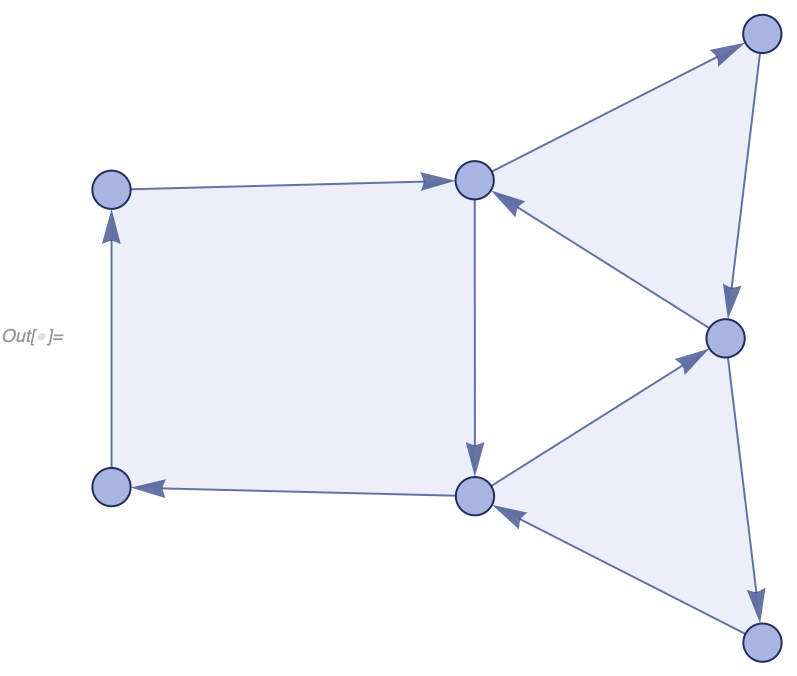

### GraphHighlight and GraphHighlightStyle

Vertices and edges can be highlighted with **`GraphHighlight`** option:
```
In[] := WolframModelPlot[{{1, 2, 3}, {3, 4, 5}, {5, 6, 7, 1}, {7, 8, 2}, {4,
   9}, {9}}, GraphHighlight -> {{1, 2, 3}, 4, {9}}]
```
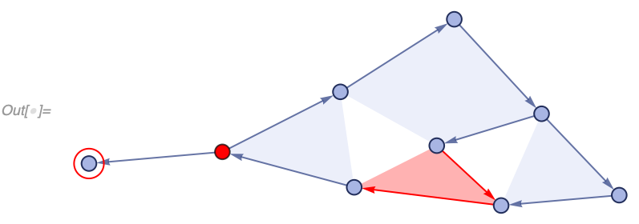

For a hypergraph with multiedges, only the specified number of edges will be highlighted:
```
In[] := WolframModelPlot[{{1, 2, 3}, {1, 2, 3}, {3, 4}, {3, 4}, {3,
   4}, {4}, {4}}, GraphHighlight -> {{1, 2, 3}, {3, 4}, {3, 4}, {4}}]
```


The color of the highlight can be specified with **`GraphHighlightStyle`** (only colors, not other style specifiers are supported at the moment):
```
In[] := WolframModelPlot[{{1, 2, 3}, {3, 4, 5}, {5, 6, 7, 1}, {7, 8, 2}, {4,
   9}, {9}}, GraphHighlight -> {{1, 2, 3}, 4, {9}},
 GraphHighlightStyle -> Darker@Green]
```


### "HyperedgeRendering"

By default, `WolframModelPlot` represents each hyperedge as a polygon. It is possible instead of drop the polygons (and the vertex layout adjustments that come with them), and simply split each hyperedge into a collection of binary edges by setting **`"HyperedgeRendering"`** to `"Subgraphs"`. This looses information (`{{1, 2}, {2, 3}}` and `{{1, 2, 3}}` would look the same), but might be helpful if one does not care to see the separation between hyperedges.
```
In[] := WolframModelPlot[{{1, 2, 3}, {3, 4, 5}, {5, 6, 7, 1}, {7, 8, 2}, {4,
   9}, {9}}, "HyperedgeRendering" -> "Subgraphs",
 VertexLabels -> Automatic]
```


### VertexCoordinateRules

It is possible to manually specify some or all coordinates for the vertices.
```
In[] := WolframModelPlot[{{1, 2, 3}, {2, 4, 5}, {2, 6, 7, 8}, {8, 9, 1}},
 VertexCoordinateRules -> {1 -> {0, 0}, 2 -> {1, 0}, 3 -> {0, 1}},
 Axes -> True]
```


Unfortunately though due to limitations of [`GraphEmbedding`](https://reference.wolfram.com/language/ref/GraphEmbedding.html), specifying coordinates of two or more vertices breaks the scaling of distances between vertices. As a result, vertices and arrowheads might appear too small or too large, and will need to be manually adjusted. This might also affect [`RulePlot`](#ruleplot-of-wolframmodel) in some cases.
```
In[] := WolframModelPlot[{{1, 2, 3}, {2, 4, 5}, {2, 6, 7, 8}, {8, 9, 1}},
 VertexCoordinateRules -> {1 -> {0, 0}, 2 -> {1, 0}}]
```


```
In[] := WolframModelPlot[{{1, 2, 3}, {2, 4, 5}, {2, 6, 7, 8}, {8, 9, 1}},
 VertexCoordinateRules -> {1 -> {0, 0}, 2 -> {1, 0}},
 VertexSize -> 0.03, "ArrowheadLength" -> 0.06]
```


### VertexLabels

`"VertexLabels" -> Automatic` will draw the labels for vertices, similar to [`GraphPlot`](https://reference.wolfram.com/language/ref/GraphPlot.html):
```
In[] := WolframModelPlot[{{1, 2, 3}, {2, 4, 5}, {2, 6, 7, 8}, {8, 9, 1}},
 VertexLabels -> Automatic]
```


### VertexSize and "ArrowheadLength"

The size of vertices (in the units of internal graphics coordinates), and the length of arrowheads can be adjusted with **`VertexSize`** and **`"ArrowheadLength"`** respectively:
```
In[] := WolframModelPlot[{{1, 2, 3, 4}, {1, 5, 6}, {2, 7, 8}, {4, 6, 9}},
 VertexSize -> 0.1, "ArrowheadLength" -> 0.3]
```


Note that unlike [`GraphPlot`](https://reference.wolfram.com/language/ref/GraphPlot.html), both vertices and arrowheads have fixed size relative to the layout (in fact, the arrowheads are drawn manually as polygons). This fixed-size implies that they scale proportionally when the image is resized, and do not overlay/disappear for tiny/huge graphs or image sizes.

These options can also be used to get rid of vertices and arrowheads altogether:
```
In[] := WolframModelPlot[{{1, 2, 3}, {3, 4, 5}, {5, 6, 7}, {7, 8, 9}, {9, 10,
   1}}, "Cyclic", "ArrowheadLength" -> 0, VertexSize -> 0,
 VertexStyle -> Transparent]
```


As a neat example, this can be used to draw unordered hypergraphs:
```
In[] := WolframModelPlot[{{1, 2, 2}, {2, 3, 3}, {3, 1, 1}},
 "ArrowheadLength" -> 0, EdgeStyle -> <|{_, _, _ ..} -> Transparent|>,
  "EdgePolygonStyle" -> <|{_, _, _ ..} ->
    Directive[Hue[0.63, 0.66, 0.81], Opacity[0.1],
     EdgeForm[Directive[Hue[0.63, 0.7, 0.5], Opacity[0.7]]]]|>]
```


### "MaxImageSize"

**`"MaxImageSize"`** allows one to specify the image size while allowing for automatic reduction in size for very small hypergraphs. To demonstrate that, consider the difference:
```
In[] := WolframModelPlot[{{{1}}, {{1, 1}}, {{1, 2, 3}}},
 "MaxImageSize" -> 100]
```


```
In[] := WolframModelPlot[{{{1}}, {{1, 1}}, {{1, 2, 3}}}, ImageSize -> 100]
```


### Style Options

There are four styling options: **`PlotStyle`**, **`VertexStyle`**, **`EdgeStyle`** and **`"EdgePolygonStyle"`**.

`PlotStyle` controls the overall style for everything, `VertexStyle` and `EdgeStyle` inherit from it:
```
In[] := WolframModelPlot[{{1, 2, 3}, {3, 4, 5}, {5, 6, 7, 1}, {7, 8, 2}, {4,
   9}, {9}}, PlotStyle -> Directive[Blue, Dotted]]
```
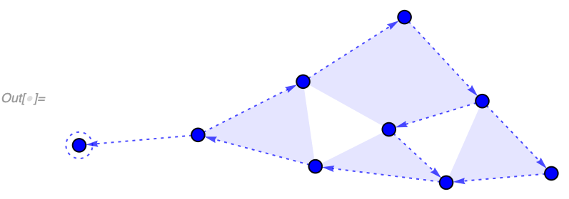

`VertexStyle` works similarly to [`GraphPlot`](https://reference.wolfram.com/language/ref/GraphPlot.html):
```
In[] := WolframModelPlot[{{1, 2, 3}, {3, 4, 5}, {5, 6, 7, 1}, {7, 8, 2}, {4,
   9}, {9}}, PlotStyle -> Directive[Blue, Dotted], VertexStyle -> Red]
```


`EdgeStyle` controls edge lines, and `"EdgePolygonStyle"` inherits from it (automatically adding transparency):
```
In[] := WolframModelPlot[{{1, 2, 3}, {3, 4, 5}, {5, 6, 7, 1}, {7, 8, 2}, {4,
   9}, {9}}, PlotStyle -> Directive[Blue, Dotted], VertexStyle -> Red,
  EdgeStyle -> Darker@Green]
```


Finally, `"EdgePolygonStyle"` controls the hyperedge polygons:
```
In[] := WolframModelPlot[{{1, 2, 3}, {3, 4, 5}, {5, 6, 7, 1}, {7, 8, 2}, {4,
   9}, {9}}, PlotStyle -> Directive[Blue, Dotted], VertexStyle -> Red,
  EdgeStyle -> Darker@Green,
 "EdgePolygonStyle" ->
  Directive[Lighter[Green, 0.9], EdgeForm[Dotted]]]
```


It is possible to specify styles separately for each edge and vertex. Vertex styles are specified in the same order as `Union @* Catenate` evaluated on the list of edges.
```
In[] := WolframModelPlot[{{1, 2, 3}, {3, 4, 5}, {5, 6, 7, 1}, {7, 8, 2}, {4,
   9}, {9}}, EdgeStyle -> ColorData[97] /@ Range[6],
 VertexStyle -> ColorData[98] /@ Range[9]]
```


Alternatively, one can specify different styles for different patterns of elements. In this case, styles are specified as [`Association`](https://reference.wolfram.com/language/ref/Association.html)s with patterns for keys. This can be used to, for example, differently color edges of different arities:
```
In[] := WolframModelPlot[{{1, 2, 3}, {3, 4, 5}, {5, 6, 7, 1}, {7, 8, 2}, {4,
   9}, {9}},
 EdgeStyle -> <|{_} -> Darker@Blue, {_, _} ->
    Darker@Yellow, {_, _, _} -> Darker@Green, {_, _, _, _} ->
    Darker@Red|>]
```
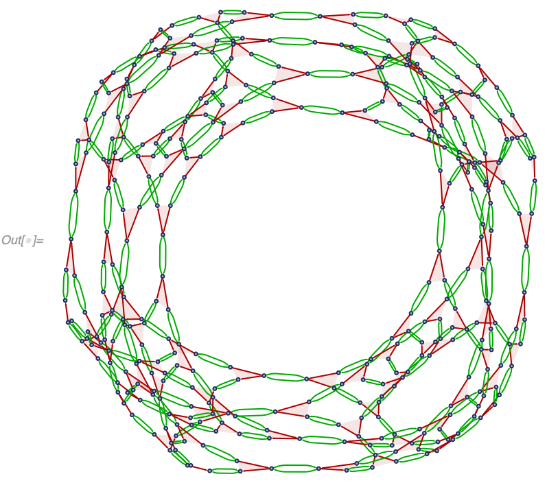

### Graphics Options

All [`Graphics`](https://reference.wolfram.com/language/ref/Graphics.html) options are supported as well, such as [`Background`](https://reference.wolfram.com/language/ref/Background.html), [`PlotRange`](https://reference.wolfram.com/language/ref/PlotRange.html), [`Axes`](https://reference.wolfram.com/language/ref/Axes.html), etc.:
```
In[] := WolframModel[{{1, 2}} -> {{1, 3}, {1, 3}, {3, 2}}, {{1, 2}, {2,
    3}, {3, 1}}, 7]["FinalStatePlot", Background -> Black,
 PlotStyle -> White, GridLines -> Automatic,
 PlotRange -> {{30, 50}, {20, 40}}, Axes -> True]
```
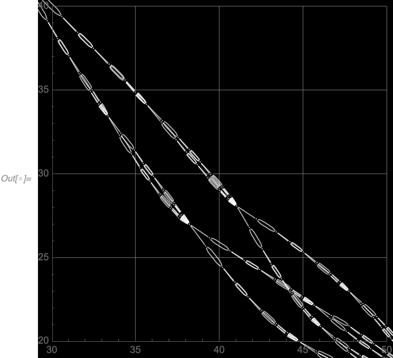

## RulePlot of WolframModel

**`RulePlot`** can be used to get a visual representation of hypergraph substitution rules based on [`WolframModelPlot`](#wolframmodelplot).
```
In[] := RulePlot[WolframModel[{{1, 2}, {1, 2}} -> {{3, 2}, {3, 2}, {2, 1}, {1,
      3}}]]
```


The shared elements between rules sides (vertices `1` and `2` in the example above) are put at the same positions in the `RulePlot` and highlighted in a darker shade of blue. Shared edges are highlighted as well:
```
In[] := RulePlot[WolframModel[{{1, 2, 3}} -> {{1, 2, 3}, {3, 4, 5}}]]
```


Multiple rules can be plotted:
```
In[] := RulePlot[WolframModel[{{{1, 1, 2}} -> {{2, 2, 1}, {2, 3, 2}, {1, 2,
      3}}, {{1, 2, 1}, {3, 4, 2}} -> {{4, 3, 2}}}]]
```


Sometimes an incorrectly scaled layout might be produced due to the same issue discussed above in [`"VertexCoordinateRules"`](#vertexcoordinaterules):
```
In[] := RulePlot[WolframModel[{{1, 2}, {1, 3}, {1, 4}} -> {{2, 2}, {2, 2}, {2,
      5}, {3, 2}}]]
```


`VertexCoordinateRules` can be used in that case to specify the layout manually:
```
In[] := RulePlot[WolframModel[{{1, 2}, {1, 3}, {1, 4}} -> {{2, 2}, {2, 2}, {2,
      5}, {3, 2}}],
 VertexCoordinateRules -> {1 -> {0, 0}, 2 -> {1, 0}, 3 -> {0, 1},
   4 -> {-1, 0}, 5 -> {2, 1}}]
```


Some of the [`WolframModelPlot`](#wolframmodelplot) options are supported, specifically [`GraphHighlightStyle`](#graphhighlight-and-graphhighlightstyle), [`"HyperedgeRendering"`](#hyperedgerendering), [`VertexCoordinateRules`](#vertexcoordinaterules) and [`VertexLabels`](#vertexlabels). `"EdgeType"` is supported as an option instead of the second argument like in [`WolframModelPlot`](#wolframmodelplot).

There are also two additional `RulePlot`-specific style options. `Spacings` controls the amount of empty space between the rule parts and the frame (or the space where the frame would be if it's not shown):
```
In[] := RulePlot[WolframModel[{{{1, 2}} -> {{1, 3}, {1, 3}, {3, 2}}, {{1,
      2}, {1, 2}} -> {{1, 3}, {3, 2}}}], Spacings -> 0.03]
```
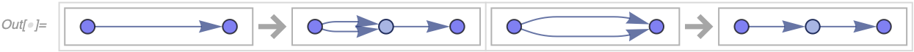

`"RulePartsAspectRatio"` is used to control the aspect ratio of rule sides. As an example, it can be used to force rule parts to be square:
```
In[] := RulePlot[WolframModel[{{1, 2}} -> {{1, 3}, {1, 3}, {3, 2}}],
 "RulePartsAspectRatio" -> 1]
```


## Utility Functions

### GeneralizedGridGraph

**`GeneralizedGridGraph`** is similar to [`GridGraph`](https://reference.wolfram.com/language/ref/GridGraph.html), but it allows for additional specifiers in each direction of the grid:
```
In[] := GeneralizedGridGraph[{5 -> "Directed", 5 -> "Circular"}]
```


Possible specifiers are `"Directed"` and `"Circular"`, and they can be combined:
```
In[] := GeneralizedGridGraph[{3 -> {"Directed", "Circular"}, 6}]
```


Same options as [`GridGraph`](https://reference.wolfram.com/language/ref/GridGraph.html) are supported. In addition `"VertexNamingFunction" -> "Coordinates"` names vertices according to their position in a grid:
```
In[] := GeneralizedGridGraph[{4, 5, 2},
 "VertexNamingFunction" -> "Coordinates", VertexLabels -> Automatic]
```


Finally, it's possible to use different `EdgeStyle` in different directions by specifying it as a list:
```
In[] := GeneralizedGridGraph[{4 -> "Directed", 5, 2},
 "VertexNamingFunction" -> "Coordinates",
 EdgeStyle -> Darker /@ {Red, Green, Blue}]
```


### HypergraphAutomorphismGroup

**`HypergraphAutomorphismGroup`** does the same as [`GraphAutomorphismGroup`](https://reference.wolfram.com/language/ref/GraphAutomorphismGroup.html), but for ordered hypergraphs:
```
In[] := HypergraphAutomorphismGroup[{{1, 2, 3}, {1, 2, 4}}]
Out[] = PermutationGroup[{Cycles[{{3, 4}}]}]
```

A more complicated example:
```
In[] := GroupOrder[
 HypergraphAutomorphismGroup[
  EchoFunction[
    WolframModelPlot]@{{1, 2, 3}, {3, 4, 5}, {5, 6, 1}, {1, 7, 3}, {3,
      8, 5}, {5, 9, 1}}]]
```


```
Out[] = 24
```

### HypergraphUnifications

When considering how many matches could potentially exist to a given set of rule inputs, it is often useful to see all possible ways hypergraphs can overlap. **`HypergraphUnifications`** constructs all possible hypergraphs that contain both subgraphs matching the specified arguments. The argument-hypergraphs must overlap by at least a single edge. `HypergraphUnifications` identifies vertices to the least extent possible, but it makes some identifications if necessary.

The output format is a list of triples `{unified hypergraph, first argument edge matches, second argument edge matches}`, where the last two elements are associations mapping the edge indices in the input hypergraphs to the edge indices in the unified hypergraph.

As an example, consider a simple case of two adjacent binary edges:
```
In[] := HypergraphUnifications[{{1, 2}, {2, 3}}, {{1, 2}, {2, 3}}]
Out[] = {{{{3, 1}, {3, 4}, {2, 3}}, <|1 -> 3, 2 -> 1|>, <|1 -> 3,
   2 -> 2|>}, {{{2, 3}, {3, 1}}, <|1 -> 1, 2 -> 2|>, <|1 -> 1,
   2 -> 2|>}, {{{4, 1}, {2, 3}, {3, 4}}, <|1 -> 3, 2 -> 1|>, <|1 -> 2,
    2 -> 3|>}, {{{1, 2}, {2, 1}}, <|1 -> 1, 2 -> 2|>, <|1 -> 2,
   2 -> 1|>}, {{{1, 2}, {3, 4}, {2, 3}}, <|1 -> 1, 2 -> 3|>, <|1 -> 3,
    2 -> 2|>}, {{{1, 3}, {2, 3}, {3, 4}}, <|1 -> 1,
   2 -> 3|>, <|1 -> 2, 2 -> 3|>}}
```

In the first output here `{{{3, 1}, {3, 4}, {2, 3}}, <|1 -> 3, 2 -> 1|>, <|1 -> 3, 2 -> 2|>}`, the graphs are overlapped by a shared edge `{2, 3}`, and two inputs are matched respectively to `{{2, 3}, {3, 1}}` and `{{2, 3}, {3, 4}}`.

All matches can be visualized by coloring shared edges purple, edges mapped to only the first argument or only the second argument red and blue respecively:
```
In[] := WolframModelPlot[#,
   EdgeStyle ->
    ReplacePart[Table[Automatic, Length[#]],
     Join[Thread[Intersection[Values[#2], Values[#3]] -> Purple],
      Thread[Values[#2] -> Red], Thread[Values[#3] -> Blue]]]] & @@@
 HypergraphUnifications[{{1, 2}, {2, 3}}, {{1, 2}, {2, 3}}]
```


A more complicated example with edges of multiple arities is
```
In[] := WolframModelPlot[#,
   EdgeStyle ->
    ReplacePart[Table[Automatic, Length[#]],
     Join[Thread[Intersection[Values[#2], Values[#3]] -> Purple],
      Thread[Values[#2] -> Red], Thread[Values[#3] -> Blue]]]] & @@@
 HypergraphUnifications[{{1, 2, 3}, {4, 5, 6}, {1, 4}}, {{1, 2, 3}, {4, 5,
     6}, {1, 4}}]
```


### WolframPhysicsProjectStyleData

**`WolframPhysicsProjectStyleData`** allows one to lookup styles used in various **SetReplace** functions and properties such as [`WolframModelPlot`](#wolframmodelplot) and [`"CausalGraph"`](#causal-graphs).

For example, here is the default style used to draw polygons in [`WolframModelPlot`](#wolframmodelplot):
```
In[] := WolframPhysicsProjectStyleData["SpatialGraph", "EdgePolygonStyle"]
Out[] = Directive[Hue[0.63, 0.66, 0.81], Opacity[0.1], EdgeForm[None]]
```

The full specification is `WolframPhysicsProjectStyleData[theme, plot type, style element]`, however either the last, or the last two elements can be ommited to obtain a full [`Association`](https://reference.wolfram.com/language/ref/Association.html) of styles. The `theme` argument can be omitted to get the result for the default plot theme (only `"Light"` theme is supported at the moment). Here are all styles used in [`"CausalGraph"`](#causal-graphs) for example:
```
In[] := WolframPhysicsProjectStyleData["CausalGraph"]
Out[] = <|"EdgeStyle" -> Hue[0, 1, 0.56],
 "FinalVertexStyle" ->
  Directive[GrayLevel[1], EdgeForm[{Hue[0.11, 1, 0.97], Opacity[1]}]],
  "InitialVertexStyle" ->
  Directive[RGBColor[{0.259, 0.576, 1}],
   EdgeForm[{RGBColor[{0.259, 0.576, 1}], Opacity[1]}]],
 "VertexStyle" ->
  Directive[Hue[0.11, 1, 0.97],
   EdgeForm[{Hue[0.11, 1, 0.97], Opacity[1]}]]|>
```

This function is useful if one needs to produce "fake" example plots using styles consistent with the Wolfram Physics Project.

# Physics

A hypothesis is that spacetime at small scales is a network, and the fundamental law of physics is a system similar to the one this package implements.

A slightly different version of this system was first introduced in Stephen Wolfram's [A New Kind Of Science](https://www.wolframscience.com/nks/chap-9--fundamental-physics/).

Stay tuned for the upcoming **Technical Introduction**, where we will present many more details about our physics results.
