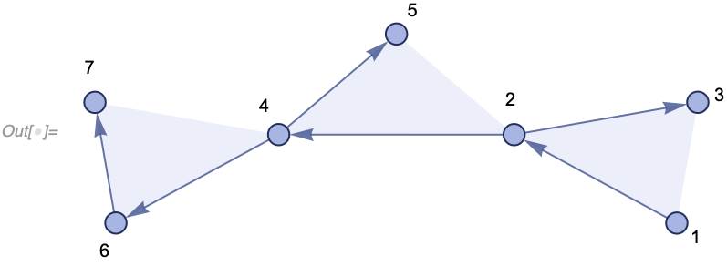

[](https://discord.setreplace.org)

[Wolfram Models as Set Substitution Systems](#wolfram-models-as-set-substitution-systems) | [Getting Started](#getting-started) | [Symbols and Functions](#symbols-and-functions) | [Physics](#physics) | [Acknowledgements](#acknowledgements)

# Wolfram Models as Set Substitution Systems

## Set Substitution Systems

*SetReplace* is a [Wolfram Language](https://www.wolfram.com/language/) package for manipulating set substitution systems. To understand what a set substitution system does consider an unordered set of elements:

```wl
{1, 2, 5, 3, 6}
```

We can set up an operation on this set which would take any of the two elements and replace them with their sum:

```wl
{a_, b_} :> {a + b}
```

In *SetReplace*, this can be expressed as the following (the new element `1 + 2 -> 3` is put at the end)

```wl
In[] := SetReplace[{1, 2, 5, 3, 6}, {a_, b_} :> {a + b}]
Out[] = {5, 3, 6, 3}
```

Note that this is similar to [`SubsetReplace`](https://reference.wolfram.com/language/ref/SubsetReplace.html) function of Wolfram Language (introduced in version 12.1, it replaces all non-overlapping subsets at once by default):

```wl
In[] := SubsetReplace[{1, 2, 5, 3, 6}, {a_, b_} :> a + b]
Out[] = {3, 8, 6}
```

## Wolfram Models

A more interesting case (which we call a Wolfram model) is one where the set elements are related to each other. Specifically, we can consider a set of ordered lists of atomic vertices; in other words, an ordered hypergraph.

As an example consider a set:

```wl
{{1, 2, 3}, {2, 4, 5}, {4, 6, 7}}
```

We can render it as a collection of ordered hyperedges:

```wl
In[] := WolframModelPlot[{{1, 2, 3}, {2, 4, 5}, {4, 6, 7}},
 VertexLabels -> Automatic]
```



We can then have a rule which would pick a subset of these hyperedges related through common vertices (much like a join query) and replace them with something else:

```wl
{{v1_, v2_, v3_}, {v2_, v4_, v5_}} :>
 Module[{v6}, {{v5, v6, v1}, {v6, v4, v2}, {v4, v5, v3}}]
```

Note the [`Module`](https://reference.wolfram.com/language/ref/Module.html) on the right-hand side creates a new variable (vertex) which causes the hypergraph to grow. Due to optimizations, it's not always a [`Module`](https://reference.wolfram.com/language/ref/Module.html) that creates vertices, so its name may be different. After a single replacement we get this (the new vertex is v11):

```wl
In[] := WolframModelPlot[SetReplace[{{1, 2, 3}, {2, 4, 5}, {4, 6, 7}},
  {{v1_, v2_, v3_}, {v2_, v4_, v5_}} :>
   Module[{v6}, {{v5, v6, v1}, {v6, v4, v2}, {v4, v5, v3}}]],
 VertexLabels -> Automatic]
```


After 10 steps, we get a more complicated structure:

```wl
In[] := WolframModelPlot[SetReplace[{{1, 2, 3}, {2, 4, 5}, {4, 6, 7}},
  {{v1_, v2_, v3_}, {v2_, v4_, v5_}} :>
   Module[{v6}, {{v5, v6, v1}, {v6, v4, v2}, {v4, v5, v3}}], 10],
 VertexLabels -> Automatic]
```


And after 100 steps, it gets even more elaborate:

```wl
In[] := WolframModelPlot[SetReplace[{{1, 2, 3}, {2, 4, 5}, {4, 6, 7}},
  {{v1_, v2_, v3_}, {v2_, v4_, v5_}} :>
   Module[{v6}, {{v5, v6, v1}, {v6, v4, v2}, {v4, v5, v3}}], 100]]
```


Exploring the hypergraph models of this variety is the primary purpose of this package.

# Getting Started

## Dependencies

You only need three things to use *SetReplace*:

* Windows, macOS 10.12+, or Linux.
* [Wolfram Language 12.1+](https://www.wolfram.com/language/) including [WolframScript](https://www.wolfram.com/wolframscript/). A free version is available as [Wolfram Engine](https://www.wolfram.com/engine/).
* A C++17 compiler to build the low-level part of the package. Instructions on how to set up a compiler to use in WolframScript are [here](https://reference.wolfram.com/language/CCompilerDriver/tutorial/SpecificCompilers.html#509267359).

## Build Instructions

For users who wish to make use of SetReplace functionality, and not modify the source code itself, we recommend simply building and installing the paclet.

To do this, run the following on the command line:

```
cd ~/PATH-TO-CHECKOUT/SetReplace
./install.wls
```

Please note that if you do not have GitLink installed, it will be installed for you.

For more info about doing development on the SetReplace codebase and the associated workflows, see the Contributing guide.

### C++ 17

If you see an error message about c++17, make sure the C++ compiler you are using is up-to-date. If your default system compiler does not support c++17, you can choose a different one with environmental variables. The following, for instance, typically works on a Mac:

    ```bash
    COMPILER=CCompilerDriver\`ClangCompiler\`ClangCompiler COMPILER_INSTALLATION=/usr/bin ./install.wls
    ```

    Here `ClangCompiler` can be replaced with one of ``<< CCompilerDriver`; "Compiler" /. CCompilerDriver`CCompilers[Full]``, and `COMPILER_INSTALLATION` is a directory in which the compiler binary can be found.

## Contributing

Keep in mind that this is an active research project. While we try to keep the main functionality backward compatible, it might change in the future as we adjust our models and find better ways of analysis. Keep that in mind when building on top of *SetReplace*, and keep track of [git SHAs](Documentation/SymbolsAndFunctions/UtilityFunctions/BuildData.md) as you go.

*SetReplace* is an open-source project, and everyone is welcome to contribute. Read our [contributing guidelines](.github/CONTRIBUTING.md) to get started.

We have a [Discord server](https://discord.setreplace.org). If you would like to contribute but have questions or don't know where to start, this is the perfect place! In addition to helping new contributors, we discuss feature and research ideas. So, if you are interested, please join!

# Symbols and Functions

- [SetReplace\*](Documentation/SymbolsAndFunctions/SetReplace.md)
- [ToPatternRules](Documentation/SymbolsAndFunctions/ToPatternRules.md)
- [WolframModel and WolframModelEvolutionObject](Documentation/SymbolsAndFunctions/WolframModelAndWolframModelEvolutionObject/WolframModelAndWolframModelEvolutionObject.md)
  - Properties
    - [States](Documentation/SymbolsAndFunctions/WolframModelAndWolframModelEvolutionObject/Properties/States.md)
    - [Plots of States](Documentation/SymbolsAndFunctions/WolframModelAndWolframModelEvolutionObject/Properties/PlotsOfStates.md)
    - [Plots of Events](Documentation/SymbolsAndFunctions/WolframModelAndWolframModelEvolutionObject/Properties/PlotsOfEvents.md)
    - [All Edges throughout Evolution](Documentation/SymbolsAndFunctions/WolframModelAndWolframModelEvolutionObject/Properties/AllEdgesThroughoutEvolution.md)
    - [States as Edge Indices](Documentation/SymbolsAndFunctions/WolframModelAndWolframModelEvolutionObject/Properties/StatesAsEdgeIndices.md)
    - [Events](Documentation/SymbolsAndFunctions/WolframModelAndWolframModelEvolutionObject/Properties/Events.md)
    - [Events and States](Documentation/SymbolsAndFunctions/WolframModelAndWolframModelEvolutionObject/Properties/EventsAndStates.md)
    - [Creator and Destroyer Events](Documentation/SymbolsAndFunctions/WolframModelAndWolframModelEvolutionObject/Properties/CreatorAndDestroyerEvents.md)
    - [Causal Graphs](Documentation/SymbolsAndFunctions/WolframModelAndWolframModelEvolutionObject/Properties/CausalGraphs.md)
    - [Expression Separations](Documentation/SymbolsAndFunctions/WolframModelAndWolframModelEvolutionObject/Properties/ExpressionSeparations.md)
    - [MultiwayQ](Documentation/SymbolsAndFunctions/WolframModelAndWolframModelEvolutionObject/Properties/MultiwayQ.md)
    - [Rule Indices for Events](Documentation/SymbolsAndFunctions/WolframModelAndWolframModelEvolutionObject/Properties/RuleIndicesForEvents.md)
    - [Edge and Event Generations](Documentation/SymbolsAndFunctions/WolframModelAndWolframModelEvolutionObject/Properties/EdgeAndEventGenerations.md)
    - [Termination Reason](Documentation/SymbolsAndFunctions/WolframModelAndWolframModelEvolutionObject/Properties/TerminationReason.md)
    - [Generation Counts](Documentation/SymbolsAndFunctions/WolframModelAndWolframModelEvolutionObject/Properties/GenerationCounts.md)
    - [Event Counts](Documentation/SymbolsAndFunctions/WolframModelAndWolframModelEvolutionObject/Properties/EventCounts.md)
    - [Element Count Lists](Documentation/SymbolsAndFunctions/WolframModelAndWolframModelEvolutionObject/Properties/ElementCountLists.md)
    - [Final Element Counts](Documentation/SymbolsAndFunctions/WolframModelAndWolframModelEvolutionObject/Properties/FinalElementCounts.md)
    - [Total Element Counts](Documentation/SymbolsAndFunctions/WolframModelAndWolframModelEvolutionObject/Properties/TotalElementCounts.md)
    - [Rules](Documentation/SymbolsAndFunctions/WolframModelAndWolframModelEvolutionObject/Properties/Rules.md)
    - [Feature Vector](Documentation/SymbolsAndFunctions/WolframModelAndWolframModelEvolutionObject/Properties/FeatureVector.md) 
    - [Version](Documentation/SymbolsAndFunctions/WolframModelAndWolframModelEvolutionObject/Properties/Version.md) 
  - Options
    - ["VertexNamingFunction"](Documentation/SymbolsAndFunctions/WolframModelAndWolframModelEvolutionObject/Options/VertexNamingFunction.md)
    - ["IncludePartialGenerations"](Documentation/SymbolsAndFunctions/WolframModelAndWolframModelEvolutionObject/Options/IncludePartialGenerations.md)
    - ["IncludeBoundaryEvents"](Documentation/SymbolsAndFunctions/WolframModelAndWolframModelEvolutionObject/Options/IncludeBoundaryEvents.md)
    - ["EventOrderingFunction"](Documentation/SymbolsAndFunctions/WolframModelAndWolframModelEvolutionObject/Options/EventOrderingFunction.md)
    - ["EventSelectionFunction"](Documentation/SymbolsAndFunctions/WolframModelAndWolframModelEvolutionObject/Options/EventSelectionFunction.md)
    - ["EventDeduplication"](Documentation/SymbolsAndFunctions/WolframModelAndWolframModelEvolutionObject/Options/EventDeduplication.md)
    - [Method](Documentation/SymbolsAndFunctions/WolframModelAndWolframModelEvolutionObject/Options/Method.md)
    - [Time Constraint](Documentation/SymbolsAndFunctions/WolframModelAndWolframModelEvolutionObject/Options/TimeConstraint.md)
- [WolframModelPlot](Documentation/SymbolsAndFunctions/WolframModelPlot.md)
- [RulePlot of WolframModel](Documentation/SymbolsAndFunctions/RulePlotOfWolframModel.md)
- Utility Functions
  - [IndexHypergraph](Documentation/SymbolsAndFunctions/UtilityFunctions/IndexHypergraph.md)
  - [IsomorphicHypergraphQ](Documentation/SymbolsAndFunctions/UtilityFunctions/IsomorphicHypergraphQ.md)
  - [HypergraphToGraph](Documentation/SymbolsAndFunctions/UtilityFunctions/HypergraphToGraph.md)
  - [RandomHypergraph](Documentation/SymbolsAndFunctions/UtilityFunctions/RandomHypergraph.md)
  - [Subhypergraph](Documentation/SymbolsAndFunctions/UtilityFunctions/Subhypergraph.md)
  - [WolframModelRuleValue](Documentation/SymbolsAndFunctions/UtilityFunctions/WolframModelRuleValue.md)
  - [GeneralizedGridGraph](Documentation/SymbolsAndFunctions/UtilityFunctions/GeneralizedGridGraph.md)
  - [HypergraphAutomorphismGroup](Documentation/SymbolsAndFunctions/UtilityFunctions/HypergraphAutomorphismGroup.md)
  - [HypergraphUnifications](Documentation/SymbolsAndFunctions/UtilityFunctions/HypergraphUnifications.md)
  - [WolframPhysicsProjectStyleData](Documentation/SymbolsAndFunctions/UtilityFunctions/WolframPhysicsProjectStyleData.md)
  - [Build Data](Documentation/SymbolsAndFunctions/UtilityFunctions/BuildData.md)

# Physics

A hypothesis is that spacetime at small scales is a network, and the fundamental law of physics is a system similar to the one this package implements.

A slightly different version of this system was first introduced in *Stephen Wolfram*'s [A New Kind Of Science](https://www.wolframscience.com/nks/chap-9--fundamental-physics/).

You can find many more details about our physics results in *Stephen Wolfram*'s [Technical Introduction](https://www.wolframphysics.org/technical-introduction/), and *Jonathan Gorard*'s papers on [Relativity](https://www.wolframcloud.com/obj/wolframphysics/Documents/some-relativistic-and-gravitational-properties-of-the-wolfram-model.pdf) and [Quantum Mechanics](https://www.wolframcloud.com/obj/wolframphysics/Documents/some-quantum-mechanical-properties-of-the-wolfram-model.pdf). And there is much more on [wolframphysics.org](https://www.wolframphysics.org).

# Acknowledgements

In additional to commit authors and reviewers, *Stephen Wolfram* has contributed to the API design of most functions, and *Jeremy Davis* has contributed to the visual style of [`WolframModelPlot`](Documentation/SymbolsAndFunctions/WolframModelPlot.md), [`RulePlot`](Documentation/SymbolsAndFunctions/RulePlotOfWolframModel.md) and [`"CausalGraph"`](Documentation/SymbolsAndFunctions/WolframModelAndWolframModelEvolutionObject/Properties/CausalGraphs.md).
