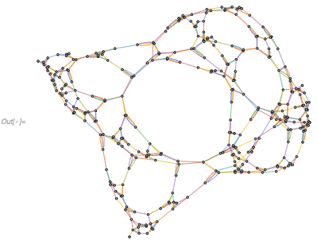

# SetReplace

## Introduction

This Wolfram Language package implements a substitution system such that in each step an unordered subset of a list is removed and replaced with different subset. This replacement is governed by a list of specified rules.

An example of such a system would be removing an element of a linked list as follows:
```
In[.] := SetReplace[{{0, 1}, {1, 2}, {2, 3}}, {{a_, b_}, {b_, c_}} :> {{a, c}}, 2]
```
```
Out[.] = {{0, 3}}
```

Here, the linked list is specified as the first argument, followed by the replacement rule, and the number of steps.

Similarly, one can create a rule that inserts elements to a linked list:

```
In[.] := SetReplace[{{0, 1}}, {{a_, b_}} :>
  Module[{new}, {{a, new}, {new, b}}], 2]
```
```
Out[.] = {{v11, 1}, {0, v12}, {v12, v11}}
```

As using Module every time might become cumbersome, an alternative syntax is available, where integers are automatically converted into patterns,
```
In[.] := SetReplace[{{0, 1}},
 Echo@FromAnonymousRules[{{0, 1}} -> {{0, 2}, {2, 1}}], 2]
```
```
>> {{v1_,v2_}}:>Module[{v3},{{v1,v3},{v3,v2}}]
Out[.] = {{v13, 1}, {0, v14}, {v14, v13}}
```

## Graph Rewrites

One can also think of this system as a directed hypergraph substitution system (each list in the set can be thought of a directed hyperedge), and a special case of that is a network substitution (graph rewrite) system.

For example, one can make a system that takes a vertex with three out-edges and replaces it with a triangle of vertices

```
In[.] := pointToTriangle = {{0, 1}, {0, 2}, {0, 3}} -> {{4, 5}, {5, 4}, {4,
     6}, {6, 4}, {5, 6}, {6, 5}, {4, 1}, {5, 2}, {6, 3}};
In[.] := Graph /@ Apply[DirectedEdge, pointToTriangle, {2}]
```


```
In[.] := Graph[DirectedEdge @@@
  SetReplace[{{0, 1}, {0, 2}, {0, 3}},
   FromAnonymousRules[pointToTriangle], 13]]
```


Unlike tradition graph rewrite systems, multiple-vertex edges are supported as well as first-class citizens:
```
In[.] := hyperedgeToTriangle = {{1, 2, 3}} -> {{5, 6, 1}, {6, 4, 2}, {4, 5, 3}};
In[.] := HypergraphPlot[#, VertexLabels -> "Name"] & /@ hyperedgeToTriangle
```


```
In[.] := HypergraphPlot[
 SetReplace[{{1, 2, 3}}, FromAnonymousRules[hyperedgeToTriangle], 13]]
```


Here HypergraphPlot function is used, which takes a list of lists as an input, and shows these lists as hyperedges, each in a different color.

## Applications

One application of this system is a fundamental physics models as described in Stephen Wolfram's [A New Kind Of Science](https://www.wolframscience.com/nks/chap-9--fundamental-physics/).

The system described there is not the same, but it follows the same general principles.

## Implementations

There are two implementations available: one written in Wolfram Language, and one in C++.

The Wolfram Language implementation converts SetRepalce rules into a list of all permutations of ordinary rules, and then calls Replace repeatedly. This works well for rules with small inputs, and for small number of evolution steps. Note, evaluation time increases non-linearly with the number of steps, so this implementation is generally unusable if the number of steps is >~ 100.

The C++ implementation is optimized for:
1. Rules that do not change.
2. Vertex degrees are small (not just in the rule inputs, but in the set itself).
3. Rule inputs are reasonably small.

If these are satisfied, C++ implementation runs in a linear time with the number of steps, which allows for generation of very large graphs (i.e., ~10^6 vertices or more). However, this implementation fails dramatically if vertex degrees grow large. For example the following
```
In[.] := SetReplace[{{0}},
  FromAnonymousRules[{{{0}} -> {{0}, {0}, {0}}, {{0}, {0}, {0}} -> {{0}}}], 30];
```
takes 3.25 seconds in C++ implementation, and less than 1 millisecond in Wolfram Language one.

Hence a general rule for choosing an implementation is this: if one wants to check a large number of rules for small number of steps, then it's best to use Wolfram Language implementation. If one wants to simulate a single rule satisfying conditions above for a large number of steps, it's best to use C++ implementation.

Implementation can be specified with a "Method" option (the default is C++), i.e.,
```
In[.] := HypergraphPlot@
 SetReplace[{{0, 1}, {0, 2}, {0, 3}},
  FromAnonymousRules[{{0, 1}, {0, 2}, {0, 3}} -> {{4, 5}, {5, 4}, {4,
      6}, {6, 4}, {5, 6}, {6, 5}, {4, 1}, {5, 2}, {6, 3}, {1, 6}, {3,
      4}}], 100, "Method" -> "C++"]
```


or

```
In[.] := HypergraphPlot@
 SetReplace[{{0, 1}, {0, 2}, {0, 3}},
  FromAnonymousRules[{{0, 1}, {0, 2}, {0, 3}} -> {{4, 5}, {5, 4}, {4,
      6}, {6, 4}, {5, 6}, {6, 5}, {4, 1}, {5, 2}, {6, 3}, {1, 6}, {3,
      4}}], 100, "Method" -> "WolframLanguage"]
```


If studying a particular rule in detail, it is also a good idea to evaluate it with both C++ and Wolfram Language implementations and make sure the results are the same. If they are not, please, create an issue on GitHub, and include the rule in it that produces the discrepancy.

## Other SetReplace functions

There are other functions available, such as SetReplaceAll, SetReplaceFixedPoint and SetReplaceList. Only Wolfram Language implementation is available for these at the moment. They all have usage strings, so just run
```
In[.] := ?SetReplace`*
```


to see the full list and explore.

## Neat examples

One example of a class 3 or 4 (unclear which) system is
```
In[.] := GraphPlot[
 UndirectedEdge @@@
  SetReplace[{{0, 0}, {0, 0}, {0, 0}},
   FromAnonymousRules[{{0, 1}, {0, 2}, {0, 3}} -> {{4, 5}, {5, 4}, {4,
        6}, {6, 4}, {5, 6}, {6, 5}, {4, 1}, {5, 2}, {6, 3}, {1,
       6}, {3, 4}}], 10000]]
```


One can also delete some edges from the right-hand side of the rule to get the following:
```
In[.] := GraphPlot[
 neat2 = Graph[
   DirectedEdge @@@
    SetReplace[{{0, 0}, {0, 0}, {0, 0}},
     FromAnonymousRules[{{0, 1}, {0, 2}, {0, 3}} -> {{1, 6}, {6,
         4}, {6, 5}, {5, 6}, {6, 3}, {3, 4}, {5, 2}}], 10000]]]
```


This interesting thing about this is that it creates a planar graph

```
In[.] := PlanarGraphQ[neat2]
```
```
Out[.] = True
```

which still looks quite complex.

## Build

macOS, Linux and Windows are all supported. To build the paclet:

1. `cd` to the root directory of the repository.
2. Run `./build.wls`.
3. Then run `./install.wls` to install the paclet into your Wolfram system.
4. Restart any running Wolfram kernels.
5. Every time before using the package, evaluate ``<< SetReplace` `` to import.
