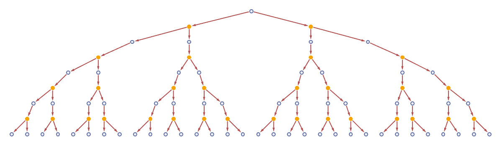
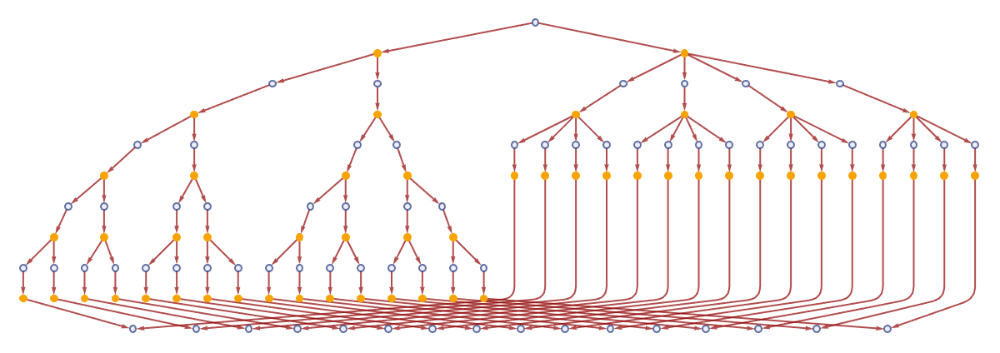
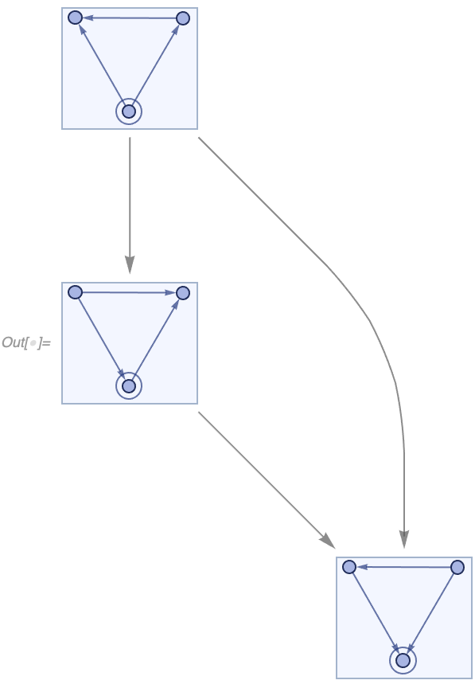
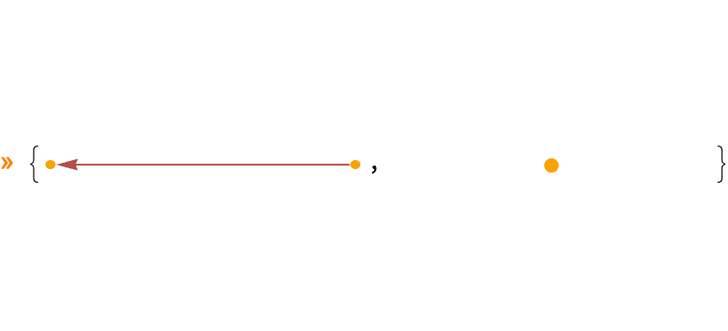
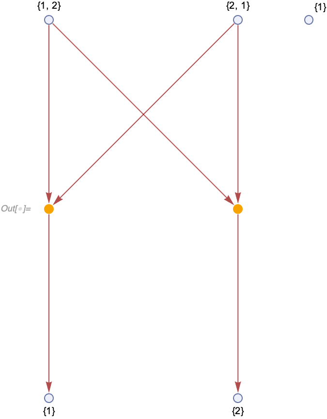
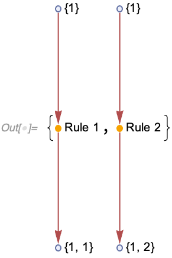
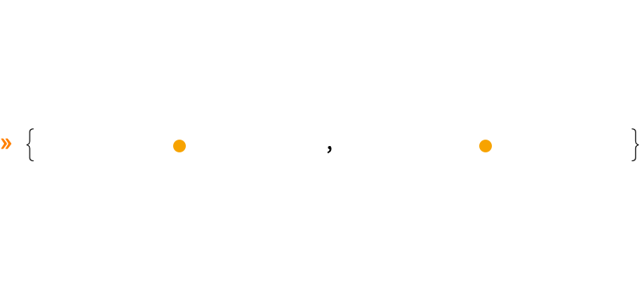
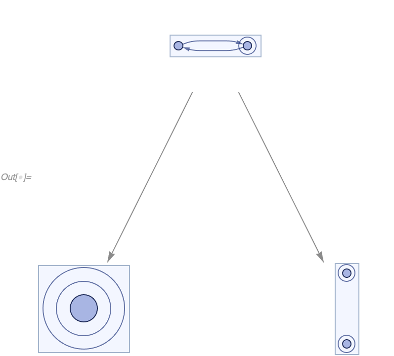

# Confluence and Causal Invariance

## Introduction

There are claims made in the [Wolfram Physics Project](https://www.wolframphysics.org) about the equivalence of
confluence and causal invariance.
This note demonstrates that some of these claims are not correct.
For example, consider
[the glossary](https://www.wolframphysics.org/glossary/#CausalInvariance) on the project's website, which,
[as of 10/30/2020](http://web.archive.org/web/20201030155847/https://www.wolframphysics.org/glossary/#CausalInvariance),
says:

> **Causal Invariance**: A property of multiway graphs whereby all possible paths yield the isomorphic causal graphs.
> When causal invariance exists, every branch in the multiway system must eventually merge.
> Causal invariance is a core property associated with relativistic invariance, quantum objectivity, etc.
> In the theory of term rewriting, a closely related property is confluence.
> In a terminating system, causal invariance implies that whatever path is taken, the "answer" will always be the same.

> **Confluence**: A simplified form of causal invariance considered in term rewriting systems such as ones that reach
> fixed points.

However, the glossary does not explicitly define confluence, so we are going to use the
[standard definition](https://en.wikipedia.org/wiki/Confluence_%28abstract_rewriting%29#General_case_and_theory) from
the theory of rewriting systems:

> A state *a* is deemed **confluent** if, for all pairs of states *b*, *c* that can be reached from *a*, there exists a
> state *d* that can be reached from both *b* and *c*.
> If every state in the system is confluent, the system itself is confluent.

We can summarize the statements above with the following definitions:

> A Wolfram model evolution is called **causal invariant** if and only if the
> [causal graphs](/Documentation/SymbolsAndFunctions/WolframModelAndWolframModelEvolutionObject/Properties/CausalGraphs.md)
> for singleway evolutions with any possible
> [event ordering functions](/Documentation/SymbolsAndFunctions/WolframModelAndWolframModelEvolutionObject/Options/EventOrderingFunction.md)
> are isomorphic.

Note that the definition above is only meaningful for terminating systems (i.e., the systems that always reach a
[`"FixedPoint"`](/Documentation/SymbolsAndFunctions/WolframModelAndWolframModelEvolutionObject/Properties/TerminationReason.md),
a state during the evolution where no more matches can be made to its expressions).

We can then define confluence as:

> A Wolfram model evolution is called **confluent** if and only if any pair of partial singleway evolutions starting
> from a particular state can be continued in such a way as to reach isomorphic final states.

In what follows, we will demonstrate that causal invariance is *not* equivalent to confluence, neither of them implies
the other, and the two statements made above are false:

> When causal invariance exists, every branch in the multiway system must eventually merge.

> In a terminating system, causal invariance implies that whatever path is taken, the "answer" will always be the same.

We will not make any comments in this note about the physics claims made above.

Before we get to specific examples, it's essential to understand the fundamental difference between these two
properties.
*Causal invariance* has to do with symmetries between evolution branches of
[expressions-events graphs](/Documentation/SymbolsAndFunctions/WolframModelAndWolframModelEvolutionObject/Properties/CausalGraphs.md).
It requires that, even though the branches operate on different expressions, they have the same causal structure:

<!--
```wl
WolframModel[{{{1, 1, 2}} -> {{1, 1, 3}, {3, 3, 2}}, {{1, 2,
      2}} -> {{1, 3, 3}, {3, 2, 2}}}, {{1, 1, 1}}, 4,
  "EventSelectionFunction" ->
   "MultiwaySpacelike"]["ExpressionsEventsGraph", ImageSize -> 600]
```
-->



On the other hand, *confluence* has to do with the symmetries between expressions' contents.
It requires that particular states from different branches are isomorphic as hypergraphs, regardless of the causal
structures that lead to them:

<!--
```wl
atomsEventsEdges[evolution_] :=
 Module[{partID},
  EdgeList@VertexReplace[
    evolution[
     "ExpressionsEventsGraph"], {{"Expression", n_} :>
      evolution["AllExpressions"][[n]], {"Event", n_} :> {"Event",
       partID, n}}]]
Module[{leftBranch, rightBranch}, Graph[Join[
   atomsEventsEdges[
    WolframModel[<|
      "PatternRules" -> {{{1, 1, 1}} :> {{1, 1, 2}, {2, 2, 1}}, {{1,
           1, 1}} :> {{1, 3, 3}, {3, 2, 2}, {2, 4, 4}, {4, 1,
           1}}}|>, {{1, 1, 1}},
     "EventSelectionFunction" -> "MultiwaySpacelike"]],
   atomsEventsEdges[
    leftBranch =
     WolframModel[{{1, 1, 2}} -> {{1, 1, 3}, {3, 3, 2}}, {{1, 1,
        2}, {2, 2, 1}}, 3,
      "EventSelectionFunction" -> "MultiwaySpacelike"]],
   atomsEventsEdges[rightBranch = WolframModel[<|"PatternRules" -> {
         {{1, 3, 3}} :> {{1, 9, 9}, {9, 5, 5}, {5, 10, 10}, {10, 3,
            3}},
         {{3, 2, 2}} :> {{3, 11, 11}, {11, 6, 6}, {6, 12, 12}, {12, 2,
             2}},
         {{2, 4, 4}} :> {{2, 13, 13}, {13, 7, 7}, {7, 14, 14}, {14, 4,
             4}},
         {{4, 1, 1}} :> {{4, 15, 15}, {15, 8, 8}, {8, 16, 16}, {16, 1,
             1}}}|>, {{1, 3, 3}, {3, 2, 2}, {2, 4, 4}, {4, 1, 1}},
      "EventSelectionFunction" -> "MultiwaySpacelike"]],
   atomsEventsEdges[
    WolframModel[{{{1, 2, 2}} -> {{1, 2}}, {{1, 1, 2}} -> {{1, 2}}},
     Join[leftBranch["FinalState"], rightBranch["FinalState"]], 1,
     "EventSelectionFunction" -> "MultiwaySpacelike"]]],
  GraphLayout -> {"LayeredDigraphEmbedding",
    "VertexLayerPosition" -> {9, 8, 8, 9, 8, 8, 8, 8, 10, 7, 6, 6, 7,
      6, 6, 5, 4, 4, 5, 4, 4, 5, 4, 4, 5, 4, 4, 3, 2, 2, 3, 2, 2, 3,
      2, 2, 3, 2, 2, 3, 2, 2, 3, 2, 2, 3, 2, 2, 3, 2, 2, 7, 6, 6, 6,
      6, 7, 6, 6, 6, 6, 7, 6, 6, 6, 6, 7, 6, 6, 6, 6, 1, 0, 1, 0, 1,
      0, 1, 0, 1, 0, 1, 0, 1, 0, 1, 0, 1, 0, 1, 0, 1, 0, 1, 0, 1, 0,
      1, 0, 1, 0, 1, 0, 5, 5, 5, 5, 5, 5, 5, 5, 5, 5, 5, 5, 5, 5, 5,
      5}}, VertexStyle -> {_ ->
     WolframPhysicsProjectStyleData["ExpressionsEventsGraph",
      "ExpressionVertexStyle"], {"Event", ___} ->
     WolframPhysicsProjectStyleData["ExpressionsEventsGraph",
      "EventVertexStyle"]},
  EdgeStyle ->
   WolframPhysicsProjectStyleData["ExpressionsEventsGraph",
    "EdgeStyle"], ImageSize -> 600]]
```
-->



## Confluence !=> Causal Invariance

Consider the following system:

```wl
confluentRule = {{1}, {1, 2}} -> {{1, 2}, {2}};
confluentInit = {{1}, {1, 2}, {2, 3}, {1, 3}};
```

This system is confluent, as any partial evolution, if continued, will always terminate at the final state isomorphic to
`{{1, 2}, {2, 3}, {1, 3}, {3}}`:

```wl
In[] := ResourceFunction["MultiwaySystem"][
  "WolframModel" -> {confluentRule}, {confluentInit}, 2, "StatesGraph", VertexSize -> 1]
```



However, this system is not causal invariant.
We can generate two non-isomorphic causal graphs by using different event ordering functions, which contradicts the
definition above:

```wl
In[] := IsomorphicGraphQ @@ Echo @ (
  WolframModel[confluentRule, confluentInit, Infinity, "EventOrderingFunction" -> #][
    "CausalGraph"] & /@ {"OldestEdge", "NewestEdge"})
```



```wl
Out[] = False
```

Therefore, confluence *does not imply* causal invariance.

Note that the `"CausalInvariantQ"` property of
[`MultiwaySystem`](https://resources.wolframcloud.com/FunctionRepository/resources/MultiwaySystem) checks for
confluence despite its name:

```wl
In[] := ResourceFunction["MultiwaySystem"]["WolframModel" -> {confluentRule}, {confluentInit}, 2, "CausalInvariantQ"]
Out[] = True
```

## Causal Invariance !=> Confluence

Consider the following causal invariant system:

```wl
causalInvariantRule = {{1, 2}, {2, 1}} -> {{1}};
causalInvariantInit = {{1, 2}, {2, 1}, {1}};
```

To see that it's causal invariant, note that the multiway system in this case only has two events:

```wl
In[] := WolframModel[
  causalInvariantRule, causalInvariantInit, Infinity, "EventSelectionFunction" -> "MultiwaySpacelike"][
    "ExpressionsEventsGraph", VertexLabels -> Automatic]
```



These two events correspond to two different singleway evolutions terminating at states `{{1}, {1}}` and `{{1}, {2}}`,
respectively:

```wl
In[] := WolframModel[causalInvariantRule, causalInvariantInit, Infinity, "EventOrderingFunction" -> #][
  "ExpressionsEventsGraph", VertexLabels -> Placed[Automatic, After]] & /@ {"RuleOrdering", "ReverseRuleOrdering"}
```



These evolutions yield isomorphic causal graphs, which are composed of a single vertex with no edges, implying that this
system is causal invariant by definition:

```wl
In[] := IsomorphicGraphQ @@ Echo @ (
  WolframModel[causalInvariantRule, causalInvariantInit, Infinity, "EventOrderingFunction" -> #]["CausalGraph"] & /@
    {"RuleOrdering", "ReverseRuleOrdering"})
```



```wl
Out[] = True
```

It is not, however, confluent, because the final states in these two evolutions are not isomorphic, and the evolutions
terminate after these states are reached:


```wl
In[] := ResourceFunction["MultiwaySystem"][
  "WolframModel" -> {causalInvariantRule}, {causalInvariantInit}, 2, "StatesGraph", VertexSize -> .7]
```



Therefore, causal invariance *does not imply* confluence.

Note that the `"CausalInvariantQ"` property of
[`MultiwaySystem`](https://resources.wolframcloud.com/FunctionRepository/resources/MultiwaySystem) returns
[`False`](https://reference.wolfram.com/language/ref/False.html) in this case:

```wl
In[] := ResourceFunction["MultiwaySystem"][
  "WolframModel" -> {causalInvariantRule}, {causalInvariantInit}, 2, "CausalInvariantQ"]
Out[] = False
```

## Future Research

It would be interesting to investigate the systems exhibiting these properties in different combinations.
For example, systems that don't exhibit [multiway branching](/Research/LocalMultiwaySystem/LocalMultiwaySystem.md) at
all do satisfy both of these conditions.
It might be possible to generalize this to include more classes of systems.
We could also enumerate ([#57](https://github.com/maxitg/SetReplace/issues/57)) simple rules and determine how many of
them exhibit just one of these properties, both or neither.

To do that, we need to implement tests for both confluence ([#59](https://github.com/maxitg/SetReplace/issues/59),
[#477](https://github.com/maxitg/SetReplace/issues/477)) and causal invariance
([#486](https://github.com/maxitg/SetReplace/issues/486)) in *SetReplace*.

We will also need to generalize the definition of causal invariance to non-terminating Wolfram models
([#487](https://github.com/maxitg/SetReplace/issues/487)).

It will be interesting to investigate other similar properties.
For example, one can investigate a stronger version of confluence:
1. Consider any infinite singleway evolution of a system.
2. Consider another finite partial singleway evolution.
3. If any such finite evolution can be continued in such a way as to reach one of the states from the infinite
evolution, we define the system as *"super"-confluent* ([#478](https://github.com/maxitg/SetReplace/issues/478)).
