# Local Multiway System

## Introduction

This note introduces [local multiway systems](/README.md#eventselectionfunction) and examines them in the context of the
singleway and [global multiway](https://resources.wolframcloud.com/FunctionRepository/resources/MultiwaySystem) systems.

By default, [`WolframModel`](/README.md#wolframmodel-and-wolframmodelevolutionobject) computes only a single branch of
the evolution.
If there are multiple matches of the rules to the hypergraph, only one of these matches will be turned into an
actualized event, and the other matches will be ignored.
They will not appear in the evolution object.

This, however, introduces a dependence on the [evaluation order](/README.md#eventorderingfunction), which might not be
desirable if one's goal is to eliminate arbitrariness from the system.

There are multiple possible resolutions to this problem.
One is to only consider causal invariant rules, i.e., the rules with a property such that the result of the evolution
does not depend on the event order.
This is, however, quite limiting, as we will be ignoring the majority of the rules.
Also, the idea of having multiple possible evolution paths is, in itself, interesting to investigate.

Another approach is to consider the so-called multiway systems, which evaluate all possible ways to resolve such
overlaps between matches.
This is the approach that is discussed in this note.

The original type of the multiway system that was first considered in the
[Wolfram Physics Project](https://www.wolframphysics.org) is what we will call the
[*global* multiway system](https://resources.wolframcloud.com/FunctionRepository/resources/MultiwaySystem), which will
be discussed in more detail in the next section.
Here we propose a new kind of multiway system, called a *local* multiway system.
The prime difference is that it allows one to consider the branching of only parts of space (subgraphs of the state
hypergraph) instead of the entire hypergraph all at once.

In the subsequent sections, we will discuss the local multiway system in more detail and introduce the types of
relationships possible between expressions produced during its evolution.

## Global Multiway System

The most important thing to understand about the global multiway system is that it operates on entire states.
The most fundamental object is the states graph, which has states at the vertices and updating events at the edges.
All possible updating events are determined for each state, and edges leading to new states are created.
This process is then repeated for the new states.

Let's consider an instance of the global multiway system (implemented in the
[`MultiwaySystem`](https://resources.wolframcloud.com/FunctionRepository/resources/MultiwaySystem) resource function).
Specifically, let's start with a rule that moves a "particle" (a unary expression) along directed edges in a graph:

```wl
In[] := RulePlot[WolframModel[{{1}, {1, 2}} -> {{1, 2}, {2}}]]
```

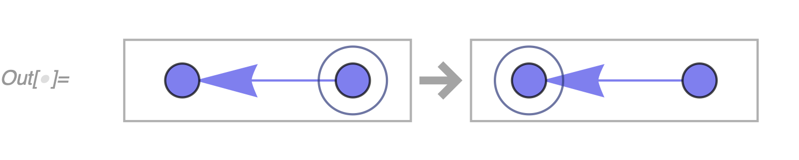

If we run this system on a path graph with 3 vertices, we get a very simple behavior:

```wl
In[] := ResourceFunction["MultiwaySystem"][
 "WolframModel" -> {{{1}, {1, 2}} -> {{1, 2}, {2}}}, {{{1}, {1, 
    2}, {2, 3}}}, 3, "StatesGraph", VertexSize -> 1]
```

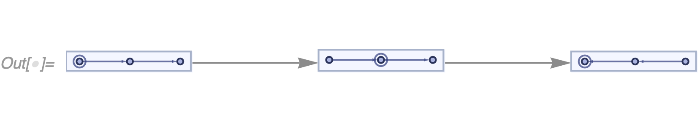

Now, what happens if we split the path in this graph into two different branches?
In this case, the rules will lead to non-deterministic behavior&mdash;multiple choices of substitutions are
possible&mdash;so the system explores all possible choices at once:

```wl
In[] := ResourceFunction["MultiwaySystem"][
 "WolframModel" -> {{{1}, {1, 2}} -> {{1, 2}, {2}}}, {{{1}, {1,
    2}, {2, 3}, {2, 4}, {4, 5}}}, 4, "StatesGraph", VertexSize -> 1,
 GraphLayout -> "LayeredDigraphEmbedding"]
```

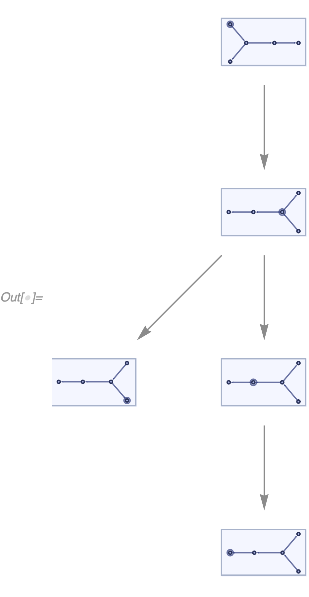

Now the states graph itself splits into two branches, mirroring precisely the input graph.

One important feature of
[`MultiwaySystem`](https://resources.wolframcloud.com/FunctionRepository/resources/MultiwaySystem) is that if it
encounters multiple states that are isomorphic, it merges them into one.
For example, if instead of the input graph in the example above we use the graph where the branches have the same
length, the system will combine them, and we will not see the splitting behavior:

```wl
In[] := ResourceFunction["MultiwaySystem"][
 "WolframModel" -> {{{1}, {1, 2}} -> {{1, 2}, {2}}}, {{{1}, {1,
    2}, {2, 3}, {3, 4}, {2, 5}, {5, 6}}}, 3, "StatesGraph",
 VertexSize -> 1, GraphLayout -> "LayeredDigraphEmbedding"]
```

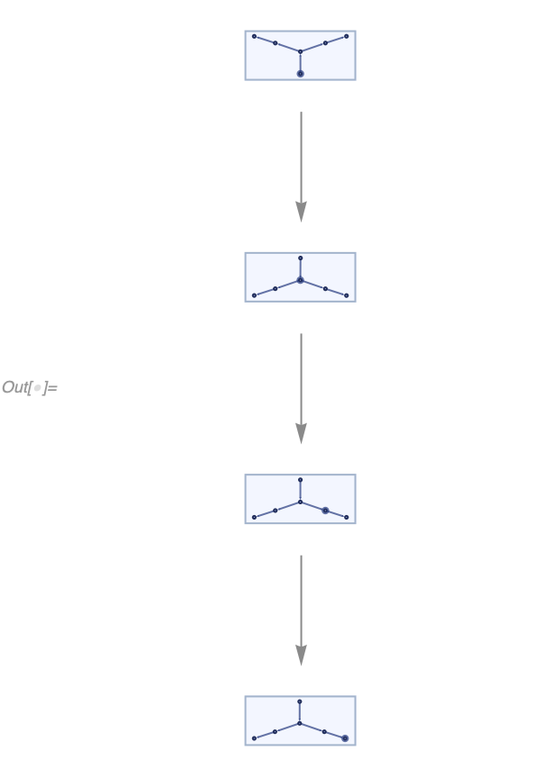

This is why our original graph uses branches of different lengths (`{{2, 3}}` and `{{2, 4}, {4, 5}}`).

But what if we start with particles on different branches and let them merge?

```wl
In[] := ResourceFunction["MultiwaySystem"][
 "WolframModel" -> {{{1}, {1, 2}} -> {{1, 2}, {2}}}, {{{a1}, {a1,
    a2}, {a2, a3}, {a3, m1}, {b1}, {b1, b2}, {b2, m1}, {m1,
    m2}}}, 7, "StatesGraph", VertexSize -> {1.6, 0.32},
 GraphLayout -> "LayeredDigraphEmbedding", EdgeStyle -> Automatic,
 GraphHighlight -> {{{1}, {2}, {1, 3}, {2, 4}, {3, 5}, {4, 6}, {5,
      6}, {6, 7}} -> {{1}, {2}, {1, 3}, {2, 4}, {3, 5}, {4, 5}, {5,
      6}, {7, 1}}, {{1}, {2}, {1, 3}, {2, 4}, {3, 5}, {5, 4}, {4,
      6}, {7, 2}} -> {{1}, {2}, {1, 3}, {2, 4}, {3, 4}, {4, 5}, {6,
      1}, {7, 2}}}]
```


Note that even at the first step, the system branches in two different states.
However, there is no ambiguity.
The two events there occur at entirely different places in space.
Note also that some events are duplicated.
For example, the two events highlighted red are the same event, as they both correspond to the particle on a more
extended branch moving one step.

So, based on the above, there are two issues with the global multiway system.

First, there is an incredible amount of redundancy.
In particular, if there is an event that happened somewhere in a faraway galaxy, it would mean the entire universe,
including all of the expressions here on Earth, duplicates, which seems both strange and unnecessary, and is
fundamentally non-local.
In other words, there is exponentially more data in the global multiway system than is necessary to describe the state
of the universe completely.

Second, it is hard to distinguish between space evolving in disconnected regions in parallel (i.e., spacelike events)
and multiway branching due to overlapping event inputs (i.e., branchlike events).

In the global multiway system, these look identical.
The only way to distinguish them is to examine their input and output states, which is a highly nontrivial problem,
especially given that both states are canonicalized.

To illustrate the point, here is an example of a branchlike- and a spacelike-separated pair of events, respectively:

```wl
In[] := ResourceFunction["MultiwaySystem"]["WolframModel" -> #1, {#2}, 2,
   "StatesGraph", VertexSize -> {1.6, 0.32},
   GraphLayout -> "LayeredDigraphEmbedding",
   EdgeStyle -> Automatic] & @@@ {{{{{1, 2}, {2, 3}} -> {{1, 2, 3}},
    {{1, 2, 3}} -> {{1, 3}}},
   {{1, 2}, {2, 3}, {3, 4}}},
  {{{{1, 2}} -> {{1, 2, 3}}}, {{1, 2}, {2, 3}}}}
```

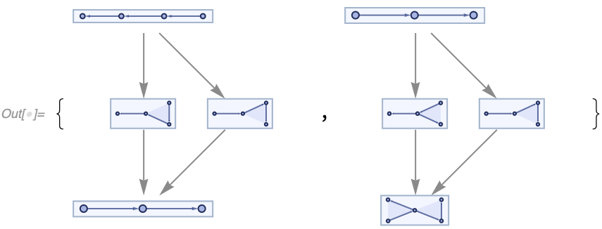

## Local Multiway System

Let us then consider a different approach.
Suppose we have a system with overlapping pairs of rule matches.
We still want to include all of those events in the multiway system.
But instead of duplicating the entire state, we will do that locally; i.e., we will have multiple branches growing from
that pair of events, and we will weave them into a single data structure describing the entire multiway system.
The states themselves will then be reconstructed afterward in post-processing.

This approach sounds complicated at first, but it is more straightforward than it appears.
To understand how it would work, let's think first about how one would implement a singleway Wolfram model evolution.

### Data Structure

In our implementation, the data structure is simply a set of expressions, and each expression has information about
events that have created and destroyed it:

```wl
{<|"Atoms" -> {atom1, atom2, ...},
   "CreatorEvent" -> eventIndex,
   "DestroyerEvent" -> eventIndex|>, ...}
```

The collection of these objects is essentially the *only* thing that needs to be returned from the evolution code.
Things like [`"StatesList"`](/README.md#states) and [`"CausalGraph"`](README.md#causal-graphs) can be reconstructed.

The causal graph, in particular, is the simplest one to reconstruct.
Indeed, if each event is a vertex, and each expression is an edge going from its `#CreatorEvent` to its
`#DestroyerEvent`, that would immediately give us a causal graph.

Reconstructing states is a bit more complicated, but it can be done by selecting a foliation of a causal graph, i.e., a
subset of events including all of their dependencies, and selecting all expressions that were created but not destroyed
by one of those events.

### Index of Matches

In addition to this data structure, we need to have an index of matches.
It's a set of all possible matches that can be made to the current state, and it is updated after each event is applied.

It is initially created at the construction of the system by indexing the initial condition.
Each event's outputs are then indexed after its instantiation (potentially by matching those outputs with their
neighbors).
The matches that involve the input expressions are deleted from the index, and the expressions themselves are not
allowed to be used in further matching.

This deletion causes the system to be singleway, as once an expression is used in an event, it can never be matched
again.
It is also the reason there is only one destroyer event for each expression.

### Match-All Local Multiway System

However, imagine that instead of deleting all matches involving the input expressions, we will only remove the
instantiated match.
With only that change, we will evolve the system precisely the same way we used to.

Note, in this case, we will automatically get a multiway system&mdash;in fact, the
[match-all](/README.md#eventselectionfunction) version of it.
It is called match-all because it will match not only the spacelike sets of expressions but also branchlike and even
timelike ones.

### Evolution

To understand what it means, let's try some examples.
Even the most trivial rules become too complicated quite quickly in the match-all system, so let's use the pattern rules
with globally named atoms here.
We will be using the [`"ExpressionsEventsGraph"`](/README.md#causal-graphs) property of the
[`WolframModel`](/README.md#wolframmodel-and-wolframmodelevolutionobject), which will allow us to see both expressions
and events on the same graph.

Let's then take a look at the following system:

```wl
In[] := WolframModel[<|"PatternRules" -> {{{1, 2}} -> {{2, 3}},
     {{1, 2}, {2, 3}} -> {{1, 2, 3}}}|>,
  {{1, 2}}, Infinity,
  "EventSelectionFunction" -> None]["ExpressionsEventsGraph",
 VertexLabels -> Placed[Automatic, After]]
```

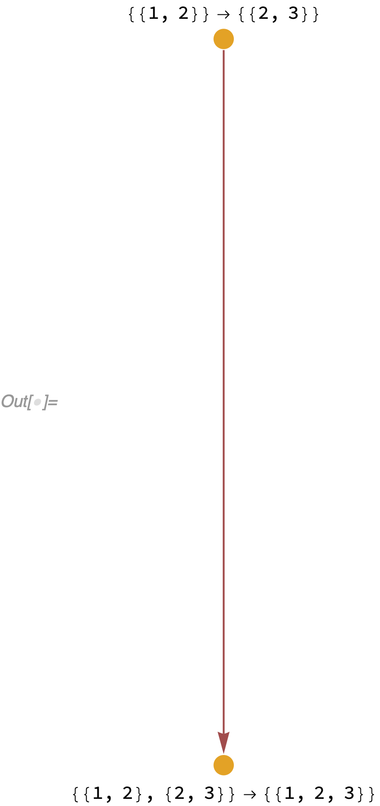

In this case we have two rules, `{{1, 2}} -> {{2, 3}}` and `{{1, 2}, {2, 3}} -> {{1, 2, 3}}`.
Note that here `1`, `2` and `3` are not patterns but labeled vertices.
We have started with an initial condition, which is a single expression `{1, 2}`.
We have obtained two events.

The first event replaced `{1, 2}` with `{2, 3}`.
That is entirely normal and would happen in a singleway system as well.
However, the singleway system would terminate immediately after that, as there is only a single expression `{2, 3}` left
now, `{1, 2}` has been deleted and the second rule requires both `{1, 2}` and `{2, 3}` as inputs.
In other words, `{1, 2}` and `{2, 3}` are *timelike* expressions, and our singleway
[`WolframModel`](/README.md#wolframmodel-and-wolframmodelevolutionobject) only matches *spacelike* expressions.

However, the match-all multiway system will proceed, as both `{1, 2}` and `{2, 3}` are now in the system, and it does
not care that they are timelike.
Hence, the second event is instantiated as well, `{{1, 2}, {2, 3}} -> {{1, 2, 3}}`.
Note that at the end of this evolution, all three expressions `{1, 2}`, `{2, 3}` and `{1, 2, 3}` are open for further
matching, and the only reason further matching does not occur is because both possible exact matches have already been
instantiated.

If, however, we add another rule, `{{1, 2}, {1, 2, 3}} -> {{2, 3}}`, the system will keep evolving indefinitely, as
`{2, 3}` created after applying the new rule is not the same `{2, 3}` as was created by the first rule.
Therefore, it will be matched again by the second rule.
After that, the second and third rules will keep "oscillating", supplying inputs to one another:

```wl
In[] := WolframModel[<|"PatternRules" -> {{{1, 2}} -> {{2, 3}},
     {{1, 2}, {2, 3}} -> {{1, 2, 3}},
     {{1, 2}, {1, 2, 3}} -> {{2, 3}}}|>, {{1, 2}}, 6,
  "EventSelectionFunction" -> None]["ExpressionsEventsGraph",
 VertexLabels -> Placed[Automatic, Before]]
```

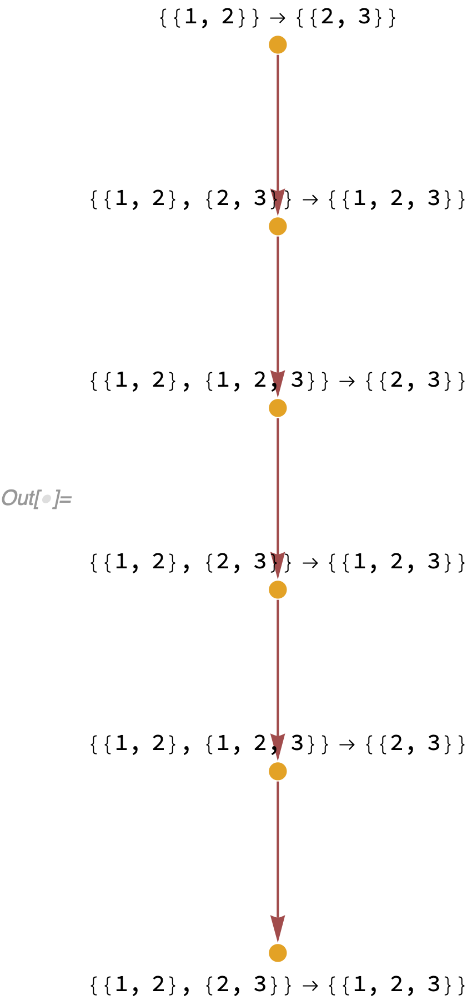

The match-all system will match branchlike events as well, as can be seen in the following example:

```wl
In[] := WolframModel[<|"PatternRules" -> {{{1, 2}} -> {{2, 3}},
     {{1, 2}} -> {{2, 4}}, {{2, 3}, {2, 4}} -> {{2, 3, 4}}}|>,
  {{1, 2}}, 6,
  "EventSelectionFunction" -> None]["ExpressionsEventsGraph",
 VertexLabels -> Placed[Automatic, After]]
```

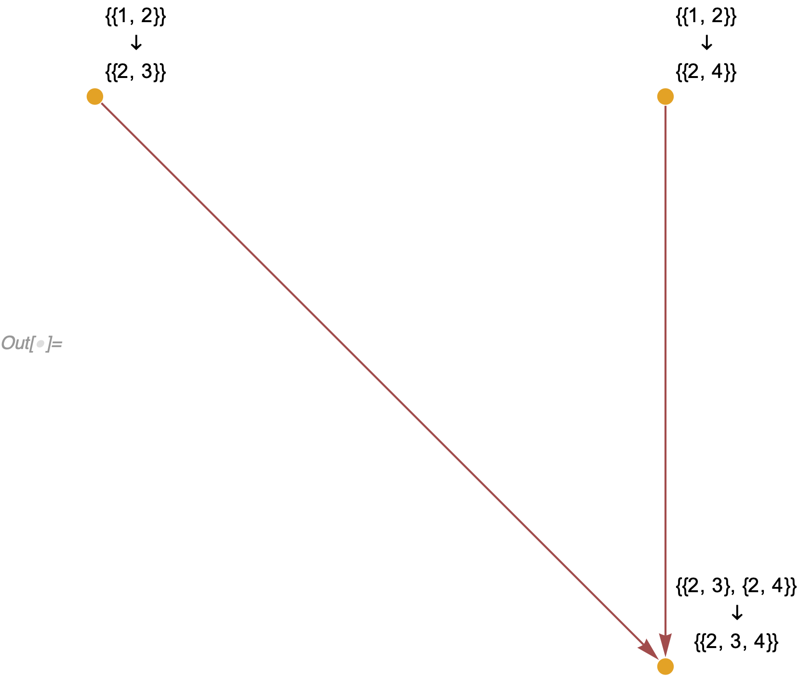

Note in the above there are two possibilities to match `{{1, 2}}`, which are incompatible according to the ordinary
[`WolframModel`](/README.md#wolframmodel-and-wolframmodelevolutionobject) and can only be achieved one at a time with
different choices of the [`"EventOrderingFunction"`](/README.md#eventorderingfunction).
However, the match-all system can still match the two outputs with the third rule.

Further note the obvious feature of the match-all system: it produces expressions and events that would occur in neither
the singleway [`WolframModel`](/README.md#wolframmodel-and-wolframmodelevolutionobject) nor the global
[`MultiwaySystem`](https://resources.wolframcloud.com/FunctionRepository/resources/MultiwaySystem).
As such, it is a form of "interference" between branches and might allow branches to merge and interact.

### Reconstruction

Reconstructing causal graphs in this system is straightforward as well.
In fact, all one needs to do is to allow multiple destroyer events:

```wl
{<|"Atoms" -> {atom1, atom2, ...},
   "CreatorEvent" -> eventIndex,
   "DestroyerEvents" -> {eventIndex1, eventIndex2, ...}|>, ...}
```

Now, each expression would correspond to exactly `Length[#DestroyerEvents]` causal edges, with each one going from the
`#CreatorEvent` to each element of the `#DestroyerEvents`.
An even more useful structure is the expressions-events graph already used above, where both events and expressions are
represented as differently colored vertices.
There is only one edge going into each expression-vertex (corresponding to its `#CreatorEvent`).
And there are `Length[#DestroyerEvents]` edges coming out of each expression-vertex.
This immediately lets us see the locations where the true multiway branching occurs.

For example, the pair of systems demonstrated above where the separation was hard to distinguish in the global multiway
system now looks like this:

```wl
In[] := WolframModel[#1, #2, 2, "EventSelectionFunction" -> None][
    "ExpressionsEventsGraph",
    VertexLabels ->
     Placed[Automatic,
      After]] & @@@ {{{{{1, 2}, {2, 3}} -> {{1, 2, 3}},
     {{1, 2, 3}} -> {{1, 3}}},
    {{1, 2}, {2, 3}, {3, 4}}},
   {{{1, 2}} -> {{1, 2, 3}}, {{1, 2}, {2, 3}}}} // (Framed[#,
      FrameStyle -> LightGray] & /@ # &)
```

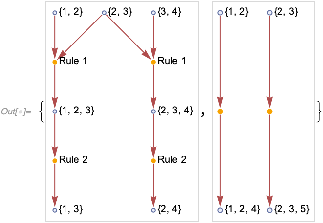

Note that the vertex `{2, 3}` in the first example has an out-degree of 2, which indicates the multiway branching.
Also note that the second example's events are entirely disconnected, as there are no causal connections between them.
In addition, there are only two events instead of four, as the local multiway system does not duplicate identical
events.

The reconstruction of spatial states is more complicated.
However, it is still relatively straightforward to understand how a local patch of space would look.
Indeed, what is space?
Ultimately, it's a collection of expressions that are all pairwise spacelike separated with one another.
And indeed, we can create such patches in a match-all system just like in any other system.

However, we need to discuss in more detail what it means for the two events or expressions to be spacelike, branchlike
or timelike.

## Expressions Separation

Suppose we want to have more control over the local multiway system's matching behavior and reproduce the global
multiway system's evolution.
In that case, we need a way to detect whether a pair of expressions is:

* Spacelike &mdash; the expressions were produced (directly or indirectly) by a single event
* Branchlike &mdash; the expressions were made (directly or indirectly) by multiple events that matched the same
expression
* Timelike &mdash; the expressions are causally related: one produced or was produced by another

And in simple systems, it is straightforward to understand what the separation is, i.e., in the following three systems,
the expressions `{2, 3}` and `{3, 4}` are spacelike, branchlike and timelike, respectively:

```wl
In[] := Framed[WolframModel[<|"PatternRules" -> #|>, {{1, 2}}, Infinity,
     "EventSelectionFunction" -> None]["ExpressionsEventsGraph",
    VertexLabels -> Placed[Automatic, After]],
   FrameStyle -> LightGray] & /@ {{{1, 2}} -> {{2, 3}, {3, 4}},
  {{{1, 2}} -> {{2, 3}}, {{1, 2}} -> {{3, 4}}},
  {{{1, 2}} -> {{2, 3}}, {{2, 3}} -> {{3, 4}}}}
```


In the first example, a single event produces two expressions, `{2, 3}` *and* `{3, 4}`.
This corresponds to a spacelike separation, as both of these expressions can appear simultaneously in a singleway
system.
In the second example, there are two possibilities: the first or the second rule can be matched to the initial
expression `{1, 2}`.
Hence, the expressions produced from that, `{2, 3}` and `{3, 4}`, are branchlike separated.
Finally, in the third example, evolution is linear.
The first event and the expression `{2, 3}` are the prerequisites for the second event and the expression `{3, 4}`.
Hence, these expressions are timelike separated.

So, if the expressions are immediate neighbors in the causal graph, as in the examples above, the separation is not hard
to determine.
However, what if the expressions are further back in history?

For example, what about the expressions `{4, 5}` and `{5, 6}` here?

```wl
In[] := WolframModel[<|
   "PatternRules" -> {{{1, 2}} -> {{2, 3}}, {{1, 2}} -> {{3, 4}},
     {{2, 3}, {3, 4}} -> {{4, 5}, {5, 6}}}|>, {{1, 2}}, Infinity,
  "EventSelectionFunction" -> None]["ExpressionsEventsGraph",
 VertexLabels -> Placed[Automatic, After]]
```

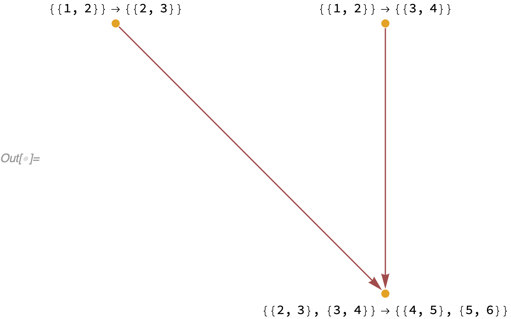

In this example, the expression `{1, 2}` first branches into two expressions `{2, 3}` and `{3, 4}`.
They are then merged by the third event, which creates two expressions, `{4, 5}` and `{5, 6}`.
In that case, the final expressions `{4, 5}` and `{5, 6}` would still be spacelike separated, as they were produced from
a single event after the branches have already merged.

But what about something like this?

```wl
In[] := WolframModel[<|"PatternRules" -> {{{v, i}} -> {{v, 1}, {v, 2}},
     {{v, 1}} -> {{v, 1, 1}, {v, 1, 2}},
     {{v, 1, 1}, {v, 2}} -> {{v, f, 1}},
     {{v, 1, 2}, {v, 2}} -> {{v, f, 2}}}|>, {{v, i}}, Infinity,
  "EventSelectionFunction" -> None]["ExpressionsEventsGraph",
 VertexLabels -> Placed[Automatic, After]]
```

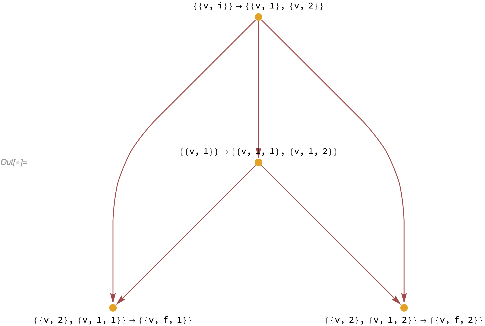

What is the separation between the expressions `{v, f, 1}` and `{v, f, 2}`?
On one hand, they are spacelike separated, because one of their common ancestors is the event
`{{v, 1}} -> {{v, 1, 1}, {v, 1, 2}}`.
But on the other hand, they are branchlike separated, as they have an expression `{v, 2}` as another common ancestor.
In other words, these expressions are mixed spacelike and branchlike separated.
And if we had an event matching both `{v, f, 1}` and `{v, f, 2}` as inputs, it would simultaneously merge different
pieces of space and two different branches.

It seems, however, that the branchial separation should take precedence.
That is because if we only allow events to match spacelike-separated expressions, we expect the evolution to be
equivalent to the global multiway system evolution.
In this case, we have to define the separation above as branchlike, as the two final expressions can never
simultaneously appear in the same singleway system.

Thus, to determine the separation between two expressions, `A` and `B`, in an expressions-events graph:
1. Compute the past causal cones of both `A` and `B`.
2. Compute the intersection between the causal cones.
3. Consider all vertices with out-degree zero (the future boundary of the intersection):
  * If the boundary contains either `A` or `B`, they are timelike separated
  * If any vertices on the boundary are expression-vertices, they are branchlike separated
  * Otherwise, all vertices on the boundary are event-vertices, and they are spacelike separated

## Spacelike-Only Local Multiway System

Now that we understand how to precisely define separations between expressions, we can make a spacelike-only multiway
system, i.e., a system that would only match pairwise spacelike groups of expressions, similar to what the global
[`MultiwaySystem`](https://resources.wolframcloud.com/FunctionRepository/resources/MultiwaySystem) does.

Indeed, all we need for that case is a verification that an event we are about to instantiate does not merge branches.

The only modification we need to do compared to the match-all system is adding matches to the index only if their inputs
are pairwise spacelike separated.
The expressions we will get then will be exactly the same as in the global
[`MultiwaySystem`](https://resources.wolframcloud.com/FunctionRepository/resources/MultiwaySystem).

It is interesting now to consider the same example of two particles starting on two different branches that [caused lots
of redundancy](#global-multiway-system) in the global
[`MultiwaySystem`](https://resources.wolframcloud.com/FunctionRepository/resources/MultiwaySystem).

As a reminder, the system evaluates the propagation of two "particles" along a directed graph:

```wl
In[] := WolframModelPlot[{{a1}, {a1, a2}, {a2, a3}, {a3, m1}, {b1}, {b1,
   b2}, {b2, m1}, {m1, m2}}, VertexLabels -> Automatic]
```

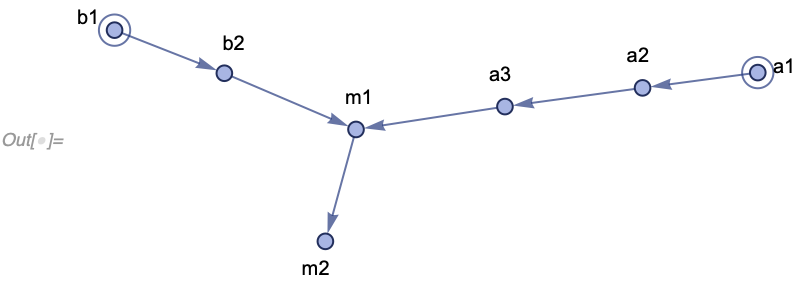

Instead of a mesh of redundant events that the global multiway system produced, we now only have two places where the
events merge:

```wl
In[] := WolframModel[{{1}, {1, 2}} -> {{1, 2}, {2}},
  {{a1}, {a1, a2}, {a2, a3}, {a3, m1}, {b1}, {b1, b2}, {b2, m1}, {m1,
    m2}}, Infinity,
  "EventSelectionFunction" ->
   "MultiwaySpacelike"]["ExpressionsEventsGraph",
 VertexLabels -> Automatic, ImageSize -> 400]
```

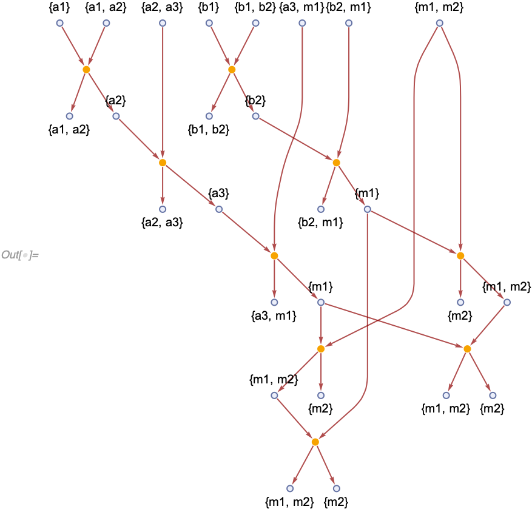

It is perhaps easier to see in a different layout:

```wl
In[] := WolframModel[{{1}, {1, 2}} -> {{1, 2}, {2}},
  {{a1}, {a1, a2}, {a2, a3}, {a3, m1}, {b1}, {b1, b2}, {b2, m1}, {m1,
    m2}}, Infinity,
  "EventSelectionFunction" ->
   "MultiwaySpacelike"]["ExpressionsEventsGraph",
 VertexLabels -> Automatic,
 GraphLayout -> "SpringElectricalEmbedding", ImageSize -> 600]
```

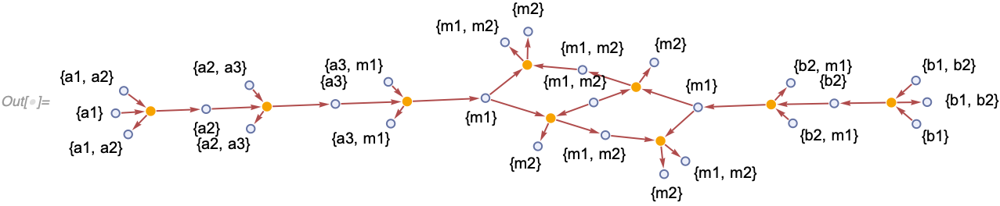

If we look closely at the events near the merge points, we can see that some redundancy remains.
However, it is no longer due to the spacelike-separated events, but rather due to the "background" expressions being
rewritten during evolution.
And as a result, if a particle follows another particle on the same "track", the expressions it's going through are
different (even though they involve the same vertices), hence the duplication.

Note that all branches are entirely independent in this kind of evolution, and they simply reproduce all possible
evolution orders in singleway systems.

## Future Research

Some further improvements and features can be implemented and investigated.

We can consider multiway systems that are neither match-all nor spacelike.
For example, one possibility would be to allow branchlike but not timelike matching.
We can even consider hybrid systems where some of the rules are spacelike and some branchlike.
The progress of that direction is tracked in [#345](https://github.com/maxitg/SetReplace/issues/345) and
[#346](https://github.com/maxitg/SetReplace/issues/346).

Another direction to consider is the deduplication of expressions.
The global [`MultiwaySystem`](https://resources.wolframcloud.com/FunctionRepository/resources/MultiwaySystem)
canonicalizes and deduplicates every state it encounters; thus, for example, the final state `{1, 2, 3, 4}` here only
appears once:

```wl
In[] := ResourceFunction["MultiwaySystem"][
 "WolframModel" -> {{{1}} -> {{1, 2, 3}},
   {{1, 2, 3}} -> {{1, 2}, {1, 3}}, {{1}} -> {{1, 2}, {1, 3}},
   {{1, 2}, {1, 3}} -> {{1, 2, 3, 4}}}, {{{1}}}, 2, "StatesGraph",
 VertexSize -> {1.6, 0.32}, GraphLayout -> "LayeredDigraphEmbedding",
 EdgeStyle -> Automatic]
```

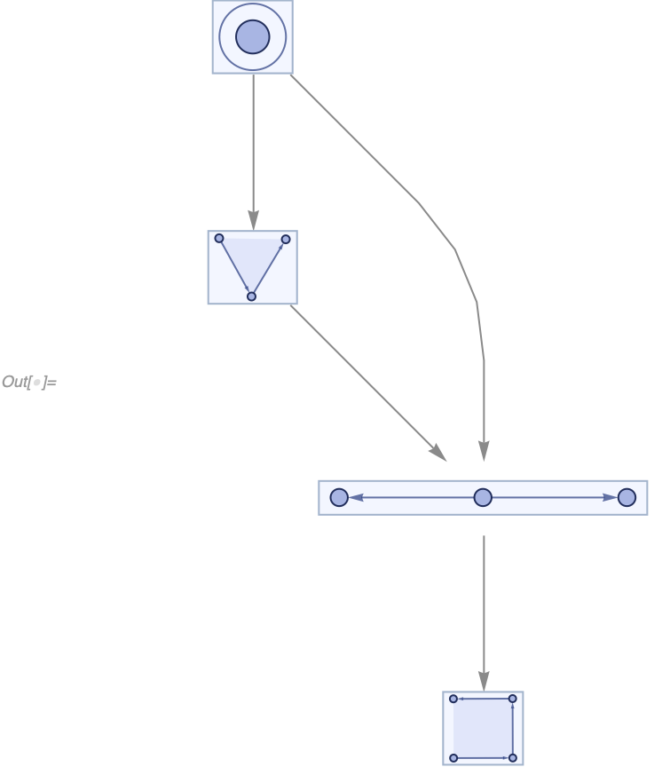

The current implementation of the local multiway system does not do that, however:

```wl
In[] := WolframModel[{{{1}} -> {{1, 2, 3}},
   {{1, 2, 3}} -> {{1, 2}, {1, 3}}, {{1}} -> {{1, 2}, {1, 3}},
   {{1, 2}, {1, 3}} -> {{1, 2, 3, 4}}}, {{1}}, Infinity,
  "EventSelectionFunction" ->
   "MultiwaySpacelike"]["ExpressionsEventsGraph",
 VertexLabels -> Automatic]
```

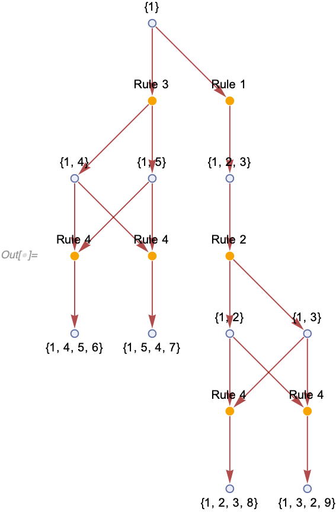

It would be interesting to introduce isomorphism testing to the local multiway system, as it will allow for a much
better understanding of how branches combine at the local level.
This isomorphism testing can be done by starting with a subset of spacelike-separated expressions.
We can then consider a pair of singleway evolutions starting from these expressions (events in them will be subsets of
the entire multiway evolution).
Let's then consider the final states of these spacelike evolutions.
Suppose they are identical up to the renaming of new atoms.
In that case, we can deduplicate the resulting expressions so that the two branches corresponding to singleway
evolutions end at the same set of expressions, even if the intermediate steps are different.

In the example above, we can consider two evolutions starting from `{{1}}` and ending at `{{1, 4}, {1, 5}` and
`{{1, 2}, {1, 3}}`, respectively.
Note that if we rename `{4 -> 2, 5 -> 3}`, the final states become identical.
Hence, we can deduplicate them, merging future evolutions (since they now start from the same set of expressions).
We then get:

```wl
In[] := Graph[{{1} -> 1, {1} -> 2, 1 -> {1, 2, 3}, {1, 2, 3} -> 3,
  2 -> {1, 2}, 2 -> {1, 3}, 3 -> {1, 2},
  3 -> {1, 3}, {1, 2} -> 4, {1, 2} -> 5, {1, 3} -> 4, {1, 3} -> 5,
  4 -> {1, 2, 3, 4}, 5 -> {1, 3, 2, 4}},
 EdgeStyle ->
  WolframPhysicsProjectStyleData["ExpressionsEventsGraph",
   "EdgeStyle"],
 VertexLabels ->
  Prepend[Automatic][# -> "Rule " <> ToString[#2] & @@@ {{1, 1}, {2,
      3}, {3, 2}, {4, 4}, {5, 4}}],
 VertexStyle -> (# ->
      WolframPhysicsProjectStyleData[
       "ExpressionsEventsGraph", #2] & @@@ {{{__Integer},
      "ExpressionVertexStyle"}, {_Integer, "EventVertexStyle"}})]
```

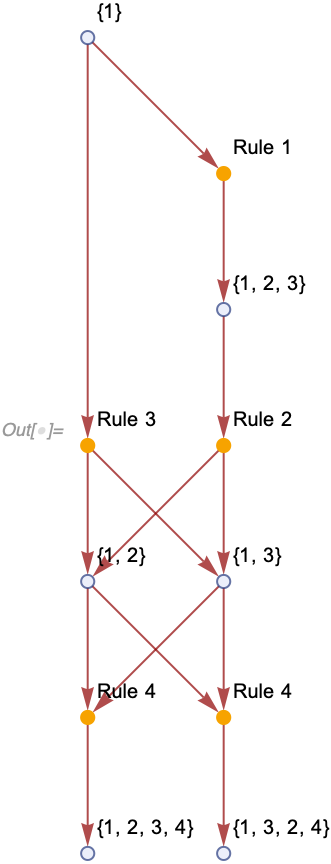

However, looking at even this simple example, we can determine that the algorithm described above is not quite right;
e.g., consider the last two expressions, `{1, 2, 3, 4}` and `{1, 3, 2, 4}`.
On the one hand, if we start all the way from `{{1}}` and consider two possible evolutions ending with `{{1, 2, 3, 4}}`
and `{{1, 3, 2, 4}}`, they should be deduplicated, as they are the same up to the renaming `2 <-> 3`.
However, if one was to deduplicate them, one of the events corresponding to rule 4 will be incorrectly instantiated, as
it will match the inputs in the order `{{1, 3}, {1, 2}}` but will name the outputs as if they were matched in the order
`{{1, 2}, {1, 3}}`.

But if there is a consistent way to define it, this approach will be the most compact representation of a multiway
system so far.
It will allow us to see the internal structure of the global multiway system evolution, which is currently inaccessible.
The implementation is tracked in [#349](https://github.com/maxitg/SetReplace/issues/349).
