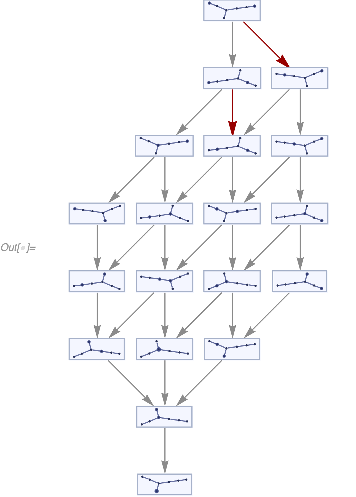
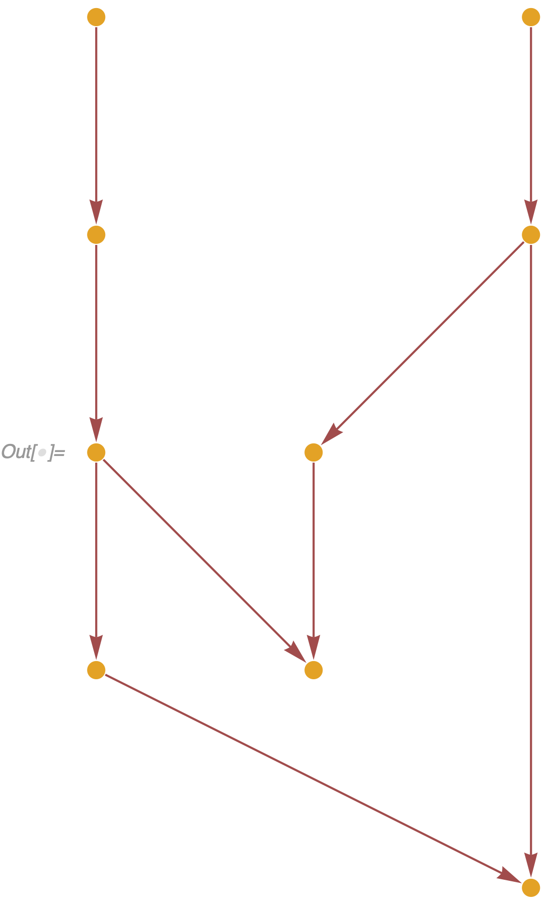
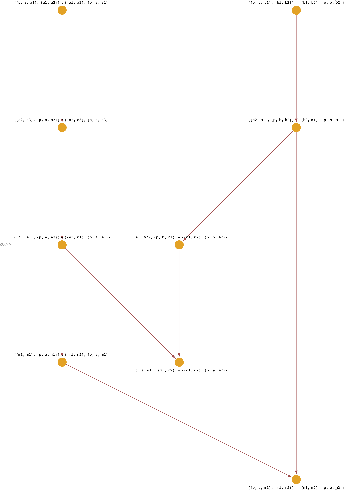

# Local Multiway System

## WolframModel

Multiway branching is not yet implemented in `WolframModel`.
If two matches are possible such that their sets of inputs overlap, only one of the matches is selected, and the other one is ignored and deleted.

However, branching is desirable, as it makes it much easier to think about quantum mechanics in these models.
Also, choosing a single path of evolution introduces arbitrariness to the system.
Now, a system of rules is insufficient, and one has to specify the event ordering function as well.

## Global Multiway System

First, I need to point out that we already have a solution to the problems described above.
It is the [`MultiwaySystem`](https://resources.wolframcloud.com/FunctionRepository/resources/MultiwaySystem) function, which, from now on, I will call the global multiway system.

And while it does solve the issues described above, it still has drawbacks.

First, it is essential to understand that unlike the `WolframModel`, the global multiway system operates on the entire states of the system.
Let's consider an instance of the `MultiwaySystem`.
Specifically, let's start with a rule that moves a "particle" (a unary edge) alone directed edges in a graph:

```wl
In[] := RulePlot[WolframModel[{{1}, {1, 2}} -> {{1, 2}, {2}}]]
```


If we run this system on a path graph with 3 vertices, we get a very simple behavior:

```wl
In[] := ResourceFunction["MultiwaySystem"][
 "WolframModel" -> {{{1}, {1, 2}} -> {{1, 2}, {2}}}, {{{1}, {1, 
    2}, {2, 3}}}, 3, "StatesGraph", VertexSize -> 1]
```


Now, what happens if we split this graph so that the evolution is non-deterministic, and there are two branches a particle can follow?

```wl
In[] := Graph[ResourceFunction["MultiwaySystem"][
  "WolframModel" -> {{{1}, {1, 2}} -> {{1, 2}, {2}}}, {{{1}, {1, 
     2}, {2, 3}, {2, 4}, {4, 5}}}, 4, "StatesGraph", VertexSize -> 1],
  GraphLayout -> "LayeredDigraphEmbedding"]
```


Now the evolution itself splits in two branches, mirroring precisely the input graph.
(Note, we needed to make the "outgoing branches" in the input graph different length, because otherwise the two final states are isomorphic, and the `MultiwaySystem` identifies them as one.)

But what if we start with particles on different branches and let them merge?

```wl
In[] := ResourceFunction["MultiwaySystem"][
 "WolframModel" -> {{{1}, {1, 2}} -> {{1, 2}, {2}}}, {{{a1}, {a1, 
    a2}, {a2, a3}, {a3, m1}, {b1}, {b1, b2}, {b2, m1}, {m1, 
    m2}}}, 7, "StatesGraph", VertexSize -> {1.6, 0.32}, 
 GraphLayout -> "LayeredDigraphEmbedding", EdgeStyle -> Automatic, 
 GraphHighlight -> {{{1}, {2}, {1, 3}, {2, 4}, {3, 5}, {4, 6}, {5, 
      6}, {6, 7}} -> {{1}, {2}, {1, 3}, {2, 4}, {3, 5}, {4, 5}, {5, 
      6}, {7, 1}}, {{1}, {2}, {1, 3}, {2, 4}, {3, 5}, {5, 4}, {4, 
      6}, {7, 2}} -> {{1}, {2}, {1, 3}, {2, 4}, {3, 4}, {4, 5}, {6, 
      1}, {7, 2}}}]
```



Note that even at the first step, the system branches in two different states.
However, there is no ambiguity.
The two events there occur at entirely different places in space.
Note also, that some events are duplicated.
For example, the two events highlighted red are the same event, as they both correspond to the particle on a more extended branch moving one step.

So, based on the above, there are two issues with the global multiway system.

First, there is an incredible amount of redundancy.
In particular, if there is an event that happened somewhere in a far away galaxy, it would mean the entire Universe, including all of the edges here on Earth, duplicates, which seems both strange and unnecessary, and is fundamentally non-local.
In other words, there are exponentially more data in the global multiway system that is necessary to describe completely the state of the Universe.

Second, it is hard to distinguish between purely classical space evolving in disconnected regions in parallel (i.e., spacelike events), and multiway branching that happens due to overlapping event inputs (i.e., branchlike events).

In the global multiway system, these look identical, and the only way to distinguish them is to examine their input and output states, which is a highly non-trivial problem, especially given that both of those states are canonicalized.

## Local Multiway System

Let us then consider a different approach.
Suppose we have a system with overlapping pairs of rule matches.
We still want to include all of those events in the multiway system.
But instead of duplicating the entire state, we will do that locally.
I.e., we will have multiple branches growing from that pair of events, and we will weave them into a single data structure describing the entire multiway system.
The states themselves will then be reconstructed afterward in post-processing.

### Current "Singleway" System

This approach sounds complicated at first, but it is more straightforward than it appears.
To understand how it would work, let's think about the `libSetReplace` implementation of `WolframModel`.

#### Datastructure

In that implementation, the datastructure is simply a set of edge structs (called `Expression`s there), and each struct simply has information about events that have created and destroyed the corresponding edge:

```c++
struct SetExpression {
  AtomsVector atoms;  // list of vertices
  EventID creatorEvent;
  EventID destroyerEvent = finalStateEvent;
  Generation generation; // here just for convenience, can be reconstructed in post-processing
};
```

The collection of these objects is essentially the *only* thing that is returned from the evolution code.
Things like `"StatesList"` and `"CausalGraph"` are reconstructed.

The causal graph, in particular, is the simplest one to reconstruct.
Indeed, if each event is a vertex, and each `SetExpression` is an edge going from its `creatorEvent` to its `destroyerEvent`, that would immediately give us a causal graph.

Reconstructing states is a bit more complicated, but it can be done by selecting a foliation of a causal graph, i.e., a subset of events including all of their dependencies, and selecting all edges that were created, but not destroyed by one of those events.

#### Index of Matches

In addition to this data structure, we have an index of matches.
It's a set of all possible matches that can be made to the current state and is updated after each event is applied.

It is initially created at the construction of the system by indexing the initial condition.
After each event is applied, the outputs of that event are indexed (potentially by matching those outputs with their neighbors).
The matches that involve the input edges are deleted from the index.

This deletion causes the system to be singleway, as once an edge is used in an event, it can never be matched again.
It is also the reason there is only one `destroyerEvent` for each `SetExpression`.

### Match-All Local Multiway System [#335](https://github.com/maxitg/SetReplace/issues/335)

Imagine however that instead of deleting all matches involving the input edges, we will only remove the particular match that was instantiated.
With only that change, we will proceed to evolve the system precisely the same way we used to.

Note, in this case, we will automatically get a multiway system, in fact, the match-all version of it, as described in [#335](https://github.com/maxitg/SetReplace/issues/335).
It is called match-all because it will match not only the spacelike sets of edges but also branchlike and even timelike ones.

#### Evolution

To understand what it means, let's try some examples using the evolution in [2992742](https://github.com/maxitg/SetReplace/commit/299274283dde6d86b6e660a36f64beaed7d73269).
In the match-all system, even the most trivial rules become extremely complicated quite quickly, so let's use the pattern rules for this one.
Furthermore, let's use a little helper function which would label the causal graph vertices with the input and output edges of the corresponding events:

```wl
labeledCausalGraph[evolution_, opts___] := 
 evolution["LayeredCausalGraph", opts, 
  VertexLabels -> 
   Thread[Range[
      evolution["EventsCount"]] -> (Placed[#, {After, Above}] &) /@ 
      OutputForm /@ (Column /@ (Riffle[List @@ #, "\[DownArrow]"] &) /@
            Last /@ evolution["EventsList"] /. 
         edgeIndex_Integer :> 
          evolution["AllExpressions"][[edgeIndex]])]]
```

Let's then take a look at the following system:

```wl
In[] := labeledCausalGraph[
 WolframModel[<|
   "PatternRules" -> {{{1, 2}} -> {{2, 3}}, {{1, 2}, {2, 3}} -> {{1, 
        2, 3}}}|>, {{1, 2}}, Infinity]]
```


In this case we have two rules, `{{1, 2}} -> {{2, 3}}` and `{{1, 2}, {2, 3}} -> {{1, 2, 3}}`.
Note that here `1`, `2` and `3` are not patterns but labeled vertices.
We have started with an initial condition, which is a single edge `{1, 2}`.
We have obtained two events.

The first event replaced `{1, 2}` with `{2, 3}`.
That is entirely normal and would happen in a singleway system as well.
However, the singleway system would terminate immediately after that, as there is only a single edge `{2, 3}` left now, `{1, 2}` has been deleted, and the second rule requires both `{1, 2}` and `{2, 3}` as inputs.
Another way of saying it is that `{1, 2}` and `{2, 3}` are **timelike** edges, and our singleway `WolframModel` only matches **spacelike** edges.

However, the match-all multiway system will proceed, as both `{1, 2}` and `{2, 3}` are now in the system, and it does not care that they are timelike.
Hence, the second event is instantiated as well, `{{1, 2}, {2, 3}} -> {{1, 2, 3}}`.
Note that at the end of this evolution, all three edges `{1, 2}`, `{2, 3}` and `{1, 2, 3}` are open for further matching, and the only reason further matching does not occur is because both possible exact matches have already been applied.

If, however, we add another rule, `{{1, 2}, {1, 2, 3}} -> {{2, 3}}`, the system will keep evolving indefinitely as `{2, 3}` created after applying the new rule is not the same `{2, 3}` as was created by the first rule.
Therefore it will be matched again by the second rule.
After that, the second and the third rules will keep "dancing" supplying inputs to one another:

```wl
In[] := labeledCausalGraph[
 WolframModel[<|
   "PatternRules" -> {{{1, 2}} -> {{2, 3}}, {{1, 2}, {2, 3}} -> {{1, 
        2, 3}}, {{1, 2}, {1, 2, 3}} -> {{2, 3}}}|>, {{1, 2}}, 6]]
```


The match-all system will match branchlike events as well, as can be seen in the following example:

```wl
In[] := labeledCausalGraph[
 WolframModel[<|
   "PatternRules" -> {{{1, 2}} -> {{2, 3}}, {{1, 2}} -> {{2, 4}}, {{2,
         3}, {2, 4}} -> {{2, 3, 4}}}|>, {{1, 2}}, 6]]
```


Note in the above there are two possibilities to match `{{1, 2}}`, which are incompatible according to the ordinary `WolframModel` and can only be achieved one-at-a-time with different choices of the `"EventOrderingFunction"`.
However, the match-all system can still match them with the third rule.

Further note the obvious feature of the match-all system is that it produces edges and events that would not occur in either the singleway `WolframModel`, nor in the global `MultiwaySystem`.
In particular, it might allow us to produce branch interference in quantum mechanics with the use of branchlike events, i.e., events which would merge edges from different branches, and hence cause the branches themselves to merge.

#### Reconstruction

Reconstructing causal graphs in this system is quite straightforward as well.
In fact, all one needs to do is to allow multiple destroyer events:

```c++
struct SetExpression {
  AtomsVector atoms;  // list of vertices
  EventID creatorEvent;
  std::vector<EventID> destroyerEvents = {};
  Generation generation; // here just for convenience, can be reconstructed in post-processing
};
```

Now, each `SetExpression` would correspond to exactly `destroyerEvents.size()` causal edges, with each one going from the `creatorEvent` to each element of the `destroyerEvents`.
Perhaps, an even more useful structure would be an "events-edges causal graph", where both events and edges (`SetExpression`s) are represented as (perhaps differently colored) vertices.
There is only one edge going into each `SetExpression` vertex (corresponding to its `creatorEvent`).
And there are `destroyerEvents.size()` edges coming out of each `SetExpression` vertex.
This will immediately let us see the locations where the true multiway branching occurs.

The reconstruction of space states is more complicated.
However, it is still quite straightforward to understand how a local patch of space would look.
Indeed, what is space?
Ultimately, it's a collection of edges that are all pairwise spacelike with one another.
And indeed, we can create such patches in a match-all system just like in any other system.

However, we need to discuss in more detail what it means exactly for the two events or edges to be spacelike, branchlike, or timelike.

## Event Separation

If we want to have more control over the matching behavior of the local multiway system, and in particular, to be able to reproduce the behavior of the global multiway system, we need a way to detect whether a pair of edges is spacelike, branchlike or timelike.

Ultimately, it is a question of whether two edges were produced by branching (i.e., their common ancestor is an edge), by a single event (i.e., their ancestor is a single event which produced multiple output edges), or whether one of the edges causally depends on the other one.

And in simple systems, it is quite straightforward to understand what the separation is.
I.e., in the following three systems, the edges `{2, 3}` and `{3, 4}` are spacelike, branchlike and timelike respectively:

```wl
In[] := Framed[labeledCausalGraph[
    WolframModel[<|"PatternRules" -> #|>, {{1, 2}}, 
     Infinity]]] & /@ {{{1, 2}} -> {{2, 3}, {3, 
     4}}, {{{1, 2}} -> {{2, 3}}, {{1, 2}} -> {{3, 4}}}, {{{1, 
      2}} -> {{2, 3}}, {{2, 3}} -> {{3, 4}}}}
```


And this separation is typically not too hard to understand for edges that are immediate neighbors in the causal graph.
However, what if the edges are farther down in history?

For example, what about the edges `{4, 5}` and `{5, 6}` here?
Presumably, they are spacelike edges in a space created as a result of quantum effects (similar to how the interference pattern from a double-slit experient displayed on a computer monitor is a perfectly classical state inside a computer, but it was nevertheless caused by quantum effects):

```wl
In[] := labeledCausalGraph[
 WolframModel[<|
   "PatternRules" -> {{{1, 2}} -> {{2, 3}}, {{1, 2}} -> {{3, 4}}, {{2,
         3}, {3, 4}} -> {{4, 5}, {5, 6}}}|>, {{1, 2}}, Infinity]]
```


But what about something like this?

```wl
In[] := labeledCausalGraph[
 WolframModel[<|
   "PatternRules" -> {{{v, i}} -> {{v, 1}, {v, 2}}, {{v, 1}} -> {{v, 
        1, 1}, {v, 1, 2}}, {{v, 1, 1}, {v, 2}} -> {{v, f, 1}}, {{v, 1,
         2}, {v, 2}} -> {{v, f, 2}}}|>, {{v, i}}, Infinity]]
```


What is the separation between the edges `{v, f, 1}` and `{v, f, 2}`?
On one hand they are spacelike, because one of their common ancestors is the event `{{v, 1}} -> {{v, 1, 1}, {v, 1, 2}}`.
But on the other hand, they are branchlike, as they have an edge `{v, 2}` as another common ancestor.
In other words, these edges are mixed spacelike and branchlike.
And if we had an event matching both `{v, f, 1}` and `{v, f, 2}` as inputs, it would simultaneously merge different pieces of space, and two different branches.

It is interesting to consider all possible combinations that could arise in a situation like this.
And nontriviality here makes it more difficult to define what it means for a pair of edges to be, say, branchlike.
This will be a subject for future research.

## Spacelike-Only Local Multiway System

However, it is not difficult to understand how to make a purely spacelike multiway system, i.e., a system that would only match pairwise spacelike groups of edges, similar to what the global `MultiwaySystem` does.

Indeed, all we need for that case is a verification that an event we are about to instantiate does not merge branches in any way whatsoever.
And that is not too hard to do.

Indeed, consider an events-edges causal graph.
Let's take two edges in that graph and ask whether these edges are purely spacelike.
One possible (highly inefficient, and possibly incorrect) implementation of that is in [9e5bc63](https://github.com/maxitg/SetReplace/blob/9e5bc63b9136b3703aa13d45b455771edb9e3924/libSetReplace/Set.cpp#L345).

Specifically, let's say we have two edges, `first` and `second`.
We can start by collecting the entire past lightcone of `first`.
Then, we will perform a recursive search of the `second` 's lightcone.
As soon as we hit an element from the `first` 's lightcone, we stop the recursion, and check what kind of an element we have intersected.
If it's an event, we proceed to look at other branches, as an ancestor event would indicate spacelike separation.
However, if it's an edge, that would imply the separation is either branchlike (if it's a common ancestor edge), or timelike (if that edge is `first` or `second` themselves).
In that case, we stop enumeration and declare these two edges are not purely spacelike.

Now, if we only add matches to the index that are purely pairwise spacelike as described above, we would get similar evolution as is performed by the global `MultiwaySystem`.

It is interesting now to consider the same example of two particles starting on two different branches that [caused lots of redundancy](#global-multiway-system) in the global `MultiwaySystem`.

```wl
In[] := WolframModel[{{1}, {1, 2}} -> {{1, 2}, {2}}, {{a1}, {a1, a2}, {a2, 
    a3}, {a3, m1}, {b1}, {b1, b2}, {b2, m1}, {m1, m2}}, 
  Infinity]["LayeredCausalGraph"]
```



Instead of a mesh of redundant events that the global multiway system produced, we now only have two places where the events merge.
To examine them more closely, lets "label" the particles:

```wl
In[] := labeledCausalGraph[
 WolframModel[{{p, x, 1}, {1, 2}} -> {{1, 2}, {p, x, 2}}, {{p, a, 
    a1}, {a1, a2}, {a2, a3}, {a3, m1}, {p, b, b1}, {b1, b2}, {b2, 
    m1}, {m1, m2}}, Infinity], ImageSize -> 384]
```



If we look closely at the events near the merge points, we can see that some "redundancy" remains, but it is no longer due to the spacelike separated events, but rather due to the "background" edges being rewritten during evolution.
And as a result, if a particle follows another particle on the same "track", the edges it's going through are different (even though they involve the same vertices), hence the "duplication".

Note, however, that this kind of evolution would not give us quantum physics, as the branches never merge or interfere with one another.

A more interesting case would be to consider a system of rules where some are purely spacelike (i.e., only operate on pairwise spacelike sets of elements), and some are purely (or impurely) branchlike (i.e., they only operate on branchlike separated edges, but not on spacelike ones).

Investigation of these rules and the study of possible quantum effects in the match-all local multiway system are the subjects for future research.
