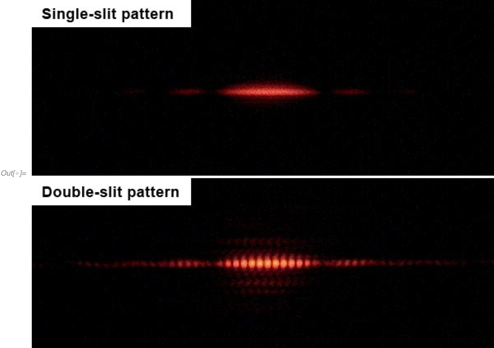
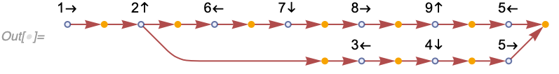
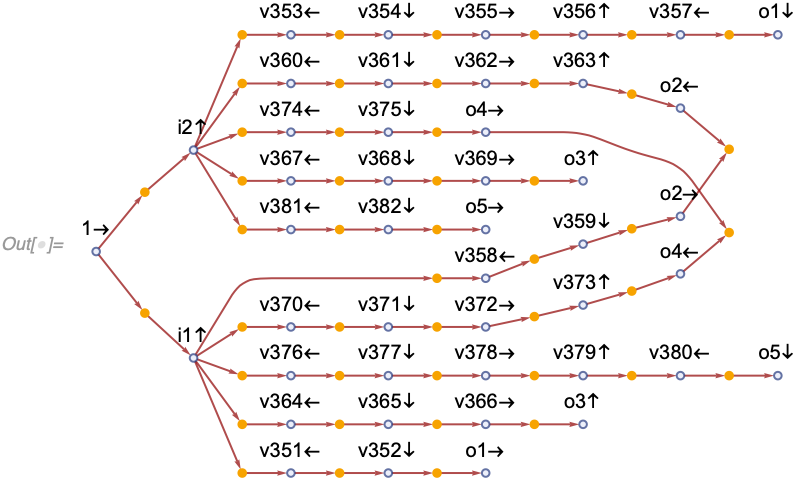
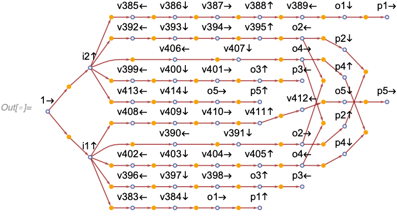
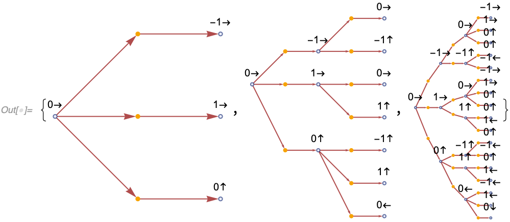
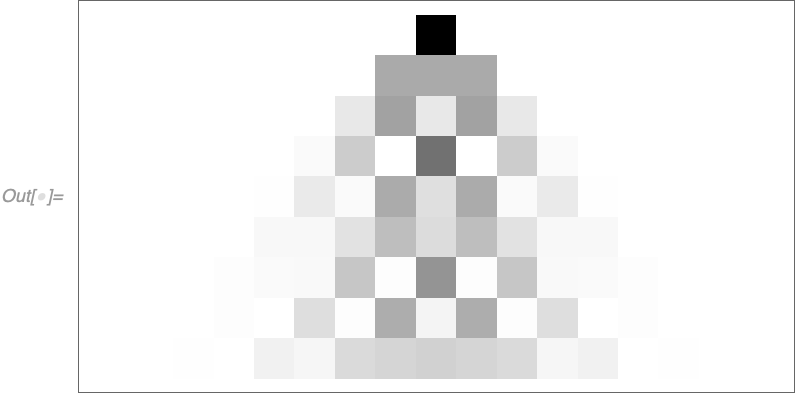
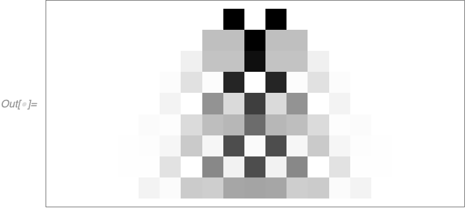
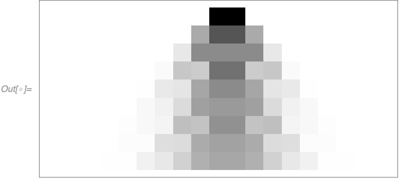
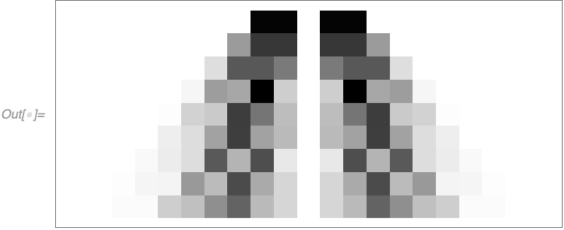

# Local Multiway System

## Introduction

This note introduces [local multiway systems](/README.md#eventselectionfunction), examines them in the context of the
singleway and [global multiway](https://resources.wolframcloud.com/FunctionRepository/resources/MultiwaySystem) systems,
and explores the possible connections to quantum theory.

By default, [`WolframModel`](/README.md#wolframmodel-and-wolframmodelevolutionobject) computes only a single branch of
the evolution.
If there are multiple matches of the rules to the hypergraph, only one of these matches will be turned into an
actualized event, the other matches will be ignored, and will not appear in the evolution object.

This, however, introduces a dependence on the [evaluation order](/README.md#eventorderingfunction), which is not
desirable as it is similar to choosing a preferred reference frame, which is not consistent with
[relativity](https://en.wikipedia.org/wiki/Theory_of_relativity#Special_relativity).

There are multiple possible resolutions to this problem.
One way is to only consider
[causal invariant](https://resources.wolframcloud.com/FunctionRepository/resources/CausalInvariantQ) rules, i.e., the
rules with a property, such that the result of the evolution does not depend on the event order.
This is, however, quite limiting as we will be ignoring the majority of the rules.
Also, the idea of having multiple possible evolution paths seems relevant to quantum physics.

Another approach is to consider the so-called multiway systems, which evaluate all possible ways to resolve such
overlaps between matches.
This is the approach that is discussed in this note.

The original type of the multiway system that was first considered in the
[Wolfram Physics Project](https://www.wolframphysics.org) is what we will call the
[*global* multiway system](https://resources.wolframcloud.com/FunctionRepository/resources/MultiwaySystem), which will
be discussed in more detail in the next section.
Here we propose a new kind of a multiway system, called *local* multiway system.
The prime difference is that it allows one to consider the branching of only parts of space (subgraphs of the state
hypergraph) instead of the entire hypergraph all at once.

In the subsequent sections, we will discuss the local multiway system in more detail, the types of relationships
possible between edges and, more generally, parts of the hypergraph, and provide some ideas on possible connections to
quantum physics.

## Definition of the System

### Global Multiway System

The most important thing to understand about the *global* multiway system is that it operates on the entire states of
the system.
The most fundamental object there is the states graph, which has states at the vertices, and updating events at the
edges.
For each state, all possible updating events are determined, and edges are created leading to new states.
This process is then recursively repeated.

Let's consider an instance of the *global* multiway system (implemented in the `MultiwaySystem` resource function).
Specifically, let's start with a rule that moves a "particle" (a unary edge) alone directed edges in a graph:

```wl
In[] := RulePlot[WolframModel[{{1}, {1, 2}} -> {{1, 2}, {2}}]]
```


If we run this system on a path graph with 3 vertices, we get a very simple behavior:

```wl
In[] := ResourceFunction["MultiwaySystem"][
 "WolframModel" -> {{{1}, {1, 2}} -> {{1, 2}, {2}}}, {{{1}, {1, 
    2}, {2, 3}}}, 3, "StatesGraph", VertexSize -> 1]
```


Now, what happens if we split the path in this graph into two different branches?
In this case, the rules will lead to non-deterministic behavior, multiway choices of substitutions are possible and so,
the system explores all possible choices at once.

```wl
In[] := Graph[ResourceFunction["MultiwaySystem"][
  "WolframModel" -> {{{1}, {1, 2}} -> {{1, 2}, {2}}}, {{{1}, {1, 
     2}, {2, 3}, {2, 4}, {4, 5}}}, 4, "StatesGraph", VertexSize -> 1],
  GraphLayout -> "LayeredDigraphEmbedding"]
```


Now the states graph itself splits in two branches, mirroring precisely the input graph.

One important feature of `MultiwaySystem` is that if it encounters multiple states that are isomorphic, it merges them
into one.
For example, if instead of the input graph in the example above we use the graph where the branches have the same
length, the system will combine them, and we would not see the splitting behavior:

```wl
In[] := Graph[ResourceFunction["MultiwaySystem"][
  "WolframModel" -> {{{1}, {1, 2}} -> {{1, 2}, {2}}},
  {{{1}, {1, 2}, {2, 3}, {3, 4}, {2, 5}, {5, 6}}}, 3, "StatesGraph",
  VertexSize -> 1], GraphLayout -> "LayeredDigraphEmbedding"]
```


This is why our original graph uses branches of different lengths (`{{2, 3}}` and `{{2, 4}, {4, 5}}`).

But what if we start with particles on different branches and let them merge?

```wl
In[] := ResourceFunction["MultiwaySystem"][
 "WolframModel" -> {{{1}, {1, 2}} -> {{1, 2}, {2}}}, {{{a1}, {a1,
    a2}, {a2, a3}, {a3, m1}, {b1}, {b1, b2}, {b2, m1}, {m1,
    m2}}}, 7, "StatesGraph", VertexSize -> {1.6, 0.32},
 GraphLayout -> "LayeredDigraphEmbedding", EdgeStyle -> Automatic,
 GraphHighlight -> {{{1}, {2}, {1, 3}, {2, 4}, {3, 5}, {4, 6}, {5,
      6}, {6, 7}} -> {{1}, {2}, {1, 3}, {2, 4}, {3, 5}, {4, 5}, {5,
      6}, {7, 1}}, {{1}, {2}, {1, 3}, {2, 4}, {3, 5}, {5, 4}, {4,
      6}, {7, 2}} -> {{1}, {2}, {1, 3}, {2, 4}, {3, 4}, {4, 5}, {6,
      1}, {7, 2}}}]
```


Note that even at the first step, the system branches in two different states.
However, there is no ambiguity.
The two events there occur at entirely different places in space.
Note also, that some events are duplicated.
For example, the two events highlighted red are the same event, as they both correspond to the particle on a more
extended branch moving one step.

So, based on the above, there are two issues with the global multiway system.

First, there is an incredible amount of redundancy.
In particular, if there is an event that happened somewhere in a far away galaxy, it would mean the entire Universe
including all of the edges here on Earth, duplicates, which seems both strange and unnecessary, and is fundamentally
non-local.
In other words, there are exponentially more data in the global multiway system that is necessary to describe completely the state of the Universe.

Second, it is hard to distinguish between purely classical space evolving in disconnected regions in parallel (i.e.,
spacelike events), and multiway branching that happens due to overlapping event inputs (i.e., branchlike events).

In the global multiway system, these look identical, and the only way to distinguish them is to examine their input and
output states, which is a highly non-trivial problem, especially given that both of those states are canonicalized.

To illustrate the point, here is an example of a branchlike and a spacelike separated pair of events, respectively:

```wl
In[] := ResourceFunction["MultiwaySystem"]["WolframModel" -> #1, {#2}, 2,
   "StatesGraph", VertexSize -> {1.6, 0.32},
   GraphLayout -> "LayeredDigraphEmbedding",
   EdgeStyle -> Automatic] & @@@ {{{{{1, 2}, {2, 3}} -> {{1, 2, 3}},
    {{1, 2, 3}} -> {{1, 3}}},
   {{1, 2}, {2, 3}, {3, 4}}},
  {{{{1, 2}} -> {{1, 2, 3}}}, {{1, 2}, {2, 3}}}}
```


### Local Multiway System

Let us then consider a different approach.
Suppose we have a system with overlapping pairs of rule matches.
We still want to include all of those events in the multiway system.
But instead of duplicating the entire state, we will do that locally.
I.e., we will have multiple branches growing from that pair of events, and we will weave them into a single data
structure describing the entire multiway system.
The states themselves will then be reconstructed afterward in post-processing.

This approach sounds complicated at first, but it is more straightforward than it appears.
To understand how it would work, let's think about the `libSetReplace` implementation of `WolframModel`.

#### Datastructure

In that implementation, the datastructure is simply a set of edge structs (called `Expression`s there), and each struct
simply has information about events that have created and destroyed the corresponding edge:

```c++
struct SetExpression {
  AtomsVector atoms;  // list of vertices
  EventID creatorEvent;
  EventID destroyerEvent = finalStateEvent;
  Generation generation; // here just for convenience, can be reconstructed in post-processing
};
```

The collection of these objects is essentially the *only* thing that is returned from the evolution code.
Things like `"StatesList"` and `"CausalGraph"` are reconstructed.

The causal graph, in particular, is the simplest one to reconstruct.
Indeed, if each event is a vertex, and each `SetExpression` is an edge going from its `creatorEvent` to its
`destroyerEvent`, that would immediately give us a causal graph.

Reconstructing states is a bit more complicated, but it can be done by selecting a foliation of a causal graph, i.e., a
subset of events including all of their dependencies, and selecting all edges that were created, but not destroyed by
one of those events.

#### Index of Matches

In addition to this data structure, we have an index of matches.
It's a set of all possible matches that can be made to the current state and is updated after each event is applied.

It is initially created at the construction of the system by indexing the initial condition.
After each event is applied, the outputs of that event are indexed (potentially by matching those outputs with their
neighbors).
The matches that involve the input edges are deleted from the index.

This deletion causes the system to be singleway, as once an edge is used in an event, it can never be matched again.
It is also the reason there is only one `destroyerEvent` for each `SetExpression`.

#### Match-All Local Multiway System

Imagine however that instead of deleting all matches involving the input edges, we will only remove the particular match that was instantiated.
With only that change, we will proceed to evolve the system precisely the same way we used to.

Note, in this case, we will automatically get a multiway system, in fact, the
[match-all](/README.md#eventselectionfunction) version of it.
It is called match-all because it will match not only the spacelike sets of edges but also branchlike and even timelike
ones.

#### Evolution

To understand what it means, let's try some examples.
In the match-all system, even the most trivial rules become extremely complicated quite quickly, so let's use the
pattern rules for this one.
We will be using the [`"ExpressionsEventsGraph"`](/README.md#causal-graphs) property of the `WolframModel` which will
allow us to see both expressions (edges) and events on the same graph.

Let's then take a look at the following system:

```wl
In[] := WolframModel[<|"PatternRules" -> {{{1, 2}} -> {{2, 3}},
     {{1, 2}, {2, 3}} -> {{1, 2, 3}}}|>,
  {{1, 2}}, Infinity,
  "EventSelectionFunction" -> None]["ExpressionsEventsGraph",
 VertexLabels -> Placed[Automatic, After]]
```


In this case we have two rules, `{{1, 2}} -> {{2, 3}}` and `{{1, 2}, {2, 3}} -> {{1, 2, 3}}`.
Note that here `1`, `2` and `3` are not patterns but labeled vertices.
We have started with an initial condition, which is a single edge `{1, 2}`.
We have obtained two events.

The first event replaced `{1, 2}` with `{2, 3}`.
That is entirely normal and would happen in a singleway system as well.
However, the singleway system would terminate immediately after that, as there is only a single edge `{2, 3}` left now,
`{1, 2}` has been deleted, and the second rule requires both `{1, 2}` and `{2, 3}` as inputs.
Another way of saying it is that `{1, 2}` and `{2, 3}` are **timelike** edges, and our singleway `WolframModel` only
matches **spacelike** edges.

However, the match-all multiway system will proceed, as both `{1, 2}` and `{2, 3}` are now in the system, and it does
not care that they are timelike.
Hence, the second event is instantiated as well, `{{1, 2}, {2, 3}} -> {{1, 2, 3}}`.
Note that at the end of this evolution, all three edges `{1, 2}`, `{2, 3}` and `{1, 2, 3}` are open for further
matching, and the only reason further matching does not occur is because both possible exact matches have already been
applied.

If, however, we add another rule, `{{1, 2}, {1, 2, 3}} -> {{2, 3}}`, the system will keep evolving indefinitely as
`{2, 3}` created after applying the new rule is not the same `{2, 3}` as was created by the first rule.
Therefore it will be matched again by the second rule.
After that, the second and the third rules will keep "oscillating" supplying inputs to one another:

```wl
In[] := WolframModel[<|"PatternRules" -> {{{1, 2}} -> {{2, 3}},
     {{1, 2}, {2, 3}} -> {{1, 2, 3}},
     {{1, 2}, {1, 2, 3}} -> {{2, 3}}}|>, {{1, 2}}, 6,
  "EventSelectionFunction" -> None]["ExpressionsEventsGraph",
 VertexLabels -> Placed[Automatic, Before]]
```


The match-all system will match branchlike events as well, as can be seen in the following example:

```wl
In[] := WolframModel[<|"PatternRules" -> {{{1, 2}} -> {{2, 3}},
     {{1, 2}} -> {{2, 4}}, {{2, 3}, {2, 4}} -> {{2, 3, 4}}}|>,
  {{1, 2}}, 6,
  "EventSelectionFunction" -> None]["ExpressionsEventsGraph",
 VertexLabels -> Placed[Automatic, After]]
```


Note in the above there are two possibilities to match `{{1, 2}}`, which are incompatible according to the ordinary
`WolframModel` and can only be achieved one-at-a-time with different choices of the `"EventOrderingFunction"`.
However, the match-all system can still match them with the third rule.

Further note the obvious feature of the match-all system is that it produces edges and events that would not occur in
either the singleway `WolframModel`, nor in the global `MultiwaySystem`.
In particular, it might allow us to produce branch interference in quantum mechanics with the use of branchlike events,
i.e., events which would merge edges from different branches, and hence cause the branches themselves to merge.

#### Reconstruction

Reconstructing causal graphs in this system is quite straightforward as well.
In fact, all one needs to do is to allow multiple destroyer events:

```c++
struct SetExpression {
  AtomsVector atoms;  // list of vertices
  EventID creatorEvent;
  std::vector<EventID> destroyerEvents = {};
  Generation generation; // here just for convenience, can be reconstructed in post-processing
};
```

Now, each `SetExpression` would correspond to exactly `destroyerEvents.size()` causal edges, with each one going from
the `creatorEvent` to each element of the `destroyerEvents`.
An even more useful structure is an expressions-events graph already used above, where both events and edges
(`SetExpression`s) are represented as differently colored vertices.
There is only one edge going into each `SetExpression` vertex (corresponding to its `creatorEvent`).
And there are `destroyerEvents.size()` edges coming out of each `SetExpression` vertex.
This will immediately let us see the locations where the true multiway branching occurs.

For example, the pair of systems demonstrated above where the separation was hard to distinguish in the global multiway
system now looks like this:

```wl
In[] := WolframModel[#1, #2, 2, "EventSelectionFunction" -> None][
    "ExpressionsEventsGraph",
    VertexLabels ->
     Placed[Automatic,
      After]] & @@@ {{{{{1, 2}, {2, 3}} -> {{1, 2, 3}},
     {{1, 2, 3}} -> {{1, 3}}},
    {{1, 2}, {2, 3}, {3, 4}}},
   {{{1, 2}} -> {{1, 2, 3}}, {{1, 2}, {2, 3}}}} // (Framed[#,
      FrameStyle -> LightGray] & /@ # &)
```


Note that the vertex `{2, 3}` in the first example has the out-degree `2`, which indicates the multiway branching.
Also note that the events in the second example are completely disconnected as there are no causal connections between
them.
In addition, there are only two events instead of four as the local multiway system does not duplicate identical events.

The reconstruction of spatial states is more complicated.
However, it is still quite straightforward to understand how a local patch of space would look.
Indeed, what is space?
Ultimately, it's a collection of edges that are all pairwise spacelike-separated with one another.
And indeed, we can create such patches in a match-all system just like in any other system.

However, we need to discuss in more detail what it means exactly for the two events or edges to be spacelike,
branchlike, or timelike.

### Event Separation

If we want to have more control over the matching behavior of the local multiway system, and in particular, to be able
to reproduce the behavior of the global multiway system, we need a way to detect whether a pair of edges is spacelike,
branchlike or timelike.

Ultimately, it is a question of whether two edges were produced by branching (i.e., their common ancestor is an edge),
by a single event (i.e., their ancestor is a single event which produced multiple output edges), or whether one of the
edges causally depends on the other one.

And in simple systems, it is quite straightforward to understand what the separation is.
I.e., in the following three systems, the edges `{2, 3}` and `{3, 4}` are spacelike, branchlike and timelike
respectively:

```wl
In[] := Framed[WolframModel[<|"PatternRules" -> #|>, {{1, 2}}, Infinity,
     "EventSelectionFunction" -> None]["ExpressionsEventsGraph",
    VertexLabels -> Placed[Automatic, After]],
   FrameStyle -> LightGray] & /@ {{{1, 2}} -> {{2, 3}, {3, 4}},
  {{{1, 2}} -> {{2, 3}}, {{1, 2}} -> {{3, 4}}},
  {{{1, 2}} -> {{2, 3}}, {{2, 3}} -> {{3, 4}}}}
```


In the first example, a single event produces two edges, `{2, 3}` *and* `{3, 4}`.
This corresponds to a spacelike separation, as both of these edges can appear simultaneously in a singleway system.
In the second example, there are two possibilities.
Either the first, or the second rule can be matched to the initial edge `{1, 2`.
Hence the edges that are produced as a result of that, `{2, 3}` and `{3, 4}` are branchlike separated.
Finally, in the third example, the evolution is linear.
The first event, and the edge `{2, 3}` are the prerequisites for the second event and the edge `{3, 4}`.
Hence, these edges are timelike separated.

So, if the edges are immediate neighbors in the causal graph as in the examples above, the separation is not hard to
determine.
However, what if the edges are farther down in history?

For example, what about the edges `{4, 5}` and `{5, 6}` here?

```wl
In[] := WolframModel[<|
   "PatternRules" -> {{{1, 2}} -> {{2, 3}}, {{1, 2}} -> {{3, 4}},
     {{2, 3}, {3, 4}} -> {{4, 5}, {5, 6}}}|>, {{1, 2}}, Infinity,
  "EventSelectionFunction" -> None]["ExpressionsEventsGraph",
 VertexLabels -> Placed[Automatic, After]]
```


In this example, the edge `{1, 2}` first branches into two edges `{2, 3}` and `{3, 4}`.
They are then merged by the third event, which in turn creates two edges, `{4, 5}` and `{5, 6}`.

If one was to interpret that as a physical process, one correspondence could be that the third event is an interaction
event between two evolution branches in the many-worlds interpretation, perhaps describing a wavefunction collapse.
In that case, the final edges `{4, 5}` and `{5, 6}` would still be spacelike as they were produced from a single event
after the branches have already merged.

But what about something like this?

```wl
In[] := WolframModel[<|"PatternRules" -> {{{v, i}} -> {{v, 1}, {v, 2}},
     {{v, 1}} -> {{v, 1, 1}, {v, 1, 2}},
     {{v, 1, 1}, {v, 2}} -> {{v, f, 1}},
     {{v, 1, 2}, {v, 2}} -> {{v, f, 2}}}|>, {{v, i}}, Infinity,
  "EventSelectionFunction" -> None]["ExpressionsEventsGraph",
 VertexLabels -> Placed[Automatic, After]]
```


What is the separation between the edges `{v, f, 1}` and `{v, f, 2}`?
On one hand they are spacelike, because one of their common ancestors is the event `{{v, 1}} -> {{v, 1, 1}, {v, 1, 2}}`.
But on the other hand, they are branchlike, as they have an edge `{v, 2}` as another common ancestor.
In other words, these edges are mixed spacelike and branchlike.
And if we had an event matching both `{v, f, 1}` and `{v, f, 2}` as inputs, it would simultaneously merge different
pieces of space, and two different branches.

It seems, however, that the branchial separation should take precedence.
That is because if we only allow events to match spacelike separated edges, we expect the evolution to be equivalent to
the global multiway system evolution.
In this case we have to define the separation above as branchlike, as the two final edges can never simultaneously
appear in the same singleway system.

Thus, to determine the separation between two edges, `A` and `B`, in an expressions-events graph:
1. Compute the past causal cones of both `A` and `B`.
2. Compute the intersection between the causal cones.
3. Take all vertices with out-degree zero (the future boundary of the intersection).
4. If the boundary contains either `A` and `B`, they are timelike separated.
5. If any vertices on the boundary are expression-vertices, they are branchlike separated.
6. Otherwise, if all vertices on the boundary are event-vertices, they are spacelike separated.

### Spacelike-Only Local Multiway System

However, it is not difficult to understand how to make a purely spacelike multiway system, i.e., a system that would only match pairwise spacelike groups of edges, similar to what the global `MultiwaySystem` does.

Indeed, all we need for that case is a verification that an event we are about to instantiate does not merge branches in any way whatsoever.
And that is not too hard to do.

Indeed, consider an events-edges causal graph.
Let's take two edges in that graph and ask whether these edges are purely spacelike.
One possible (highly inefficient, and possibly incorrect) implementation of that is in [9e5bc63](https://github.com/maxitg/SetReplace/blob/9e5bc63b9136b3703aa13d45b455771edb9e3924/libSetReplace/Set.cpp#L345).

Specifically, let's say we have two edges, `first` and `second`.
We can start by collecting the entire past lightcone of `first`.
Then, we will perform a recursive search of the `second` 's lightcone.
As soon as we hit an element from the `first` 's lightcone, we stop the recursion, and check what kind of an element we have intersected.
If it's an event, we proceed to look at other branches, as an ancestor event would indicate spacelike separation.
However, if it's an edge, that would imply the separation is either branchlike (if it's a common ancestor edge), or timelike (if that edge is `first` or `second` themselves).
In that case, we stop enumeration and declare these two edges are not purely spacelike.

Now, if we only add matches to the index that are purely pairwise spacelike as described above, we would get similar evolution as is performed by the global `MultiwaySystem`.

It is interesting now to consider the same example of two particles starting on two different branches that [caused lots of redundancy](#global-multiway-system) in the global `MultiwaySystem`.

```wl
In[] := WolframModel[{{1}, {1, 2}} -> {{1, 2}, {2}}, {{a1}, {a1, a2}, {a2, 
    a3}, {a3, m1}, {b1}, {b1, b2}, {b2, m1}, {m1, m2}}, 
  Infinity]["LayeredCausalGraph"]
```


Instead of a mesh of redundant events that the global multiway system produced, we now only have two places where the events merge.
To examine them more closely, lets "label" the particles:

```wl
In[] := labeledCausalGraph[
 WolframModel[{{p, x, 1}, {1, 2}} -> {{1, 2}, {p, x, 2}}, {{p, a, 
    a1}, {a1, a2}, {a2, a3}, {a3, m1}, {p, b, b1}, {b1, b2}, {b2, 
    m1}, {m1, m2}}, Infinity], ImageSize -> 384]
```


If we look closely at the events near the merge points, we can see that some "redundancy" remains, but it is no longer due to the spacelike separated events, but rather due to the "background" edges being rewritten during evolution.
And as a result, if a particle follows another particle on the same "track", the edges it's going through are different (even though they involve the same vertices), hence the "duplication".

Note, however, that this kind of evolution would not give us quantum physics, as the branches never merge or interfere with one another.

A more interesting case would be to consider a system of rules where some are purely spacelike (i.e., only operate on pairwise spacelike sets of elements), and some are purely (or impurely) branchlike (i.e., they only operate on branchlike separated edges, but not on spacelike ones).

Investigation of these rules and the study of possible quantum effects in the match-all local multiway system are the subjects for future research.

## Introduction

The goal of the [Wolfram Physics Project](https://www.wolframphysics.org) is to find the fundamental law of physics, a simple rule that describes the entire Universe.
That includes quantum mechanics.
There were attempts made to describe quantum mechanics by [Stephen Wolfram](https://www.wolframphysics.org/technical-introduction/) and [Jonathan Gorard](https://www.wolframcloud.com/obj/wolframphysics/Documents/some-quantum-mechanical-properties-of-the-wolfram-model.pdf), however, a consistent and complete formulation has not yet emerged.
This note attempts to provide some ideas on how such interpretation can be constructed based on the [many-worlds interpretation](https://en.wikipedia.org/wiki/Many-worlds_interpretation) and [path integrals](https://en.wikipedia.org/wiki/Path_integral_formulation).

## Apparent Paradox

At first, it seems there is no way to get destructive interference in a multiway system which produces the same combination of states regardless of the evolution order.

Indeed, let's think about what destructive interference means.
One example is a [double-slit experiment](https://en.wikipedia.org/wiki/Double-slit_experiment).
In that experiment, a particle have a choice to go into one of the two slits.
On the other side from the source, there is a screen at which the density of particles is counted as they arrive, and an interference pattern is observed.



Now, consider a position in the interference pattern where the intensity is zero (no particles arrive) on the bottom (double-slit case), but the particles do arrive at the top.
Note the crucial fact: if the other slit is opened, the intensity disappears.

Let's now think about it in terms of the multiway system.
In a multiway system, an observation of a particle at that same position would be an event.
In a single-slit-open case, that event is being observed.
However, if the other slit is opened, the event is no longer there! In the very middle of the low-intensity region, the intensity could be identically zero, which means this event would be impossible.

In a multiway system as previously considered in the Wolfram Physics Project, a subsystem can always be chosen with an arbitrary evolution order consistent with causality.
This means an evolution can be chosen in which the particle from the newly opened slit never reaches the screen.
Thus, apparently, we should still be able to see non-zero intensity at the screen [see [Investigating Quantum Interference Effects in Wolfram Models](https://community.wolfram.com/groups/-/m/t/2028586)].

So, it would appear there are only two ways to make this event impossible:

1. Break the arbitrariness of the evolution order (i.e., make the system non-causal-invariant). This way, we would prioritize certain evolutions over others. Then, we could introduce new "high-priority" rules that would cause destructive interference, and the evolution paths in which these rules are not applied would be ignored. However, this would appear to violate [relativity](https://en.wikipedia.org/wiki/Theory_of_relativity).
2. "DDOS-attack". Let's say the presence of events that should destructively interfere causes so many new edges to be created that the other branches of the evolution become effectively impossible due to their probability approaching zero. This is the only approach that seems to be able to contain both relativity and quantum mechanics, and is the approach suggested by both by [Jonathan Gorard](https://www.wolframcloud.com/obj/wolframphysics/Documents/some-quantum-mechanical-properties-of-the-wolfram-model.pdf) (according to private conversations with the author) and [Stephen Wolfram](https://www.wolframphysics.org/technical-introduction/).

## Many-world Interpretation

The first observation I would like to make is that the question of measurement and computing of probabilities is an independent problem to what we are trying to do here.

Indeed, in [many-world interpretation](https://en.wikipedia.org/wiki/Many-worlds_interpretation) of quantum mechanics (which is one of the accepted interpretations of quantum mechanics), there are no measurements.
Instead, the "measurement" is simply an interaction between an observer and a measured system, after which they get entangled.
Observer only thinks the reality is definite because its memory is disjoint between different states of the superposition.

Indeed, consider a system that could be in one of two states: `|0>` or `|1>`. Let's say it's initially in the superposition:

```
1/Sqrt[2] (|0> + |1>)
```

After the measurement, the observer can be in two states as well depending on the outcome of the measurement: `|o[0]>` or `|o[1]>`.
In a wave-function collapse interpretations, after the measurement, we would get one and only one of two cases.
The decision is non-unitary, non-linear, and the source of non-determinism in the quantum mechanics:

```
|0, o[0]> or |1, o[1]>
```

In the many-world interpretation, however, instead of making a choice for the entire universe, the observer itself is now in a superposition, and the state after the measurement is simply

```
1/Sqrt[2] (|0, o[0]> + |1, o[1]>)
```

A natural question arises: if there is no measurement, and the observer is always in a superposition, how would we compute probabilities from the amplitudes.
Where does the Born rule come from (probability is the magnitude squared of the amplitude)?

It seems the natural approach to this problem is to consider the same observer performing repeated measurements of the system, and making conclusions about the ways probabilities are computed.
If this interpretation is correct, as the number of measurements approaches infinity, the observer with probability 1 will conclude that the probabilities are computed as squares of amplitudes.
The details of this are [not entirely clear](https://arxiv.org/abs/0905.0624), and there is an ongoing discussion about whether there is an acceptable solution.
Various attempts have been made to solve this problem based on [frequentism](https://www.sciencedirect.com/science/article/abs/pii/0003491689901413?via%3Dihub), [decision theory](https://arxiv.org/abs/0906.2718), and [symmetries](https://arxiv.org/abs/quant-ph/0405161).

However, the crucial point is that the issue of probabilities is an independent problem in many-world interpretations.
If the multiway system can reproduce the many-worlds interpretations, any solution to the probabilities problem in the many-worlds interpretation would work for the multiway system as well.
So, we can leave this problem for another time, and focus on the unitary evolution of the system.

## Path Integrals

Here we will attempt to understand how to produce unitary evolution in the multiway system.
To understand this problem, we will consider the path integral formulation.

Essentially, path integrals define a modified probability theory on histories.
First, it is natural to assume that histories in the path integral formulation correspond to causal graphs in the Wolfram model.
Then, *path integral formalism becomes the probability theory on causal graphs***:**

1. Consider all possible causal graphs.
2. To each of them, assign an amplitude (`Exp[I S]`), a complex number.

    It appears the amplitude should be computable as a sum over the causal graph. In addition, its magnitude is apparently 1 for each independent evolution of the system.

3. To compare the probabilities of two sets of causal graphs, sum the amplitudes of the elements of each set, compute the magnitude square of them, and compare.

Now, this is where it gets interesting. If one thinks about the kind of things of which one would want to compute a probability, ultimately, the only thing that matters are events.
I.e., any result of an experiment, any observation is an event (happening within the observer's brain).
As such, the only probability we are really computing is the probability that a given event appears in the causal graph.

An event appears in the causal graph if and only if certain edges appear in it, so, alternatively, the probability we want to compute is the probability of an edge existing in the evolution.

Imagine next that the system has a cyclic symmetry, such that each edge can take one of, say, 4 forms, but the rules are not changed if all of the edges are cyclically transformed within them.
From the observer's point of view, there will be no way of knowing which form (phase) each of the edges takes.
However, if the rules are known, it will be possible to compute the relative phases by following the evolution history, which would be equivalent to computing an action as a sum over Lagrangian density.
The details of the Lagrangian might then encode the microscopic structure of the rule(s).

The only thing left to do then would be to cancel out the edges with opposite phases, and square the remaining amplitudes to obtain the probabilities.
Note that `Abs[a + I b]^2 == Abs[a]^2 + Abs[I b]^2`, therefore, the "orthogonal" phases can be treated as independent. The most natural here is the case where there are four variants of each edge, hence the elementary phases take four values: 1, I, -1 and -I.

This approach is somewhat similar to [QuantumToMultiwaySystem](https://resources.wolframcloud.com/FunctionRepository/resources/QuantumToMultiwaySystem
), however, it now supports multi-component systems (rather than a single global state), works in Wolfram models, and we have a possible explanation on how the phases of edges might naturally arise.

## Simple Example

One example would be a system such that there are four types of edges (assume 1, a, and b never refer the same vertex),

```wl
{{1, a, b, b, b}, {1, b, a, b, b}, {1, b, b, a, b}, {1, b, b, b, a}}
```

which can be transformed into each other according to the following transformation rule:

```wl
{1, a, b, c, d} -> {1, d, a, b, c}
```

Then suppose we have a rule which is invariant under that symmetry.
The following will work for our example (the aforementioned symmetry only applies to 5-edges):

```wl
{{1, a, b, c, d}, {1, 2}} -> {{2, d, a, b, c}}
```

Note that this rule is in fact invariant:

```wl
In[] := With[{originalRule = {{1, a, b, c, d}, {1, 2}} -> {{2, d, a, b, c}}}, 
 SameQ @@ ResourceFunction[
    "CanonicalWolframModelRule"] /@ {originalRule, 
    WolframModel[{{1, a, b, c, d}} -> {{1, d, a, b, c}}] /@ 
     originalRule}]
```

```wl
Out[] = True
```

Think of `{1, a, b, c, d}` as a particle, and `{1, 2}` as a track along which the particle moves.
We can visualize the evolution with an expressions-events graph:

```wl
In[] := WolframModel[{{1, a, b, c, d}, {1, 2}} -> {{2, d, a, b, c}},
  {{1, x, y, y, y}, {1, 2}, {2, 3}, {3, 4}, {4, 5}}, 
  Infinity]["ExpressionsEventsGraph", VertexLabels -> Automatic]
```


To make it even easier to see, let's label the edges bases on their phase, and remove the "track"-edges from the graph.
We'll use a helper function for that.

```wl
particleMotionPlot[evolution_WolframModelEvolutionObject, 
  opts : OptionsPattern[]] := With[{
   expressions = evolution["AllExpressions"],
   graph = 
    evolution["ExpressionsEventsGraph", opts, 
     VertexLabels -> Automatic]},
  Graph[VertexDelete[
    graph, {{"Expression", e_ /; MatchQ[expressions[[e]], {_, _}]}}], 
   VertexLabels -> 
    Normal[# /. {s_String /; (StringMatchQ[s, "Rule" ~~ ___]) :> "", 
          s_String :> ToExpression[s]} /. {{n_, x_, y_, y_, y_} :> 
          Row[{n, "\[UpArrow]"}], {n_, y_, x_, y_, y_} :> 
          Row[{n, "\[LeftArrow]"}], {n_, y_, y_, x_, y_} :> 
          Row[{n, "\[DownArrow]"}], {n_, y_, y_, y_, x_} :> 
          Row[{n, "\[RightArrow]"}]} & /@ 
      Association[
       Replace[VertexLabels, AbsoluteOptions[graph, VertexLabels]]]]]]
```

We can now see phases more clearly:

```wl
In[] := particleMotionPlot[
 WolframModel[{{1, a, b, c, d}, {1, 2}} -> {{2, d, a, b, c}},
  {{1, x, y, y, y}, {1, 2}, {2, 3}, {3, 4}, {4, 5}}, Infinity], 
 GraphLayout -> {"LayeredDigraphEmbedding", "Orientation" -> Left}, 
 VertexLabels -> Placed[Automatic, Above]]
```


Things get more interesting if the track splits:

```wl
In[] := particleMotionPlot[
 WolframModel[{{a, b, c, d, e}, {a, f}} -> {{f, e, b, c, d}},
  {{1, x, y, y, y}, {1, 2}, {2, 3}, {3, 4}, {4, 5}, {2, 6}, {6, 
    7}, {7, 5}}, Infinity, "EventSelectionFunction" -> None], 
 GraphLayout -> {"LayeredDigraphEmbedding", "Orientation" -> Left}, 
 VertexLabels -> Placed[Automatic, Above]]
```


In this case, there are two branches, and in both of them, the particle ends up in the "up" position, so the interference would be constructive.

However, if the path lengths are not equal, the interference would be destructive:

```wl
In[] := particleMotionPlot[
 WolframModel[{{1, a, b, c, d}, {1, 2}} -> {{2, d, a, b, c}},
  {{1, x, y, y, y}, {1, 2}, {2, 3}, {3, 4}, {4, 5}, {2, 6}, {6, 
    7}, {7, 8}, {8, 9}, {9, 5}}, Infinity, 
  "EventSelectionFunction" -> None], 
 GraphLayout -> {"LayeredDigraphEmbedding", "Orientation" -> Left}, 
 VertexLabels -> Placed[Automatic, Above]]
```


Of course, in the rules we are currently using, nothing happens.
However, note that computing probabilities from here is a trivial (non-universal) computation, so it can be done as a post-processing step without any loss to how well this system can reproduce quantum mechanics.

Note further than once destructive interference occurs (and all relevant branches are evaluated), the evolution will continue, however, due to our symmetry, the number of branches in the opposite phase positions will always stay equal, hence if we treat these branches as destroyed, they are never going to "reappear" in the future.

To make the destruction more apparent, we can add additional rules that would "delete them" (in the match-all system, they are not actually doing anything, but they are helpful for visualization purposes):

```wl
In[] := particleMotionPlot[
 WolframModel[{{{1, a, b, c, d}, {1, 2}} -> {{2, d, a, b, c}}, {{n, x,
       y, y, y}, {n, y, y, x, y}} -> {}, {{n, y, x, y, y}, {n, y, y, 
      y, x}} -> {}},
  {{1, x, y, y, y}, {1, 2}, {2, 3}, {3, 4}, {4, 5}, {2, 6}, {6, 
    7}, {7, 8}, {8, 9}, {9, 5}}, Infinity, 
  "EventSelectionFunction" -> None], 
 GraphLayout -> {"LayeredDigraphEmbedding", "Orientation" -> Left}, 
 VertexLabels -> Placed[Automatic, Above]]
```



Note that once decoherence occurs, and the branch is spatially separated from the rest of the multiway system, we can drop it as it is no longer going to affect anything else.
This allows us to obtain a "nearly-classical" view of the world, where there is some interference between branches (quantum effects) soon after they are created, but they soon decohere (disconnect) and never interact again.

## The First Interference Pattern

We can now get a toy example of a double-slit experiment.
To do that, let's say we have paths of different lengths going from two slits to the screen.
The difference between lengths is going to depend on the screen point.
We get something like this (obviously, this is a very crude example since the "metric" between the slits and the screen is not at all euclidean).

```wl
path[s_, t_, length_] := 
 Partition[Join[{s}, Table[Unique["v"], length], {t}], 2, 1]
```

```wl
In[] := particleMotionPlot[
 WolframModel[{{{a, b, c, d, e}, {a, f}} -> {{f, e, b, c, d}}, {{n, x,
       y, y, y}, {n, y, y, x, y}} -> {}, {{n, y, x, y, y}, {n, y, y, 
      y, x}} -> {}},
  Join[
   {{1, x, y, y, y}, {1, i1}, {1, i2}},
   path[i1, o1, 2], path[i2, o1, 5],
   path[i1, o2, 2], path[i2, o2, 4],
   path[i1, o3, 3], path[i2, o3, 3],
   path[i1, o4, 4], path[i2, o4, 2],
   path[i1, o5, 5], path[i2, o5, 2]], Infinity, 
  "EventSelectionFunction" -> None], 
 GraphLayout -> {"LayeredDigraphEmbedding", "Orientation" -> Left}, 
 VertexLabels -> Placed[Automatic, Above]]
```



As you can see, the only remaining final states of the particle are `o1`, `o3` and `o5`. The other two have been destroyed.
If we continue evolving this futher, all the branches will evolve, but only `o1`, `o3` and `o5` will remain "uncancelled":

```wl
In[] := particleMotionPlot[
 WolframModel[{{{a, b, c, d, e}, {a, f}} -> {{f, e, b, c, d}}, {{n, x,
       y, y, y}, {n, y, y, x, y}} -> {}, {{n, y, x, y, y}, {n, y, y, 
      y, x}} -> {}},
  Join[
   {{1, x, y, y, y}, {1, i1}, {1, i2}},
   path[i1, o1, 2], path[i2, o1, 5],
   path[i1, o2, 2], path[i2, o2, 4],
   path[i1, o3, 3], path[i2, o3, 3],
   path[i1, o4, 4], path[i2, o4, 2],
   path[i1, o5, 5], path[i2, o5, 2],
   {{o1, p1}, {o2, p2}, {o3, p3}, {o4, p4}, {o5, p5}}], Infinity, 
  "EventSelectionFunction" -> None], 
 GraphLayout -> {"LayeredDigraphEmbedding", "Orientation" -> Left}, 
 VertexLabels -> Placed[Automatic, Above]]
```



This shows that once the branches destructively interfered, we can delete them from the evolution as well as an optimization.

## 1D Motion

Now, let's consider a slightly more realistic example.
Let's say the particle can now move back and forth on a line.
And let's see what kind of behavior we can get that way.

If the line only has 3 vertices, and we start in the middle, the particle oscillates between being in the middle, and being in the superposition of the sides:

```wl
In[] := Table[particleMotionPlot[
  WolframModel[{{{1, a, b, c, d}} -> {{1, d, a, b, c}}, {{1, a, b, c, 
       d}, {1, 2}} -> {{2, a, b, c, d}}}, 
   Join[{{0, x, y, y, y}}, Partition[Range[-1, 1], 2, 1], 
    Partition[Reverse@Range[-1, 1], 2, 1]], k, 
   "EventSelectionFunction" -> None], 
  GraphLayout -> {"LayeredDigraphEmbedding", "Orientation" -> Left}, 
  VertexLabels -> Placed[Automatic, Above]], {k, 1, 3}]
```



We can even write a function to compute probabilities of different positions, and plot the evolution of essentially the wave function over time:

```wl
positionProbabilities[evolution_] := 
 List @@@ Normal[(Association[
       Rule @@@ 
        Thread[{Keys@#, Normalize[Values@#, Total]}]] &)@(Power[#, 
        2] &)@Abs@
      Merge[Association /@ ((#[[1]] -> 
             Replace[
              Exp[I \[Pi]/
                 2 (First[FirstPosition[#, x]] - 2)], _?(Not@*
                  NumericQ) -> 0]) &) /@ 
         evolution["AllExpressions"][[
          Cases[{"Expression", _}][
            VertexList[evolution["ExpressionsEventsGraph"]][[
             First /@ 
              Position[
               VertexOutDegree[evolution["ExpressionsEventsGraph"]], 
               0]]]][[All, 2]]]], Total]]
```

```wl
motionPlot[init_, width_, steps_] := 
 ArrayPlot[(Sort /@ 
     Table[positionProbabilities[
       WolframModel[{{{1, a, b, c, d}} -> {{1, d, a, b, c}}, {{1, a, 
            b, c, d}, {1, 2}} -> {{2, a, b, c, d}}}, 
        Join[init, Partition[Range[-width, width], 2, 1], 
         Partition[Reverse@Range[-width, width], 2, 1]], k, 
        "EventSelectionFunction" -> None]], {k, 0, steps}])[[All, All,
    2]]]
```

```wl
In[] := motionPlot[{{0, x, y, y, y}}, 8, 8]
```



Note that we already see some interference here, which has to do with discretization effects.
The issue we have here is that the "energy" of the particle is very large, the phase cycles in just 4 steps, and there is no obvious way to increase it without making the rules more complex.

Because of that, it's hard to distinguish the interference caused by these discretization effects from the interference caused by, i.e., multiple slits:

```wl
In[] := motionPlot[{{-1, x, y, y, y}, {1, x, y, y, y}}, 9, 8]
```



One thing we can do is making slits wider, in which case choosing phases in a certain way, we can get rid of the interference due to discretization:

```wl
In[] := motionPlot[{{0, x, y, y, y}, {1, y, y, x, y}}, 9, 8]
```



If we now put two such slits close to each other, we can get the interference back (note also that the center column is completely canceled out):

```wl
In[] := motionPlot[{{-2, x, y, y, y}, {-1, y, y, x, y}, {1, x, y, y, y}, {2, 
   y, y, x, y}}, 10, 8]
```



## Unresolved Issues

There are multiple issues with the approach presented above.

First, while we can extract probabilities from the evolution with a non-universal decoding step, this process is not philosophically satisfactory, as it does not explain where do the amplitudes come from.
In particular, it is not clear why we don't observe the evolution which corresponds to the "canceled-out" branches.

More significantly, it is not clear how to change the basis.
Consider, for example, a single qubit.
We can represent its states with two possible edges, say,

```
|0> -> {0, x, y, y, y}, |1> -> {1, x, y, y, y}
```

we can then represent combinations of those as branchlike-separated groups of edges, i.e.,

```
1/Sqrt[2] (|0> + |1>) -> {{0, x, y, y, y}, {1, x, y, y, y}}
```

and

```
1/Sqrt[2] (|0> + I |1>) -> {{0, x, y, y, y}, {1, y, x, y, y}}
```

etc. We can represent unbalanced combinations as well, for example,

```
1/Sqrt[3] (|0> + 2 I |1>) -> {{0, x, y, y, y}, {1, y, x, y, y}, {1, y, x, y, y}}
```

However, here lies the problem, as increasing precision of the relative weights in the superposition requires increasing the number of edges.
At some level it makes sense, as there is indeed no way to encode an infinite-precision real number with a finite number of elements in a discreet system.
However, we also expect from the quantum theory that arbitrary-rotated bases are equivalent.
For example, it appears that we should have a symmetry where we can define

```
1/Sqrt[2] (|0> + |1>) -> |a>
```

```
1/Sqrt[2] (|0> - |1>) -> |b>
```

and have an equivalent theory in terms of `|a>` and `|b>`.
However, in our interpretation, two edges will now need to be used for each basis state instead of one.

It appears at first that [Spekkens toy model](https://arxiv.org/abs/quant-ph/0401052) can potentially provide a solution, however, while it works well for single qubits, combinations of them appear to be tricky as states like this

```
1/Sqrt[2] (|00> + |11>)
```

can no longer be simply thought of as branchlike combinations of parts of the superposition.

Finally, it's not clear how to make the phase change more slowly than `Pi/2` for a single event.
One way to do that is to use a cyclic symmetry with more than 4 elements, but that makes both the rules and the reconstruction process much more complex and artificial.

And if one does not allow events that change the phase by less than `Pi/2`, it's difficult to reproduce, i.e., a double-slit experiment, and explain energies that are smaller than the fundamental scale.
