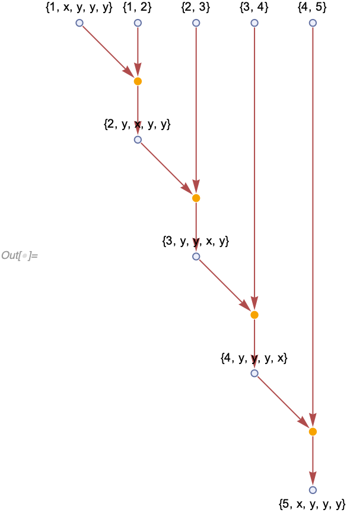
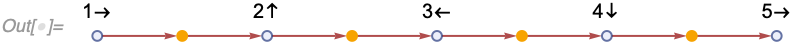
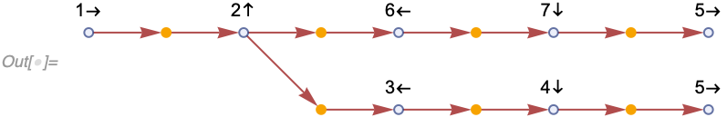
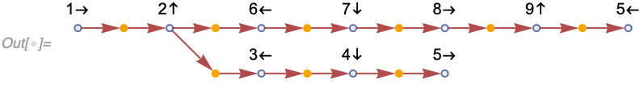

# Phases and Interference in Multiway Systems


## Introduction

The goal of the [Wolfram Physics Project](https://www.wolframphysics.org) is to find the fundamental law of physics, a simple rule that describes the entire Universe.
That includes quantum mechanics.
There were attempts made to describe quantum mechanics by [Stephen Wolfram](https://www.wolframphysics.org/technical-introduction/) and [Jonathan Gorard](https://www.wolframcloud.com/obj/wolframphysics/Documents/some-quantum-mechanical-properties-of-the-wolfram-model.pdf), however, a consistent and complete formulation has not yet emerged.
This note attempts to provide some ideas on how such interpretation can be constructed based on the [many-worlds interpretation](https://en.wikipedia.org/wiki/Many-worlds_interpretation) and [path integrals](https://en.wikipedia.org/wiki/Path_integral_formulation).

## Apparent Paradox

At first, it seems there is no way to get destructive interference in a multiway system which produces the same combination of states regardless of the evolution order.

Indeed, let's think about what destructive interference means.
One example is a [double-slit experiment](https://en.wikipedia.org/wiki/Double-slit_experiment).
In that experiment, a particle have a choice to go into one of the two slits.
On the other side from the source, there is a screen at which the density of particles is counted as they arrive, and an interference pattern is observed.


Now, consider a position in the interference pattern where the intensity is zero (no particles arrive) on the bottom (double-slit case), but the particles do arrive at the top.
Note the crucial fact: if the other slit is opened, the intensity disappears.

Let's now think about it in terms of the multiway system.
In a multiway system, an observation of a particle at that same position would be an event.
In a single-slit-open case, that event is being observed.
However, if the other slit is opened, the event is no longer there! In the very middle of the low-intensity region, the intensity could be identically zero, which means this event would be impossible.

In a multiway system as previously considered in the Wolfram Physics Project, a subsystem can always be chosen with an arbitrary evolution order consistent with causality.
This means an evolution can be chosen in which the particle from the newly opened slit never reaches the screen.
Thus, apparently, we should still be able to see non-zero intensity at the screen [see [Investigating Quantum Interference Effects in Wolfram Models](https://community.wolfram.com/groups/-/m/t/2028586)].

So, it would appear there are only two ways to make this event impossible:

1. Break the arbitrariness of the evolution order (i.e., make the system non-causal-invariant). This way, we would prioritize certain evolutions over others. Then, we could introduce new "high-priority" rules that would cause destructive interference, and the evolution paths in which these rules are not applied would be ignored. However, this would appear to violate [relativity](https://en.wikipedia.org/wiki/Theory_of_relativity).
2. "DDOS-attack". Let's say the presence of events that should destructively interfere causes so many new edges to be created that the other branches of the evolution become effectively impossible due to their probability approaching zero. This is the only approach that seems to be able to contain both relativity and quantum mechanics, and is the approach suggested by both by [Jonathan Gorard](https://www.wolframcloud.com/obj/wolframphysics/Documents/some-quantum-mechanical-properties-of-the-wolfram-model.pdf) (according to private conversations with the author) and [Stephen Wolfram](https://www.wolframphysics.org/technical-introduction/) and [Jonathan Gorard](https://www.wolframcloud.com/obj/wolframphysics/Documents/some-quantum-mechanical-properties-of-the-wolfram-model.pdf).

## Many-world Interpretation

The first observation I would like to make is that the question of measurement and computing of probabilities is an independent problem to what we are trying to do here.

Indeed, in [many-world interpretation](https://en.wikipedia.org/wiki/Many-worlds_interpretation) of quantum mechanics (which is one of the accepted interpretations of quantum mechanics), there are no measurements.
Instead, the "measurement" is simply an interaction between an observer and a measured system, after which they get entangled.
Observer only thinks the reality is definite because its memory is disjoint between different states of the superposition.

Indeed, consider a system that could be in one of two states: `|0>` or `|1>`. Let's say it's initially in the superposition:

```
1/Sqrt[2] (|0> + |1>)
```

After the measurement, the observer can be in two states as well depending on the outcome of the measurement: `|o[0]>` or `|o[1]>`.
In a wave-function collapse interpretations, after the measurement, we would get one and only one of two cases.
The decision is non-unitary, non-linear, and the source of non-determinism in the quantum mechanics:

```
|0, o[0]> or |1, o[1]>
```

In the many-world interpretation, however, instead of making a choice for the entire universe, the observer itself is now in a superposition, and the state after the measurement is simply

```
1/Sqrt[2] (|0, o[0]> + |1, o[1]>)
```

A natural question arises: if there is no measurement, and the observer is always in a superposition, how would we compute probabilities from the amplitudes.
Where does the Born rule come from (probability is the magnitude squared of the amplitude)?

It seems the natural approach to this problem is to consider the same observer performing repeated measurements of the system, and making conclusions about the ways probabilities are computed.
If this interpretation is correct, as the number of measurements approaches infinity, the observer with probability 1 will conclude that the probabilities are computed as squares of amplitudes.
The details of this are [not entirely clear](https://arxiv.org/abs/0905.0624), and there is an ongoing discussion about whether there is an acceptable solution.
Various attempts have been made to solve this problem based on [frequentism](https://www.sciencedirect.com/science/article/abs/pii/0003491689901413?via%3Dihub), [decision theory](https://arxiv.org/abs/0906.2718), and [symmetries](https://arxiv.org/abs/quant-ph/0405161).

However, the crucial point is that the issue of probabilities is an independent problem in many-world interpretations.
If the multiway system can reproduce the many-worlds interpretations, any solution to the probabilities problem in the many-worlds interpretation would work for the multiway system as well.
So, we can leave this problem for another time, and focus on the unitary evolution of the system.

## Path Integrals

Here we will attempt to understand how to produce unitary evolution in the multiway system.
To understand this problem, we will consider the path integral formulation.

Essentially, path integrals define a modified probability theory on histories.
First, it is natural to assume that histories in the path integral formulation correspond to causal graphs in the Wolfram model.
Then, *path integral formalism becomes the probability theory on causal graphs***:**

1. Consider all possible causal graphs.
2. To each of them, assign an amplitude (`Exp[I S]`), a complex number.

    It appears the amplitude should be computable as a sum over the causal graph. In addition, its magnitude is apparently 1 for each independent evolution of the system.

3. To compare the probabilities of two sets of causal graphs, sum the amplitudes of the elements of each set, compute the magnitude square of them, and compare.

Now, this is where it gets interesting. If one thinks about the kind of things of which one would want to compute a probability, ultimately, the only thing that matters are events.
I.e., any result of an experiment, any observation is an event (happening within the observer's brain).
As such, the only probability we are really computing is the probability that a given event appears in the causal graph.

An event appears in the causal graph if and only if certain edges appear in it, so, alternatively, the probability we want to compute is the probability of an edge existing in the evolution.

Imagine next that the system has a cyclic symmetry, such that each edge can take one of, say, 4 forms, but the rules are not changed if all of the edges are cyclically transformed within them.
From the observer's point of view, there will be no way of knowing which form (phase) each of the edges takes.
However, if the rules are known, it will be possible to compute the relative phases by following the evolution history, which would be equivalent to computing an action as a sum over Lagrangian density.
The details of the Lagrangian might then encode the microscopic structure of the rule(s).

The only thing left to do then would be to cancel out the edges with opposite phases, and square the remaining amplitudes to obtain the probabilities.
Note that `Abs[a + I b]^2 == Abs[a]^2 + Abs[I b]^2`, therefore, the "orthogonal" phases can be treated as independent. The most natural here is the case where there are four variants of each edge, hence the elementary phases take four values: 1, I, -1 and -I.

This approach is somewhat similar to [QuantumToMultiwaySystem](https://resources.wolframcloud.com/FunctionRepository/resources/QuantumToMultiwaySystem
), however, it now supports multi-component systems (rather than a single global state), works in Wolfram models, and we have a possible explanation on how the phases of edges might naturally arise.

## Simple Example

One example would be a system such that there are four types of edges (assume 1, a, and b never refer the same vertex),

```
{{1, a, b, b, b}, {1, b, a, b, b}, {1, b, b, a, b}, {1, b, b, b, a}}
```

which can be transformed into each other according to the following transformation rule:

```
{1, a, b, c, d} -> {1, d, a, b, c}
```

Then suppose we have a rule which is invariant under that symmetry.
The following will work for our example (the aforementioned symmetry only applies to 5-edges):

```
{{1, a, b, c, d}, {1, 2}} -> {{2, d, a, b, c}}
```

Note that this rule is in fact invariant:

```
In[] := With[{originalRule = {{1, a, b, c, d}, {1, 2}} -> {{2, d, a, b, c}}}, 
 SameQ @@ ResourceFunction[
    "CanonicalWolframModelRule"] /@ {originalRule, 
    WolframModel[{{1, a, b, c, d}} -> {{1, d, a, b, c}}] /@ 
     originalRule}]
```

```
Out[] = True
```

Think of `{1, a, b, c, d}` as a particle, and `{1, 2}` as a track along which the particle moves.
We can visualize the evolution with an expressions-events graph:

```
In[] := WolframModel[{{1, a, b, c, d}, {1, 2}} -> {{2, d, a, b, c}},
  {{1, x, y, y, y}, {1, 2}, {2, 3}, {3, 4}, {4, 5}}, 
  Infinity]["ExpressionsEventsGraph", VertexLabels -> Automatic]
```



To make it even easier to see, let's label the edges bases on their phase, and remove the "track"-edges from the graph.
We'll use a helper function for that.

```
particleMotionPlot[evolution_WolframModelEvolutionObject, 
  opts : OptionsPattern[]] := With[{
   expressions = evolution["AllExpressions"],
   graph = 
    evolution["ExpressionsEventsGraph", opts, 
     VertexLabels -> Automatic]},
  Graph[VertexDelete[
    graph, {{"Expression", e_ /; MatchQ[expressions[[e]], {_, _}]}}], 
   VertexLabels -> 
    Normal[# /. {s_String /; (StringMatchQ[s, "Rule" ~~ ___]) :> "", 
          s_String :> ToExpression[s]} /. {{n_, x_, y_, y_, y_} :> 
          Row[{n, "\[UpArrow]"}], {n_, y_, x_, y_, y_} :> 
          Row[{n, "\[LeftArrow]"}], {n_, y_, y_, x_, y_} :> 
          Row[{n, "\[DownArrow]"}], {n_, y_, y_, y_, x_} :> 
          Row[{n, "\[RightArrow]"}]} & /@ 
      Association[
       Replace[VertexLabels, AbsoluteOptions[graph, VertexLabels]]]]]]
```

We can now see phases more clearly:

```
In[] := particleMotionPlot[
 WolframModel[{{1, a, b, c, d}, {1, 2}} -> {{2, d, a, b, c}},
  {{1, x, y, y, y}, {1, 2}, {2, 3}, {3, 4}, {4, 5}}, Infinity], 
 GraphLayout -> {"LayeredDigraphEmbedding", "Orientation" -> Left}, 
 VertexLabels -> Placed[Automatic, Above]]
```



Things get more interesting if the track splits:

```
In[] := particleMotionPlot[
 WolframModel[{{a, b, c, d, e}, {a, f}} -> {{f, e, b, c, d}},
  {{1, x, y, y, y}, {1, 2}, {2, 3}, {3, 4}, {4, 5}, {2, 6}, {6, 
    7}, {7, 5}}, Infinity, "EventSelectionFunction" -> None], 
 GraphLayout -> {"LayeredDigraphEmbedding", "Orientation" -> Left}, 
 VertexLabels -> Placed[Automatic, Above]]
```



In this case, there are two branches, and in both of them, the particle ends up in the "up" position, so the interference would be constructive.

However, if the path lengths are not equal, the interference would be destructive:

```
In[] := particleMotionPlot[
 WolframModel[{{1, a, b, c, d}, {1, 2}} -> {{2, d, a, b, c}},
  {{1, x, y, y, y}, {1, 2}, {2, 3}, {3, 4}, {4, 5}, {2, 6}, {6, 
    7}, {7, 8}, {8, 9}, {9, 5}}, Infinity, 
  "EventSelectionFunction" -> None], 
 GraphLayout -> {"LayeredDigraphEmbedding", "Orientation" -> Left}, 
 VertexLabels -> Placed[Automatic, Above]]
```



Of course, in the rules we are currently using, nothing happens.
However, note that computing probabilities from here is a trivial (non-universal) computation, so it can be done as a post-processing step without any loss to how well this system can reproduce quantum mechanics.

Note further than once destructive interference occurs (and all relevant branches are evaluated), the evolution will continue, however, due to our symmetry, the number of branches in the opposite phase positions will always stay equal, hence if we treat these branches as destroyed, they are never going to "reappear" in the future.

To make the destruction more apparent, we can add additional rules that would "delete them" (in the match-all system, they are not actually doing anything, but they are helpful for visualization purposes):

```
In[] := particleMotionPlot[
 WolframModel[{{{1, a, b, c, d}, {1, 2}} -> {{2, d, a, b, c}}, {{n, x,
       y, y, y}, {n, y, y, x, y}} -> {}, {{n, y, x, y, y}, {n, y, y, 
      y, x}} -> {}},
  {{1, x, y, y, y}, {1, 2}, {2, 3}, {3, 4}, {4, 5}, {2, 6}, {6, 
    7}, {7, 8}, {8, 9}, {9, 5}}, Infinity, 
  "EventSelectionFunction" -> None], 
 GraphLayout -> {"LayeredDigraphEmbedding", "Orientation" -> Left}, 
 VertexLabels -> Placed[Automatic, Above]]
```


Note that once decoherence occurs, and the branch is spatially separated from the rest of the multiway system, we can drop it as it is no longer going to affect anything else.
This allows us to obtain a "nearly-classical" view of the world, where there is some interference between branches (quantum effects) soon after they are created, but they soon decohere (disconnect) and never interact again.

## The First Interference Pattern

We can now get a toy example of a double-slit experiment.
To do that, let's say we have paths of different lengths going from two slits to the screen.
The difference between lengths is going to depend on the screen point.
We get something like this (obviously, this is a very crude example since the "metric" between the slits and the screen is not at all euclidean).

```
path[s_, t_, length_] := 
 Partition[Join[{s}, Table[Unique["v"], length], {t}], 2, 1]
```

```
In[] := particleMotionPlot[
 WolframModel[{{{a, b, c, d, e}, {a, f}} -> {{f, e, b, c, d}}, {{n, x,
       y, y, y}, {n, y, y, x, y}} -> {}, {{n, y, x, y, y}, {n, y, y, 
      y, x}} -> {}},
  Join[
   {{1, x, y, y, y}, {1, i1}, {1, i2}},
   path[i1, o1, 2], path[i2, o1, 5],
   path[i1, o2, 2], path[i2, o2, 4],
   path[i1, o3, 3], path[i2, o3, 3],
   path[i1, o4, 4], path[i2, o4, 2],
   path[i1, o5, 5], path[i2, o5, 2]], Infinity, 
  "EventSelectionFunction" -> None], 
 GraphLayout -> {"LayeredDigraphEmbedding", "Orientation" -> Left}, 
 VertexLabels -> Placed[Automatic, Above]]
```


As you can see, the only remaining final states of the particle are `o1`, `o3` and `o5`. The other two have been destroyed.
If we continue evolving this futher, all the branches will evolve, but only `o1`, `o3` and `o5` will remain "uncancelled":

```
In[] := particleMotionPlot[
 WolframModel[{{{a, b, c, d, e}, {a, f}} -> {{f, e, b, c, d}}, {{n, x,
       y, y, y}, {n, y, y, x, y}} -> {}, {{n, y, x, y, y}, {n, y, y, 
      y, x}} -> {}},
  Join[
   {{1, x, y, y, y}, {1, i1}, {1, i2}},
   path[i1, o1, 2], path[i2, o1, 5],
   path[i1, o2, 2], path[i2, o2, 4],
   path[i1, o3, 3], path[i2, o3, 3],
   path[i1, o4, 4], path[i2, o4, 2],
   path[i1, o5, 5], path[i2, o5, 2],
   {{o1, p1}, {o2, p2}, {o3, p3}, {o4, p4}, {o5, p5}}], Infinity, 
  "EventSelectionFunction" -> None], 
 GraphLayout -> {"LayeredDigraphEmbedding", "Orientation" -> Left}, 
 VertexLabels -> Placed[Automatic, Above]]
```


This shows that once the branches destructively interfered, we can delete them from the evolution as well as an optimization.

## 1D Motion

Now, let's consider a slightly more realistic example.
Let's say the particle can now move back and forth on a line.
And let's see what kind of behavior we can get that way.

If the line only has 3 vertices, and we start in the middle, the particle oscillates between being in the middle, and being in the superposition of the sides:

```
In[] := Table[particleMotionPlot[
  WolframModel[{{{1, a, b, c, d}} -> {{1, d, a, b, c}}, {{1, a, b, c, 
       d}, {1, 2}} -> {{2, a, b, c, d}}}, 
   Join[{{0, x, y, y, y}}, Partition[Range[-1, 1], 2, 1], 
    Partition[Reverse@Range[-1, 1], 2, 1]], k, 
   "EventSelectionFunction" -> None], 
  GraphLayout -> {"LayeredDigraphEmbedding", "Orientation" -> Left}, 
  VertexLabels -> Placed[Automatic, Above]], {k, 1, 3}]
```


We can even write a function to compute probabilities of different positions, and plot the evolution of essentially the wave function over time:

```
positionProbabilities[evolution_] := 
 List @@@ Normal[(Association[
       Rule @@@ 
        Thread[{Keys@#, Normalize[Values@#, Total]}]] &)@(Power[#, 
        2] &)@Abs@
      Merge[Association /@ ((#[[1]] -> 
             Replace[
              Exp[I \[Pi]/
                 2 (First[FirstPosition[#, x]] - 2)], _?(Not@*
                  NumericQ) -> 0]) &) /@ 
         evolution["AllExpressions"][[
          Cases[{"Expression", _}][
            VertexList[evolution["ExpressionsEventsGraph"]][[
             First /@ 
              Position[
               VertexOutDegree[evolution["ExpressionsEventsGraph"]], 
               0]]]][[All, 2]]]], Total]]
```

```
motionPlot[init_, width_, steps_] := 
 ArrayPlot[(Sort /@ 
     Table[positionProbabilities[
       WolframModel[{{{1, a, b, c, d}} -> {{1, d, a, b, c}}, {{1, a, 
            b, c, d}, {1, 2}} -> {{2, a, b, c, d}}}, 
        Join[init, Partition[Range[-width, width], 2, 1], 
         Partition[Reverse@Range[-width, width], 2, 1]], k, 
        "EventSelectionFunction" -> None]], {k, 0, steps}])[[All, All,
    2]]]
```

```
In[] := motionPlot[{{0, x, y, y, y}}, 8, 8]
```


Note that we already see some interference here, which has to do with discretization effects.
The issue we have here is that the "energy" of the particle is very large, the phase cycles in just 4 steps, and there is no obvious way to increase it without making the rules more complex.

Because of that, it's hard to distinguish the interference caused by these discretization effects from the interference caused by, i.e., multiple slits:

```
In[] := motionPlot[{{-1, x, y, y, y}, {1, x, y, y, y}}, 9, 8]
```


One thing we can do is making slits wider, in which case choosing phases in a certain way, we can get rid of the interference due to discretization:

```
In[] := motionPlot[{{0, x, y, y, y}, {1, y, y, x, y}}, 9, 8]
```


If we now put two such slits close to each other, we can get the interference back (note also that the center column is completely canceled out):

```
In[] := motionPlot[{{-2, x, y, y, y}, {-1, y, y, x, y}, {1, x, y, y, y}, {2, 
   y, y, x, y}}, 10, 8]
```


## Unresolved Issues

There are multiple issues with the approach presented above.

First, while we can extract probabilities from the evolution with a non-universal decoding step, this process is not philosophically satisfactory, as it does not explain where do the amplitudes come from.
In particular, it is not clear why we don't observe the evolution which corresponds to the "canceled-out" branches.

More significantly, it is not clear how to change the basis.
Consider, for example, a single qubit.
We can represent its states with two possible edges, say,

```
|0> -> {0, x, y, y, y}, |1> -> {1, x, y, y, y}
```

we can then represent combinations of those as branchlike-separated groups of edges, i.e.,

```
1/Sqrt[2] (|0> + |1>) -> {{0, x, y, y, y}, {1, x, y, y, y}}
```

and

```
1/Sqrt[2] (|0> + I |1>) -> {{0, x, y, y, y}, {1, y, x, y, y}}
```

etc. We can represent unbalanced combinations as well, for example,

```
1/Sqrt[3] (|0> + 2 I |1>) -> {{0, x, y, y, y}, {1, y, x, y, y}, {1, y, x, y, y}}
```

However, here lies the problem, as increasing precision of the relative weights in the superposition requires increasing the number of edges.
At some level it makes sense, as there is indeed no way to encode an infinite-precision real number with a finite number of elements in a discreet system.
However, we also expect from the quantum theory that arbitrary-rotated bases are equivalent.
For example, it appears that we should have a symmetry where we can define

```
1/Sqrt[2] (|0> + |1>) -> |a>
```

```
1/Sqrt[2] (|0> - |1>) -> |b>
```

and have an equivalent theory in terms of `|a>` and `|b>`.
However, in our interpretation, two edges will now need to be used for each basis state instead of one.

It appears at first that [Spekkens toy model](https://arxiv.org/abs/quant-ph/0401052) can potentially provide a solution, however, while it works well for single qubits, combinations of them appear to be tricky as states like this

```
1/Sqrt[2] (|00> + |11>)
```

can no longer be simply thought of as branchlike combinations of parts of the superposition.

Finally, it's not clear how to make the phase change more slowly than `Pi/2` for a single event.
One way to do that is to use a cyclic symmetry with more than 4 elements, but that makes both the rules and the reconstruction process much more complex and artificial.

And if one does not allow events that change the phase by less than `Pi/2`, it's difficult to reproduce, i.e., a double-slit experiment, and explain energies that are smaller than the fundamental scale.
