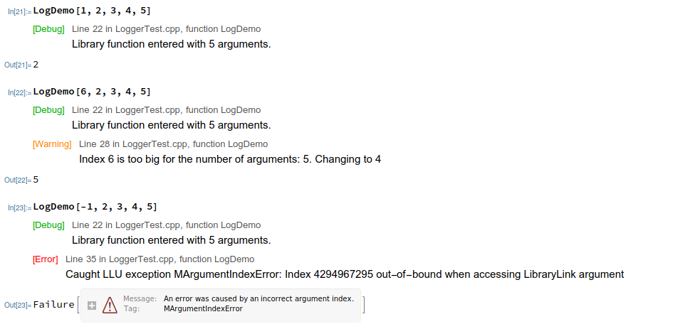
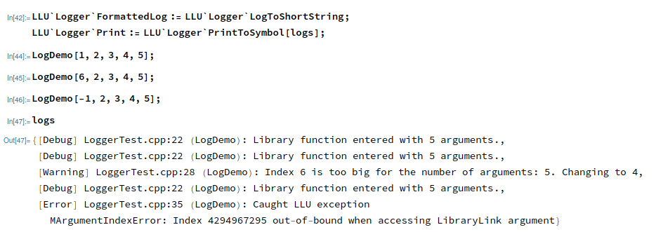

===========================================
Logging and debug printing
===========================================

In the process of developing a C++ paclet it is often useful to print some information from the C++ code, either for debugging purpose or in the form of a log.
The most common way of achieving this in C++ is simple printing to the console (e.g. with ``std::cout`` or ``std::cerr``) but this approach has noticeable
drawbacks:

 - requires running Wolfram Language from the command line to be able to see printed messages from the paclet library (and even then may not work on Windows)
 - print statements must be surrounded with ``#ifdef``\ s, disabled in some other way, or simply removed from the codebase before making it production-ready

One alternative is to log messages to a text file, but this approach has its own problems like choosing the right location for the file, taking care of closing
the file, etc.

LLU provides a logging and debug printing mechanism integrated with the Wolfram Language which:

 - is cross platform
 - has zero overhead when logging is disabled (so the print statements can stay in the code even in the Release mode)
 - is flexible and easy to customize

It is achieved by directing all the message data via WSTP to the Kernel and processing/formatting each message there according to the developer's settings.
To be able to use the logging facility from LLU, first:

.. code-block:: cpp

   #include <LLU/ErrorLog/Logger.h>

and then simply use one of the 3 predefined macros:

.. doxygendefine:: LLU_DEBUG

.. doxygendefine:: LLU_WARNING

.. doxygendefine:: LLU_ERROR

Each macro takes an arbitrary number of parameters of any WSTP-supported types (see :doc:`wstp` for details). Additionally, each log will be automatically
equipped with file name, line number and function name, all related to the place were the log message was issued.

By default the macros are disabled and the compiler will not generate any extra machine code (so the 0 overhead condition is fulfilled).
To enable all macros compile your paclet with ``-D<log_level>``, where ``<log_level>`` is one of the following:

.. doxygendefine:: LLU_LOG_DEBUG

.. doxygendefine:: LLU_LOG_WARNING

.. doxygendefine:: LLU_LOG_ERROR

For example, consider a simple library function that takes a number of integers and the first of them is the index of the argument that will be returned:

.. code-block:: cpp
   :linenos:
   :emphasize-lines: 2, 8, 14

	EXTERN_C DLLEXPORT int LogDemo(WolframLibraryData libData, mint argc, MArgument* args, MArgument res) {
		LLU_DEBUG("Library function entered with ", argc, " arguments.");
		auto err = LLErrorCode::NoError;
		try {
			MArgumentManager mngr(libData, argc, args, res);
			auto index = mngr.getInteger<mint>(0);
			if (index >= argc) {
				LLU_WARNING("Index ", index, " is too big for the number of arguments: ", argc, ". Changing to ", argc - 1);
				index = argc - 1;
			}
			auto value = mngr.getInteger<mint>(index);
			mngr.setInteger(value);
		} catch (const LibraryLinkError& e) {
			LLU_ERROR("Caught LLU exception ", e.what(), ": ", e.debug());
			err = e.which();
		}
		return err;
	}

Compile with ``-DLLU_LOG_DEBUG``, load in the notebook and try:



A less verbose option is overriding the ```LLU`Logger`FormattedLog``` symbol:

.. image:: ../_static/img/Logger2.png
   :alt: More concise LLU Logger output in a notebook.

Or drop formatting and accumulate logs as Strings in a List:



Other features include:

 - Easy modification of log styling
 - Formatting logs as :wlref:`Association` or :wlref:`List`
 - Printing logs to Messages window
 - Filtering messages by file name, function name, log severity
 - Blocking all logs in top-level (so you don't have to rebuild your paclet to temporarily disable logging,
   but the logs will still be sent via WSTP to top-level, only immediately discarded)

